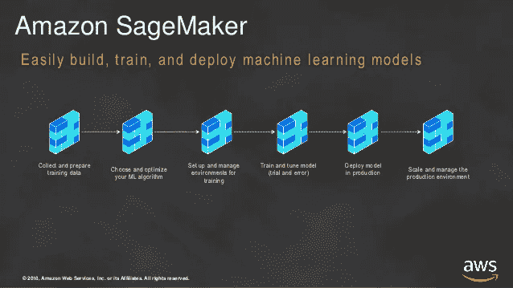
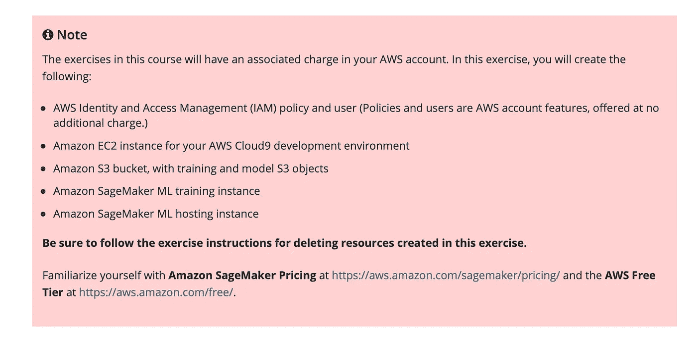
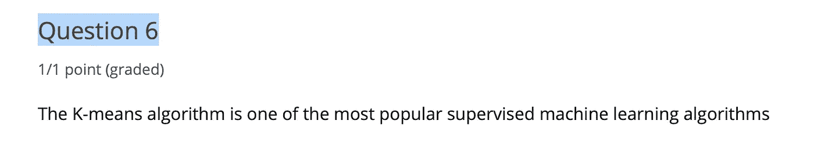
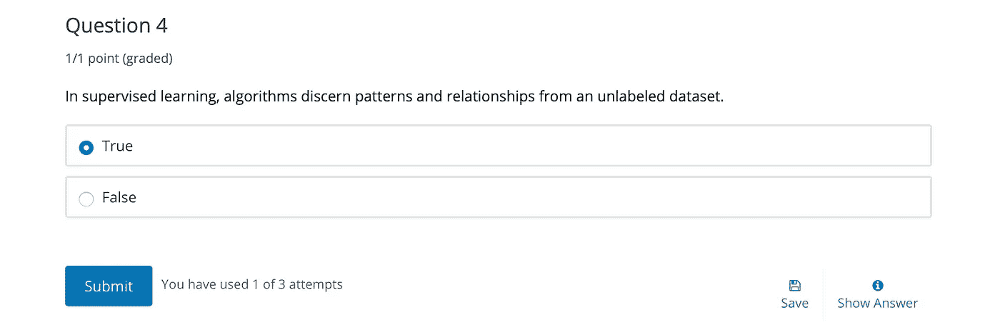
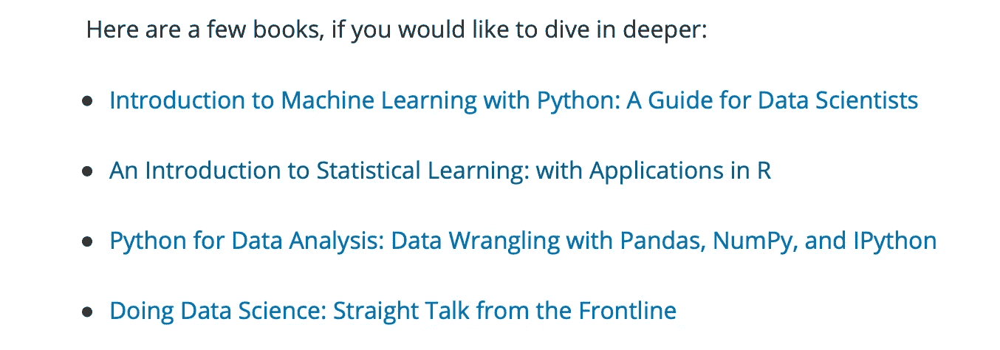

# edX AWS SageMaker:我对期末考试得 100 分并不感到骄傲

> 原文：<https://levelup.gitconnected.com/edx-aws-sagemaker-i-am-not-proud-about-getting-100-on-the-final-exam-abe243f21a5d>

我建议你审计一下 **edX** **AWS SageMaker。**我不会为课程证书付费，我建议你也不要这样做。我列举了 21 种替代资源(免费)。

AWS Sagemaker 管道。图片来源: [slideshare](https://www.slideshare.net/AmazonWebServices/aws-machine-learning-week-sf-end-to-end-model-development-using-sagemaker) 。网

我通过了 **AWS(亚马逊网络服务)Sagemaker 认证 EdX** 课程**【1】**。

一开始，我使用我的标准审查过滤器:*“我希望我早就知道。”*或*“我希望这一点得到强调。”*

在某种程度上，我想我确实问了上面的审查过滤器。与我之前的文章不同，它最终成为了*的候选名单，“我希望我早就知道。”。*

我尽量保持中立。我尽量不写下我的观点。我试图只写下事实。

但是部分经历了 **EdX** **AWS Sagemaker 认证后，**发现自己很偏颇。因为我的偏见，我考虑是否应该写一篇关于这门课的评论，或者就让它过去。

我决定写关于这门课程的评论。在这篇博客文章的第四遍之后，我意识到了选择细节内容的偏见！

哦好吧。

# “我希望我已经知道”关于美国焊接学会 Sagemaker 课程的事实。

你不必完成任何练习就能获得证书。 **EdX AWS Sagemaker** 中的所有练习都是可选的。

每个练习之前都有:

图一。每次演习前的公告。

> 提示:上述公告的简称为:*如果您使用* ***AWS Sagemaker，*** *您将被收费(在您的信用卡上)。*

**AWS** **Sagemaker 没有空闲层。在本课程中，所有练习都使用**AWS**sage maker**。

> 提示:下面的问题可以被认为是期末考试的一个窍门。

图 2:期末考试的第 6 题。

小心点！

下面这个问题可能看起来(对某些人来说)是个陷阱。

图 3，期末考试第 4 题，共 10 题。

> 提示:这并不复杂，因为你有三次尝试的机会。

# 替代学习资源

## 第一周

第一周结束时，推荐以下书籍[2]:

图 4。推荐书籍[2]。

我强烈推荐统计学的第二本书，同时也学习了 T42 语言的力量。

对于贝叶斯统计中扎实的基础，我推荐“ *MITx: 6.041x 概率入门——不确定性的科学*”**【3】**。

第三本书是韦斯·麦金尼写的，他是《熊猫 T1》的原作者。如果你认为你会管理数据，如果你做机器学习，你会得到这本书。

有很多(20+本)书籍和教程可以学习 **Python** 。我在参考文献**【4，5，6，7】中给出了一些我最喜欢的。**

> 小贴士:在参加任何 FANNG(脸书、亚马逊、网飞、英伟达、谷歌)的面试之前，都要好好想想。

## 第 2 周亚马逊 SageMaker 和 Jupyter 笔记本

**Jupyter** 笔记本和分支是数据科学、机器学习和深度学习的事实上的工具**【8】。**

免费的机器学习课程**【9】**。

免费深度学习课程**【10，11，12，13，14】**。

**Sklearn** ， **TensorFlow** ， **pytorch** 等都是免费的机器学习和深度学习框架**【15，16，17】**。

这些框架可以在 **GCP** (风镜云平台) **Colab** 上免费运行**【18】**。

## 第 3 周机器学习模型的抽样

超参数调谐概述:

 [## 使用 Python 进行超参数调优:完整的分步指南

### 为什么以及如何使用 Keras/XGBoost 示例

towardsdatascience.com](https://towardsdatascience.com/hyperparameter-tuning-with-python-keras-xgboost-guide-7cb3ef480f9c) 

集群概述:

 [## 数据科学家需要知道的 5 种聚类算法

### 聚类是一种涉及数据点分组的机器学习技术。给定一组数据点，我们…

towardsdatascience.com](https://towardsdatascience.com/the-5-clustering-algorithms-data-scientists-need-to-know-a36d136ef68) 

对 kmeans 和 kmetoids 的更详细调查:

 [## 45 对 KMeans 和 KMedoids 无监督学习聚类的广泛研究的观察

### 在数据集中发现模式或聚类是人类智能的基本能力之一。如果我们打算…

towardsdatascience.com](https://towardsdatascience.com/45-observations-of-an-extensive-study-of-kmeans-and-kmedoids-unsupervised-learning-clustering-41da9b254712) 

**XGBoost** 在以下内容中有解释:

 [## XGBoost:深入探讨升压

### 每天我们都听到人工智能的突破。但是，您是否想知道 it 面临哪些挑战…

medium.com](https://medium.com/sfu-cspmp/xgboost-a-deep-dive-into-boosting-f06c9c41349) 

## 第四周

在**Colab****【19】**中构建一个电影推荐应用。

Apache MXNet **教程【20】**。

护目镜 TensorFlow **教程****【16】**。

# 摘要

你应该旁听课程，然后再决定是否要花钱买证书。

祝你好运。依我拙见(IMHO)，你不会需要的！

# 参考

[1] [AWS: OTP-AWSD4 亚马逊 SageMaker:简化机器学习应用开发。](https://courses.edx.org/courses/course-v1:AWS+OTP-AWSD4+3T2018/course/)

[2] [第 1 周笔记和资源。](https://learning.edx.org/course/course-v1:AWS+OTP-AWSD4+3T2018/block-v1:AWS+OTP-AWSD4+3T2018+type@sequential+block@f824b2a586c84b4aba0cc01874f873bf/block-v1:AWS+OTP-AWSD4+3T2018+type@vertical+block@5c4b84048f59467798d8587828e008ea)

[3][MITx:6.041 x 概率导论——不确定性的科学。](https://courses.edx.org/courses/MITx/6.041x/1T2014/course/)

【4】[如何像计算机科学家一样思考:学习 Python。](http://www.greenteapress.com/thinkpython/thinkCSpy/thinkCSpy.pdf)

[5] [代码像一条蟒蛇。](https://www.merlot.org/merlot/viewMaterial.htm?id=1201241)

[6][Python 的搭便车指南！](https://docs.python-guide.org)

【7】[用 Python 解决算法和数据结构的问题。](https://runestone.academy/runestone/books/published/pythonds/index.html)

[8] [Jupyter —快速指南](https://www.tutorialspoint.com/jupyter/jupyter_quick_guide.htm)。

【9】[程序员机器学习入门！](https://course18.fast.ai/ml.html)

[10] [2018，程序员实用深度学习，第一部分](https://course18.fast.ai/index.html)。

[11] [2018，程序员前沿深度学习，第二部分。](https://course18.fast.ai/lessons/lessons2.html)

[12] [2019，程序员实用深度学习，v3。](https://course19.fast.ai)

[13] [2019，第二部分:从基础开始的深度学习。](https://course19.fast.ai/part2)

[14] [2020，程序员实用深度学习。](https://course.fast.ai)

[15][sci kit-学习教程](https://scikit-learn.org/stable/tutorial/index.html)。

【16】[张量流核心](https://www.tensorflow.org/overview)。

欢迎来到 PYTORCH 教程。

[18] [CS231n Python 教程配 Google Colab。](https://colab.research.google.com/github/cs231n/cs231n.github.io/blob/master/python-colab.ipynb)

[19] [Colab:搭建电影推荐系统。](https://developers.google.com/machine-learning/recommendation/labs/movie-rec-programming-exercise)

[Apache MXNet 教程](https://mxnet.apache.org/versions/1.5.0/tutorials/index.html)。