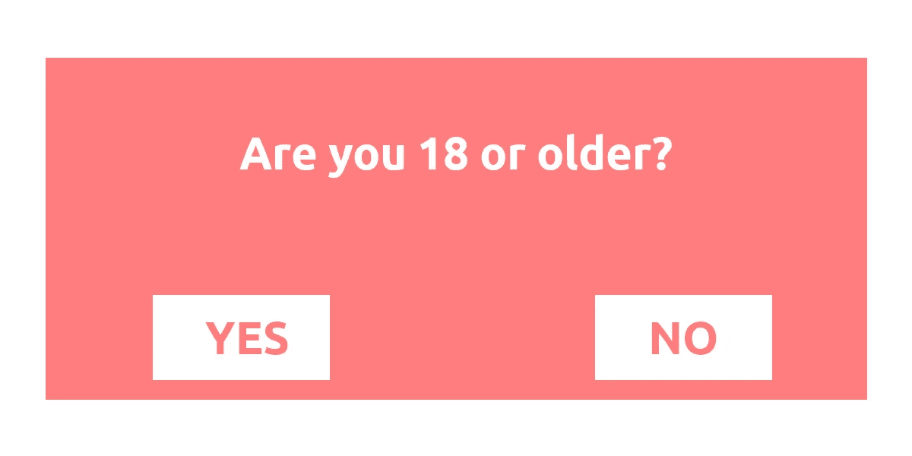
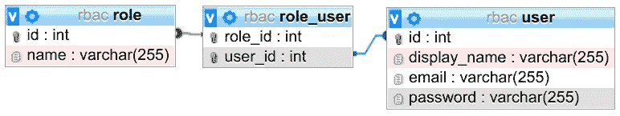

# 有效的访问控制😇

> 原文：<https://levelup.gitconnected.com/effective-access-control-331f883cb0ff>


[科学高清照片](https://unsplash.com/@scienceinhd?utm_source=medium&utm_medium=referral)在 [Unsplash](https://unsplash.com?utm_source=medium&utm_medium=referral)

访问控制是将访问权限限制在选定的一组人或系统的行为。该组被授权访问系统。为了检查一个人是否被授权访问，这个人通常必须被认证。

在本文中，我主要关注 web 服务。对物理系统(如笔记本电脑/全磁盘加密)的访问是另一回事。进入建筑物/尾门是另一回事。

在访问控制的上下文中，人们通常会提到这些实体:

*   **题材**:我女朋友/奥巴马/我邻居这样的人；像国家安全局这样的组织；像 Github/谷歌/脸书这样的公司；像机器人这样的软件
*   **对象**:分区、文件、数据库、数据库模式、数据库表……
*   **权限**:读、写、修改/变更、删除、添加/插入、追加、输入、执行……

比如我女朋友有权限进我家。这种情况下，我女朋友是主语，宾语是“房子”，权利是“进入”。

在本文中，您将了解如何破坏访问控制，不同类型的访问控制，以及一些有效访问控制的技巧。开始吧！

# 门禁怎么破？

在访问控制中，很多事情都可能出错，其中一些很难自动检查。这就是为什么在 OWASP TOP-10 2017 中，破解访问控制(BAC)是[第 4 位的原因。](https://owasp.org/www-project-top-ten/2017/A5_2017-Broken_Access_Control)

## 隐藏系统是不安全的


由 [Taras Chernus](https://unsplash.com/@chernus_tr?utm_source=medium&utm_medium=referral) 在 [Unsplash](https://unsplash.com?utm_source=medium&utm_medium=referral) 上拍摄的照片

一些系统或数据不需要访问控制的(隐含)假设是一个常见的错误，因为它们从未(故意)向公众公开。我在这里想到的是 AWS S3 桶，人们让每个人上传。这里的想法是，人们需要知道存储桶的名称，没有人会尝试`s3://company-data`或类似的名称。

这方面的另一种攻击叫做**不安全直接对象引用(IDOR)** 。假设你想从亚马逊下载一张发票，发现它是从`https://amazon.com/invoice/1234/invoice.pdf`下载的。你不会好奇`[https://amazon.com/invoice/1233/invoice.pdf](https://amazon.com/invoice/1234/invoice.pdf)`包含了什么吗？很有可能这是另一个人的发票。并且可能不再执行访问控制。

## 忘记应用访问控制


谢尔盖·古特尼科夫的图片(来源:[维基共享](https://commons.wikimedia.org/wiki/File:Gates_without_wall.jpg))

很多后端系统有几十个路由。它们都需要应用访问控制。这取决于您的访问控制系统的实现，但是您可能需要向每个非公共的路由添加代码。这样很容易忘记。并且在一次代码审查中遗漏了它，它被遗忘了。即使所有人都同意该路由需要访问控制。

## 客户端访问控制



成人内容的年龄验证是客户端访问控制的典型示例。图片由作者提供。

很久没有看到客户端的访问控制了，但是请不要忘记:访问控制需要在服务器端完成。我从未见过有效的 web 系统客户端访问控制。

## 信任客户

认证通常意味着用户需要输入用户名/电子邮件和密码。然后，服务器会创建一个会话或令牌来记住该用户。我们不希望用户不得不一次又一次地进行身份验证。

通常，至少有 3 个级别的用户:

*   匿名用户
*   注册用户
*   管理员

管理员也是注册的，但是比所有其他用户有更多的特权。系统需要一种方法来区分管理员和普通用户。

有时，这是通过未签名的 cookie 来完成的。因此，如果用户是客户端的管理员，我们会存储这些信息。非恶意用户不会篡改这些信息，因此浏览器会在每次请求时告诉我们“我不是管理员”。但是恶意用户可以更改 cookie。通过将`is_admin` cookie 从`is_admin=false`更改为`is_admin=true`，他们执行了**权限提升**。

有两种典型的解决方法:

*   对该信息进行加密签名，并在每次请求时检查签名
*   将该信息存储在服务器上，并在收到加密签名的用户 id 时进行查找。

将信息存储在客户机上的好处是，您可以将一些请求保存到数据库中。

将信息存储在服务器上的好处是，特权的丧失会立即生效。

## 缺少到期日期

想象一下:你的公司有一套员工制度。大多数员工只能看到他们的工资单，但是团队领导也可以看到他们团队的工资单。团队领导也可以奖励表现出色的员工。你是团队领导。你每天都使用那个系统，却从不注销。在某种程度上，你得到了晋升。不过，你不再是团队领导了。因此，你应该不再能够看到你的前团队的工资单。但你知道。

如果系统将授权和角色存储在客户机上永不过期的令牌中，客户机就可以永远使用该令牌。因为您的一些系统可能依赖于正确的令牌，所以它们从不检查另一个源。加密签名是正确的，因此令牌是可信的。的确如此。直到包含的信息发生变化。

## 身份验证控制被破坏

如果您可以作为另一个用户进行身份验证，您将获得该用户的所有权利。这并没有真正破坏访问控制，但具有相同的效果。我将写几篇关于认证的文章:

*   [密码哈希](/password-hashing-eb3b97684636)😇
*   多因素身份认证—尚未编写！
*   单点登录—它在我的列表中，伙计🤞
*   OAuth 和 OpenID——你猜对了……它正在路上😅

# 访问控制策略

以下访问控制策略处理的问题略有不同。这里我不是在谈论具体的技术，而是许多实现使用的抽象概念。

## **自主访问控制(DAC)**

您可以将所有权限正式存储为元组(主体、对象、权限)。您可以将这些元组存储为矩阵或元组列表。或者，您可以以对象为中心，存储所有主题及其权限的列表。例如，对于文件`foobar.txt`，您可以存储`Alice:read,write; Bob:read`。这被称为**访问控制列表(ACL)。你也可以以主题为中心存储信息:对于每个用户，存储用户能做什么。这就是所谓的**能力列表(C-List)** 。它仍然是相同的信息，但另一种数据结构。**

“自由”部分是允许用户更改对象的权限。

## **强制访问控制(MAC)**

就发展援助委员会而言，这些权利相互之间没有任何关系。这在 MAC 中是不一样的。对于 MAC，权限的顺序是:公开

与 DAC 不同，在 MAC 情况下，不允许用户更改权限。权限由系统管理员设置。

## **基于角色的访问控制(RBAC)**

将权限直接分配给主题可能需要大量的管理工作。相反，您可以创建一个角色，例如“团队领导”、“质量保证”、“开发人员”、“会计”、“CTO”。每个主题可以有任意数量的角色。角色拥有对象的权限。例如，对于“其他人的工资”,“CTO”角色可能有权“阅读”和“编辑”。对于给定的对象，主体的权限是用户拥有的所有角色的所有权限的集合。据我所知，所有的内容管理系统(CMS)都使用 RBAC。著名的例子有维基百科、Reddit 和 StackExchange。

要应用 RBAC，您需要一个`role`表(也可以称为`group`)和一个连接用户和组的表:



作者图片

然后，您需要获得用户拥有的所有角色:

```
SELECT role_id FROM role_user WHERE user_id = :current_user
```

您可能希望缓存这个查询，因为您将会经常执行它，并且角色可能不会很快改变。

最后一个要素是为每条路线存储一个访问控制列表。在 Flask 中，使用 [Flask-User](https://pypi.org/project/Flask-User/) 时可能是这样的:

```
@app.route("/analytics", methods=["GET"])
@roles_required("admin")
def analytics_route():
    return {"some": "analytics_data"}
```

当这个路径被调用时，`@roles_required`装饰器首先执行访问控制代码。如果用户没有访问权限，其余的将被忽略，并抛出一个异常或返回一个错误响应。

RBAC 可以与 DAC 或 MAC 结合使用。对于 web 应用程序来说，对象(路由)通常有一些它们需要的固定角色。只有开发者能改变它们。它们固定在代码中，而不是数据库中。这里的装饰者`@roles_required("admin")`是一个 ACL。

## **基于属性的访问控制(ABAC)**

RBAC 缺少的一部分是背景。你想利用主体和客体之间的关系，例如，如果主体是客体的创建者，它可能会自动授予主体一些权利。或者根据时间或地点，权限可能会改变。例如，普通员工可能不允许在晚上 11 点至早上 5 点之间进入办公室。

我们不想对数据库发出太多请求，给出有意义的错误响应，并且不重复代码。一个很好的折衷方案可能是这种模式:

```
@app.route("/article/<article_id>", methods=["PATCH"]) # execute (1)
@get_article  # execute (2)
@attribute_required(is_author) # execute (3)
def edit_article(article: Article): # execute (4)
    ...  # update the article
```

`get_article`装饰者简单地使用了 ORM:

```
from typing import Any, Callable
from functools import wrapsdef get_article(func: Callable) -> Callable:
    """
    Make the variable "article" available. Parameters
    ----------
    func : Callable
        Needs to have an 'article' keyword parameter. Returns
    -------
    modified_func : Callable
        A function where the parameter 'article' is added to
        the signature
    """
    @wraps(func)
    def wrapper(**kwargs: Any) -> Any:
        article_id = kwargs["article_id"]
        article = get_article_from_db(article_id)
        kwargs["article"] = article
        return func(**kwargs)
    return wrapper
```

`is_author`功能非常简单:

```
def is_author(article: Article, user: User) -> bool:
    return article.author_id == user.id
```

更复杂的是`attribute_required`的设计，但原则上，它的工作原理与上面的装饰器类似。

## 为什么有装饰师的 RBAC/ABAC 很棒

假设你建立了电子商务网站易贝。一个实体是拍卖。它具有各种属性:

*   **拍卖 ID** :由系统设定，不可修改
*   **卖家 ID** :系统设置，不可修改
*   **标题**:用户设置，不可修改
*   **描述文本**:由卖方设定，卖方可编辑

您可以像这样实现`change_descripion_text`函数:

```
def change_descripion_text(id):
    auction = Auction.query.filter_by(Auction.id == id).first()
    if current_user.id != auction.seller_id:
        raise PermissionDeniedException("Only the seller may edit")
```

然后您意识到管理员应该总是能够改变它:

```
def change_descripion_text(id):
    auction = Auction.query.filter_by(Auction.id == id).first()
    is_seller = current_user.id == auction.seller_id
    is_admin = is_admin(current_user)
    if not (is_seller or is_admin):
        raise PermissionDeniedException("Only the seller may edit")
```

你可能会意识到，你也应该检查版主。或许你也允许公司出售。因此，不仅把它放在商店里的人，而且该公司的版主也应该能够调整描述文本。然后你意识到还有元数据，比如物品的重量/体积。上面提到的访问控制有太多地方让开发人员出错。

相反，您可以使用角色。比如`seller`听起来像个角色。角色可以是上下文相关的。

```
@requires_role([SellerRole(id), AdminRole(), ModeratorRole()])
def change_descripion_text(id):
    auction = Auction.query.filter_by(Auction.id == id).first()
```

# 使访问控制有效的技巧


Jaimie Harmsen 在 [Unsplash](https://unsplash.com?utm_source=medium&utm_medium=referral) 上拍摄的照片

创建 web 服务的例子肯定是大多数读者最感兴趣的，所以让我们把重点放在这上面。访问控制是在后端实施的，因此通常是在 API 级别。大多数时候是关于哪些用户可以调用哪些 API 端点，但有时可能会更复杂。例如，在一个社交网络中，每个用户都可以获得另一个用户的好友列表。但是如果你是那个用户的朋友，你可能只能看到他的生日。因此，一些端点可能是可调用的，但是根据调用者的不同而提供不同的数据。

现在，让我们只关注使用 REST API 的简单情况。如果您有权限用一组给定的参数调用端点，那么您将总是得到相同的结果。不管你是谁/你扮演什么角色。我们目前唯一关心的权利是“可以打电话”。我们的主体是“用户”，我们的对象是组合(路由、参数)。

在这种情况下，您通常会希望创建一个基于角色的系统。有一些简单的原则可以帮助你:

*   **默认拒绝**:很容易在某个地方增加一条新路线。确保人们不会通过默认不允许任何访问来泄露数据。让他们写下哪些角色是允许的。
*   **干**:不要重复自己。实现一次访问控制代码，使检查变得简单，而不需要复制粘贴实现。在 Python / Flask 中，通常希望在函数上有一个装饰符来表示允许的角色。
*   **最小特权**:不要给人们不需要的角色。不要给角色他们不需要的权限。如果人们离开，就取消他们的角色——不管他们离开的是工作还是那个角色。接触的人越少，潜在的问题就越少。
*   **YAGNI** :设计好的软件很难。一些软件工程师倾向于提前 10 步考虑，并为潜在的未来用例构建系统。当然，有时候你已经知道话题已经摆在桌面上了。否则，**y**ou**a**in t**g**onna**n**eed**I**t(YAGNI)。在你需要的时候制造东西。这可能意味着更多的工作和软件的重构。没关系。
*   **最大限度地减少攻击面**:只要有可能，尽量删除特性和过时的代码。您删除的代码不需要维护。它不能有安全问题。
*   **围绕权限对对象进行分组**:如果您有几种类型的权限/角色，您可以围绕它们对对象进行分组。
    例如，如果你的对象是文件，你的角色是“所有者”、“组”、“其他”，权限是“读取”/“写入”/“执行”，那么这个分组就是一个具有 Unix 风格权限的目录。
    如果你在考虑 web 服务，你的对象可以是路由，权限可以是“调用”，角色可以是“匿名”、“注册”、“管理”。然后，您可以以这样一种方式组织您的代码，即没有任何文件包含匿名用户和管理员用户的路由。如果你这样做了，那么人为错误就更容易被排除。在审查中，如果一个管理员类型的路由突然出现在“普通用户”文件中，这很容易被发现。

# 信用

史蒂文·戈登很好地总结了部分术语:

# 下一步是什么？

在这个关于应用安全(AppSec)的系列文章中，我们已经解释了攻击者的一些技术😈以及防守队员的技术😇：

*   第 1 部分: [SQL 注入](https://medium.com/faun/sql-injections-e8bc9a14c95)😈🐝
*   Part 2: [不要泄密](/leaking-secrets-240a3484cb80)😇
*   第 3 部分:[跨站点脚本(XSS)](/cross-site-scripting-xss-fd374ce71b2f) 😈🐝
*   第四部分:[密码哈希](/password-hashing-eb3b97684636)😇
*   第五部分: [ZIP 炸弹](https://medium.com/bugbountywriteup/zip-bombs-30337a1b0112)😈
*   第六部分:[验证码](https://medium.com/plain-and-simple/captcha-500991bd90a3)😇
*   第 7 部分:[电子邮件欺骗](https://medium.com/bugbountywriteup/email-spoofing-9da8d33406bf)😈
*   第 8 部分:[软件组成分析](https://medium.com/python-in-plain-english/software-composition-analysis-sca-7e573214a98e) (SCA)😇
*   第九部分: [XXE 袭击](https://medium.com/faun/xxe-attacks-750e91448e8f)😈🐝
*   第 10 部分:有效的访问控制😇🐝

这即将到来:

*   CSRF😈
*   磁盘操作系统😈
*   凭据填充😈
*   密码劫持😈
*   单点登录😇
*   双因素认证😇
*   备份😇
*   磁盘加密😇

如果您对更多关于 AppSec / InfoSec 的文章感兴趣，请告诉我！