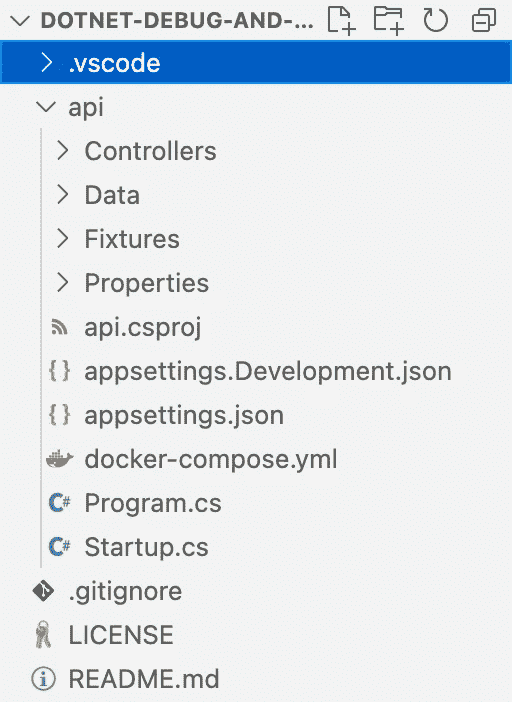
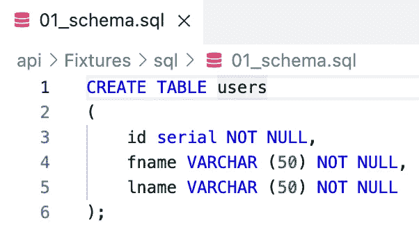
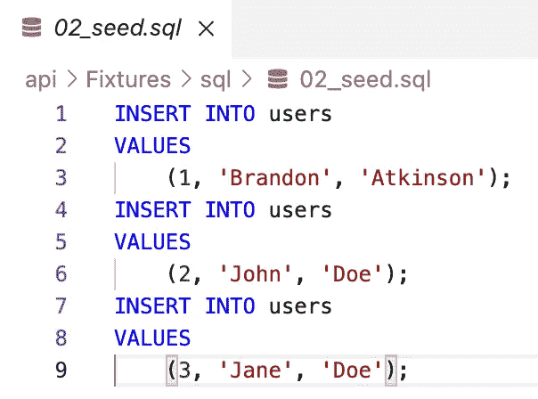
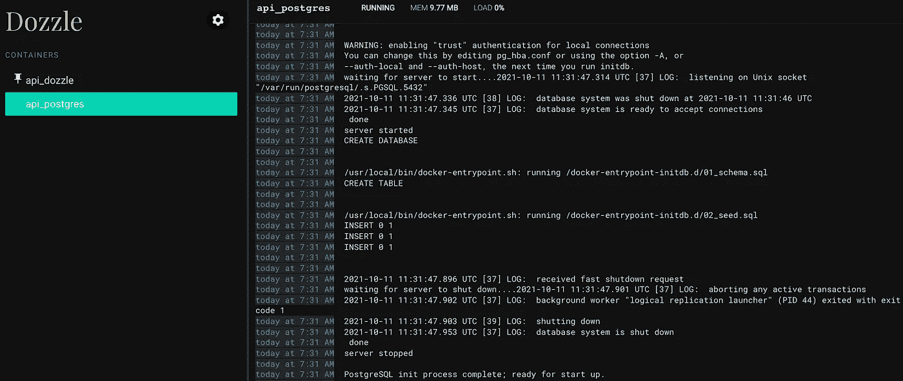
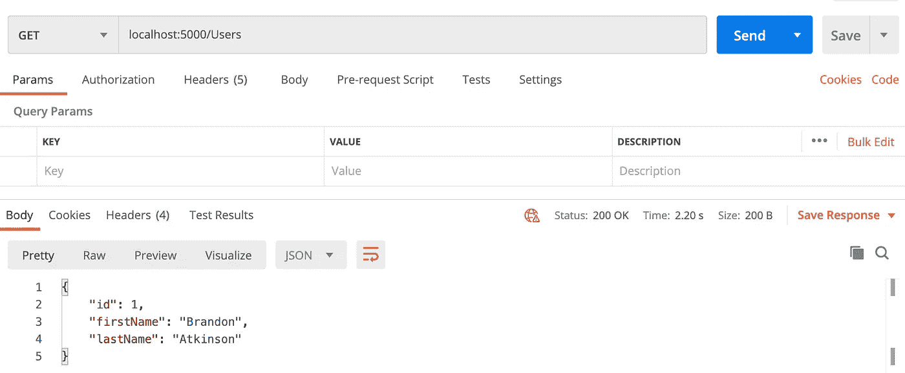
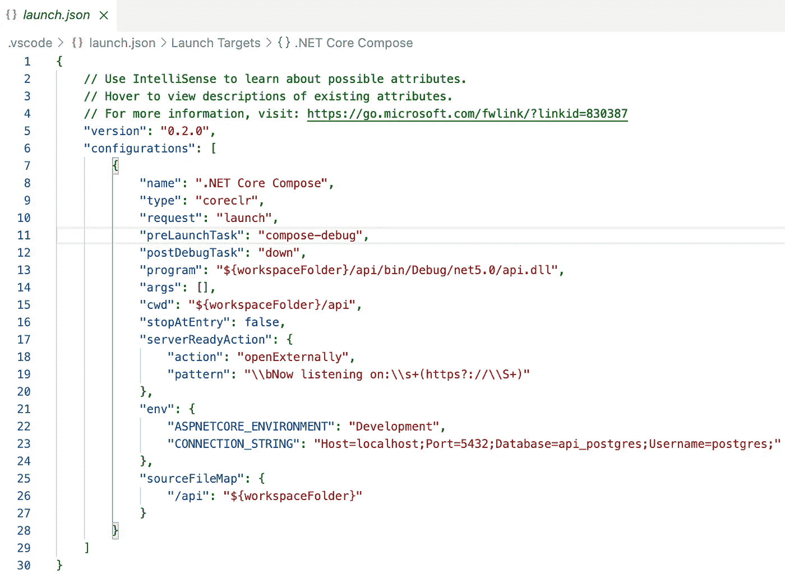
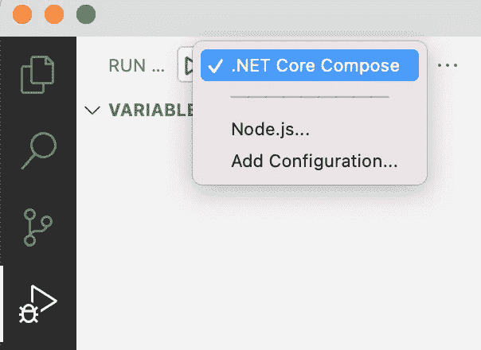
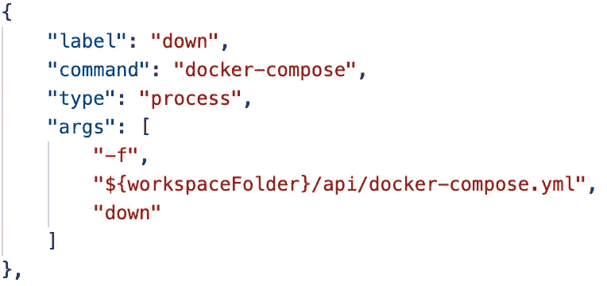
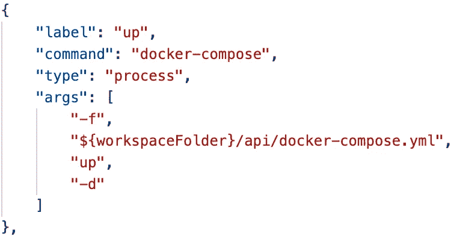
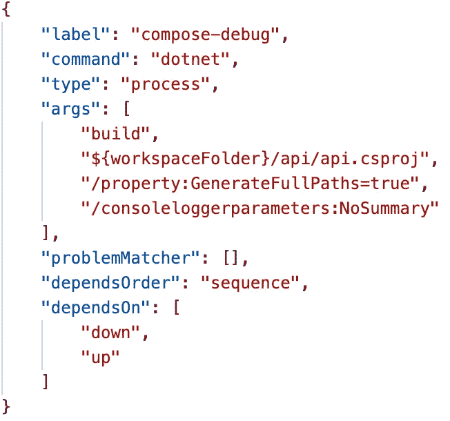

# 有效的调试。NET Core & Docker Compose(在 VS 代码中调试开始时启动 Compose 堆栈)

> 原文：<https://levelup.gitconnected.com/effective-debugging-with-net-2ed70167de58>


我今天处理的大多数项目都有某种外部依赖。这可能是一个数据库、一个云提供商，或者只是我需要与之交流的另一个 API。为了开发我的代码，我很少不通过网络与某些东西交流。能够有效地开发和调试那些外部依赖是清洁软件的关键，但也可以大大加快你的努力。这就是 Docker 和 Docker Compose 的用武之地。通过使用 Compose，您可以轻松地创建这些依赖项的模拟版本，并随时运行它们。通过使用 Compose，我们可以加速开发工作并产生更好的代码。

在本帖中，我们将看看最常见的场景之一，在本地运行数据库进行测试。然而，我们将通过在. NET 中将撰写启动与调试会话的启动联系起来来实现这一点。

# 设置

这个项目的回购非常简单。NET 核心 Web API，它简单地返回我们数据库中的用户。这篇文章的目的不是构建一个 REST API，所以我们将保持它的超级简单。下面是项目结构的样子:



演示代码项目结构和文件

让我们快速分解一下:

*   **控制器**包含一个具有一个`Get`端点的单个`UsersController`。对于这个演示，它所做的只是从数据库中返回第一个用户。
*   **数据**包含我们的`DbContext`和一个用于与我们的数据库交互的`Users`模型。
*   **Fixtures** 包含了所有的`.sql`文件，这些文件创建了一个模式并用数据播种数据库中的`Users`表。



创建数据库模式的 SQL



用数据植入用户表的 SQL

*   其余文件是标准的。NET 和 Docker 文件，所以我们不会对它们进行太深入的讨论。

接下来，让我们看一下`docker-compose.yml`文件，它将加速我们的 API 所需的依赖关系，在本例中是一个 PostgreSQL 数据库:

```
version: "3.7"services:
  database:
    container_name: api_postgres
    image: postgres:11.6-alpine
    environment:
      POSTGRES_DB: api_postgres
    volumes:
      - ./Fixtures/sql/:/docker-entrypoint-initdb.d/
    ports:
      - "5432:5432" dozzle:
    container_name: api_dozzle
    image: amir20/dozzle:latest
    volumes:
      - /var/run/docker.sock:/var/run/docker.sock
    ports:
      - "8888:8080"
```

坚持“保持简单”的趋势，这个文件中没有太多内容。我们构建了两个容器，PostreSQL 数据库和一个 Dozzle 容器。如果你不熟悉 Dozzle，[去这里看看](https://github.com/amir20/dozzle)。我不能说足够多的好话，但我们不会在这里覆盖它。

对于 PostgreSQL 容器，我们只需拉一个 11.6 Alpine 版本，将我们的 SQL 文件从`Fixtures`文件夹挂载到`docker-entrypoint-initdb.b`文件夹，然后就可以了。此时，我们可以运行一个`docker-compose up`来让我们的数据库运行起来:



Dozzle 日志查看器显示我们的 Postgres 容器正在运行

现在，我们可以开始调试我们的应用程序，并确认它连接到我们的数据库并返回数据:



邮递员调用我们的用户控制器，返回数据库中的第一个用户

老实说，我们可以就此打住！我们有一个组合文件来加速我们的依赖关系，我们可以开始调试并很好地访问我们的数据库。老实说，这种设置绝对没有任何问题:

*   用您的依赖项创建一个`docker-compose.yml`文件。
*   当你准备好调试的时候，运行一个`docker-compose up`命令。
*   开始调试。

我一直都在用这个设置，非常棒！但是，有几个方面我们可以改进:

*   每次我想调试时都必须手动启动 Compose 堆栈，或者让它在我开发的整个过程中一直运行，这感觉不太好。
*   有时我会忘记运行`docker-compose down`来拆除堆栈，几个小时后回来时会发现堆栈仍在运行。

我们可以做得更好，现在我们来看看如何自动化这一切。

# 将所有东西绑定到调试器

我真正想要的是以下内容:

*   当我启动调试器时，自动启动我的合成堆栈。
*   当我退出调试器时，自动拆除我的合成堆栈。

事实证明，在您的项目中使用`launch.json`和`tasks.json`文件，这些事情非常容易。当您在 VS 代码中启动一个调试会话时，这两个文件驱动了让您的会话运行的所有步骤。让我们来看看这个项目中的`launch.json`文件:



launch.json 文件

如果你以前曾经打开过这个文件，所有这些应该看起来很熟悉。事实上，这个文件几乎是样板代码而不是为我创建的代码，只有几处改动:

*   `name`(第 8 行):此已更新为”。NET Core Compose”，以清楚地表明我们将使用 Compose 文件进行调试。这个名称显示在调试器面板中，因为您可以有多个调试配置，所以您想很容易地看到您将要启动哪个。



*   `preLaunchTask`(第 11 行):这是在`tasks.json`文件中定义的一个新任务，它将负责启动调试会话。
*   `postLaunchTask`(第 12 行):`tasks.json`文件中定义的新任务，将在调试器停止时运行。
*   `env:CONNECTION_STRING`(第 23 行):这是到 Postgres 数据库的连接字符串，并指向 localhost，因为我们从 Compose 文件本地运行容器。

文件中的其他内容都是样板文件，可能就是您在最初的`launch.json`文件中看到的内容。现在，我们来看一下推动这种配置的任务。

我们将按相反的顺序来看这些:

*   `down`负责拆缀栈。如果你记得从`launch.json`文件中，它被配置为`postLaunchTask`，并将在调试器停止时自动拆除堆栈。这是一项非常方便的任务，可以确保所有东西都被清理干净。我们通过`-f`标志来告诉 Compose 我们的文件在哪里，因为`tasks.json`通常位于项目的根目录，我将我的 API 嵌套在一个子目录中。



*   `up`负责为我们启动撰写堆栈。类似地，在`down`任务中，我们传递`-f`标志来告诉 Compose 我们的文件在哪里。还要注意我们传入了`-d`标志。这是分离模式标志，它将在后台运行容器。如果您不将此标志传入，Compose 将会阻塞，调试器将永远不会启动，这一点非常关键！



*   `compose-debug`是所有魔法发生的任务。这是在我们的`launch.json`文件中配置为`preLaunchTask`的任务，并且将是我们启动调试器时调用的任务。其中大部分是样板代码，您可以从 VS 代码中获得基本的调试任务，但是包含了两个关键元素！



`dependsOrder`使用`dependsOn`属性，这里我们使用`sequence`值。这告诉任务，我们希望按照列出的顺序运行在`dependsOn`属性中定义的任务。在我们的例子中，我们希望在启动调试器之前，首先运行`down`任务，然后运行`up`任务！这允许我们执行以下操作:

*   杀死任何因任何原因仍在运行的合成堆栈。这只是一个有用的检查，将确保`up`命令可以正常运行。
*   启动新的合成堆栈。
*   启动调试器会话。

现在，我们不必担心在调试之前运行 Compose，它会自动为我们完成！

# **收尾**

如果您没有使用 Docker Compose 来帮助您的本地开发，现在就开始使用它吧！即使你没有实现这篇文章中展示的技巧，它也会节省你大量的时间。自从完成这些任务后，我发现我的开发经历变得更加顺畅，我真的很喜欢它。我承认这并不能节省你大量的时间，但是让所有这些事情自动开始，然后自己清理也是很好的。深入挖掘`launch.json`和`tasks.json`的文件和生命周期也很有趣。我绝对可以看到这在未来的各种事情中派上用场！

## 参考

*   GitHub Repo:[https://GitHub . com/atkinsonbg/dot net-debug-and-launch-compose](https://github.com/atkinsonbg/dotnet-debug-and-launch-compose)
*   Docker 撰写参考:[https://docs.docker.com/compose/reference/](https://docs.docker.com/compose/reference/)
*   VS 代码任务:[https://code.visualstudio.com/docs/editor/tasks](https://code.visualstudio.com/docs/editor/tasks)