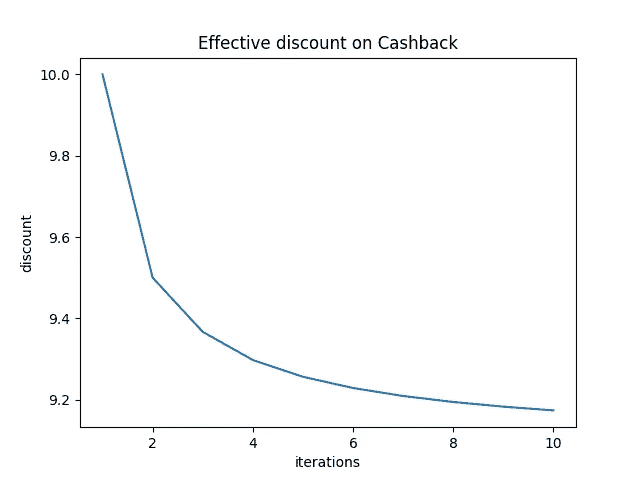
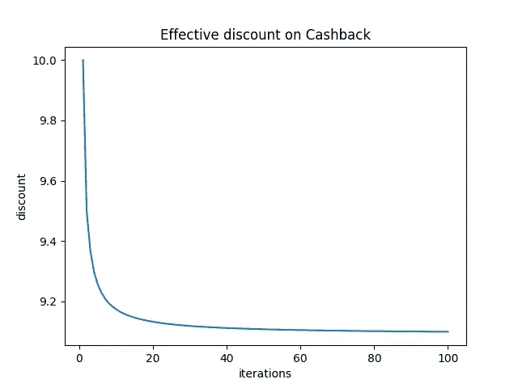
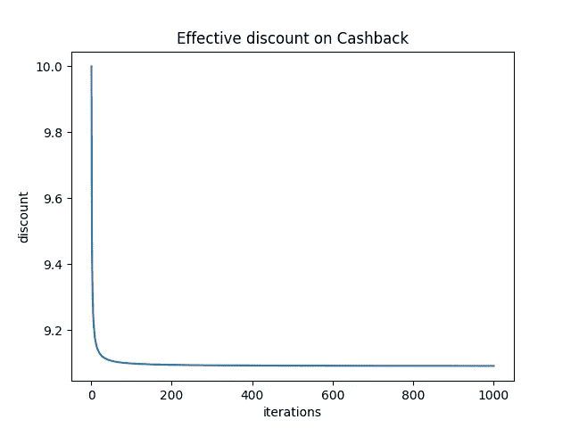
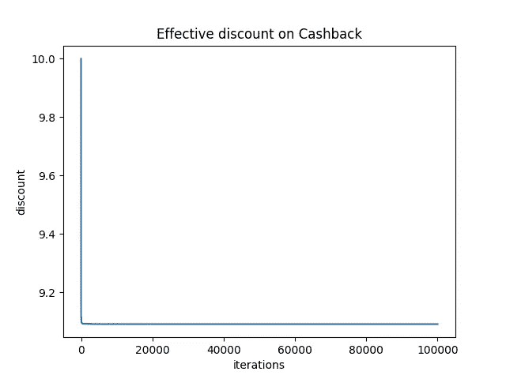

# 返现带来的实际折扣比您想象的要少

> 原文：<https://levelup.gitconnected.com/effective-discount-due-to-cashback-is-less-than-you-thought-51daebad23e0>

## 用 Python 和 matplotlib 求返现系数


Artem Beliaikin 在 [Unsplash](https://unsplash.com?utm_source=medium&utm_medium=referral) 上拍摄的照片

你可能想知道，当你得到 10%的返现时，你得到了 10%的折扣。这就是大多数企业如何欺骗他们的客户相信。你会惊讶地发现，实际上，返现带来的实际折扣比你想象的要小。让我来解释一下。

# 问题是

假设你每次从商店买东西都花了 100 美元，并且你每次购物都会得到 10%的现金返还作为未来的信用，让我们看看你实际上节省了多少钱。

## 第一次迭代

商品价值= 100 美元
消费金额= 100 美元
返现= 10 美元
有效折扣= 10%

这是大多数人倾向于相信他们得到 10%折扣的地方，但在第二次迭代中事情开始发生变化。让我们看一看

## 第二次迭代

商品价值= 100 美元
兑现= 10 美元
消费金额= 90 美元
兑现= 9 美元

到目前为止购买的商品价值= 100 美元+100 美元= 200 美元
获得的总返现= 19 美元
有效折扣= 9.50 美元

在这里，你得到的不是 10 美元的返现，而是 9 美元的返现。但是，同样，这是因为您获得的返现金额是您支付的净额，而不是您已经兑换的返现金额。所以你可以看到，在第二次迭代中，你只是得到了 9.5%的折扣，在第三次迭代中会进一步降低，以此类推。

为了让事情变得有趣，让我们使用 Python 以编程方式进行计算，并使用 [matplotlib](https://matplotlib.org/) ( **有效折扣**与**迭代次数**)绘制图表。Matplotlib 是一个著名的 Python 库，它为我们提供了创建静态、动画和交互式可视化的实用函数。

# Python 代码

为了解决这个问题，我们将创建两个 python 函数:

1.  一个名为`calc(n)`的函数，用于计算 n 次迭代的有效折扣，并将值存储在`x_axis`和`y_axis`数组中
2.  一个名为`plot(x, y)`的函数，使用`x_axis`和`y_axis`数组通过`matplotlib`绘制图形。

我们将假设在每次迭代中购买价值 100 美元的商品，并对所花金额进行 10%的返现。

然后我们用所需的迭代次数调用`calc(n)`函数。下面的代码描述了这段代码，如你所见，我们将调用`calc(n)`函数 10 次迭代。

现在，让我们执行代码，自己看看

# 结果呢

我们将运行代码 10、100、1000 和 100，000 次迭代，并绘制迭代的有效折扣。

当我们执行代码十次迭代时，我们得到以下输出:

```
Effective discount on cashback after 10 iterations is 9.17355371900000000000
```

当我们使用 matplotlib 绘制图形时，它也输出一个图形。该图如下所示:



十次迭代返现的有效折扣

乍一看，它看起来像一个有效折扣慢慢稳定到接近 9.1 的值的倒数双曲线图形。

让我们将它绘制为 100 次迭代，以便更清楚地了解这一点。对于 100 次迭代，我们得到以下输出:

```
Effective discount on cashback after 100 iterations is 9.09917355371900826446280985
```

并且生成下面的图形:



100 次迭代返现的有效折扣

现在，这似乎更加稳定，并趋于 9.09。如果我们执行 1000 次迭代呢？

为此，我们得到以下输出:

```
Effective discount on cashback after 1000 iterations is 9.09173553719008264462809998
```

因此，图表如下所示:



1000 次迭代返现的有效折扣

该图似乎已经稳定在 9.091 附近，我们的迭代次数越多，我们看到的与上一个值的偏差就越小。如果我们运行 100，000 次迭代呢？实际上，任何客户都不可能做到这一点，但是为了达到有效的折扣价值，让我们试一试:

因此，对于 100，000 次迭代，我们得到以下输出:

```
Effective discount on cashback after 100000 iterations is 9.09091735537190082644636101
```

正如我们所见，在 100，000 次迭代和 1000 次迭代中获得的有效折扣没有太大差异。

现在让我们看一下图表:



100，000 次迭代返现的有效折扣

并且图形看起来更加方形和平坦。因此，没有必要继续下去，因为我们不会看到任何更大的变化。

# 结论

总而言之，让我们看看我们的发现:

返现 10%的实际折扣为 9.091%。
返现 1%的实际折扣为 0.9091%

因此，返现 x%的有效折扣为 **0.9091*x%** 。

正如我们从图表和结果中看到的那样，有效折现倾向于 0.9091。所以我们可以把它当作一个常数，它就变成了**返现系数**。

因此，您通过返现购买的产品的有效折扣是您返现百分比的 0.9091 倍。