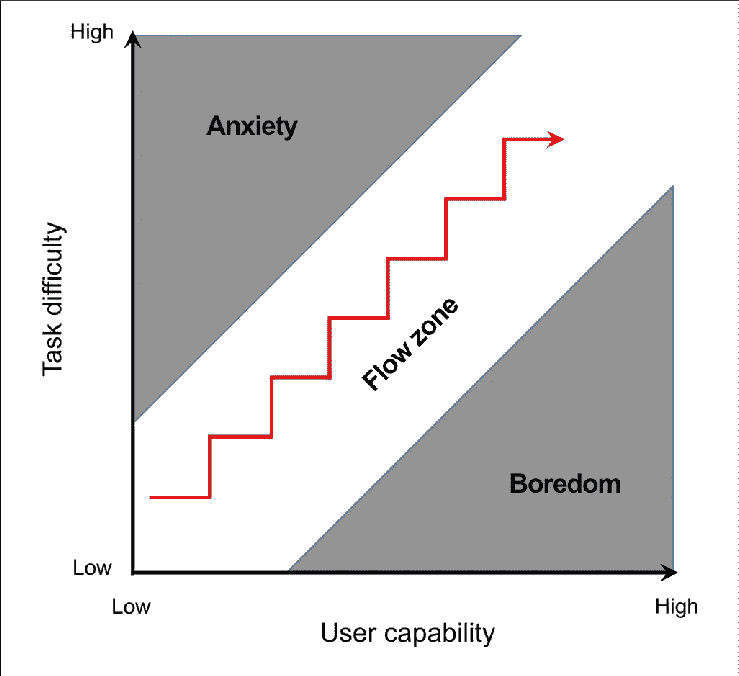

# 对抗开发者自满的有效方法

> 原文：<https://levelup.gitconnected.com/effective-methods-for-fighting-developer-complacency-2dc1e45fd92c>

凯文·Ku 在 [Unsplash](https://unsplash.com/s/photos/developer?utm_source=unsplash&utm_medium=referral&utm_content=creditCopyText) 上的照片

我们都在某个时候经历过。你正在做一个项目或一个 bug，突然碰了壁。你心里想:

> “有什么意义？我只是在这件事上毫无进展。”

这是软件开发世界中的一个常量。你将不可避免地经历一次又一次的自满和沮丧。你会觉得你做的事情没有以前那么有影响力了。你会感到筋疲力尽，对工作没有热情。这将感觉像一件苦差事。

你努力工作的事业是如何变成每天又一套琐碎的任务的？编程的火和激情去哪了？过去的兴奋和惊奇已经让位于自满，甚至把你变成了一个代码守财奴。

这种感觉完全正常。这并不会给你的职业生涯带来厄运，你还有希望战胜它。用乐趣和冒险来平衡编程的单调和挫折是一项你也可以掌握的技能。当你碰壁，想要放弃的时候，关上你的笔记本电脑，走开。不要。相反，尝试这些简单的技巧来“重置”你的自满情绪。

## 切换项目或任务

当面对一个过于复杂或困难的问题时，自满情绪会迅速增加。在一个高难度的项目上工作太长时间会导致缺乏专注和效率。你会发现自己变得越来越邋遢或者偷工减料。你的代码会开始看起来混乱，你会太怀疑自己。

这是一个最好的时机来改变项目，从目前的难度水平休息一下。将齿轮换成一组更容易、更简单的任务，为你的大脑提供快速的多巴胺，让你从那些耗费精力的复杂任务中重新充电。

请记住，为了达到一种流畅的状态，并感觉自己“进入状态”，你必须保持在适当的难度范围内。你需要呆在“心流区”里，在那里事情不会太难也不会太简单。

Csikszentmihalyi 的流动状态图。来源:researchgate.net

切换项目不一定是一个巨大的转变，也不需要永远持续下去。你可以简单地在一个较小的副业项目上工作一会儿，或者做一些编码练习。一旦你经历了一次重置，完成了一些较小的任务，你就可以用全新的思维切换回那些更大、更困难的任务。

## 清理你的票

这类似于切换项目，但有一个重要的区别——它与编写代码没有直接关系。你不会转到一个副业项目或者用你最喜欢的语言编写一个小工具。这相当于更新电子表格。

仔细检查你现有的票单队列，记下一些你正在处理的问题的笔记。更新项目的当前状态。清理掉闲置了数周、数月或数年的旧票。这是你整理你一直在做的事情的机会，但是也可以通过做一些短时间的简单任务来重置。如果你使用看板，然后移动一些东西，进行视觉调整。确保被阻止的东西在正确的列中，并且你一周前修复的 bug 通过一些注释被关闭。

清理票据可以让你简单地休息一下，但也可以让你更好地计划事情。在一个项目的开始，创建一堆任务和笔记是很容易的。你可以估计项目*可能*会在哪里结束，但是你永远不会真正知道，直到你陷入代码中试图让它工作。花点时间重新设定和调整你的行动计划对于战胜自满和完成成功的项目是至关重要的。

## 咨询同事

默默承受比向同事寻求帮助要容易得多。软件开发行业有太多自大的人，所以尽量不要让你的自我膨胀得太厉害。每个人都会被卡住。编程很难。编程很累人。如果你需要帮助，伸出手来，不仅是技术问题，还有情感问题都会有很大帮助。

[米米·蒂安](https://unsplash.com/@mimithian?utm_source=unsplash&utm_medium=referral&utm_content=creditCopyText)在 [Unsplash](https://unsplash.com/s/photos/talking?utm_source=unsplash&utm_medium=referral&utm_content=creditCopyText) 上的照片

向同事或朋友咨询可能不会带来“哈哈”的时刻，但它足以让你放松心情。与同事讨论哪怕是最平常的事情，比如天气，也能让你对某项任务或项目的想法进入潜意识。你会变得更加放松，思考一些不同的东西，希望不要那么紧张。一旦你回到之前的任务，你的大脑会有时间重新聚焦，你可能会在不知不觉中想出一个解决方案。

## 重新开始

我不是指放弃整个项目，辞去你的工作。我的意思是，也许是时候重写一些你一直在纠结的代码组件了。项目进行得越久，它就会变得越大越乱。技术债务始于项目之初，除非你及早解决，否则只会越来越糟。

沿着项目的道路，你学习什么可行，什么不可行。很有可能在代码中有一些你一直在处理而不是修复的漏洞。当它们停留太久的时候，你应该会非常厌倦，因为它们会在以后带着复仇回来，让你的生活比现在糟糕得多。如果你故意避免一些代码，因为它让你感到悲伤，那应该是一个提示，更仔细地看它，甚至重写它。

Git 记得。不要害怕删除代码，从头再写一遍。这提供了一个奇妙的重置机制，因为您已经编写过一次，并且知道一些陷阱在哪里。项目第二次看起来和运行得更好的机会要高得多。

*感谢您的阅读！希望这些简单的技术可以帮助您度过下一轮的开发人员自满，并为您自己的“重置机制”提供一个起点。在* [*Twitter*](https://twitter.com/Tate_Galbraith) *上用你自己的一些方法来对抗开发者的郁闷。*