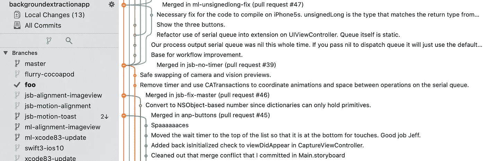

# 代码审查和合并的有效实践

> 原文：<https://levelup.gitconnected.com/effective-practices-for-code-reviews-and-merging-7ccb4f9964f0>

## 通过主动参与保持您的代码库质量

作者截图

无论你称之为拉取请求、合并请求还是代码审查，都有有效的实践，每个人都可以而且应该去做，这不仅能使它进行得更顺利，而且有助于保持你的代码库的质量。

养成写干净代码的习惯很重要，但是如果没有定义贡献指南，你的代码库可能会失修。

# 1 -为开发人员定义完成

> 你会惊讶地发现，仅仅了解好的实践还不足以采取行动

如果您的团队不能就这一点达成一致，并且您将最佳实践留给机会，那么您的代码库将会老化得更快。合并是代码质量的最后一道防线，拥有一些把关规则将有助于让您的代码库优雅地老化。

做一个简单的、子弹式的清单，列出签入代码时要做的事情。这听起来很老套，但几年前我们确实把它打印出来，放在我们的每张桌子上作为提醒。这比只有软拷贝形式的列表和所有其他*只写*文档要有效得多。清单就在开发人员面前，当他们跳过一个项目时，至少他们必须用一个有效的理由来证明跳过它，而不仅仅是因为他们忘记了。

你会惊讶地发现，仅仅了解好的实践还不足以采取行动；显然，人类的大脑喜欢避免额外的工作，有选择地在方便的时候忘记事情，需要被唠叨。

## 清单示例

你的清单的内容可能没有事实重要，事实上它是明确定义的，并在团结中实践。如果您对这个列表不感兴趣，请不要担心，但是理想情况下，一个好的开发人员会非常关心至少其中的一些项目:

*   需求被实现，没有任何挥之不去的未问问题(至少尝试让*知道*未知)
*   如果[实践 BDD](https://jeffreybakker.medium.com/defining-and-measuring-software-behaviour-b542370e8b7d) ，场景被定义以确保需求是可验证的
*   如果项目是[跨平台的](https://jeffreybakker.medium.com/mobile-development-stack-native-vs-xamarin-vs-xamarin-forms-309af0e11ae6)，那么所有的平台都经过了完整性测试
*   添加或更新了针对新功能或已更改功能的单元测试。在这个过程中，现有的单元测试没有被破坏。已经破坏的测试是已知的，并且正在等待某种类型的操作
*   你是否不得不破解一些东西来让它工作？如果它没有被恢复，你用可搜索的代码注释标记了它吗？
*   对于新文件，使用了代码格式化工具(带有您团队的共享设置)
*   [在提交之前，图像文件被优化](https://imageoptim.com/mac)为最小无损压缩
*   *大的二进制文件使用非膨胀的源代码控制扩展来签入(例如使用 [git lfs](https://git-lfs.github.com/) 、 [git fat](https://github.com/jedbrown/git-fat) 或 [git-annex](https://git-annex.branchable.com/) )*
*   *持续集成:构建任务在 CI 机器上传递。单元测试在 CI 机器上通过，而不仅仅是在你的机器上通过*
*   *从目标分支反向集成(如果在推送之前没有重新建立基础)，解决合并冲突并在 CI 上重新运行，必要时进行完整性检查*

*如果这个列表让你焦虑，那就是这个例子的失败之处。虽然所有这些都是有价值的实践，但是清单很长，没有耐心的开发人员会跳过一些步骤——特别是如果他们不同意或者看不到其中一些的价值。试着将你的团队最看重的代码质量度量按优先级排序，并简洁地写出来。*

*让我焦虑的是，整个开发团队在没有任何定义的情况下提交代码。*

# *2 -先发制人的自我检讨*

*在指定审核人之前，对自己的更改进行自我审核不失为一个好主意。这为您提供了执行以下操作的机会:*

*   *捕捉潜在的尴尬错误。例如，打字错误，看起来很乱的空白，你忘记删除的代码，你忘记的代码内注释。*
*   *编写代码评审注释(如果你们没有一起评审的话)来帮助解释可能需要一些评审背景的决策，但是不要要求代码内注释。*
*   *如果您忘记签入一个文件或者签入了一个您不应该签入的文件，这是您再次检查的“最后机会”。不管你有多聪明或多有经验，如果不小心的话，人们还是会犯这个错误，评论者也不总是能发现他们。*

*通过做这些基本的检查，您可能会节省一些代码审查的周转时间。*

# *3 对复习*

*无论你是屏幕共享还是让另一个程序员坐在你的办公桌前(可能是 2020 年的前者)，对提议的更改的实时浏览和讨论都显示出对我们将什么放入代码库的更多关注。*

*这种复习也是一种知识传授。我们不应该等到有人离开公司时才发生这种情况。抛砖引玉式的评论通常不会透露太多信息。*

# *4 -分支和合并策略*

> *一个永久可发布的代码库要求自己始终处于可靠、健康的状态…*

*在你的开发机器上，本地个人分支是免费的——做你想做的，只要你不伤害任何人。当需要合并到其他人依赖的分支时，你需要确保他们可以。你的团队应该有一个明确的分支策略。*

*有不同类型的分支，具有不同的寿命和不同的稳定水平。因此，提交和合并应该以不同的方式处理。本着良好实践的精神，分支被用来阻止将代码直接提交给主/主线/主干，主/主线/主干应该只通过合并接受变更。*

*一个永久可发布的代码库要求自己处于一个持续可靠、健康的状态，通过一个分级的分支过程来维护。下面只是如何实现这一点的一个例子，但是有不同的策略来获得相同的效果。有一个结构化的有效的计划，你的团队可以坚持。*

## *修正分支错误:生命周期短*

*这些分支只在修复 bug 并被一个开发人员使用的时候存在。*

## *特征分支:中等寿命*

*根据特征的大小，这些可以一次持续数周。它可能被一个或多个开发人员使用。*

## *功能协作分支:中短生命周期*

*如果有多个开发人员在一个特性的不同部分工作，您可能希望将特性分支作为一个相对稳定的基线。然后从那里进一步分支，以创建更短生命周期的分支，保持特性分支足够可靠，以供其他开发人员使用，不受中间变更的阻碍。*

## *史诗分支:长寿命*

*如果一组特性是可能需要几个月才能实现的史诗的一部分，那么保留一个史诗分支可能是有益的。然而，在许多情况下，如果 epic 中的特性可以单独消化，并且足够独立，可以在没有彼此的情况下工作，那么在特性分支完成时将它们合并到 master 中可能会更好，而不是在两者之间有一个 epic 分支。*

## *主分支:永久*

*主分支机构将拥有整个组织中最大的流量。应该算是“发展稳定”。它可能有用户级的错误，但是应该足够稳定可靠，开发人员可以在任何时候开始工作。*

*   *永远不要直接提交给 master(除非有合理的例外)*
*   *不要将任何不能在 CI 上编译的东西合并到 master 中*
*   *不要合并任何破坏或阻碍最基本功能的东西*
*   *应该做出合理的努力来保持单元测试顺利通过；故障应该迅速解决*
*   *UI 自动化应该定期从这里运行，如果不是在 CI 上的话*
*   *理想情况下没有未完成的工作；通常只有达到开发者定义的完成的特性才应该被合并*

*在 master 上打破一条关键路径会花费开发人员一天的时间。所以从理论上讲，如果几十个开发人员都在使用 master，你可以很容易地让公司损失一周的生产力。*

*当有人打破师父时，应该有一些轻松或好玩的羞辱:)没什么太严重的，因为每个人都会犯错误，但我们也不想传达这样的信息，即养成习惯没什么。*

## *稳定分支:永久*

*这是一个更成熟的 master 版本，因此更适合非开发人员，比如 QA。在主分支和发布分支之间有这样的缓冲应该允许“代码冻结”期，而不会阻碍主分支的进展。*

*您可能有一些将主代码升级为稳定代码的标准。健康稳定分支的一些良好指标是:*

*   *CI 上的单元测试和 UI 测试不仅都通过了，而且在一段时间内一直都通过了*
*   *从字面上来说，一个没有严重阻塞缺陷的构建可以在任何一天的任何时间进行 QA，以便可以测试最近完成的变更。这减少了从开发团队获得垃圾版本*
*   *未解决的新 bug 应该减少到相对较低的数量，理想情况下，没有严重的 bug*

*当下一个发行版的所有测试都完成时，稳定版可以升级到发行版。*

## *发布分支:永久*

*发布候选和发布版本本身可以从一个发布分支中产生。通过最终的质量保证测试和批准，它更经得起考验，而不是稳定。什么构成了发布分支？*

*   *当所有计划发布的功能或修复完成并通过 QA 和 PO 验收(和/或 UAT)时*
*   *当 stable 通过 QA 的全面回归测试时*

*随着你的代码慢慢升级到一个发布分支，你有可能在任何时候为公开发布做一个构建。*

## *命名策略*

*您的团队也应该遵循一致的分支命名模式。通常以开发人员姓名首字母作为个人分支和/或 bug 或功能跟踪号的前缀。*

# *结论*

*最终，代码库不能完全逃脱时间的摧残，但是通过尽职调查和相互参与，你的代码质量可以保持更高更久。*