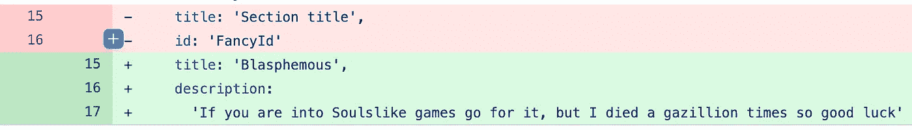

# 贡献代码的有效 PRs

> 原文：<https://levelup.gitconnected.com/effective-prs-for-contributing-code-da783a00c48>

## 关于 PR 中有多少锁定或提交频率的意见


凯勒·伍兹在 [Unsplash](https://unsplash.com?utm_source=medium&utm_medium=referral) 上的照片

我负责一个小型开发团队，包括我自己在内共有六人。我是团队领导，所以除了编码之外，我还有几项职责。其中一些是:

*   提前规划新功能。
*   资源分配。
*   当我的团队对 Github 问题或代码库有疑问时，为他们提供指导。
*   指导他们，让他们更好地了解自己的职业道路。
*   **审查减贫战略。**

我认为 PRs 是了解您团队的代码技能和怪癖的最佳知识来源，特别是自从 COVID 以来，一切都远程运行。你只能从松散的消息或缩放的电话中得到这么多。阅读他人编写和提交的代码会让你对他们的思想状态有更多的了解。

有时你会看到一些令人费解的代码，有时你会看到“聪明”的代码，只会让整个事情变得不可读，有时你会得到这样的珍宝:



我的开发人员的一个测试文件中的代码😆

在我的团队进行了无数次 PR 之后，我发现了在向代码库添加有意义的代码和避免臃肿和难以审查的 PR 之间的最佳平衡。

# 500 行代码。

对我来说这是个神奇的数字。我仍然可以对代码进行可靠的审查，而不会迷失在其中，但它也足够大，所以我的开发人员觉得他们正在为项目的更大范围做出贡献。

为什么有 500 行代码？

*   很容易发现漏洞。
*   它使评审者和被评审者之间的来回沟通更快、更清晰。
*   可以更快地推送和部署代码，使整个开发生命周期更有效率。
*   产品更新更频繁，客户也乐于看到更频繁的变化。

# 代码的变化需要逐渐发生。

如果 PR 太大，可能是在确定特性范围时出现了问题。这意味着它可能被分割成多个更小的特征。这是任何开发团队保持理智的关键。小功能带来小胜利。小胜鼓舞士气。

软件已经从一个整体变成了相互连接的多种服务。为什么不对 PRs 做同样的事情呢？

如果是 2000 行代码，将它合并到代码库中需要多少时间和精力？几小时，几天，几周？把它分成几份公关，然后把你的下一份公关建立在前一份的基础上。

所以有人在复习 PR 1 的时候，你可以继续 PR 2。他们要求修改 PR 1？去执行它们吧。然后将这些更改合并到 PR 2 中。这样，在等待评审时就不会有阻碍，评审者也更容易发现潜在的错误或给出适当的反馈。

# 经常提交，即使只有一行代码。

还记得我说过 PRs 是了解您团队的代码技能和怪癖的最佳知识来源吗？为了实现这一点，我要求我的开发人员尽可能多地提交。

当审查 PRs 时，我可以看到提交历史、消息和他们所做的代码更改。如果我在代码上看到一些奇怪的东西，我就检查一下历史记录，看看哪里“出错”了。

对一个超过 1000 行代码的特性进行一次提交，说"**实现了特性 A"** ,对我来说毫无意义。这让我的工作更加困难，花费的时间更长，合并代码变得几乎不可能。也许你会说 1000 行代码并不多，但我是[接吻原则](https://en.wikipedia.org/wiki/KISS_principle)的信徒，所以对我来说 1000 行代码并不简单。

# 如果使用 Github，使用模板。

Github 有一个很好的功能，当你创建一个新的 PR 时，你可以使用一个[模板](https://docs.github.com/en/communities/using-templates-to-encourage-useful-issues-and-pull-requests/creating-a-pull-request-template-for-your-repository)来预先填充你的描述。在这个描述中，你可以写出公关想要达到的目标。公关信息越多越好。

我们遵循这种模板格式(抱歉我不记得是从哪里得到的):

```
[Ticket #[ADD_TICKET_NUMBER]](url to your ticketing system, eg. Zenhub)- **What kind of change does this PR introduce?** (Bug fix, feature, docs update, ...)- **What is the current behaviour?** (You can also link to an open issue here)- **What is the new behaviour (if this is a feature change)?**- **Does this PR introduce a breaking change?** (What changes might users need to make in their application due to this PR?)- **Other information**:
```

当开发人员填写它时，它让我对代码的目的有了一个清晰的了解，这让我很高兴，不会感到困惑。

我知道这种制作 PRs 的方式可能会让人们对他们的编码方式感到不舒服，甚至可能不受欢迎，但在我的团队中，这种方式非常有效。当编码时，每个人都需要花费时间和精力来开始这样思考，但是从长远来看，这样做的好处是值得的🎉

[](https://blog.jagonzalr.com/membership) [## 加入我的介绍链接媒体-何塞安东尼奥冈萨雷斯罗德里格斯

### 作为一个媒体会员，你的会员费的一部分会给你阅读的作家，你可以完全接触到每一个故事…

blog.jagonzalr.com](https://blog.jagonzalr.com/membership)