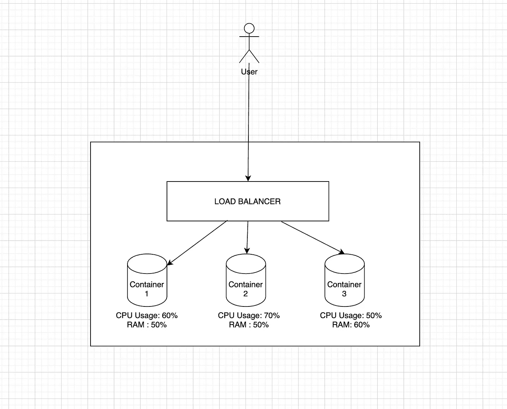
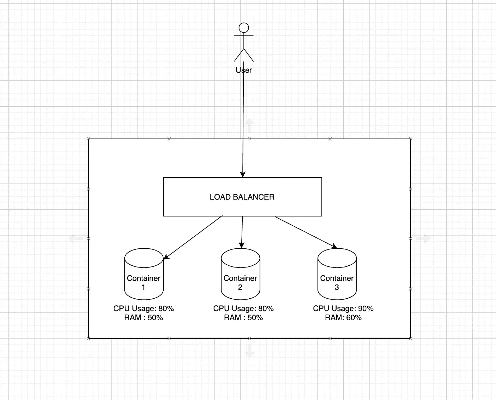
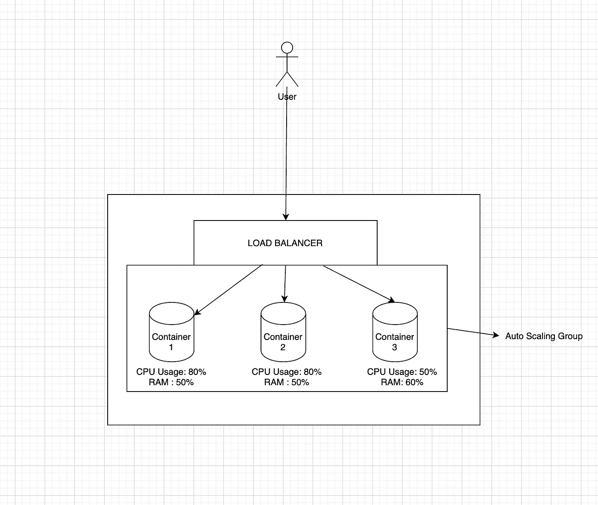
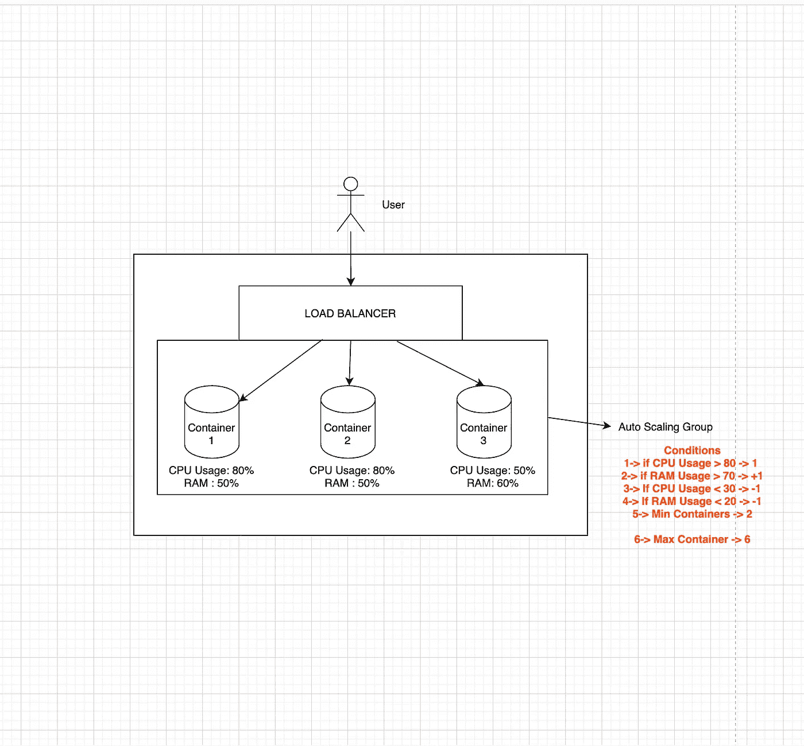
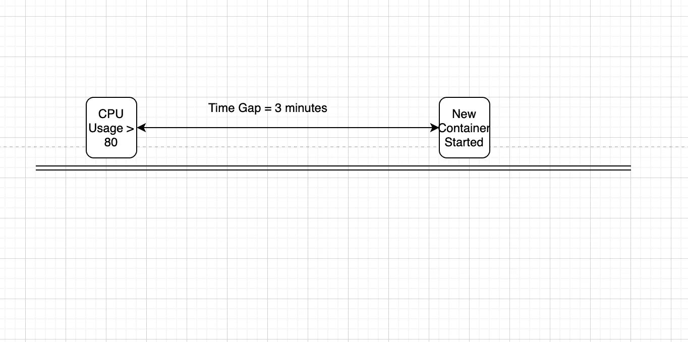
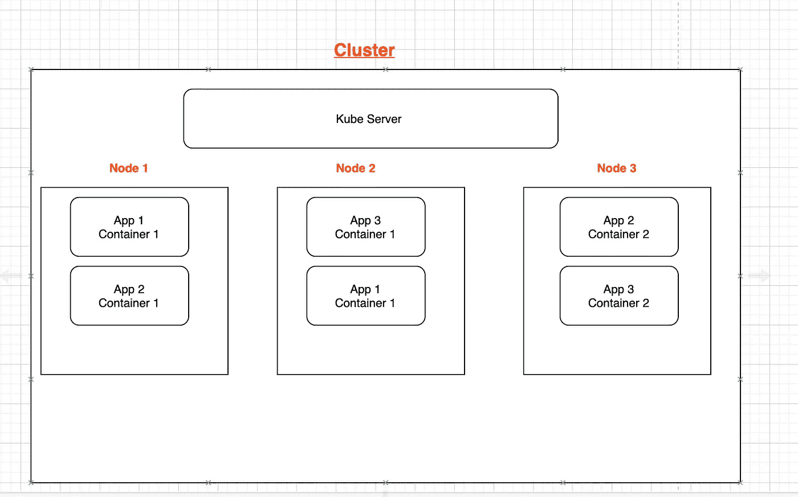

# Docker 图像大小对自动缩放 w.r.t 单节点和多节点 Kube 集群的影响

> 原文：<https://levelup.gitconnected.com/effects-of-docker-image-size-on-autoscaling-w-r-t-single-and-multi-node-kube-cluster-29c4f689cd99>

当你问开发人员，提高应用程序性能的两个关键因素是什么时，答案肯定是

*   CPU 核心的数量。
*   应用 RAM。

当谈到单片架构时，我们估计一个应用程序所需的总 CPU 和 RAM，并选择一台具有大量 CPU 内核和数百 GB RAM 的大型计算机。

这种巨大机器的问题是，与多个水平缩放的轻量级机器相比，它们非常昂贵，而且它们很难像在飞行中可用的轻量级机器那样立即得到一个。

因为这篇文章主要是关于自动缩放和 Docker 图像大小，所以我们不讨论单片和微服务。

我们将在本文中讨论的内容有

*   什么是自动扩展，何时需要自动扩展。
*   docker 图像大小和自动缩放有什么关系？
*   它如何影响单节点和多节点 Kubernetes 部署的最终用户

让我们开始讨论吧

*   **什么是自动缩放**

假设我估计的请求数量是 50000 RPM(请求/分钟),我的 SLA 响应时间大约是 50 毫秒。基于这些请求和我的 SLA，我对我的服务器和数据库进行基准测试，得出所需的容器数量和每个容器的容量( **CPU & RAM** )。让我们想象一下事情将会怎样。



假设转速为 50000 RPM，使用 3 个容器，我能够在我的 SLA 范围内满足请求。但是拥有庞大的用户群，我们不能保证请求数不能超过或者不能说我们的服务不支持超过 50000 RPM。

现在考虑一下，由于一些快速销售，我们开始收到大约 70000 RPM 的请求，现在这是每个容器的 CPU 使用情况。



这意味着我们仍将继续使用 3 个集装箱为 70000 RPM 的额外负载提供服务，我们不确定 RPM 是否会进一步呈指数级增长。此时，我所有的 CPU 内核都忙于处理用户请求，每个内核都有大量的队列。**随着队列的增加，响应时间也增加了，这导致我的 SLA 超时以及取消一些请求，因为我的服务器最多可以处理 X 个并行连接。**

作为开发人员，我们假设系统在任何时间点可以达到的最小 RPM、平均 RPM 和最高 RPM。假设最小 RPM 是 20000 (2 个容器可以处理负载)，平均值是 50000 (3 个容器)，最大值是 100000 (6 个容器)。现在，如果我们有一个系统，其中如果容器上的负载较少，它可以减少到 2 个容器，如果系统上的负载较高，它可以增加到 6 个容器(基于我们的[低、高]配置),而无需任何手动干预，这对我们扩展系统非常有帮助，即使是在峰值负载时。这是自动缩放进入画面的时候。



现在我把我所有的容器放在一个自动缩放组下，但是对于自动缩放组来说，它需要一些度量来进行缩放。这些是我们在创建自动缩放组时设置的一组条件。



右下角是自动伸缩基于应用健康和能量(CPU、RAM)放大或缩小容器的条件。

既然你对什么是水平缩放和什么是自动缩放有了基本的了解，让我们深入到描述自动缩放过程的第二点。

*   **Docker 图像大小如何影响自动缩放**

假设我们以 50K RPM 运行的应用程序开始获得 70K RPM，并且我们现有的服务器即将违反 SLA。这个自动扩展组充当容器运行时统计的监听器，一旦满足其中一个条件，它就会尝试扩展一个新容器。

生产一个新集装箱需要什么程序？

```
Container Spawning Time = Total time to download docker image + time taken for application boot up scripts + measuring health of newly spawned container.
```

从这个等式中我们可以清楚地理解一件事。如果在 CPU 使用率> 80%的情况下触发自动伸缩来增加一个容器，那么假设下载 docker 映像需要 2 分钟，启动脚本需要 30 秒，应用程序健康检查需要 30 秒。



所以在这 3 分钟的间隙里，很多事情都可能发生。

*   服务器可以达到 100%的 CPU 利用率，这会导致崩溃，从而中断许多用户请求。
*   所有的服务器都会经历峰值负载，从而大幅增加响应时间，导致用户体验不佳。

现在有人可能会问，为什么图像下载需要大量的时间，其中大部分步骤将从现有的缓存中选取。因为已经有 3 个容器在节点上运行，如果必须生成第 4 个容器，它将从节点上现有的构建缓存中获取，并且需要较少的下载时间。

**这就是多节点部署的用武之地。**

*   **它如何影响单节点终端用户&多节点 Kubernetes 部署**

作为一个产品，将会有多个这样的应用程序与我们的并行部署。让我们考虑一个例子。

有 3 个应用，每个应用 2 个容器，最多可扩展到 4 个。现在，我们在多个节点上部署了这 3 个应用程序。



现在，App 1 正面临着一些严重的 CPU 负载，因此自动缩放被触发，需要产生 App 1 的另一个实例。它遍历每个可用节点，其中它可以找到具有可用资源的节点来产生这个新容器。

在最好的情况下，如果节点 1 或节点 2 有额外的资源，新的容器将被部署在这两个节点中的任何一个上，其中构建缓存已经存在于该映像中。在这种情况下，下载和启动会更快。

但是，考虑节点 1 或节点 2 没有资源来生成 App 1 的另一个容器，并且只有节点 3 可用。因此，kube server 在节点 3 上安排了一个新的容器部署，但这次节点 3 不包含 App 1 映像的构建缓存，映像必须在运行时从公共或私有集线器下载，下载的总时间完全取决于网络带宽，这无疑会花费更多时间。

到目前为止，人们应该已经对 docker 图像大小在自动缩放和客户满意度中的重要作用有了基本的了解。

如果你有任何问题或建议，请在评论区留言。我会尽快回复你。