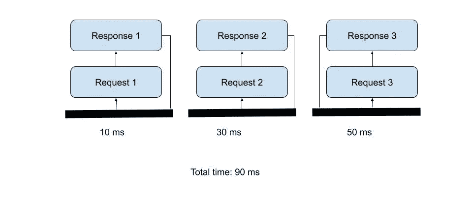
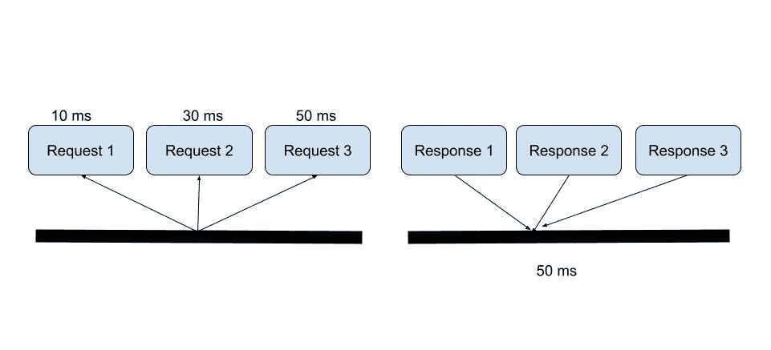

# C#中高效的异步代码

> 原文：<https://levelup.gitconnected.com/efficient-asynchronous-code-in-c-8d58fc62a88f>

## 如何正确使用异步和等待以获得最佳性能

穆罕默德·拉赫马尼在 [Unsplash](https://unsplash.com/photos/LrxSl4ZxoRs) 上的照片

**什么是异步编程？**

异步编程使您的程序能够启动一个可能长期运行的任务，然后不必等到该任务完成，而是能够在任务运行时继续响应其他事件。一旦任务完成，你的程序就会得到结果。这将使应用程序能够在后台完成任务的同时继续工作。

好了，现在我们知道异步允许我们在等待响应的同时启动一个任务并做其他事情，但是让我们看一下我们想要一次执行 3 个任务的情况，如上图所示。假设我们有这样的代码:

如果我们假设像上面的图表那样工作，执行这些调用的总时间将是 90 毫秒。但是异步编程是关于在线程之间划分工作负载，这意味着我们可以并行完成每个任务，或者等到所有任务完成后再处理结果。等待所有的任务，直到我们处理结果是这里的关键。我们可以这样重构代码:

这样，我们等待所有任务完成并利用线程，完成所有任务所需的时间等于最慢的任务，在我们的例子中是 50 毫秒，几乎快了 2 倍。

如果我们需要把它形象化，它就会是这个样子。我们希望执行的所有任务同时启动，而不是一个接一个，结果会更快地一起返回。

但这并不意味着你可以根据自己的需要来混合调用。例如，编写上面代码的正确方式应该是这样的。

因为我们不希望 orders 表上有多余的字段，所以我们可能最终会得到 *customerId* ，我们将*等待*调用来首先检索客户。但是由于接下来的两个调用互不依赖，我们可以将它们分组并一起等待。

## 结论

如果你正在开发的软件的设计很好，并且正在进行的调用相当快，我们可能会通过编写单个等待而忽略性能，但是我确实认为作为开发人员，我们应该了解编写代码和交付最佳产品的最有效方式。在这个例子中，我们看到在一行代码的帮助下，速度几乎快了一倍，但是使用这个软件的用户会真正欣赏这个速度。