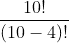
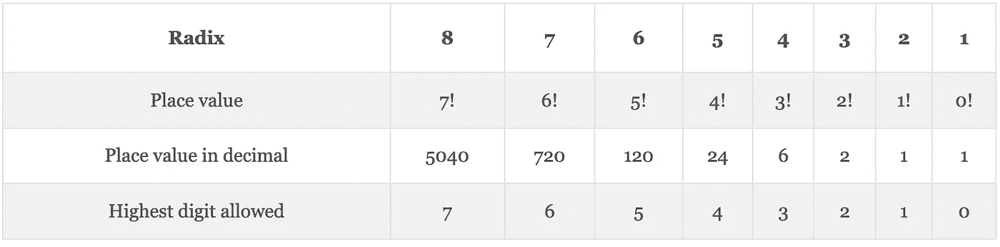

# 词典顺序的有效置换

> 原文：<https://levelup.gitconnected.com/efficient-permutations-in-lexicographic-order-8e004f94b4b8>


照片由 Olav Ahrens rtne 在 Unsplash 上拍摄

在这篇文章中，我想向你展示一种生成集合排序排列的方法。我们将着重于按字典顺序或数字顺序生成这些排列。有几种方法可以做到这一点，但就效率而言，有些方法比其他方法更好。

我们还将研究一种方法，在我们按字典顺序排列的序列中的任意位置获得一个排列。用这种方法，我们可以更直接地生成我们正在寻找的排列。我们不需要在目标序列之前生成任何先前的排列。

让我们先回忆一下什么是排列。

# 什么是排列？

从[组合学](https://en.wikipedia.org/wiki/Combinatorics)来看，排列——也称为“顺序”——是一个集合中元素重新排列的数量。一组 *n* 元素的排列数由 *n 给出！* (n 阶乘)。比如集合 *{1，2，3}* 中有 *3 个！= 3x2x1 = 6* 排列: *{1，2，3}、{1，3，2}、{2，1，3}、{2，3，1}、{3，1，2}和{3，2，1}* 。

从一组 *n* 元素中重新排列第 *k* 元素的**子集**的方式的数量由下式给出:


这个公式很容易从我们以前的定义中推导出来。让我们用一个具体的例子来说明这一点。假设我们想从 10 本书中找出 4 本书的排列方式。根据上面的公式，我们有:



我们可以这样来思考这个问题。在分子中，我们有 10 本书的排列方式数——也就是 *10！*。但是，我们只关心前 4 种方式。所以，我们把剩下的 6 种方式——or(*10-4)！= 6!*:


最后，记住在排列中，我们计算一个集合中所有可能的顺序。

# 生成排列

我们可以用不同的方法产生排列。而且，根据我们选择的方法，结果排列的顺序会改变。此外，有些方法会比其他方法更有效。[罗伯特·塞奇威克](https://www.cs.princeton.edu/~rs/)在他的调查论文 [*排列生成方法*](http://homepage.divms.uiowa.edu/~goodman/22m150.dir/2007/Permutation%20Generation%20Methods.pdf) 中总结出生成排列最快的算法是 [*堆的*算法](https://en.wikipedia.org/wiki/Heap%27s_algorithm)。然而，由此方法产生的重新排列不是按字典顺序排列的。

# 按字典顺序排列

在我们的例子中，我们希望按字典顺序或数字顺序列出它们。作为一个例子，让我们生成集合 *{0 1 2}* 的排列。我们取最小的数字， *0* ，把它放在前面，然后我们附加上剩余的 *1 和 2* 。这给出了第一个排列{0 1 2}。接下来，保持 *0* 在前面，我们重新排列 *1 和 2* : {0 2 1}。我们重复这个过程，但是现在 *1* 在前面。因此，我们得到排列 *{1 0 2}* 和 *{1 2 0}* 。最后，我们用前面的 *2* 重复:*{ 2 0 1 }**{ 2 1 0 }*。产生的排列列表如下。

```
1\. {0 1 2} 
2\. {0 2 1} 
3\. {1 0 2} 
4\. {1 2 0} 
5\. {2 0 1} 
6\. {2 1 0}
```

请注意，列表是按数字顺序排列的。换句话说，数字的每一个后续排列都比前一个大。

在这个例子中，我们只有集合{1 2 3}的 6 种排列。所以，很容易把它们都列出来。然而，随着集合的大小开始增长，排列的数量增加得更快。请记住，它遵循的是增长率的阶乘——一组大小为 *n* = *n 的排列数！*。因此，如果我们想生成集合{0 1 2 3 4 5 6 7 8 9}的排列，我们将得到 *10！= 3，628，800* 器械包的重新排列。

按字典顺序生成排列的经典算法如下。考虑数字列表*s =【1，2，3，4】*。请注意，该序列最初是排序的。这是算法所要求的。现在——假设列表的索引是从零开始的——我们进行如下操作:

**步骤 1)** 找出最大的索引 *i* 使得 *s[i] < s[i + 1]* 。如果我们找不到这样的索引，这意味着我们处于序列的最后一个排列:

从我们的列表来看， *i = 2* ，因为索引 2 处的数字， *s[2] = 3* 小于索引 *i + 1 = 3* ， *s[3] = 4* ，而 *i = 2* 是满足这个条件的最大索引。

**步骤 2)** 找出大于 *i* 的最大指数 *j* ，使得*s【I】<s【j】*:

查看我们的列表，我们得到 *j = 3* 。这满足了我们的条件 *(s[2] = 3) < (s[3] = 4)*

**步骤 3)** 将 *s[i]* 的值与 *s[j]* 的值互换:

所以，我们交换两个指数的值。我们的列表变成了:s = [1，2，4，3]

**步骤 4)** 颠倒从 *s[i + 1]* 到最后一个元素的顺序:

在我们的例子中， *i = 2* 。因此，下一个索引 *i + 1 = 3* ，这是我们列表的最后一个索引，因此它保持不变。我们的下一个排列是*s =【1，2，4，3】*。

我们用下一个置换继续这个过程，直到不满足条件 *s[i] < s[i + 1]* 。这将表明我们已经到达了序列的最后一个排列。

# 在有序序列中寻找第 n 个排列

上面的方法按顺序生成一组元素的所有排列。这个顺序总是按字典顺序排列的。但是，如果我们想在序列中的任意位置找到按字典顺序排列的排列呢？例如，如果我们想在集合{0 1 2 3 4 5 6 7 8 9}中找到第 980，000 个排列？如上所述，我们知道这个序列中有 *3，628，800 个*排列。使用我们之前的算法，在得到第 *980，000 个*之前，我们必须生成所有之前的 *979，999 个*排列。

对于这个任务，我们可以使用*阶乘数字系统*来帮助我们更有效地找到我们的任意排列。

# 阶乘数字系统

阶乘数制或 *factoradic* 是一种 [*混合基数*](https://en.wikipedia.org/wiki/Mixed_radix) 数制。这意味着每个数位的*基数*或*基数*随其位置而变化。相比之下，我们更熟悉的数字系统——如十进制或二进制——在每个位置上所有数字的基数都是固定的。

下表说明了阶乘数字系统。



要将一个值从十进制转换为因式，我们只需将该值除以基数——从 1、2、3 开始……在连续的除法中，我们跟踪余数——直到除法结果为 *0* 。每个除法的余数将对应于该位置的因数位数，从右到左。例如，要将 *256* (十进制)转换为阶乘数表示:

```
256 / 1 = 256, remainder 0 
256 / 2 = 128, remainder 0 
128 / 3 =  42, remainder 2 
 42 / 4 =  10, remainder 2 
 10 / 5 =   2, remainder 0 
  2 / 6 =   0, remainder 2
```

排列余数——从底部开始向上——我们得到工厂编号: *202200* 。作为练习，您可以尝试使用上表将其转换回十进制表示。我们只需要将每个位置的数字乘以其对应的*位值*，然后将它们相加。

# 用阶乘数系求第 n 种排列

我们现在准备使用阶乘数字系统来帮助我们找到序列中的任意排列。事实证明，这个数字系统和一组按字典顺序排列的排列之间存在联系。这种关系或映射被称为 [*莱默码*](https://en.wikipedia.org/wiki/Lehmer_code) 。

现在，让我们回到我们的问题:在集合 *{0 1 2 3 4 5 6 7 8 9}* 的按字典序排列中，寻找*的第 980，000 个*排列。如您所见，集合最初是排序的(按非降序)。这代表集合中最低的排列。请记住，使用这种方法，我们不需要生成所有以前的排列来得到我们正在寻找的排列。

我们进行如下。首先，我们将为集合中的所有数字分配一个索引——从*0–*开始。最初，索引 *0* 对应数字 *0* ，索引 *1* 对应数字 *1* 等等，直到索引 *9* 对应数字 *9* 。此外，我们将从 *0* 开始枚举序列中的每个排列。所以，集合的初始排序是排列数 *0* 。所以我们现在需要找到*(第 980000-1)= 979999*排列。

现在，我们把数字 *979，999* 除以 *(n -1)！*其中 *n* 是集合中元素的数量——在我们的例子中，*n = 10–*所以我们开始除以 *9！*。我们将跟踪余数和整数商:

```
Initial set: {0 1 2 3 4 5 6 7 8 9} 
979,999 / 9! = 2, remainder 254,239 
permutation 1st digit: 2
```

这里，整数除法的结果， *2* ，表示与我们的 *979，999*排列中的第一个数字相对应的数字在集合中的索引。索引 *2* 对应编号 *2* 。我们现在从集合中取出这个数，取余数作为我们的新分子，继续下一次迭代，从分母 *(n-1)中的 *n* 中减去 *1* ！*。我们将继续这一过程，直到并包括 *(n -1)！= 0!*:

```
set: {0 1 3 4 5 6 7 8 9} 
254,239 / 8! = 6, remainder 12,319 
permutation 2nd digit: 7 set: {0 1 3 4 5 6 8 9} 
12,319 / 7! = 2, remainder 2,239 
permutation 3rd digit: 3 set: {0 1 4 5 6 8 9} 
2,239 / 6! = 3, remainder 79 
permutation 4th digit: 5 set: {0 1 4 6 8 9} 
79 / 5! = 0, remainder 79 
permutation 5th digit: 0 set: {1 4 6 8 9} 
79 / 4! = 3, remainder 7 
permutation 6th digit: 8 set: {1 4 6 9} 
7 / 3! = 1, remainder 1 
permutation 7th digit: 4 set: {1 6 9} 
1 / 2! = 0, remainder 1 
permutation 8th digit: 1 set: {6 9} 
1 / 1! = 1, remainder 0 
permutation 9th digit: 9 set: {6} 
0 / 0! = 0, remainder 0 
permutation 10th digit: 6
```

把所有的数字放在一起，我们得到: *{2 7 3 5 0 8 4 1 9 6}* 。这是我们集合按字典顺序排列的第*980000 个*排列。

注意，上面每个整数除法的结果对应于十进制的 *979，999* 的因式数表示中的每个数字。将这些数字放在一起得到 *2623031010* 。这是十进制数 *979，999 的阶乘数表示:*

```
979,000(decimal) = 2623031010(factoradic)
```

这说明了阶乘数字系统和字典排列之间的映射。同样，我们可以按照上一节中的过程，将 *979，000–*转换为阶乘数表示。然后使用因数位数中的每个数字作为收缩集的索引，就像我们上面做的那样。

# 排列的应用

在本文中，我们从排列的基本定义出发，讨论了生成排列的不同方法。我们特别感兴趣的是按字典顺序生成排列，以及我们如何有效地做到这一点。作为总结，我将简要提及排列在不同领域的一些应用。

其中一些应用包括[信息论](https://en.wikipedia.org/wiki/Information_theory)中的错误检测和纠正算法。置换用于分析计算机科学中的排序算法。它们也用于描述生物学中的 RNA 序列。并且，它们出现在数学的许多分支中。

希望这个排列的讨论给你另一个视角，并激发你继续探索这个主题。

*原载于 2020 年 8 月 31 日 https://stemhash.com*[](https://stemhash.com/efficient-permutations-in-lexicographic-order/)**。**