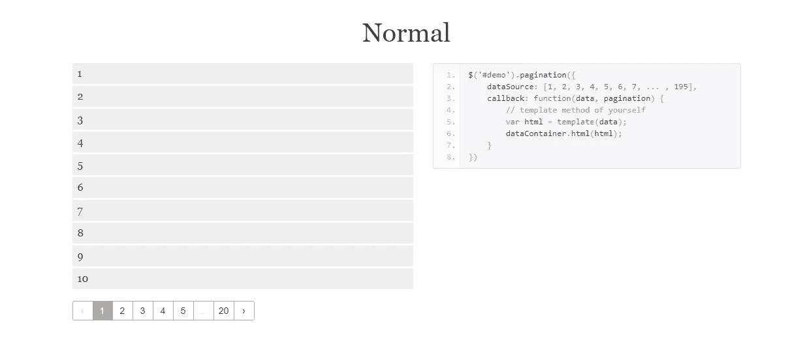
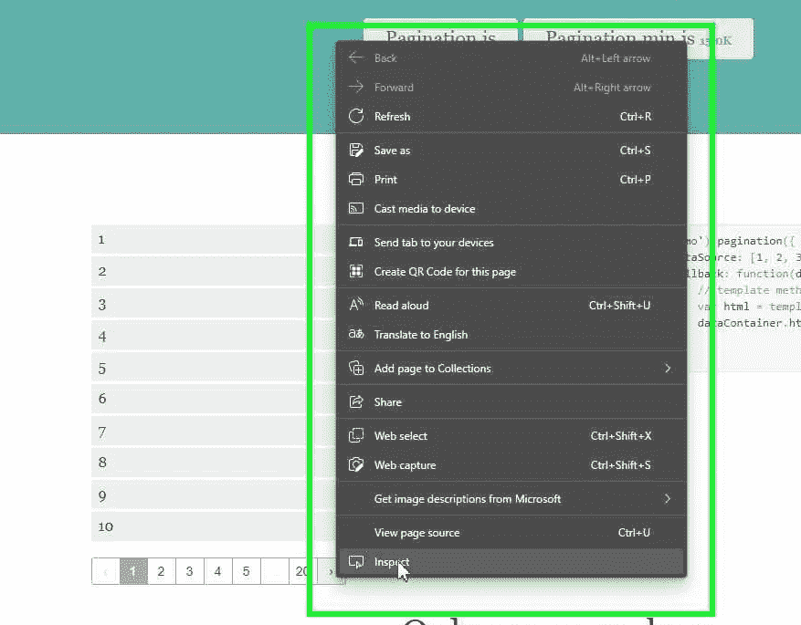
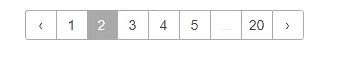
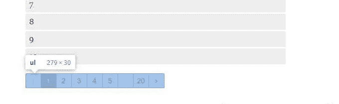
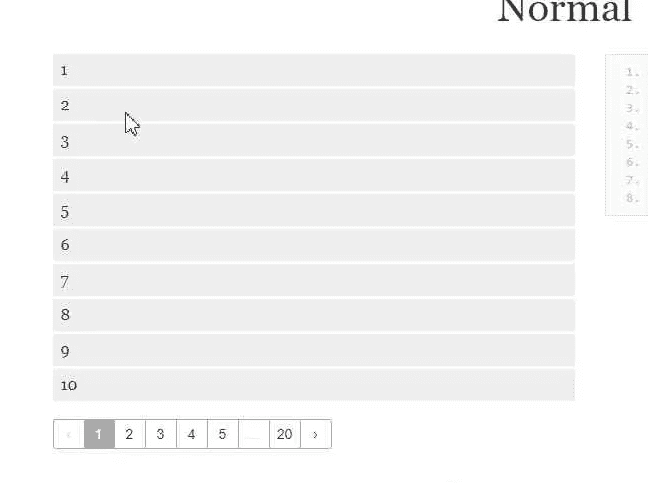
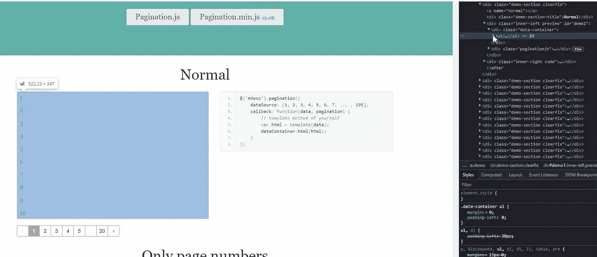

# 高效抓取多页数据:使用 Selenium 和 Python 处理分页的指南

> 原文：<https://levelup.gitconnected.com/efficiently-scraping-multiple-pages-of-data-a-guide-to-handling-pagination-with-selenium-and-3ed93857f596>


照片由[罗曼·特里福诺夫](https://unsplash.com/@roman34nov?utm_source=medium&utm_medium=referral)在 [Unsplash](https://unsplash.com?utm_source=medium&utm_medium=referral) 上拍摄

为什么分页对网页抓取器来说是一个如此大的挑战？

因为它从来不只是一页，它总是一页接一页的…

您是否厌倦了手动单击分页元素的无尽页面来收集数据？不要害怕，因为我们已经为您找到了解决方案！在本文中，我们将向您展示如何使用 Selenium 和 Python 来为您完成所有困难的工作。想象一下再也不用点击“下一步”了！只是坐下来，放松，让计算机做一页又一页的数据抓取的繁琐任务。如果出现任何问题，不要担心，我们也有一些关于错误处理的提示。所以不要等待，今天就带着微笑开始刮那些页面吧！

分页是网站上的一个常见功能，它允许您浏览多个内容页面。当使用分页抓取网站时，考虑如何处理分页以确保能够抓取所有需要的数据是很重要的。

在这个演示中，我们将使用 selenium 包 Selenium 是一个自动化 web 浏览器的流行工具。它允许您控制 web 浏览器并执行操作，例如导航到网页、与页面上的元素交互以及从页面提取数据。这对于抓取需要执行 JavaScript 的网站或者使用 AJAX 动态加载内容的网站特别有用。

## 设置环境

安装 Selenium

```
pip install selenium
```

安装 web 驱动程序管理器

```
pip install webdriver-manager
```

启动浏览器

```
# selenium 4
from selenium import webdriver
from selenium.webdriver.chrome.service import Service as ChromeService
from webdriver_manager.chrome import ChromeDriverManager

driver = webdriver.Chrome(service=ChromeService(ChromeDriverManager().install()))
driver.get('https://pagination.js.org/')
driver.maximize_window()
```

代码描述

*   这段代码将使用`webdriver_manager`库安装 ChromeDriver 可执行文件，并使用 Selenium 启动 Chrome 浏览器。浏览器将导航到网站“[https://pagination.js.org/](https://pagination.js.org/)”并最大化窗口。
*   `ChromeService`类用于创建管理 ChromeDriver 进程的服务。它允许你根据需要启动和停止 ChromeDriver 进程。
*   `webdriver_manager`库中的`ChromeDriverManager`类用于下载和安装 ChromeDriver 可执行文件。它将自动下载与您安装的 Chrome 版本兼容的最新版本的 ChromeDriver。
*   注意，为了使用这段代码，你需要安装`webdriver_manager`库。

## 与页面上的 Web 元素交互

我们将处理正常的分页，并从表中提取数字。



正常分页

步骤:

*   右键单击下一个页面元素并检查



*   转到元素，我们可以观察到该元素包含一个下一个箭头，因此我们使用 Xpath 函数 text()来捕获该元素。

```
//a[text()='›']
```

复制 xpath 并将其粘贴到 python 脚本中

```
from selenium.webdriver.common.by import By 
next_page = driver.find_element(By.XPATH,'//a[text()='›']').click()
```

`find_element`方法用于根据指定的搜索标准定位网页上的元素。在这种情况下，`By.XPATH`标准用于使用 XPath 表达式搜索元素。XPath 表达式指定元素在 HTML DOM 树中的位置。

`click`方法用于模拟鼠标点击元素。这将触发与该元素相关联的任何 JavaScript 事件或动作。在这种情况下，我们可以看到我们移动到第二页。



现在让我们创建一个循环，点击下一步按钮，直到到达页面的结尾，但这里最大的挑战是我们如何理解我们已经到达了页面的结尾。

分页的逻辑构建

*   检查分页列表



*   我们最后观察到的分页列表的 Dom 结构，但是无序列表的一个元素给出了页数。

```
<div class="paginationjs-pages">
    <ul>
        <li class="paginationjs-prev disabled "><a>‹</a></li>
        <li class="paginationjs-page J-paginationjs-page  active" data-num="1"><a>1</a></li>
        <li class="paginationjs-page J-paginationjs-page " data-num="2"><a>2</a></li>
        <li class="paginationjs-page J-paginationjs-page " data-num="3"><a>3</a></li>
        <li class="paginationjs-page J-paginationjs-page " data-num="4"><a>4</a></li>
        <li class="paginationjs-page J-paginationjs-page " data-num="5"><a>5</a></li>
        <li class="paginationjs-ellipsis disabled"><a>...</a></li>
        <li class="paginationjs-page paginationjs-last J-paginationjs-page " data-num="20"><a>20</a></li>
        <li class="paginationjs-next J-paginationjs-next " data-num="2" title="Next page"><a>›</a></li>
    </ul>
</div>
```

*   使用浏览器中的检查工具找到这个无序列表元素的 xpath。

```
all_list_elements = driver.find_elements(By.XPATH,'//*[@id="demo1"]/div[2]/div/ul/li')
number_of_pages = int(all_list_elements[-2].text)
```

这段代码将使用 Selenium 来定位 pagination 元素中的所有页面元素，并提取页面总数。

`find_elements`方法类似于`find_element`方法，但是它返回匹配搜索标准的元素列表，而不是单个元素。

在本例中，代码搜索 id 为“demo1”的所有元素、类为“ul”的子元素和类为“li”的子元素。然后它会将元素列表存储在`all_list_elements`变量中。

通过选择列表中的倒数第二个元素(`all_list_elements[-2]`)并提取文本内容来提取总页数。文本内容是页数。然后它被转换成一个整数并存储在`number_of_pages`变量中。

*   一旦我们找到了页数，我们就写一个 for 循环来迭代直到页面结束

```
for _ in range(number_of_pages):
    next_page = driver.find_element(By.XPATH,"//a[text()='›']").click()
    time.sleep(2)
```

`for`循环将迭代指定的次数(`number_of_pages`)，在每次迭代中，它将使用`find_element`方法和`By.XPATH`标准定位“下一步”按钮。然后它将使用`click`方法点击按钮。

`time.sleep`函数用于将脚本暂停指定的秒数(在本例中为 2 秒)。这有助于在与网页交互之前让网页完全载入。

*   现在我们已经演示了如何遍历页面，让我们编写一个脚本来捕获表中的所有元素

步伐

*   转到有数字的表格，右键单击并检查



*   我们注意到该表是一个无序列表



*   并且每个数字都在无序列表的一个
*   元素中。

```
<div class="data-container">
    <ul>
        <li>1</li>
        <li>2</li>
        <li>3</li>
        <li>4</li>
        <li>5</li>
        <li>6</li>
        <li>7</li>
        <li>8</li>
        <li>9</li>
        <li>10</li>
    </ul>
</div>
```

*   为了捕获无序列表中的所有元素，我们可以编写一个 xpath

```
# Locate all elements on the current page of the pagination element
page_elements = driver.find_elements(By.XPATH,'//*[@id="demo1"]/div[1]/ul/li')

# Extract the text content of the first element in the list
text_content = page_elements[0].get_attribute('innerHTML')

# Print the text content to the console
print(text_content)
```

这段代码使用 Selenium 来定位 pagination 元素的当前页面上匹配指定 XPath 表达式的所有元素。然后使用`get_attribute`方法和`'innerHTML'`属性提取列表中第一个元素的文本内容。最后，它使用`print`函数将文本内容打印到控制台。

*   让我们将上面讨论的逻辑组合到一个函数中，并在上面编码的 for 循环中使用它来单击下一页。

```
def extract_page_data(driver):
    # Initialize an empty list to store the data
    page_output = []

    # Locate all elements on the current page of the pagination element
    page_elements = driver.find_elements(By.XPATH,'//*[@id="demo1"]/div[1]/ul/li')

    # Iterate through the list of elements
    for each_element in page_elements:
        # Extract the text content of each element
        each_element_value = each_element.get_attribute('innerHTML')
        # Add the extracted text content to the page_output list
        page_output.append(each_element_value)

    # Return the page_output list
    return page_output

# Initialize an empty list to store the data from all pages
final_out = []

# Iterate through the pages
for page_num in range(number_of_pages):
    # Extract the data from the current page
    page_output = extract_page_data(driver)
    # Add the data to the final_out list as a dictionary with the page number as the key
    final_out.append({
        page_num: page_output
    })
    # Locate the "Next" button on the webpage and click it to navigate to the next page
    next_page = driver.find_element(By.XPATH, "//a[text()='›']").click()
```

文章的完整代码

```
# Import the necessary libraries
from selenium import webdriver
from selenium.webdriver.chrome.service import Service as ChromeService
from webdriver_manager.chrome import ChromeDriverManager
from selenium.webdriver.common.by import By
import time

# Install the ChromeDriver executable and start a Chrome browser using Selenium
driver = webdriver.Chrome(service=ChromeService(ChromeDriverManager().install()))

# Navigate to the website and maximize the window
driver.get('https://pagination.js.org/')
driver.maximize_window()

# Locate all elements in the pagination element and extract the total number of pages
all_list_elements = driver.find_elements(By.XPATH,'//*[@id="demo1"]/div[2]/div/ul/li')
number_of_pages = int(all_list_elements[-2].text)

# Define a function to extract the data from the current page of the pagination element
def extract_page_data(driver):
    # Initialize an empty list to store the data
    page_output = []

    # Locate all elements on the current page of the pagination element
    page_elements = driver.find_elements(By.XPATH,'//*[@id="demo1"]/div[1]/ul/li')

    # Iterate through the list of elements
    for each_element in page_elements:
        # Extract the text content of each element
        each_element_value = each_element.get_attribute('innerHTML')
        # Add the extracted text content to the page_output list
        page_output.append(each_element_value)

    # Return the page_output list
    return page_output

# Initialize an empty list to store the data from all pages
final_out = []

# Iterate through the pages
for page_num in range(number_of_pages):
    # Extract the data from the current page
    page_output = extract_page_data(driver)
    # Add the data to the final_out list as a dictionary with the page number as the key
    final_out.append({
        page_num: page_output
    })
    # Locate the "Next" button on the webpage and click it to navigate to the next page
    next_page = driver.find_element(By.XPATH, "//a[text()='›']").click()
```

总结:

在本文中，我们演示了如何使用 Selenium 和 Python 从网站的分页元素中抓取数据。我们展示了如何在 pagination 元素中提取总页数，定义一个函数从每个页面中提取数据，并使用一个`for`循环遍历页面并提取数据。我们还提供了关于错误处理和测试代码的技巧，以确保代码正常运行。通过遵循本文概述的步骤，您应该能够使用 Selenium 和 Python 成功地从分页元素中抓取数据。

# 分级编码

感谢您成为我们社区的一员！在你离开之前:

*   👏为故事鼓掌，跟着作者走👉
*   📰查看[升级编码出版物](https://levelup.gitconnected.com/?utm_source=pub&utm_medium=post)中的更多内容
*   🔔关注我们:[Twitter](https://twitter.com/gitconnected)|[LinkedIn](https://www.linkedin.com/company/gitconnected)|[时事通讯](https://newsletter.levelup.dev)

🚀👉 [**加入升级人才集体，找到一份神奇的工作**](https://jobs.levelup.dev/talent/welcome?referral=true)