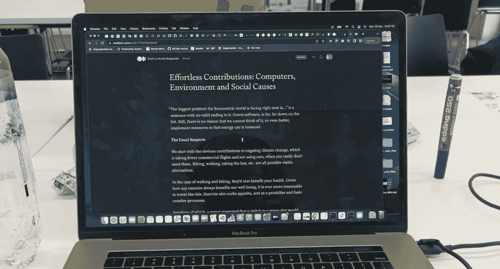

# 毫不费力的贡献:计算机、环境和社会事业

> 原文：<https://levelup.gitconnected.com/effortless-contributions-computers-environment-and-social-causes-a0c775e33cb1>

“以欧洲为中心的世界现在面临的最大问题是……”是一个没有有效结尾的句子。每一项贡献都有它的成本，在清单的最下方是绿色软件。尽管如此，我们没有理由不能采取一些基本措施来遏制气候变化，尤其是如果这不需要任何脑力或体力的努力。

**绿色未来的常见嫌疑人**

我们从减少气候变化的显而易见的贡献开始，当你真的不需要的时候，少乘商业航班，不使用汽车。骑自行车、步行、乘公共汽车等。都是可行的选择。

在步行和骑自行车的情况下，它们也有益于你的健康，抑制你的食欲，充当止痛药并促进创造性过程。

说到食物，一份报告显示，在全球范围内，转向纯素食将减少 15%的 T2 二氧化碳排放量。即使只放弃牛肉而不是乳制品也有很大的不同。放弃所有的奶酪和奶制品，一个人的排放量会变得相当理想，没有很多健康风险。如果你从附近的国家或地区采购食物，你自己的碳排放量会下降得更多。

吃素有很多窍门，比如在饮食中补充维生素 B12(只存在于动物性食物中)，平衡蛋白质和脂肪等。但是一旦一个人找到了满足他所有需求的饮食，他每天都在贡献，甚至没有注意到。

另一个巨大的能源消耗是供暖。当我一个人住的时候，我通常会把暖气关小(甚至关掉)，尤其是在冬天。我不建议这样做，但大多数时候，我们并不像自己认为的那样需要那么多的暖气。人体在 19 摄氏度左右睡眠最好，这就是为什么在晚上保持温度高于 19 摄氏度是愚蠢的。

此外，有些人无论如何也不会花太多时间在家，所以白天可以有效地关闭暖气。宠物和你的伴侣可能会在这里插话，因此这并不总是一个现实的场景。但是我们可以更有效地利用能源。

**电脑**

这是我们家供暖后最明显的能源利用。虽然我知道我们在业余时间和职业中在这上面花了太多的时间，但我们不能脱离并仍然过着舒适的生活。然而，请注意，计算机使用的能量最终都转化为热能。

让它计算一些无限的程序，就可以给家里供暖。问题只是无限程序是什么。

**BOINC**

事实证明，科学界一直在寻找计算能力。BOINC 是一个分布式计算平台，允许你在家用电脑上运行科学项目，其结果最终会被用于科学出版物，解决蛋白质折叠、素数定理和其他问题。

每周 7 天每天 24 小时运行它，尤其是使用一台重量级计算机，可以很快使人的脚发热(当放在计算机附近时)，并在这样做的同时解决棘手的问题。嘿，也许你的脚所依靠的研究将发现一种蛋白质，它将治愈你可能患有的任何疾病，无论是就在那一刻，还是 40 年后。

BOINC 唯一的两个限制是你的计算能力，如果你需要你的 GPU/CPU 来处理其他密集的工作，这种计算能力是非常有限的。另一个是过热。

**RAM**

RAM 是一个很大的用电量。这种类型的内存通常是动态 RAM (DRAM ),使您的电脑对其中的电容器充电，从而使其发热。换句话说，你电脑上的内存越多，你消耗的能量就越多。我们今天的机器安装了千兆字节规模的内存，其中大部分被浪费在愚蠢的事情上(高清广告，Chrome 等)。).然后关闭不需要的应用程序，释放内存，这减少了保持计算机运行所需的电量。

[**黑暗模式**](https://chrome.google.com/webstore/detail/dark-reader/eimadpbcbfnmbkopoojfekhnkhdbieeh)

从屏幕发出的光有一部分会从窗户逸出，通常会加热墙壁，而墙壁起到了能量接收器的作用，将热量散发到外面。相比之下，CPU 以集中的形式释放能量，加热一个人房间的特定部分，使其“加热显著”。黑暗模式仍然可以让你少用大约 3%的能源，而且对你的眼睛也有好处。

虽然这是一个微小的努力，但这样一个看似无关紧要的小变化对能源使用产生了显著的影响。3%不足以被动注意到，但也是有事([中杖](https://medium.com/u/a32c340ea342?source=post_page-----a0c775e33cb1--------------------------------)，搞清楚原生黑暗模式拜托！)

**互联网**

这是这个名单中最大的能源用户。为全球互联网供电的成本在于 1)使其可服务，以及 2)实际使用。那么，为什么不把一个人的下载从高清降级到更低的质量呢？或者下载所有音乐一次，这样你就不需要像在 YouTube 上那样，每次想听某首歌的时候都重新下载了？

一封垃圾邮件可以吸收大约 0.3 克二氧化碳，这意味着你订阅的东西越少，你的碳足迹就越少，这听起来很奇怪。从云中删除你的数据(例如，你的旧电子邮件账户)也会节省一些能量，当涉及到刷新数据或者将数据从一个位置移动到另一个位置时。这实际上是一种摆脱你的在线数据的练习，同时也是一种私有化。).

**TOR**

这个有争议。人们经常听说暗网，或深网，暗示着黑暗，尽管如果你知道怎么做，它们很容易进入。你下载 TOR，连上网络，tada！连接到隐藏的维基(我这里不包括链接)，你就上路了！这种网络的特点是，它将一个人的加密数据通过世界各地的一系列 TOR 节点传递，然后从其中一个节点吐出你的数据，然后从那里与你试图访问的服务器通信。

这种连接互联网的方式在能源使用上毫不掩饰地糟糕。但是人们不会想到罪犯和其他邪恶的组织会为了环保而使用这个网络，而是为了保密。尽管如此，网络也是举报者和记者传递信息的一种方式，这意味着它是一把双刃剑:你努力分散所有权力，无论是好是坏。

为了支持 TOR，你可以捐赠你的计算机作为网络上的一个节点。如果做得正确，你会是第一个，帮助记者不被注意，但也给了罪犯更多的回旋余地来做他们的事情。由你决定。也加热。

**超越电脑**

不做任何事也有很多其他的帮助方式。重复使用瓶子，把那些瓶子放在任何地方(这样你就可以随时想喝就喝)，对你所拥有的东西感到满意，拒绝进口酒精，喝自来水，不要耙你的院子，用茶代替咖啡(艰难，艰难，我知道)，找到一个便宜的爱好，最后，过一种安静但美好的生活。

如果每个人都能做到这一点，我们就会让经济崩溃，并在此过程中拯救世界。