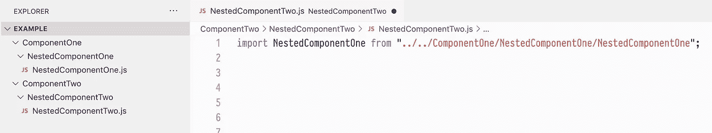
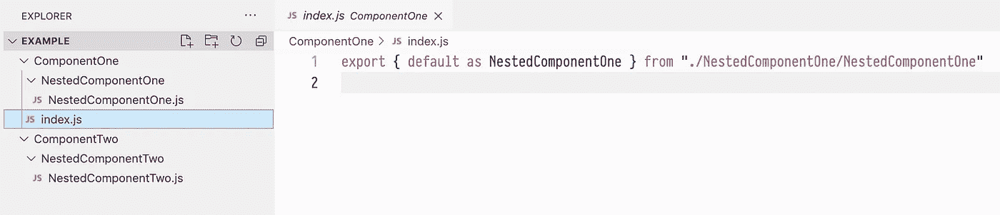
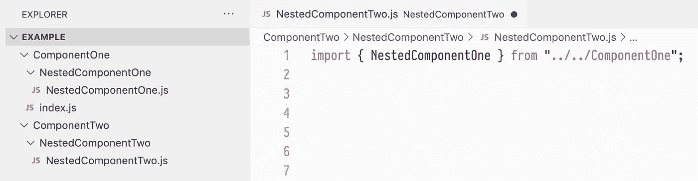
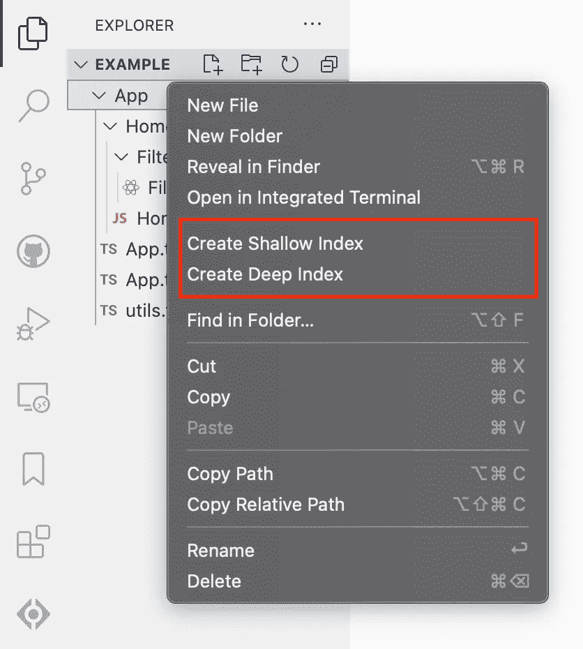
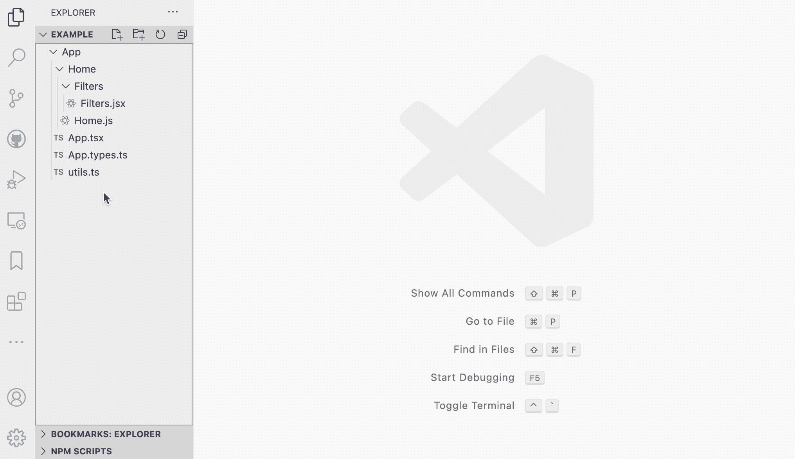
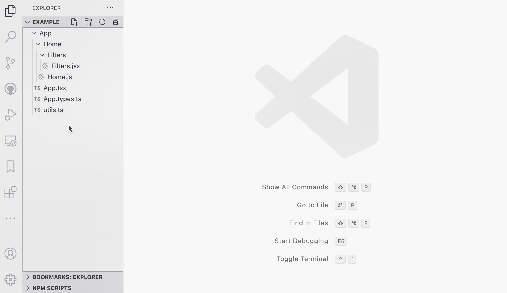

# 用 VS 代码轻松索引文件

> 原文：<https://levelup.gitconnected.com/effortless-index-files-with-vs-code-14de324e0917>

# 为什么要使用索引文件？

如果您在日常编码中大量使用 Javascript/Typescript，您将会非常清楚处理导入的痛苦。跟踪保存了可重用变量/函数的深层嵌套文件会令人疲惫和困惑。如果下面显示的混乱的进口陈述让你焦虑，那么继续读下去！

以错误的方式导入

我们可以通过在`ComponentOne`目录中创建一个`index.js`文件来简化上面的导入，如下所示。它充当文件中所有可导出变量和函数的目录表。

索引文件充当目录

现在，当我们想要导入`NestedComponentOne`时，我们不需要知道它的确切文件位置。相反，我们只需要知道它所在的根目录名。当一个文件名没有在 import 语句中被引用时，Javascript 和 Typescript 会自动寻找一个`index`文件来找到您想要的内容。它允许像这样干净的导入。

进口做得好

# 简化您的工作流程

使用`index`文件的唯一缺点是手动跟踪一个目录中的所有可导出文件。这就是我创建 [Indexify](https://marketplace.visualstudio.com/items?itemName=JordanEckowitz.indexify) 的原因！安装完扩展后，您所要做的就是右键单击 VS 代码资源管理器中的任何目录，您将获得创建浅索引或深索引的选项(不同之处将在下面解释)。一次点击，你所有的索引为你处理！

Indexify 处理所有新旧 Javascript/Typescript/Node.js 导出格式。它还自动确定是否需要一个`index.js`或`index.ts`文件(基于导出的内容)。

# 创建浅层索引

创建浅层索引将只包括所选目录根目录中的文件。所选文件夹中的所有子目录都将被忽略。

# 创建深度索引

创建深度索引将分析所选文件夹中的所有文件和目录(无论文件嵌套有多深，它们都将被索引！).

# 事后思考

如果您在使用该扩展时发现任何错误，请在这里或 Visual Studio Marketplace 中发表评论，我将很乐意解决它。我希望你和我一样觉得这个扩展很有用。

你可以在这里找到更多细节:[https://marketplace.visualstudio.com/items?itemName = jordaneckowitz . indexify](https://marketplace.visualstudio.com/items?itemName=JordanEckowitz.indexify)