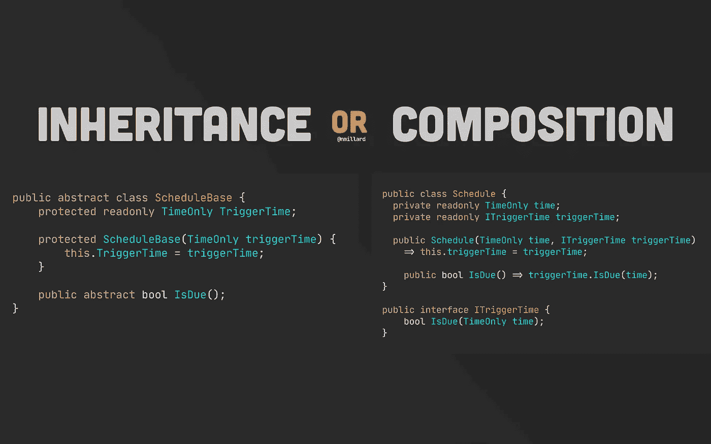
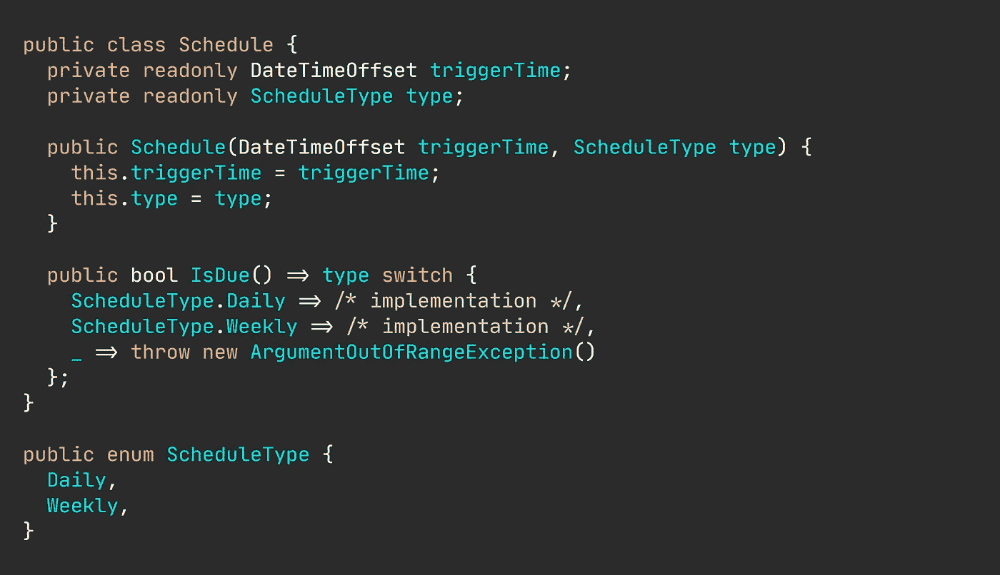
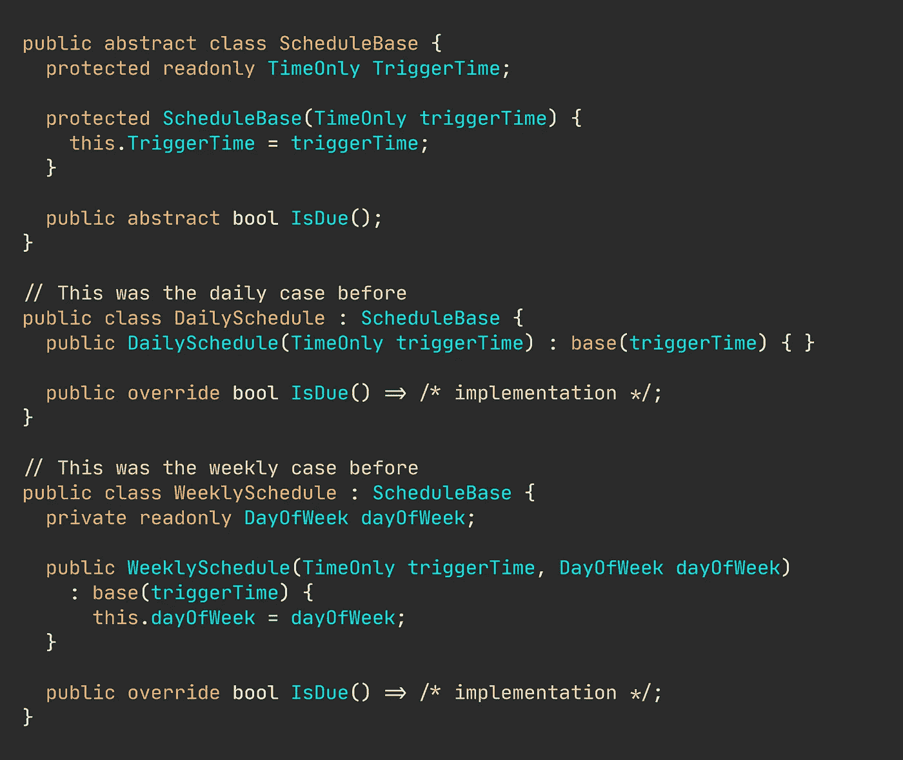
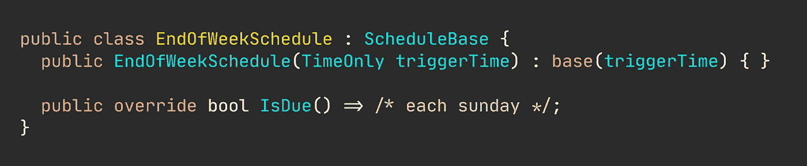
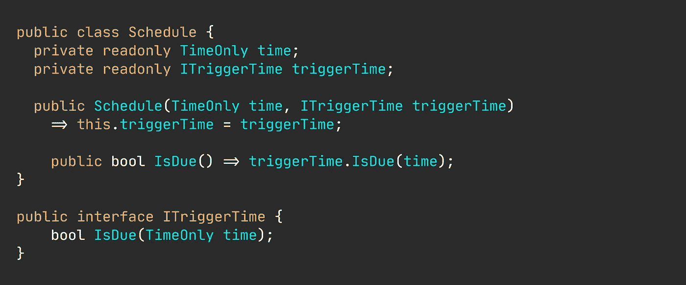
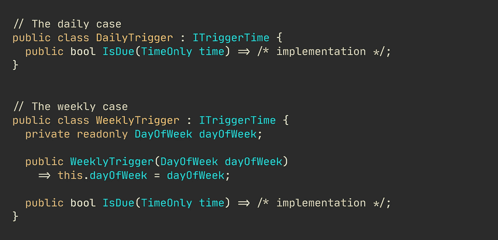
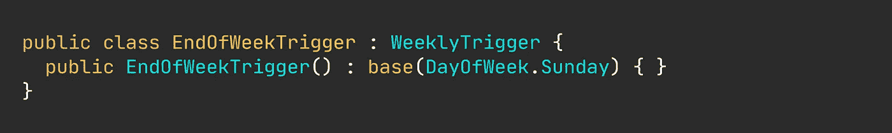

# 为初学者开发人员提供轻松的继承和组合示例

> 原文：<https://levelup.gitconnected.com/effortless-inheritance-and-composition-with-examples-for-beginner-developers-c0b5a5b72908>

## 实用编程建议

## 它们只是解决同一问题的不同方式吗？

图片由[尼克拉斯·米勒德](https://medium.com/u/7c7a43b3d9de?source=post_page-----c0b5a5b72908--------------------------------)

你可能已经看了很多关于继承和组合的教程，我猜你仍然对它们的实用性或者什么时候选择一个而不是另一个感到困惑。

对于我们的例子，我们将使用一个有一些变化的调度模型，比如触发每日或每周。此外，我们希望这个模型可以很容易地用新的变化来扩展——否则，继承和组合都没有意义，一个简单、天真的`switch`就足够了。

我已经举例说明了这种幼稚的方法，为您提供了某种判断继承和组合如何解决我们问题的“基线”。

天真的计划实施。

弄清楚一个调度实际上应该在什么时候触发并不是一件完全无关紧要的事情，也不在本文的范围之内，所以我将这一部分留给了所有后续的例子。但是，要知道`triggerTime`值包含日期、时间和时区部分。因此，为了确定触发器何时到期，我们提取不同的部分并计算计划是否到期，例如，为 2021 年 10 月 29 日 11:00 创建的每周触发器将在每周五 11:00 运行。

但是首先，我为什么要选择这个例子来展示继承和组合是如何提高代码质量的呢？这个实现不就好了吗？用基类和接口增加抽象，间接肯定只是不必要的开销，对吗？

好吧，实现现在是可管理的，但是如果我们知道将会有更多的触发类型，例如添加一个周末，或者一个工作日结束，等等，那么你需要修改现有的代码，通过添加一个新的 enum 值和在`IsDue()`方法中添加一个 case 来违反开闭原则(OCP)。圈和认知的复杂性将会飞速上升。

🔔想要更多这样的文章？在这里签名。

# 继承的例子。

让我们开始将我们的简单模型重构为一个更具可扩展性、基于继承的模型。

我们需要根据每天或每周的时间表来考虑我们的时间表。

首先，您需要将公共功能提取到一个抽象基类中，然后实现子类型。我们从朴素模型的`IsDue()`方法中的分支派生出子类型，这意味着我们需要一个`Daily`和`Weekly`调度子类型。

所以，在提取过程之后，我们只剩下这样的东西。花几秒钟时间通读代码。

重构了简单的继承方法。

不可否认，这是更多的代码，在一些开发人员看来，更复杂。然而，我们已经大大降低了`IsDue()`方法的复杂性。它现在只有一个目的。开关不见了。

注意我们是如何用`TimeOnly`代替了`DateTimeOffset`的。时间是每日和每周所需的唯一共同价值。每周计划现在可以自行发展，并接受额外的信息，例如您希望计划在一周中的哪一天运行。

当我们使用继承时，创建一个新的时间表是一个竞争任务。假设我们想要一个周末触发器。这就像实现一个新的类，而不是修改一个现有的类一样简单。

新功能。

## 但这并非没有陷阱。

尽管我们重构后的代码更加干净、易读，并且总体上更易于维护，但是对于继承还是有一些明显的、欺骗性的警告。

继承带来了紧密耦合。默认情况下，每个子类型都与其基类紧密耦合。脆弱的基类问题是一个令人生畏的例子，一个基类的微小变化会产生难以置信的连锁反应。简单地添加一个新的构造函数参数会破坏每个子类型。

另外，想象一下让基类`IsDue()`方法可重写而不是抽象的。这不会破坏任何东西，但它可能会产生不想要的或难以发现的副作用。

🔔[想要更多这样的文章？在这里签名。](https://nmillard.medium.com/subscribe)

# 我们的作文例子。

您可能听说过您应该更喜欢组合而不是继承，脆弱的基类问题给了您这样做的一个很好的理由。

让我们再次离开我们最初的，天真的例子。这次我们保留了`Schedule`类，但是我们将每个触发时间建模为一个单独的类。我们现在不去想一个日程安排`is-a`日常日程安排，而是把它想成一个要被触发的日程安排`has-a`时间。

从幼稚到构成的重构。

所以这和我们之前的继承例子有很大的不同，老实说，这现在没什么用。我们的时间表不再控制它何时被触发。相反，它将这个任务委托给一个实现`ITriggerTime`接口的专门类。

让我们创建这些接口的具体实现。

触发实现。

因此，现在很明显，我们从组合中获得了与从继承中获得的相同的清晰度和好处。因为调度只依赖于一个接口，所以我们避免了诸如脆弱的子类型这样的缺点。

## 还有一点:混合这两种方法是公平的。

假设我们现在需要在我们的合成示例中使用一个周末触发器。你会创建一个实现`ITriggerTime`的新类吗？

事实证明，我们可以自由选择在我们的组合例子中包含派生类。

因为周末触发器的行为方式与每周触发器完全相同，所以我们可以子类化`WeeklyTrigger`，避免出现重复代码。

# 总之…

继承和组合很容易互换使用。两者都提供了很大的灵活性和可扩展性。知道您需要扩展当前的功能，这肯定是一个比依赖于不灵活的传统分支(如 switch 或 if-else 语句)更好的设计决策。

因为继承倾向于脆弱的基类问题，所以你经常想要选择组合——尽管，如果真的存在`is-a`关系，那么我想在大多数情况下继承应该不是问题。

# 让我们保持联系！

[通过在这里](https://nmillard.medium.com/subscribe)注册时事通讯获得类似文章的通知，并查看新的 YouTube 频道[*(@ Nicklas Millard)*](https://www.youtube.com/channel/UCaUy83EAkVdXsZjF3xGSvMw)

*连接上*[*LinkedIn*](https://www.linkedin.com/in/nicklasmillard/)