# 使用 IBM API Connect Test and Monitor 可以轻松地免费测试您的 API

> 原文：<https://levelup.gitconnected.com/effortlessly-test-your-apis-for-free-with-ibm-api-connect-test-and-monitor-3148b84e04b2>

应用程序编程接口(API)是不同应用程序相互通信的方式。它们代表了许多产品和服务的主干，因此确保部署的 API 持续按预期执行对于依赖它们的许多消费者和企业来说至关重要。

[API Connect Test and Monitor](https://www.ibm.com/uk-en/cloud/api-connect/api-test) 是 IBM 的一个工具，它提供了对任何公开可用的 API 的免费自动化测试和监控，不需要任何代码和最少的设置。在本教程中，我将带您了解如何使用 Test and Monitor 中的自动化测试生成特性来轻松地为任何公共 API 端点创建测试。此外，我将介绍如何按计划运行这个测试，这样您就可以持续地监控 API 的状态和质量。

# 辅导的

## 设置

要开始，您需要:

1.  一个免费的 IBM 账户[用于 API 连接测试和监控。](https://www.ibm.com/account/reg/signup?formid=urx-34073)
2.  要测试的公开可用的 API。

## 创建您的第一个测试

对于本教程，我将使用 [reqres.in](https://reqres.in/) 提供的 API 来创建一个测试，但是你可以使用任何公开可用的 API。

第一步是[登录 API 连接测试和监控](https://us-east.apitest.apiconnect.ibmcloud.com/app/)。您将看到的第一个页面被称为 ***HTTP 客户端*** 。在这里，您可以对不同的 API 端点执行 REST 请求，就像在 Postman 或失眠症中一样。您可以从下拉列表中选择您的 HTTP 方法，定义您的请求 URL，并添加您的请求所需的任何标题或正文。

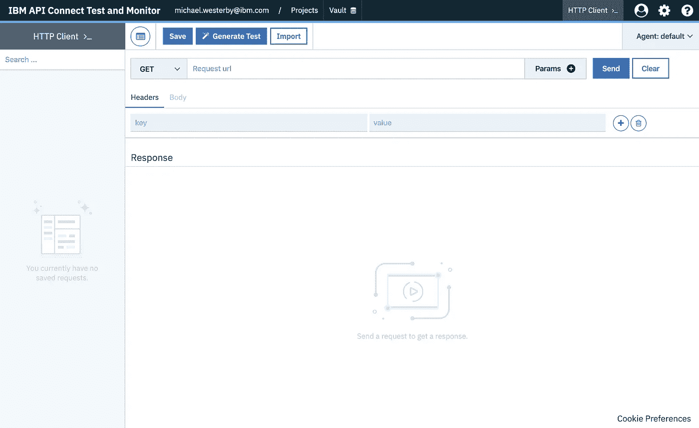

HTTP 客户端

对于我的第一个测试，我想断言当执行对`[https://reqres.in/api/users/1](https://reqres.in/api/users/1)`的`GET`请求时，我收到了正确的响应。在`Request url`框中键入这个 URL 并点击`Send`将执行请求。收到响应后，Test and Monitor 将在下面显示解析 JSON 的结果。

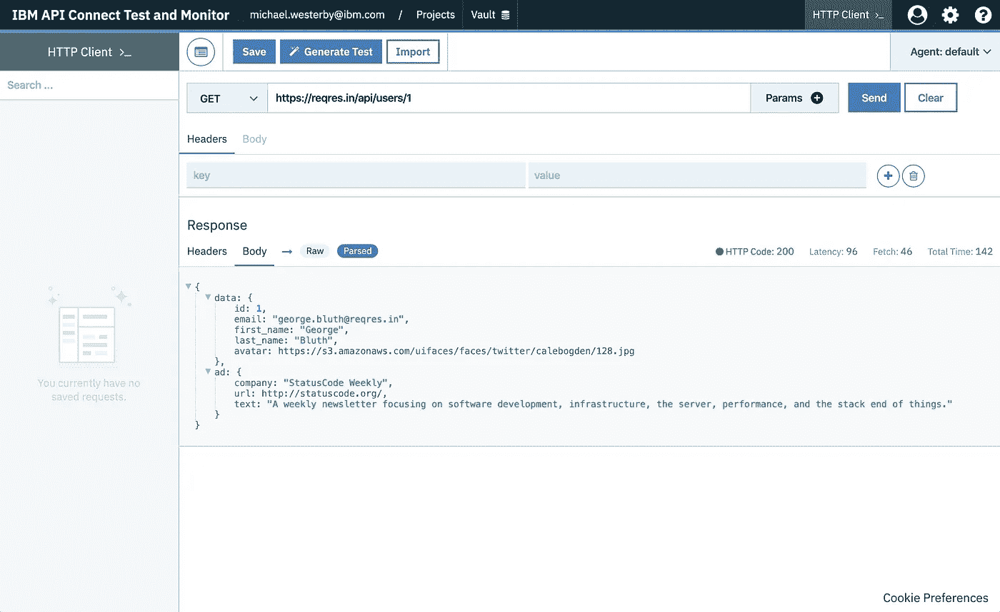

对`[https://reqres.in/api/users/1](https://reqres.in/api/users/1)`执行 GET 请求时的响应

现在是检查所显示的响应是否是您期望从该端点得到的响应的好时机(*即*响应的数据结构和值是否正确)，因为这是 Test 和 Monitor 将用来帮助生成我们的测试的。一旦您验证了答案，点击页面顶部的`Generate Test`按钮，开始进行第一次测试！您将被要求为您的测试命名，并选择一个项目来保存它。项目是一系列测试的一种方式。如果您还没有项目，您可以通过选择`Create new project`并输入名称来创建一个。然后，您将能够为您创建的未来测试选择该项目。

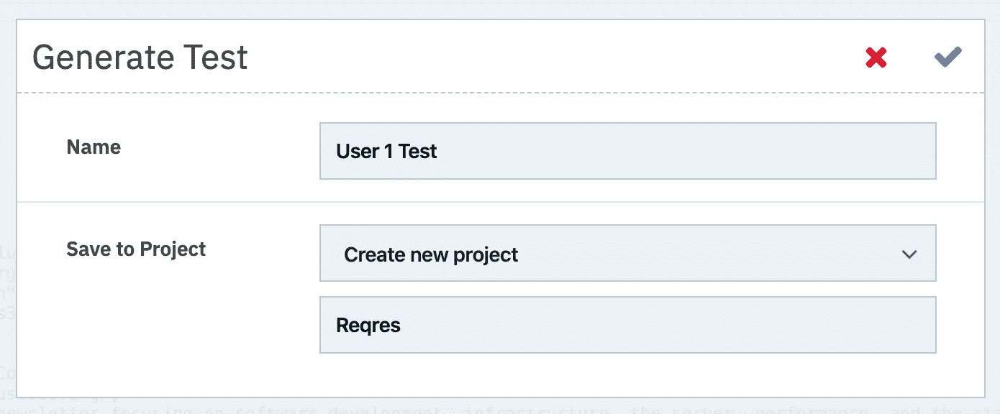

“生成测试”对话框

当您为测试命名并将其分配给项目后，单击 check 按钮以生成测试。Test 和 Monitor 现在将运行我们之前收到的响应，并开始迭代有效负载，随后了解收到的数据类型，并确定应该生成哪些测试断言和创建哪些参数。然后你会看到一个屏幕提示“一切就绪！”当这个过程结束时。

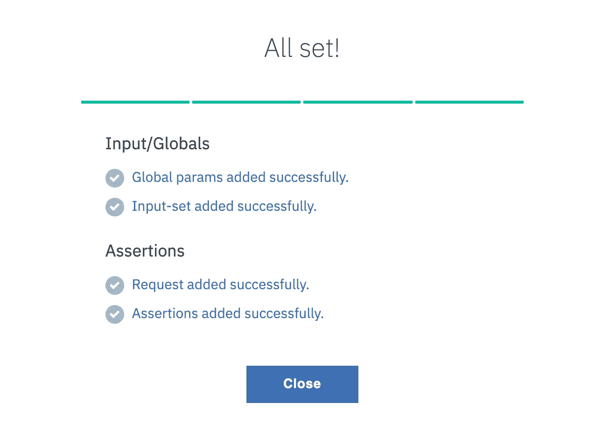

生成测试成功消息

点击`Close`按钮，您将看到生成的测试。本页面是拖拽 ***测试作曲*** 。每一行代表一个由测试和监视器从响应有效负载生成的断言。例如，在我下面的测试中，将断言这个`GET`请求的响应状态代码等于`200`，并且`Content-Type`报头等于`application/json`。此外，对于响应正文中的每个项目，测试和监视器将断言这些项目*存在*或者属于正确的*类型* : *即* `data.firstName`必须存在，或者`data.email`是有效的电子邮件地址。

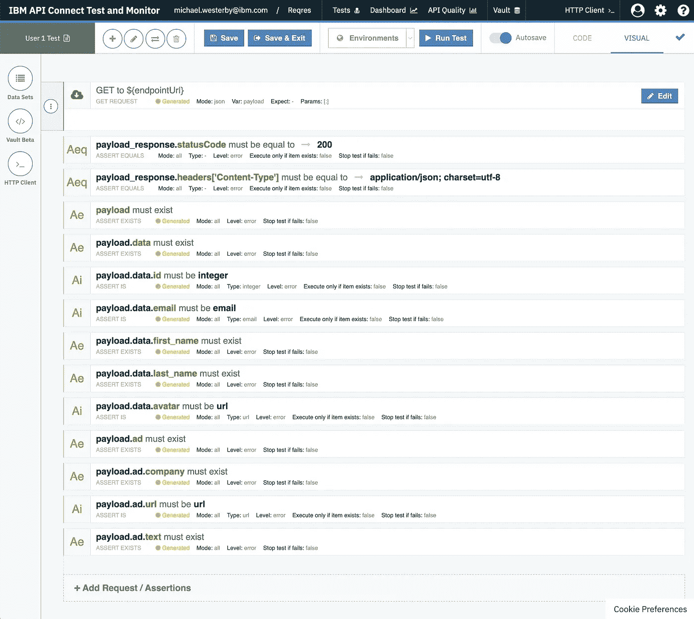

测试作曲家

这些断言中的每一个都是可定制的，如果你愿意，你可以编辑被断言的*表达式*或*类型*。此外，您还可以通过点击屏幕底部的`+ Add Request / Assertions`按钮来添加您自己的附加断言。查看一下为您的端点生成的断言，如果您满意，我们可以通过运行它来验证我们生成的测试。点击顶部的`Run Test`按钮，然后选择默认的`Agent`并点击`Run Test`。

将打开一个新的选项卡，显示我们刚刚运行的测试的 ***测试报告*** 。在这里，您可以看到测试结果的摘要，包括总体响应(即*(即*“测试通过*”*)，以及发生了多少次断言失败。在报告的底部，我们可以看到在 *Test Composer* 中定义的每个独立断言的详细状态，以及下载速度和请求延迟等其他指标。

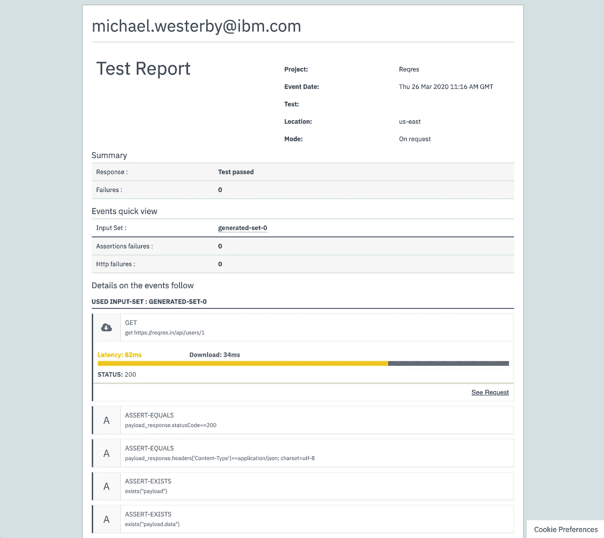

测试报告

恭喜你！到目前为止，我们已经成功地在 API Connect Test 和 Monitor 中生成并运行了我们的第一个测试。我们现在已经准备好设置我们的测试来按计划运行，这样我们就可以持续地监控我们的端点的状态。关闭*测试报告*标签，返回*测试编辑器*。现在点击屏幕顶部的`Save & Exit`按钮保存我们的测试。然后您将被重定向到 ***测试状态*** 页面。

到目前为止，我们一直在编辑我们测试的工作副本，因此在这个页面的顶部，我们当前的测试状态被设置为“ *Draft* ”。您还会注意到`Schedule`按钮目前是灰色的。为了安排一个测试，我们需要首先将我们对工作副本所做的更改发布到测试的发布版本中。为此，只需点击`Publish`按钮。

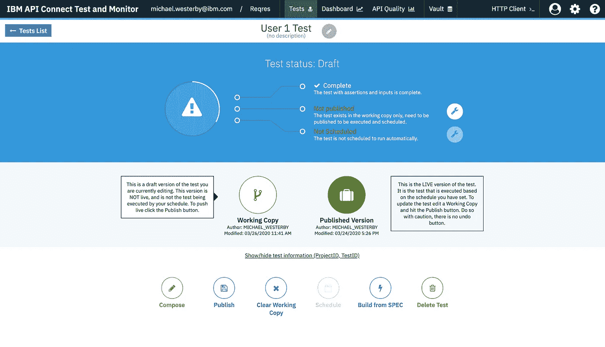

工作副本中测试的测试状态页面

点击后，测试状态将变为“*准备安排*”，并且`Schedule`按钮将变为活动状态。

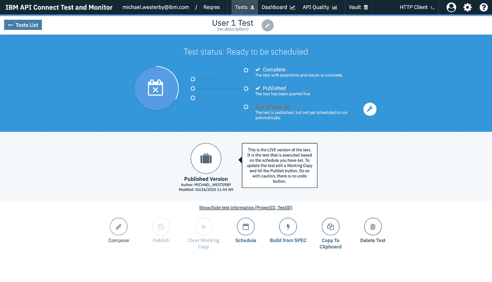

已发布测试的测试状态页面

点击`Schedule`按钮开始安排我们的测试。您现在将被带到 ***调度器*** 页面进行测试。要安排测试，您需要创建一个新的*运行*。*运行*定义了测试执行的时间表，例如，每小时一次，每天一次。点击左侧的`+ Create New Run`按钮，开始我们的新一轮跑步。

在屏幕的右侧，将出现一个新的运行页面，允许我们填写有关这个新的计划运行的详细信息。首先，为您的运行输入一个名称(我已经将我的命名为“ *Hourly* ”)，并选择默认代理来执行测试。现在，您可以随意定制测试计划的运行频率。我选择了每个月每天每小时的第 15 分钟。如果测试在计划的运行中失败，还可以通过电子邮件发送选项，如果测试失败，还可以再次尝试。如果您愿意，启用这些选项，但是将`Paused`开关*关闭*，因为如果启用，这将阻止运行执行。

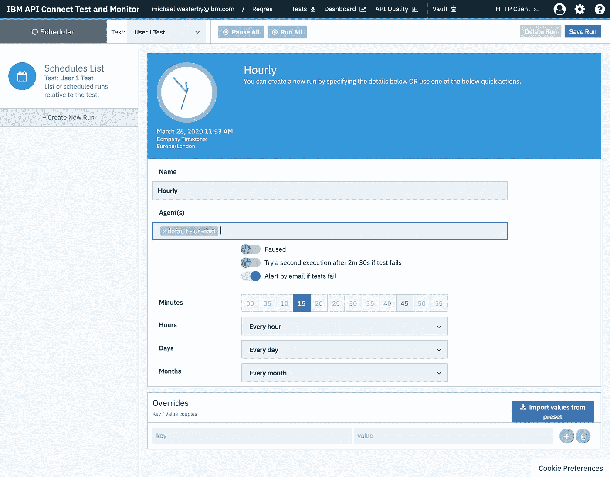

测试调度程序

对您的选择感到满意后，点击屏幕右上角的`Save Run`按钮保存您的跑步记录。您现在已经安排了您的第一次测试！

## 查看您的测试运行

既然我们已经创建并安排了我们的第一个测试，我们可以后退一步，看看我们如何监控这个测试的结果，以及您在将来进行的其他测试的结果。点击屏幕左上方的`IBM API Connect Test and Monitor`，进入 ***主仪表盘*** 。在这里，您将看到一个包含所有项目的仪表板。请注意，我们为第一个测试创建的项目现在显示在这里(在我的例子中为 *Reqres"* )。每个项目卡片下面有四个选项:****测试******API 质量*** 以及 ***设置*** 。我们将进一步探讨其中的每一项:*

*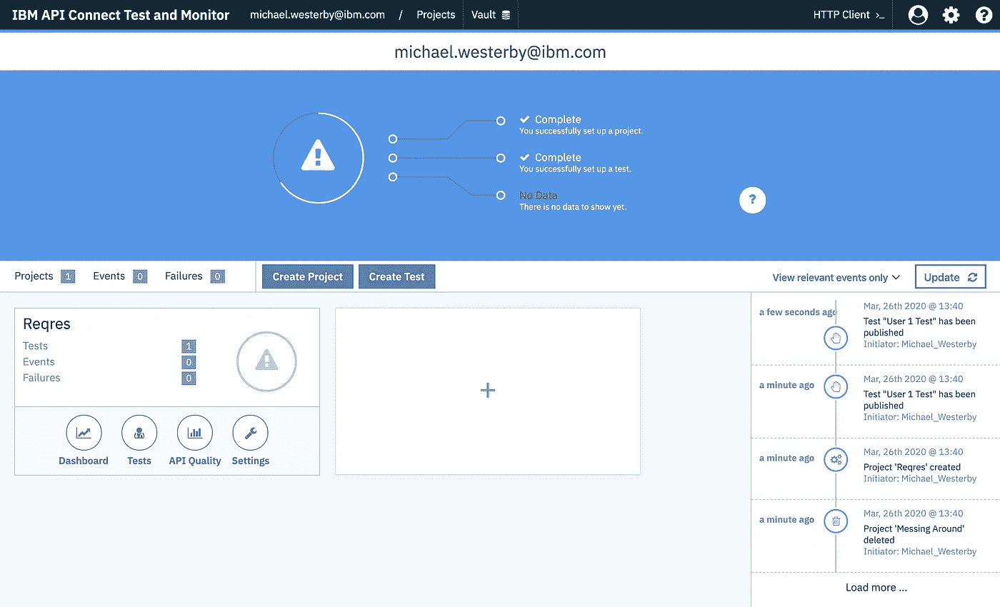*

*主仪表板*

***仪表板** 仪表板给你一个在你的项目中发生的所有事件的概述(其中*事件*是一个测试的执行，或者手动或者通过一个预定的运行)。在这里，您可以看到项目中每个事件的状态，包括运行的日期和时间，以及发生的断言失败的数量。下面我们可以看到我们创建的*用户 1 测试*已经执行了三次，都通过了。单击 Events 表中的某个事件，您可以选择查看该事件的测试报告，以便进一步调查。*

*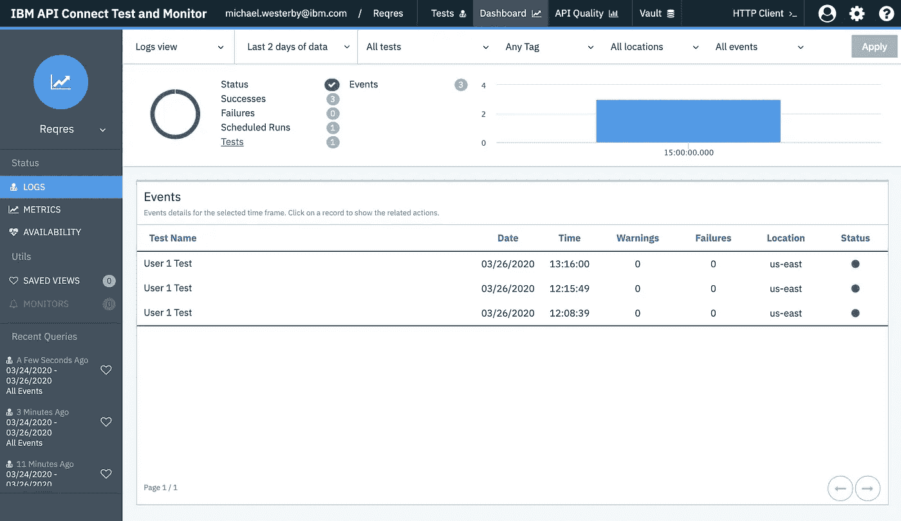*

*Reqres 项目的项目控制板页*

***测试** 测试选项将会列出与所选项目相关的所有测试(同时也给你创建新测试的选项)。在这里，您可以看到我们之前创建的*用户 1 测试*已经列出。*

*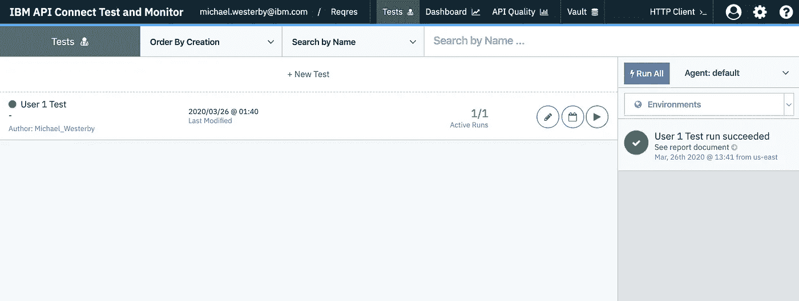*

*Reqres 项目的测试页面*

*在每个测试旁边，您可以看到有多少个活动运行。这些是您为该测试安排的运行次数。由于我们在*调度器*中为这个测试创建了一个运行，并且它当前是活动的，我们将看到`1/1 Active Runs`。此外，您可以通过点击铅笔图标来编辑测试，这将带您回到*测试状态*页面，然后您可以在撰写视图中编辑您的测试。此外，我们可以通过点击日历图标来查看/编辑测试运行时间表，该图标会将您带到该测试的*时间表*。您也可以通过单击测试旁边的 play 按钮来立即执行项目中的任何测试。*

***API 质量
在这里，您可以看到每个测试在您的项目中是如何执行的，以及它的成功率。此外，您可以跟踪几个月来测试结果(以及随后测试的 API 质量)的变化。***

*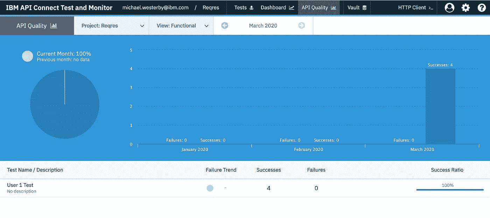*

*Reqres 项目的 API 质量页面*

***设置** 设置选项是您可以配置项目信息的地方，例如项目的名称和描述。*注意:要删除一个项目，您需要首先删除所有与之相关的测试。**

*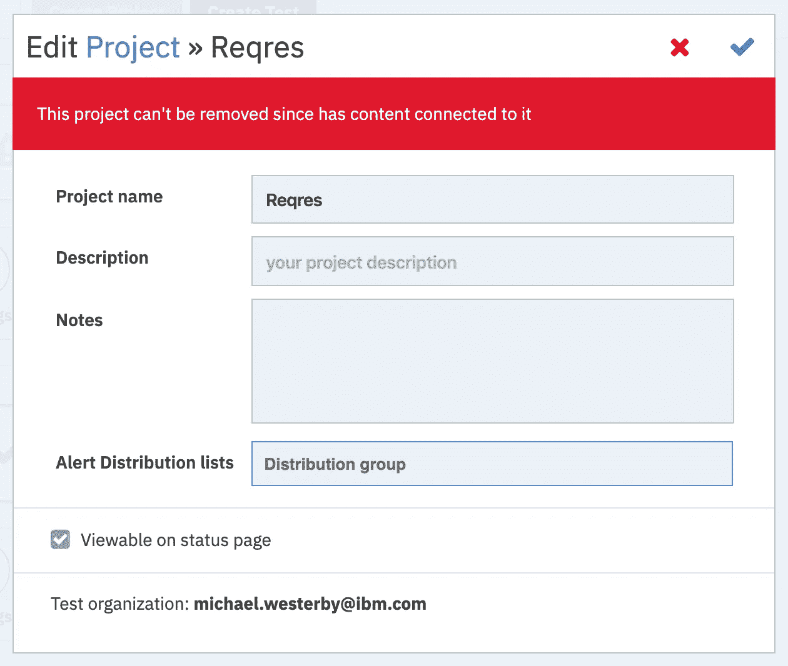*

*Reqres 项目的设置对话框*

*就是这样！您已经成功地在 IBM API Connect Test and Monitor 中创建和安排了一个测试。您可以随意在项目中添加更多的测试，并观察仪表板开始填充您的测试结果！有关测试和监控的更多信息，请查看[开发者中心](https://ibm-apiconnect.github.io/test-and-monitor/)，在那里您可以找到我们的博客、文档和 GitHub 页面的链接。*