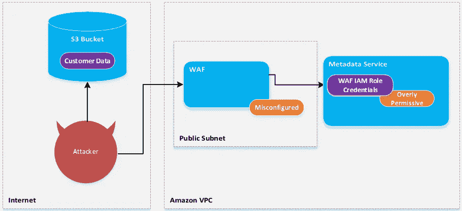
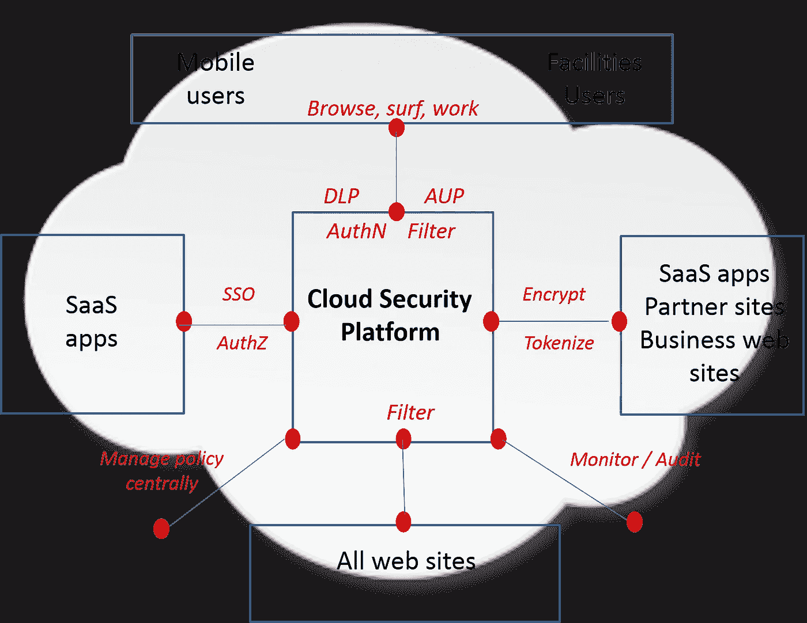

# 惊人的云安全漏洞

> 原文：<https://levelup.gitconnected.com/egregious-cloud-security-vulnerabilities-43caab0b2e5a>

## 在成为网络攻击的受害者之前，请遵循以下建议来保护您的基础设施

来源:[https://rhinosecuritylabs . com/WP-content/uploads/2016/03/cloud-image-small-e 1512789626760-1140 x400 . jpg](https://rhinosecuritylabs.com/wp-content/uploads/2016/03/cloud-image-small-e1512789626760-1140x400.jpg)

作为一个在金融行业工作的人，it 安全是每一行代码的重点。与以前的一些工作场所相比，安全扫描的数量和额外的流程开销是惊人的。虽然我不认为这有什么不好，但我喜欢自动化这些检查以实现以云为中心的 CI/CD 管道的挑战。也就是说，许多安全策略和检查已经到位，以防止采用云时出现一些常见的压力点。

在云中托管应用程序有 11 类潜在的额外漏洞:

1.  数据泄露
2.  错误配置和不充分的变更控制
3.  缺乏云安全架构和战略
4.  身份、凭证、访问和密钥管理不足
5.  账户劫持
6.  内部威胁
7.  不安全的接口和 API
8.  弱控制平面
9.  元结构和应用程序结构故障
10.  有限的云使用可见性
11.  云服务的滥用和恶意使用

## 威胁 1 —数据泄露

来源:[https://article . images . consumer reports . org/f _ auto/prod/content/dam/CRO % 20 images % 202019/Electronics/08 August/CR-Electronics-inline hero-What-to-do-about-capital-one-hack-08-19](https://article.images.consumerreports.org/f_auto/prod/content/dam/CRO%20Images%202019/Electronics/08August/CR-Electronics-InlineHero-What-to-do-about-capital-one-hack-08-19)

***什么是威胁？***

敏感、受保护或机密信息被未经授权的个人发布、查看、窃取或使用。

***什么会导致数据泄露？***

*   目标攻击
*   人为误差
*   应用程序漏洞
*   缺乏安全措施

***云的影响***

*   由于共享资源，攻击面很大
*   由于广泛的可访问性和大量的数据，云提供商经常成为目标
*   数据安全是客户的责任；云提供商提供基础设施和工具

***攻击图***

***注意事项及缓解措施***

*   纵深防御
*   最小特权原则
*   云可见性支持日志记录和监控
*   强大且经过充分测试的事件响应计划
*   加密—有助于保护数据，但会对系统性能产生负面影响

## 威胁 2 —错误配置和不充分的变更控制

来源:[https://www . campussafetymagazine . com/WP-content/uploads/2020/01/misconfiguration . jpg](https://www.campussafetymagazine.com/wp-content/uploads/2020/01/misconfiguring.jpg)

> *“几乎所有对云服务的成功攻击都是客户错误配置、管理不善和失误的结果。”* —尼尔·麦克唐纳，高德纳公司分析师

***冲云***

错误配置的云服务器，包括:

*   可公开访问的云存储
*   不安全的云数据库
*   未正确保护`*rsync*`备份
*   开放式联网网络区域存储

***注意事项及缓解措施***

*   基础架构的生命周期可以用秒或分钟来衡量
*   云需要灵活、主动的方法来控制和补救变化
*   加密敏感数据
*   记录配置更改

## 威胁 3 —缺乏云安全架构和战略

来源:[https://2 . BP . blogspot . com/-q 0k 3 bfgfham/ve 3 jznvyoci/AAAAAAAAAyc/UH-GSI 38 tyk/s 1600/casb . png](https://2.bp.blogspot.com/-q0k3BfGFhAM/VE3jZnvYoCI/AAAAAAAAAyc/UH-GSI38tyk/s1600/CASB.png)

***威胁是什么？***

缺乏适当的云安全架构会使组织暴露在攻击面前。

*造成威胁的因素:*

*   安全云架构需要新功能和新工具
*   在采用云时，组织有一个学习曲线

***冲云***

*   不是简单的“抬起和移动”
*   混合云环境中需要新的共享安全模式
*   在创新和控制之间找到正确的平衡
*   缺乏参考架构和文档

***注意事项及缓解措施***

*   确保安全架构符合业务目标。
*   开发和实施安全架构框架
*   确保威胁模型持续保持最新。
*   持续了解实际的安全状况

## 威胁 4 —身份、凭证、访问和密钥管理不足

来源:[https://security-img . scdn 6 . secure . rax cdn . com/news/920/Morse-watchman s-YIR-920 . jpg](https://security-img.scdn6.secure.raxcdn.com/news/920/Morse-Watchmans-YIR-920.jpg)

***威胁是什么？***

由于缺乏身份和访问管理(IAM)保护，对敏感资源的未授权访问。

*发生安全事故的原因:*

*   凭证保护不足
*   缺少加密密钥、密码和证书的定期自动轮换
*   缺乏可扩展的身份访问管理系统
*   未能使用多因素身份验证和强密码

***对云的影响***

利用偷来的密钥或凭证，攻击者可以:

*   读取、过滤、修改和删除数据
*   发布控制平面和管理功能
*   窥探传输中的数据
*   发布看似来自合法来源的恶意软件

***注意事项及缓解措施***

*   使用临时安全凭据(AWS IAM 角色)而不是长期访问密钥
*   不要将密钥直接嵌入代码中
*   为不同的应用程序使用不同的密钥
*   定期轮换密钥；移除未使用的访问键
*   为最敏感的操作配置多因素身份认证

## 威胁 5 —帐户劫持

来源:[https://www . thesecurityblogger . com/WP-content/uploads/2016/11/phone hacking . png](https://www.thesecurityblogger.com/wp-content/uploads/2016/11/phonehacking.png)

***威胁是什么？***

恶意攻击者可以访问并滥用高度特权或敏感的帐户。

*使系统易受攻击，因为缺少:*

*   身份和访问管理(IAM)
*   帐户级别的日志记录、监控和警报
*   纵深防御
*   防止网络钓鱼、利用和窃取凭据

***对云的影响***

*   风险最高的帐户是云服务帐户或订阅
*   不确定性源于云服务的交付模式
*   数据和应用程序驻留在云服务中，云服务驻留在云帐户或订阅中
*   云环境中的影响包括数据/资产丢失和运营受损
*   组织资产、数据和能力的潜在消除

***注意事项及缓解措施***

*   面向云应用用户的强大身份验证方法，包括单点登录和多因素
*   在具有不同凭据的多个 IAM 帐户之间划分管理职责:例如，可以创建备份的帐户不能删除备份
*   对关键数据进行异地备份
*   限制允许访问云应用程序的 IP 地址

## 威胁 6 —内部威胁

来源:[https://blogvaronis 2 . WP engine . com/WP-content/uploads/2019/10/insider-threats-header . png](https://blogvaronis2.wpengine.com/wp-content/uploads/2019/10/insider-threats-header.png)

***威胁是什么？***

个人恶意或无意使用其访问权限对组织造成负面影响的可能性。内部人员受到组织的信任，可以直接访问网络、计算机系统和敏感数据。

***注意事项和缓解措施***

*   通过身份和访问管理(IAM)和最低权限限制爆炸半径
*   防止“不经意的局内人”。
*   默认安全着陆垫
*   自动化配置管理、供应和防护栏
*   为云环境实施新的监控和检测功能(SaaS/PaaS/Iaas)
*   制定业务连续性计划