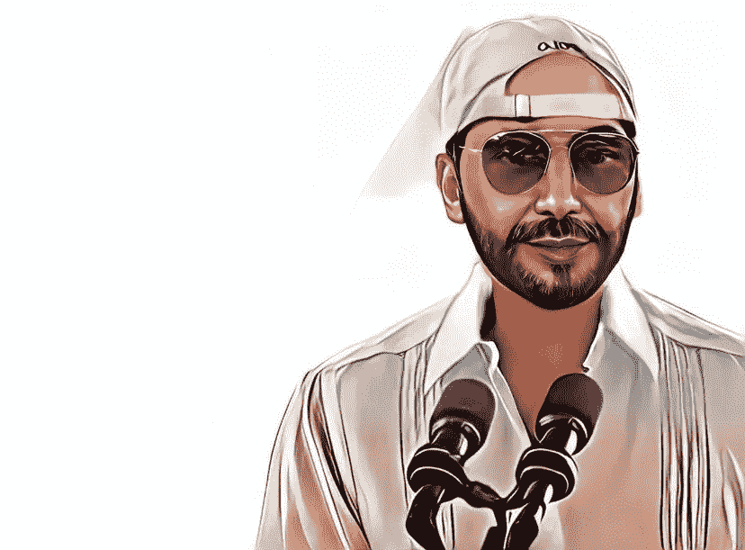
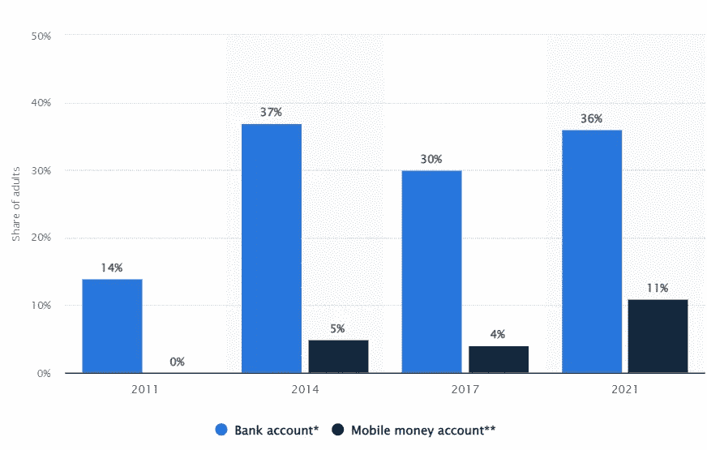
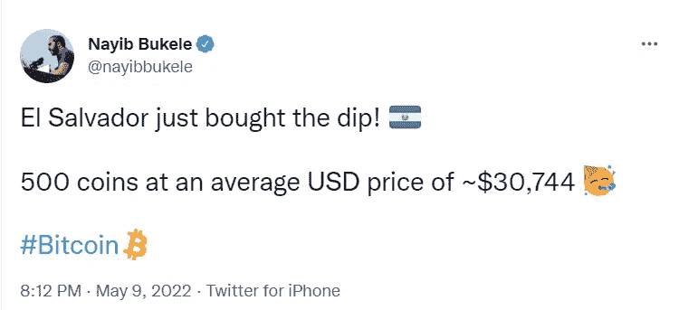

# 萨尔瓦多的比特币狂人总统让他的国家损失了 6160 万美元

> 原文：<https://levelup.gitconnected.com/el-salvadors-bitcoin-enthusiast-president-lost-his-country-61-6-million-888fb85fef78>

## 卖了才亏，对吧？

由作者创建—使用[工具](https://toonme.com/)

Nayib Bukele 曾经称自己为“[世界上最酷的独裁者](https://www.theguardian.com/world/2021/sep/26/naybib-bukele-el-salvador-president-coolest-dictator)”。

人们不确定他是否在开玩笑。

这位现已是第 43 任总统、自称“萨尔瓦多首席执行官”的人，如果他尝试的话，他的总统身份也不会降低。

他的形象像一个卡特尔领导人，穿着紧身牛仔裤，戴着飞行员太阳镜和棒球帽。

但是，人民爱他。

布克勒获得了声望，通过对该国的暴力犯罪率和反对党的腐败发动战争，以 53%的选票赢得了总统选举。

萨尔瓦多是中美洲 640 万居民的家园，所有人现在都在加密货币的波动浪潮中受益。

在这件事上，他们谁也没有选择的余地。

他们的独裁式领导人，前[雅马哈汽车经销商](https://en.wikipedia.org/wiki/Nayib_Bukele#:~:text=Bukele%20studied%20law%20at%20the,Yamaha%20products%20in%20El%20Salvador.)和重要的比特币信徒想要支持他们占人口 70%的无银行居民。

我再说一遍，全国 70%的人没有银行账户。

他希望为人们提供一种经济工具，帮助建立一个价值储存库，并减少该国 2 亿美元的汇款账单。

交易和存款的银行费用。

当总统的表演没有蒙蔽你时，这是合乎逻辑的。

布克勒宣布计划引入一项法案，使萨尔瓦多成为第一个将比特币变成法定货币的国家。

汇款占了国家支出的很大一部分，总计约 59 亿美元(23%)。

任何有可能降低成本的事情都会给国家经济带来巨大的好处。

该国没有银行账户的人口数量惊人。这是拥有银行账户(蓝色)或手机账户(黑色)的人的百分比数据。

来源—[statista.com](https://www.statista.com/statistics/1011424/el-salvador-bank-account-ownership-rate-type/#:~:text=This%20statistic%20presents%20a%20timeline,from%2030%20percent%20in%202017.)

据布克勒称，300 万人下载了该国的 Chivo 比特币钱包，占总人口的 46%。

与 2021 年相比，只有 36%的萨尔瓦多人口拥有银行账户。

其他拥有大片农村地区的国家，比如肯尼亚，似乎已经克服了没有银行账户的危机。

一种经济浮出水面，当地村民可以出售、交易和存储网络记录和数据，作为一种价值储存手段。

肯尼亚的电话网络意识到，没有银行账户的人需要创造一个安全的价值储存库来积累财富，并有一个应急基金。

肯尼亚移动货币账户 M-PESA 不需要银行账户，现在被 96%的人口使用。

该应用程序使用人类代理人，他们带着现金和手机在全国各地闲逛。

这些人工代理的功能就像自动提款机。

你走到他们面前，给他们现金，让他们把钱存入你的手机账户，或者把钱从你的账户转出，以获得现金。

在一个银行体系存在缺陷的国家，当你需要时有现金可用，当你不需要时有一个安全的地方存放，这是一件大事。

通过一系列的[研究论文](https://www.jefftk.com/suri2016.pdf)，经济学家**威廉·杰克**和**塔夫内特·苏里**得出结论，M-PESA 使 **194，000** 肯尼亚家庭摆脱了贫困，因为他们有能力降低交易成本，创造安全的价值储存。

[2016 *理科*论文](https://www.jefftk.com/suri2016.pdf)

> 移动货币是一种允许将货币价值储存在手机上并通过短信发送给其他用户的服务，已被大多数肯尼亚家庭采用。我们估计，肯尼亚移动货币系统 M-PESA 的使用提高了人均消费水平，并使 194，000 个家庭(占肯尼亚家庭的 2%)摆脱了贫困。

> 这种影响对女户主家庭更为明显，似乎是由金融行为的变化——特别是金融弹性和储蓄的增加——所驱动的。
> 
> 因此，随着时间的推移，移动货币提高了消费分配的效率，同时提高了劳动力分配的效率，从而显著减少了肯尼亚的贫困。

## 萨尔瓦多目前持有**2301 枚比特币。**

该书出版时的价值约为 4400 万美元。这样一来，Bukele 最初投资的 1.056 亿美元只剩下 41%给了这个国家。

尚不清楚该国是否出售了任何比特币，但根据 Bukele 的 Twitter，他一直在购买 dip。

目前，它一直在下降。

来源— [纳伊布·布克勒—推特](https://twitter.com/nayibbukele/status/1523742670044413954)

我很大一部分人认为，对于这个贫穷的国家来说，这可能是未来五年的一个明智之举，前提是他们能够在比特币价格回升之前在经济上生存下来。

数据证实，创造价值储存确实能让人们摆脱贫困，但也会有批评者认为转向比特币为时过早。

你可以和我站在同一个阵营，将它视为引领下一波采用浪潮的积极举措，给萨尔瓦多带来可观的财务增长机会。

在[媒体](https://t.co/0WsCUfngD2)、 [LinkedIn](https://www.linkedin.com/in/jayden-levitt-aa93511b9/) 或 [Twitter](https://twitter.com/JaydenLevitt) 上关注我。

*本文仅供参考；不应将其视为财务、税务或法律建议。在做出任何重大财务决定之前，请咨询财务专家。*