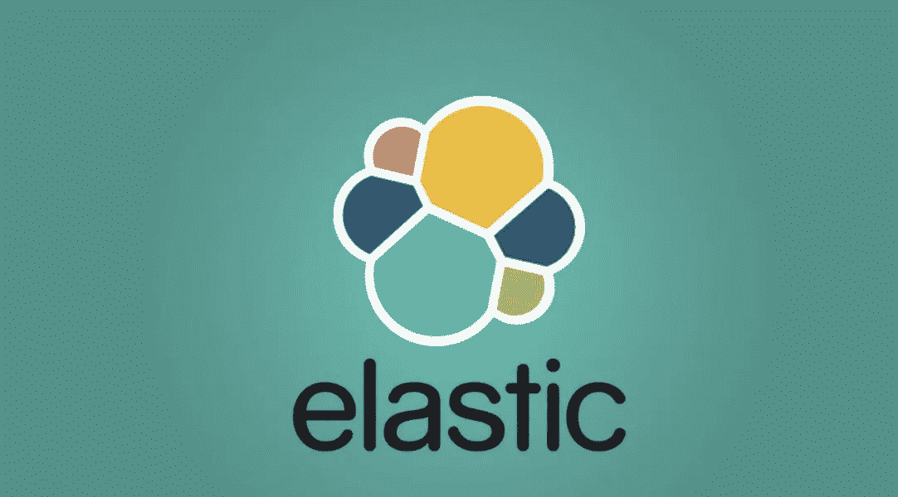
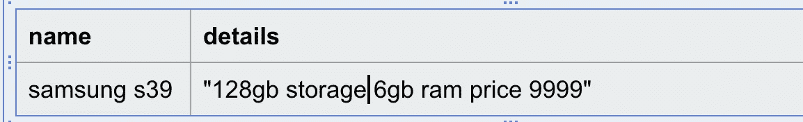
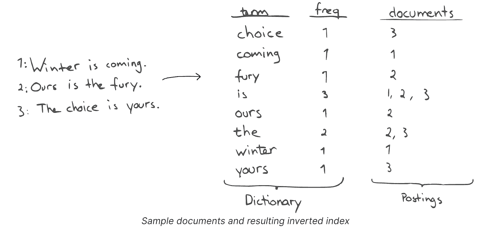
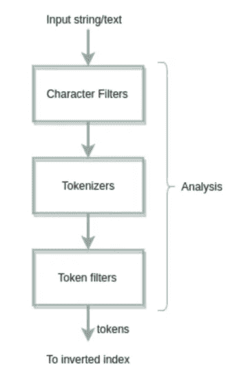

# 简化的弹性搜索:第 1 部分

> 原文：<https://levelup.gitconnected.com/elastic-search-simplified-part-1-9f7bd4985ee5>

最近，我们使用弹性搜索来实现通配符搜索功能。在花了一个星期的时间之后，我们意识到虽然开始很容易，但是很好地理解弹性搜索的基础，可以帮助以更优化的方式实现解决方案。

> 弹性搜索有多个用例，如日志分析、可视化和聚合数据，但本系列与“搜索”用例相关。



我们将讨论以下项目

1.  什么是文本搜索
2.  倒排索引
3.  TF/IDF
4.  文本分析
5.  绘图
6.  数据类型
7.  查询类型
8.  子字符串/通配符搜索

# 什么是文本搜索


假设您想在亚马逊上搜索具有特定要求的移动设备，如 128gb 存储空间、6gb 内存和大约 15k INR 的价格。

假设我们将这些细节存储在 SQL 表中，如下所示



产品详细信息 SQL 表

我们必须在 SQL 表中实现这一点，我们可能需要创建如下所示的查询

```
select * from Products where details like “%mobile” and details like “%4gb%” and details like “%128gb%” and details like “%6gb” and details like “%prices 10000%
```

如您所见，这是一个效率极低的全表扫描查询。

这个查询可能仍然不起作用，因为查询有一个错别字“价格”而不是“价格”。

在上面的案例中，我们还可以看到“*限时交易*”被赋予了更高的优先级。在传统的数据库中添加这种功能将是困难的。

考虑到所有这些因素，我们显然需要一个定制的文本搜索解决方案。

# 倒排索引



倒排索引是单个术语及其在所有索引文档中的总频率的简单映射。术语“winter”在文档 1 中出现过一次，术语“The”出现过两次，因此它们被映射到相应的文档 id。

# TF/IDF

## TF —术语频率

术语频率就是一个术语在**个体** **给定文档中出现的次数。**对于较长和较短的文档，这将进一步规范化

## IDF —反向文档频率

它只是表明一个给定的单词在所有索引文档中的稀有程度

当我们运行查询时，我们需要首先返回最相关的结果。为了计算分数，我们使用 TF/IDF 的概念。让我们借助一个使用外行数学的例子来理解它。

> lastic Search 确实提供了很大的灵活性来帮助计算分数，比如使用 boosts 等，但是 TF/IDF 将有助于理解这个想法。

```
"The sky is blue.
"The sun is bright today."
"The sun in the sky is bright."
"We can see the shining sun, the bright sun."**Inverted Index** +--------+----------------------+-------------------+
|  Term  | total term frequency |    document_id    |
+--------+----------------------+-------------------+
| sky    |                    2 | (1,1) (3,1)       |
| blue   |                    1 | (1,1)             |
| sun    |                    4 | (2,1) (3,1) (4,2) |
| bright |                    3 | (2,1) (3,1) (4,1) |
| shine  |                    1 | (4,1)             |
| today  |                    1 | (2,1)             |
+--------+----------------------+-------------------+The documents have been normalised by removing common terms like is, a, the etc and also words like shining have been stemmed to shine. More on this in the article below**Term Frequency Table**+-------------+------+--------+-------+-----+------+-------+
| document_id | blue | bright | shine | sky | sun  | today |
+-------------+------+--------+-------+-----+------+-------+
| 1           |    1 |      0 |     0 |   1 |    0 |     0 |
| 2           |    0 |      1 |     0 |   0 |    1 |     1 |
| 3           |    0 |      1 |     0 |   1 |    1 |     0 |
| 4           |    0 |      1 |     1 |   0 |    2 |     0 |
| n_t         |    1 |      3 |     1 |   2 |    3 |     1 |
+-------------+------+--------+-------+-----+------+-------+
*n_t -> total occurances in all documents**Inverse Document Frequency Table**+------+--------+-------+-----+------+-------+
| blue | bright | shine | sky | sun  | today |
+------+--------+-------+-----+------+-------+
| 4/1  | 4/3    | 4/1   | 4/2 | 4/3  | 4/1   |
+------+--------+-------+-----+------+-------+ **TF * IDF score for query "sky sun"**+-------------+-------------+---------------+-------------+------+
| document_id |  TF * IDF   | matching word | final score | **rank** |
+-------------+-------------+---------------+-------------+------+
|           1 | 1 * 2       | sky           |           2 |    3 |
|           2 | 1* 4/3      | sun           |        1.33 |    4 |
|           **3 | 1*2 + 1*4/3 | sky,sun       |        3.33 |    1** |
|           4 | 2*4/3       | sun           |        2.66 |    2 |
+-------------+-------------+---------------+-------------+------+As we can see term "sky" is less common compared to term "sun", so **sky** has been given **higher weightage** when calculating score
```

> 这是为了便于理解而进行的简化，真正的公式是不同的，但是思路是一样的，你可以查看[链接](https://sci2lab.github.io/ml_tutorial/tfidf/)来深入了解

# **文本分析**

文本分析使 Elasticsearch 能够执行全文搜索，搜索返回所有与*相关的*结果，而不仅仅是与**完全匹配的**

ElasticSearch 为一些常见的用例提供了分析器，还提供了定义定制分析器的能力。我们将在下面介绍一个标准的分析器，并在本文的后面讨论如何创建一个定制的分析器。



## 字符过滤器

假设文档中有一些 HTML 元素，字符过滤器可以帮助删除这些过滤器。这些是可选的。

## 标记化者

记号赋予器用于将文档分解成单独的记号(术语)。例如，我们将在英语文档中使用“空白”

## 令牌过滤器

令牌过滤器可用于将令牌转换为小写的*。一个 *stop* 令牌过滤器可以用来删除英语中常见的停用词，如“is”、“the”“a”等。另一个常见的需求是将“闪亮”和“闪耀”视为同一术语，这可以通过使用*词干分析器*过滤器来实现。*

> *还有更多的过滤器和记号赋予器，您可以在弹性搜索文档中找到。*

```
***query** localhost:9200/_analyze{
 "char_filter": [
  "html_strip"
 ],
 "tokenizer": "standard",
 "filter": [
  "stop",
  "lowercase",
  "stemmer"
 ],
 "text": "<b>the sky is **Blue** bright and **shining**<b>"
}{ "details" : "<b>the sky is **Blue** bright and **shining**<b>"}**Output** {
 "tokens": [{
   "token": "sky",
   "start_offset": 7,
   "end_offset": 10,
   "type": "<ALPHANUM>",
   "position": 1
  },
  {
   "token": "**blue**",
   "start_offset": 14,
   "end_offset": 18,
   "type": "<ALPHANUM>",
   "position": 3
  },
  {
   "token": "bright",
   "start_offset": 19,
   "end_offset": 25,
   "type": "<ALPHANUM>",
   "position": 4
  },
  {
   "token": "**shine**",
   "start_offset": 30,
   "end_offset": 40,
   "type": "<ALPHANUM>",
   "position": 6
  }
 ]
}*
```

> *ElasticSearch 提供了现成的常用停用词，同时提供了定义自己列表的灵活性。*

*文本分析分两次进行*

*   *指数分析器*
*   *搜索分析器*

*在本文的后面，我们将介绍一个这样的例子。*

# *绘图*

*映射是定义如何存储和索引文档及其包含的字段的过程。 **Lucene** 只理解倒排索引，弹性搜索转换，并根据提供的映射创建适当的倒排索引。*

> *ElasticSearch 索引实际上是 Lucene 索引，ElasticSearch 是 Lucene 之上的分布式系统。*

```
*PUT /my-index-000001
{
  "mappings": {
    "properties": {
      "age":    { "type": "integer" },  
      "email":  { "type": "keyword"  }, 
      "name":   { "type": "text"  }     
    }
  }
}*
```

## *菲尔茨*

*映射包含与文档相关的字段或属性的列表，每个字段都有自己的数据类型。*

## *动态映射*

*创建索引时没有必要定义映射，弹性搜索本身会动态创建映射*

```
*PUT data/_doc/1 
{ "count": 5 }**count** field with data type **long** gets created*
```

# *数据类型*

*支持的数据类型的完整列表可以在此[链接](https://www.elastic.co/guide/en/elasticsearch/reference/current/mapping-types.html)中找到。我们将讨论两种重要的数据类型*

## *关键词*

*关键字字段类型通常包含结构化内容，如 id、电子邮件地址、邮政编码、标签等，可用于过滤、排序。*

## *文本*

*文本字段类型用于文本分析，我们可以为每个单独的文本字段定义索引和搜索分析器。*

# *查询类型*

*ElasticSearch 查询可以包含两种类型的子句。详情请使用此[链接](https://www.elastic.co/guide/en/elasticsearch/reference/current/query-dsl.html)*

*   ***叶查询子句***

*引导查询寻找特定字段中的特定值，例如*匹配、术语*或*范围**

```
*GET /_search
{
  "query": {
    "term": {
      "name": {
        "value": "foobar",
        "boost": 1.0
      }
    }
  }
}*
```

*   ***复合查询子句***

*复合查询子句包装其他**叶查询或复合查询**，并用于以逻辑方式组合多个查询*

```
*Example of boolean queryPOST _search
{
  "query": {
    "bool" : {
      "**must**" : {
        "term" : { "user.id" : "kimchy" }
      },
      "**filter**": {
        "term" : { "tags" : "production" }
      },
      "**must_not**" : {
        "range" : {
          "age" : { "gte" : 10, "lte" : 20 }
        }
      },
      "**should**" : [
        { "term" : { "tags" : "env1" } },
        { "term" : { "tags" : "deployed" } }
      ]
    }
  }
}*
```

# *子字符串搜索/N 元语法过滤器*

*我们研究了使用弹性搜索进行子串/通配符搜索的用例。*

*考虑一个带有名称的文档索引*

```
*{
 "name": "nitin agarwal"
}, {
 "name": "nitish"
}*
```

*如果我们想要搜索“nit*”，在传统的数据库中，字段上的普通索引将返回结果，因为我们正在进行“以查询开始”(添加了名称≥ nit 和名称< niu).*

## *Edge N-gram*

*But as we use inverted indexes in elastic search, and we would need to use something called “edge N-gram”.*

```
*Edge N-gram for word "**nitin**"  doc_id -> 1unigram - ['n']  -> 1
bigram - ['ni']  -> 1
trigram - ['nit'] 
quadgram - ['niti']
hexagram - ['nitin']An inverted index is created with the above configuration for a quick lookup.*
```

## *Wildcard Queries*

*Let's take the example of a “*iti*” query. Elastic Search does provide the functionality of wildcard queries*

```
*GET /_search
{
  "query": {
    "wildcard": {
      "name": {
        "value": "*iti*",
      }
    }
  }
}*
```

*But this query is actually doing a full index scan and will be extremely slow.*

## *N-gram*

*We can define the max and min length of chunks to be created from a given term and token will be created like below*

```
*min_len = 2, max_len = 5, term = ["nitin"]
["ni", "it", "ti", "in"]
["nit", "iti", "tin"]
["niti", "itin"]
["nitin"]*
```

> *With Version 7.9 [通配符字段类型](https://www.elastic.co/guide/en/elasticsearch/reference/master/keyword.html#wildcard-field-type)，这与创建 N 元语法相比存储效率更高。通配符字段类型没有完全解决我们的用例，所以我们继续使用我们定制的 N-gram 解决方案*

# ***索引和搜索分析器***

*我们的搜索实现有以下要求*

*   *通配符搜索*
*   *名称可以包含 Unicode 字符，例如，如果用户搜索“ϟth”，像“ϟTHOST⁷⁷”这样的名称应该是可搜索的*
*   *不需要空格分割，例如，如果用户搜索“op ja”，像“op jap”这样的名称应该是可搜索的*
*   *最大搜索字符长度为 10 个字符，否则，用户将搜索完全匹配的字符。*

*我们必须为我们的特定需求创建一个定制的索引分析器。*

## *自定义索引分析器*

```
*{"analysis": {
  "analyzer": {
   "ngram_custom_analyser": {
    "tokenizer": "ngram_tokenizer",
    "filter": [
     "lowercase" ----------------> **added lowercase filter**
    ]
   }
  },
  "tokenizer": {
   "ngram_tokenizer": {
    "type": "ngram", -----------> **defines type as ngram**
    "min_gram": 2,   -----------> **defines the min len**
    "max_gram": 10,  -----------> **defines the max len**
    "token_chars": [----> **defines signs which should be included**
     "letter",
     "punctuation",
     "whitespace",  ------------> **allow whitespace**
     "digit",    
     "symbol"    --------------> **allow symbols**
    ]
   }
  }
 }
}{
 "mappings": {
  "properties": {
   "name": {
    "type": "text",
    "analyzer": "ngram_custom_analyser",
    "search_analyzer": "custom_search_analyzer"
   }
  }
 }
}*
```

## *自定义搜索分析器*

*我们还需要在字段上定义一个自定义搜索分析器，因为默认情况下，弹性搜索会将搜索查询拆分为字段上定义的 N 元语法标记，例如，“nitin ag”会被拆分为 N 元语法，如“ni”、“it”等，这些会被搜索，从而给出错误的结果。*

```
*{
 "analyzer": {
  "custom_search_analyzer": {
   "tokenizer": "ngram_search_tokenizer",
   "filter": [
    "lowercase"
   ]
  }
 },
 "tokenizer": {
  "ngram_search_tokenizer": {
   "type": "char_group",
   "token_chars": [ -----> **defines signs which should be inclued**
    "letter",
    "punctuation",
    "whitespace",  ------> **allow whitespace in search query**
    "digit",
    "symbol" --------> **allow symbols in search query**
   ]
  }
 }
}*
```

***这种方法的优势***

*   *搜索会非常快，因为我们会做直接匹配。*

***这种方法的缺点***

*   *与普通的标准分析器相比，这将占用更多的存储空间，但是在我们的用例中，我们可以删除超过 1 个月的文档。*

*使用弹性搜索，您将需要尝试找到最符合您要求的解决方案。*

*其他未涉及的与搜索相关的有趣主题包括*

*   *[模糊查询](https://www.elastic.co/guide/en/elasticsearch/reference/current/query-dsl-fuzzy-query.html) y*
*   *匹配短语查询*

*[**第二部分**](https://medium.com/@nitinagg.nitkkr/elastic-search-simplified-part-2-342a55a1a7c7) 本文我们来谈谈弹性搜索集群以及关于索引和搜索请求的旅程。*