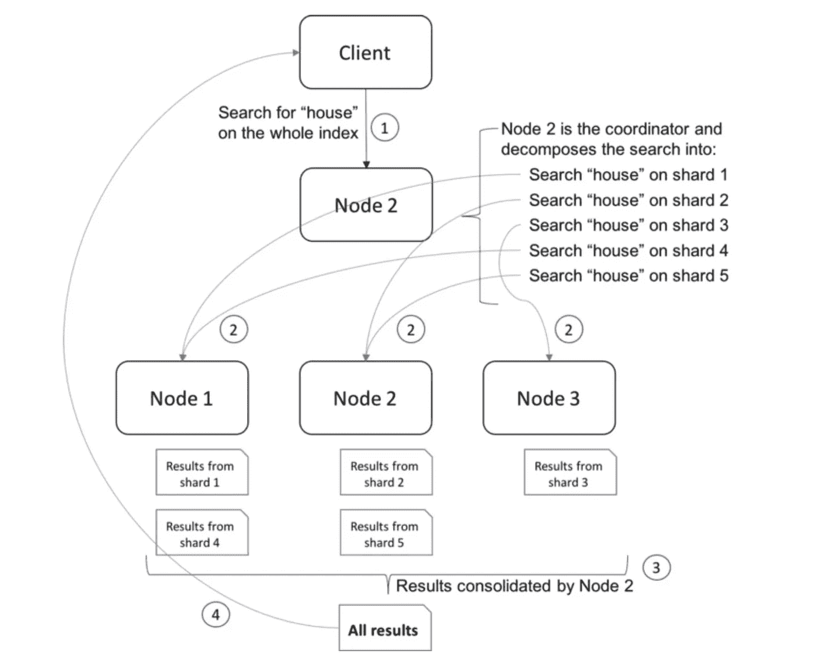
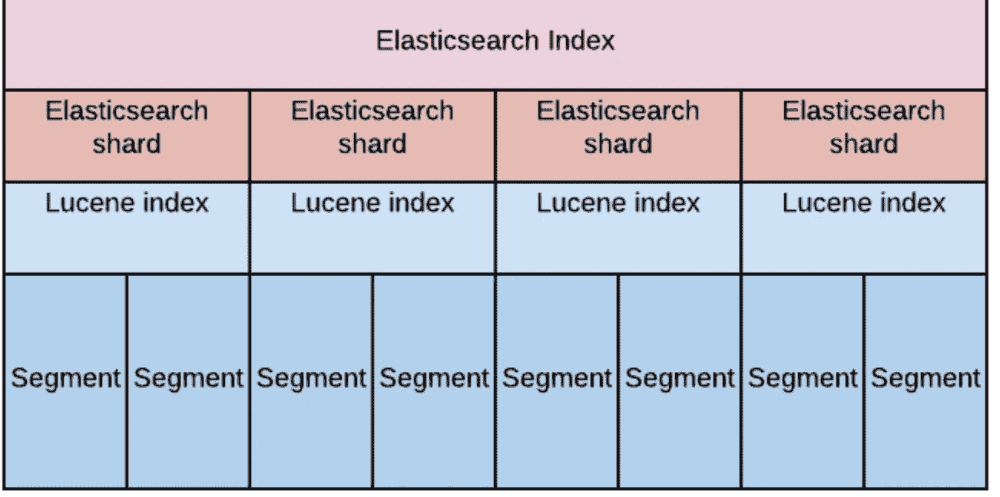
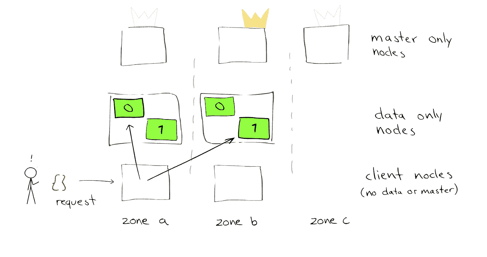
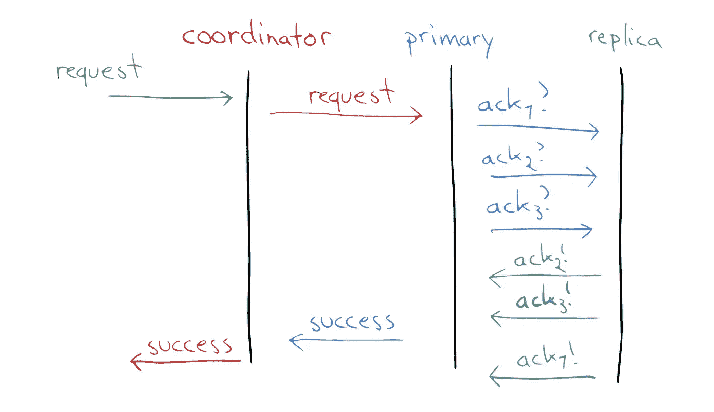

# 简化的弹性搜索:第 2 部分

> 原文：<https://levelup.gitconnected.com/elastic-search-simplified-part-2-342a55a1a7c7>

在这一部分，我们将讨论自顶向下的弹性搜索。想自下而上了解 ElasticSearch，请参考本系列[**第一部分**](https://medium.com/@nitinagg.nitkkr/elastic-search-simplified-part-1-9f7bd4985ee5) 。

> 这一部分的先决条件是对分布式系统的高级理解(一致性、可用性、持久性等)

1.  什么是弹性搜索集群
2.  陶瓷或玻璃碎片
3.  Lucene 索引中的段
4.  索引请求的旅程
5.  搜索请求的旅程
6.  线程池

# **什么是弹性搜索集群**

一个 Elasticsearch 集群是一组由一个或多个 Elasticsearch 节点实例连接在一起的集合。弹性搜索集群的强大之处在于集群中所有节点的搜索和索引任务的分布

弹性搜索集群节点可以承担以下**角色**。这些角色组合在一起可以分配给同一个节点，我们也可以根据使用情况为这些角色分配专用节点。

*   主节点—主节点负责轻量级集群范围的操作，例如创建或删除索引、跟踪集群中的哪些节点，以及决定将哪些碎片分配给哪些节点。在高可用性设置中，一个仲裁至少应该有 3 个节点。
*   数据节点—存储数据并执行与数据相关的操作，如搜索和聚合
*   客户端/协调节点—默认情况下，每个节点都有协调节点的角色，我们也可以选择有一个专用的协调节点。我们将在本文后面看到这个节点的用例。
*   摄取节点、远程合格节点、机器学习节点，更多详情请参考[文档](https://www.elastic.co/guide/en/elasticsearch/reference/current/modules-node.html)

# 陶瓷或玻璃碎片

弹性搜索索引的分片是一种将索引分成更小块的方法。

*   它允许您水平分割/缩放内容量
*   它允许您跨分片(可能在多个节点上)分布和并行化操作，从而提高性能/吞吐量

当我们创建一个索引时，我们可以选择设置碎片的数量，同时一旦创建了索引，改变碎片的数量也不是一件简单的事情。当我们有一个 GBs 大小的索引时，选择正确的碎片数对于优化性能非常重要。碎片数量在 1000 个左右很容易成为性能瓶颈。选择正确的碎片号是一个高级的话题，正确的碎片号因用例而异。

# 碎片复制品

*   它在碎片/节点发生故障时提供高可用性。因此，重要的是要注意，副本碎片决不会被分配到与原始/主碎片相同的节点上。
*   它允许您横向扩展搜索量/吞吐量，因为搜索可以在所有副本上并行执行。
*   主碎片在索引时使用。



# 片段



弹性搜索索引实际上是*分片 Apache Lucene 索引*。Lucene 已经针对性能进行了优化，为了实现性能，每个单独的 Lucene 索引都被划分为称为段的更小的文件。这些段是不可变的，每当我们更新一个文档时，它实际上是在一个新的段中创建的，旧的文档被标记为删除，弹性搜索定期合并段，这将删除旧的段。我们可以强制合并段，但是合并需要 CPU 和 I/O 开销。弹性搜索也会定期平衡碎片。

Lucene 按顺序在所有段中搜索。所以有很多段会影响性能。

# 索引请求的旅程



请求最初到达协调节点。

## 按指定路线发送

使用路由表将请求路由到那个碎片的**主服务器。主碎片确保索引操作按照设置进行复制(默认设置是“quorum”)**



在我们将索引多个文档的批量操作的情况下，请求被并行地从单独的 shard 主服务器发出。

## 索引操作延迟

当我们为索引操作编写集成测试时，我们发现我们的测试失败了，无论何时我们使用断点进行调试，它都会工作，在索引和搜索请求之间放置 1 或 2 秒钟的睡眠时间可以使它持续工作。这样做的原因是，碎片一旦将文档写入“事务日志”(类似于大多数数据库中的“**提前写入日志**”)，就会进行确认，但它们还不是实时索引的一部分。

我们还可以通过使用[刷新](https://www.elastic.co/guide/en/elasticsearch/reference/current/docs-refresh.html)使索引立即可用

```
PUT /test/_doc/1?refresh=true|false|wait_for
{"test": "test"}
```

Lucene 写入一个不可变的段，最终被刷新到磁盘。刷新操作在节点之间是不同步的，因此对于同一个请求，在短时间内可能会得到不同的结果。

# 搜索请求之旅

与索引请求一样，搜索请求首先到达协调器节点并被路由。

如果是 multi_match 查询，请求将被发送到所有不同的碎片，如果我们有一个过滤查询，在这种情况下，我们将有路由，它将被发送到相应的碎片。

```
{
 "query": {
  "bool": {
   "must": [{
    "match": {
     "name": "Brunao"
    }
   }]
  }
 }
}
```

该查询将分两个阶段运行

## 第一相

在阶段 1 中，协调节点将获取所有匹配的**文档 id。**

> 请注意，在搜索之前，查询词会根据相应字段的分析器进行标记、小写等处理

假设给我们一个大小参数，比如-> { { host } }:{ { port } }/foobar/_ search？尺寸=10

在这种情况下，协调器节点将合并所有碎片的结果，并根据计算的分数获得前 10 个 doc _ ids。

## 第二相

使用阶段 1 结果的 id，协调节点将到达保存文档的碎片，并最终返回完整的文档。

# 线程池

Elastic Search 用 java 编写，使用几个[线程池](https://www.elastic.co/guide/en/elasticsearch/reference/current/modules-threadpool.html)在节点上进行索引/搜索/路由等。使用的一些重要线程池有

*   得到
*   分析
*   写
*   大部分
*   脸红
*   强制合并
*   集群管理

线程池有以下类型

## 固定的；不变的

这些类型有固定数量的线程和固定的最大队列大小来对挂起的请求进行排队

## 固定自动队列大小

它类似于固定的，最大队列大小根据某种算法自动调整。

## 缩放比例

scaling 参数根据所提供的参数保存动态数量的线程。

所有线程池都有一个可以修改的缺省值集，但是你应该真正知道你在做什么，以防你打算玩弄这些。

# 参考

[](https://thoughts.t37.net/designing-the-perfect-elasticsearch-cluster-the-almost-definitive-guide-e614eabc1a87) [## 设计完美的弹性搜索集群:(几乎)权威指南

### 这篇文章和更多内容现在是我在 Github 上免费电子书《跑步弹性研究》的一部分…

thoughts.t37.net](https://thoughts.t37.net/designing-the-perfect-elasticsearch-cluster-the-almost-definitive-guide-e614eabc1a87) [](https://www.elastic.co/blog/found-elasticsearch-top-down) [## 弹性自上而下搜索

### 在上一篇文章《自下而上的弹性搜索》中，我们从相当底层的数据结构开始，并且…

www.elastic.co](https://www.elastic.co/blog/found-elasticsearch-top-down) [](https://www.elastic.co/blog/found-elasticsearch-from-the-bottom-up) [## 自下而上的弹性搜索，第 1 部分

### 在这个系列文章中，我们从一个新的角度来看 Elasticsearch。我们将从“底部”开始(或者足够接近！)…

www.elastic.co](https://www.elastic.co/blog/found-elasticsearch-from-the-bottom-up)