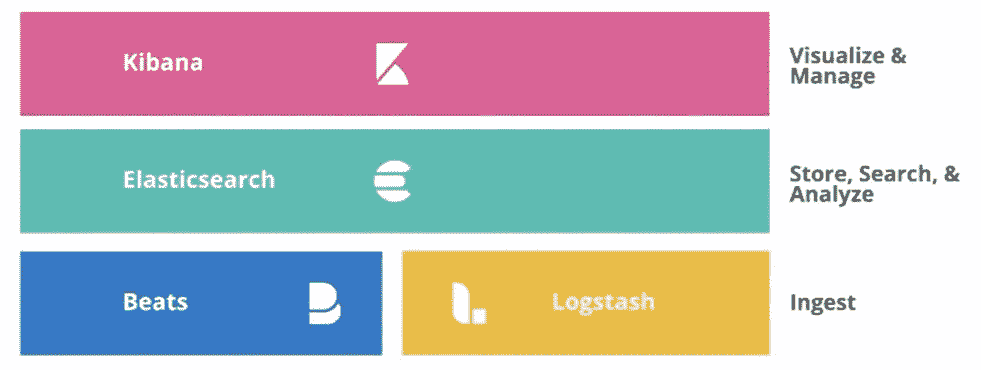
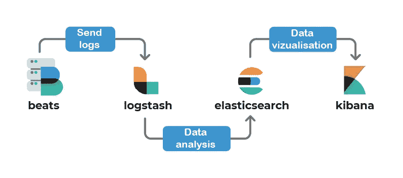

# 3 分钟内完成弹性堆叠

> 原文：<https://levelup.gitconnected.com/elastic-stack-in-3-mins-c46354d4d310>

如果你像我几年前一样是计算机开发领域的新手，你可能想知道什么是栈。别担心，让我来启发你。

一个**栈**是用来创建和管理计算机程序的工具的集合。也被称为“*技术栈*或“*软件栈*”。可以把它看作一个数据生态系统，包括创建和维护应用程序所需的底层工具、框架和库。例如，2022 年最受欢迎的技术栈之一是 *MEAN* 栈(MongoDB、Express.js、AngularJS 和 Node.js)。同样值得一提的是 *MERN* 堆栈，它与之前的堆栈非常相似，但使用了 React 而不是 Angular。

**ELK** 是一个开源栈的例子，它由 3 个主要组件组成: **Elasticsearch** 、 **Logstash** 和 **Kibana** 。然后加入节拍组成麋鹿栈。ELK 堆栈允许索引和分析数据。我们可以加载不同类型的数据，比如日志，并以图表的形式可视化它们。

弹性堆叠

让我们详细了解一下堆栈的每个元素及其作用:

*   毫无疑问，Elasticsearch 是这个堆栈的大脑。数据存储和可访问性是它的两个主要功能。虽然它有许多应用，但它的主要功能是数据流的索引。Elasticsearch 使用 JSON 存储数据。索引是数据库，保存这些数据。
*   **Logstash** 允许在将数据提交给 Elasticsearch 之前对其进行汇总和格式化。考虑将数据从关系数据库转移到 Elasticsearch。在这种情况下，在将数据发送到 Elasticsearch 之前，可以使用 Logstash 连接到数据库并转换数据。由于要执行的操作量很大，Logstash 通常安装在单独的服务器上，以防止资源被蚕食。
*   一旦数据被提取并提交给 Elasticsearch，Kibana 将作为一个可视化窗口。事实上，Kibana 会让你实时查看 Elasticsearch 数据。该工具提供了预配置的控制面板来分析返回的日志。除了监控之外，它还能够可视化和检查数据。
*   **Beats** 是一套能够交付日志的工具。这些工具必须安装在要监控的机器上。它们执行代理的功能，收集和发送事件日志。其中包括用于摄取网络捕获文件的 *Packetbeat* 、用于摄取日志文件的 *Filebeat* 、用于从各个系统收集指标的 *Metricbeat* 等。

长话短说，我们刚刚了解了 **Elastic stack** ，它是由四个互补的软件组成的集合:

*   **Beats** :代理给你带日志。
*   **Logstash** :允许在 Elasticsearch 中聚合数据。
*   **Elasticsearch** :主要组件，集中和访问信息。
*   **Kibana** :允许在 Elasticsearch 中创建仪表板和可视化数据。

今天到此为止，请随时查看官方文档[了解更多详情。感谢您的阅读，如果您对本文有任何问题或评论，请在下面留下您的评论。](https://www.elastic.co/guide/index.html)

我们下次再见，看更多的帖子。

阿卜杜尔-巴吉