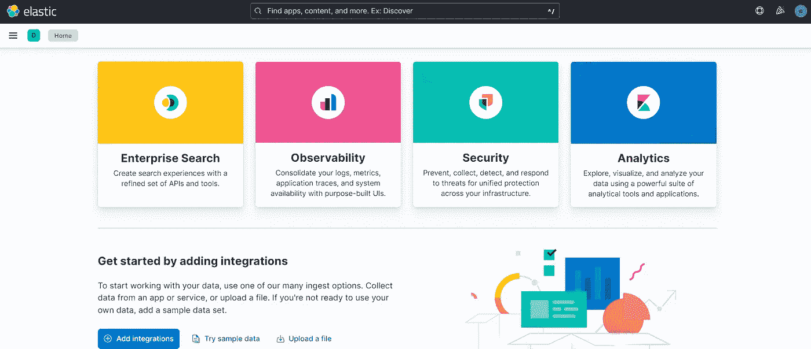

# Elasticsearch & Kibana:通过 Docker Compose 实现安全性、认证和网络加密

> 原文：<https://levelup.gitconnected.com/elasticsearch-kibana-security-authentication-and-network-encryption-enabled-with-docker-e6747a989766>


让我们继续我们的势头。在上一篇文章中，我们展示了如何在禁用安全性的情况下使用 Docker Compose 启动 Elasticsearch 和 Kibana。如果你还没有这样做，我建议你通过点击[这个链接](https://medium.com/@mhdabdel151/elasticsearch-and-kibana-installation-using-docker-compose-886c4823495e)来看看它。今天，我们将通过启用**安全**、**认证**和**网络加密**对配置进行更深入的探讨。

我们的 *docker-compose.yml* 文件目前看起来像这样:

还有。 *env* 包含这个:

```
# Version of Elastic products
STACK_VERSION=8.4.0# Port to expose Elasticsearch HTTP API to the host
ES_PORT=9200# Port to expose Kibana to the host
KIBANA_PORT=5601
```

首先，我们将把客户机的密码添加到环境变量中。因此，添加这些具有所需值的行:

```
# Password for our 'elastic' user
ELASTIC_PASSWORD=TYPE_HERE# Password for our 'kibana_system' user
KIBANA_PASSWORD=TYPE_HERE# Set the license
LICENSE=trial
```

当设置为**试用**时，自生成的许可证仅允许 30 天访问 x-pack 的所有功能(*根据本* [*条*](https://www.elastic.co/blog/security-for-elasticsearch-is-now-free) *，在版本 6.8.0 和 7.1.0* 中是免费开始)。对于与集群的任何交互，您必须利用 *ELASTIC_PASSWORD* 值。 *KIBANA_PASSWORD* 值仅在内部配置 KIBANA 时使用。

接下来，让我们编辑我们的 *docker-compose.yml* 文件。我们希望创建一个安全的 Elasticsearch 集群，启用身份验证和网络加密，并安全地连接一个 Kibana 实例。

上面提供的示例代码是针对单节点 Elasticsearch 集群的，但是通过添加一些额外的 Docker 容器服务并进行适当的配置，它可以被复制用于多节点集群。您可以添加脚本以在执行前检查是否提供了密码，请参考此[链接](https://www.elastic.co/guide/en/elasticsearch/reference/current/docker.html#docker-file)了解。

现在，通过运行以下命令，创建并启动 Kibana 实例和单节点 Elasticsearch 集群:

```
docker-compose up -d
```

一切似乎都正常，进入 [http://localhost:5601](http://localhost:5601) 访问 Kibana，以 *elastic* 用户身份登录，并填写*中的密码。env* 文件( *ELASTIC_PASSWORD* )。



运行`docker-compose down`停止集群。当使用`docker-compose up`重启集群时，Docker 卷中的数据被维护和加载。停止集群时，使用`-v`选项销毁网络、容器和卷。

今天到此为止，请随意查看关于这个主题的[官方文档](https://www.elastic.co/guide/en/elasticsearch/reference/current/docker.html#docker-compose-file)，了解更多细节和配置。感谢您的阅读，如果您对本文有任何问题或评论，请在下面留下您的评论。

我们下次再见，看更多的帖子🚀。

阿卜杜尔-巴吉