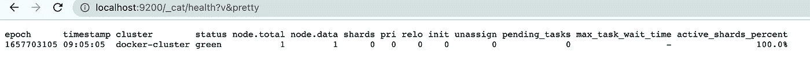
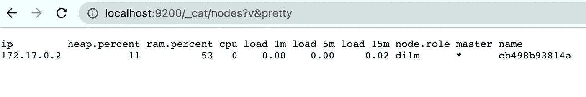
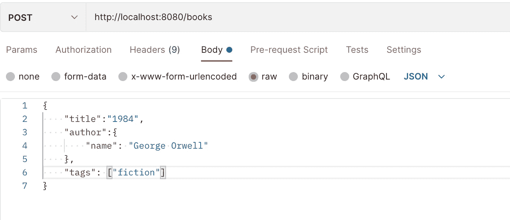
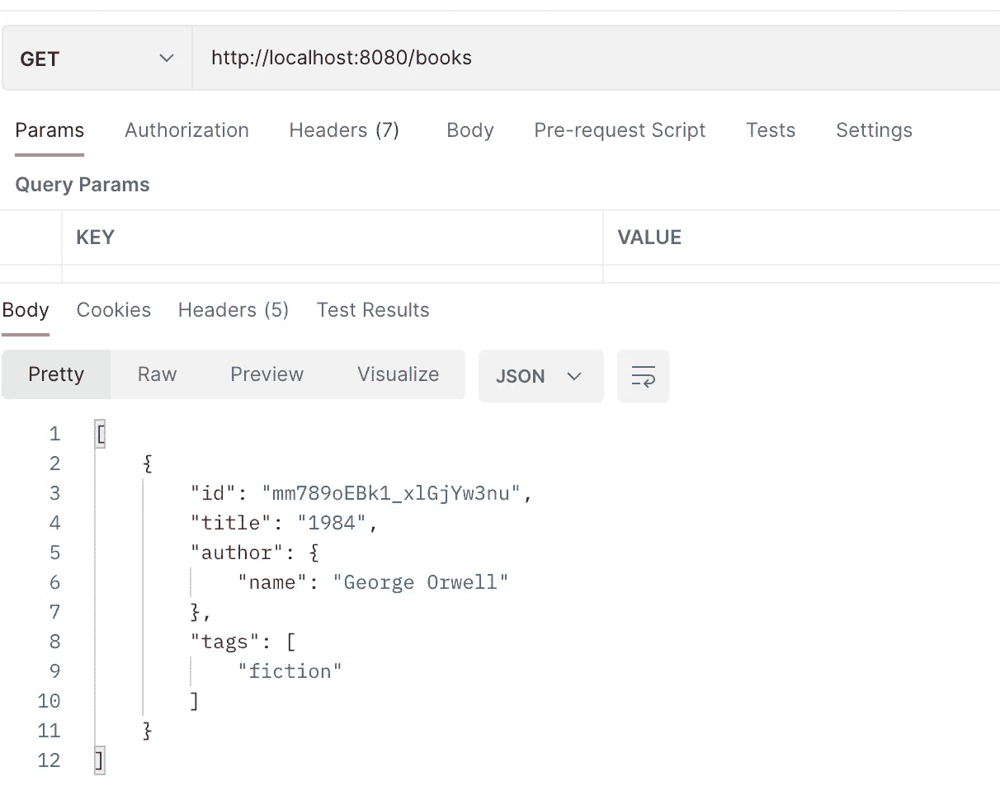
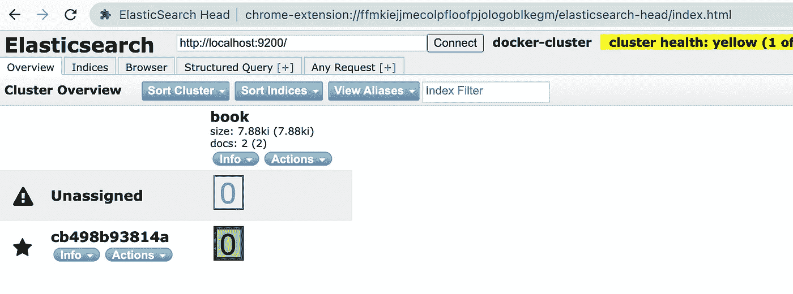
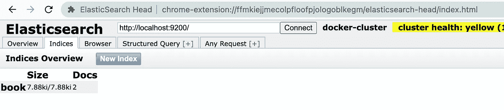
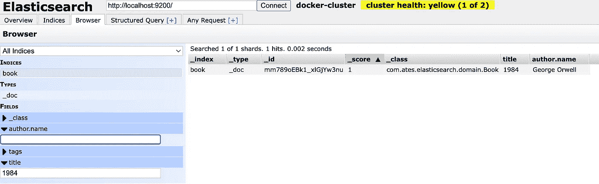
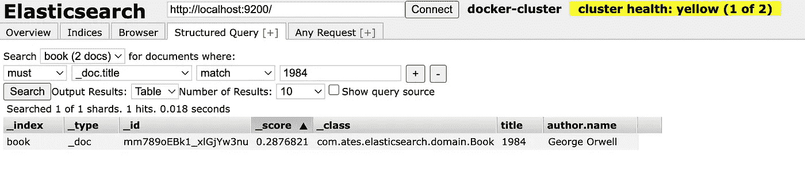
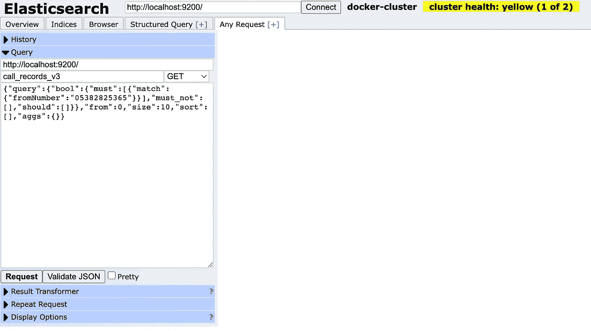

# 用 Java 进行弹性搜索

> 原文：<https://levelup.gitconnected.com/elasticsearch-with-java-41daeda3e6b1>


资料来源:coffeebeantech.com

今天我将给出一些代码示例，说明如何在 Java 和 Springboot 中使用 Elastichsearch。但是在给出代码示例之前，我想提供一点关于 Elastichsearch 的信息，比如它是什么，它是用来做什么的，以及我们为什么使用它。

# 概观

## 什么是 Elasticsearch？

“Elasticsearch 是一个分布式、免费和开放的搜索和分析引擎，适用于所有类型的数据，包括文本、数字、地理空间、结构化和非结构化数据。”

## Elasticsearch 是用来做什么的？

以下是我们可以使用的各种字段

*   搜索:应用程序、网站和企业搜索
*   日志记录和分析:安全分析、业务分析
*   监控我们的应用程序及其性能
*   以及地理空间数据分析和可视化等其他功能

## 我们为什么要用 Elastichsearch？

*   **全文搜索:** Elasticsearch 能够返回与搜索标准不完全匹配的文档。例如，如果我们在描述中搜索“硬件”和“软件”，应用程序通过全文搜索也将能够返回只包含其中一个词的结果，或者稍微不同但最接近的词。
*   **快:** Elasticsearch 也是一个近乎实时的搜索平台，延迟极短。
*   **分布式**:在一个集群中的多个节点上运行，可以扩展成千上万个节点
*   **高可用性** : Elasticsearch 也具有高可用性和容错性，因为集群中存储了多个数据副本
*   Restful API :通过简单的基于 JSON 的 HTTP 调用，它可以用于 CRUD 索引操作、监控和分析
*   **无模式**:没有固定的表或模式来存储数据。没有显式模式的索引数据

在给出了一些信息之后，现在我想提供一个例子来说明我们如何一步一步地使用 Elasticsearch。

# 实施部分

## **安装并运行 Elasticsearch**

在本地电脑上安装 Elasticsearch。有关说明，请点击此处的。

或者，如果您的本地机器上有 docker，您可以从 Docker 上提取图像。有关安装和其他详细信息，请点击[此处](https://www.elastic.co/guide/en/elasticsearch/reference/current/docker.html)

就我个人而言，我已经在我的 Docker 上安装了下面的脚本图像；

```
docker pull docker.elastic.co/elasticsearch/elasticsearch:7.6.2
```

然后为了逃跑，我执行了；

```
docker run --name es01 --net elastic -p 9200:9200 -p 9300:9300 -it docker.elastic.co/elasticsearch/elasticsearch:7.6.2
```

## **检查弹性搜索是否工作**

完成脚本后，如果你想检查你的 Elasticsearch 是否在本地运行，你可以在浏览器上输入下面的 URL。如果状态为绿色，则您的应用程序正在成功运行。

[http://localhost:9200/_ cat/health？v &漂亮的](http://localhost:9200/_cat/health?v&pretty)



或者你也可以检查节点。

[http://localhost:9200/_ cat/nodes？v &漂亮的](http://localhost:9200/_cat/nodes?v&pretty)



## **开发应用**

现在，我想展示如何在我们的应用程序中使用它。我用 Java 11 开发了这个应用程序。

还有，我用了以下版本的 Elasticsearch 和 spring-data-elastic search；

## 配置 Elasticsearch 客户端

我配置了 Elasticsearch。这里有两件事我想解释一下。

*   **抽象弹性搜索配置**

这是由 Spring-data 提供的。为什么我们应该使用它。因为[弹簧数据](https://spring.io/projects/spring-data)是；

> *Spring Data 的使命是为数据访问提供一个熟悉的、一致的、基于 Spring 的编程模型，同时仍然保留底层数据存储的特性。*

*   **RestHighLevelClient:** 工作于 Java 底层 REST 客户端之上。它的主要目标是公开特定于 API 的方法，这些方法接受请求对象作为参数并返回响应对象，以便由客户端自己处理请求封送和响应解封。

***注意****:RestHighLevelClient 对于较新版本的 Elastichsearch 已被弃用。您应该考虑改用 Java API 客户端。详情请点击* [*链接*](https://www.elastic.co/guide/en/elasticsearch/client/java-rest/current/java-rest-high.html) *。*

请不要忘记使用**@配置**和 **@Bean** 注释。

## **实体**

我创建了一个具有相同索引名的图书模型。我添加了一些字段，如 id、标题、作者和标签。这里是一些关于我使用的*注释*的信息；

***@Document* :** 这个指定了我们的实体应该进入哪个索引。

***@Id* :** 使这个字段成为你的文档的`_id`。这是该索引中的唯一标识符。

***@Field* :** 配置字段的类型。

***@多字段* :** 以几种方式索引字段。

***@InnerField:*** 描述标题字段的附加索引。

## **储存库**

我没有在这个项目中使用任何自定义查询。我只是使用了 spring-data-elasticsearch 提供的默认 CRUD 操作。

## 服务

我开发了简单的服务类，如；

## 控制器

此外，我开发了简单的服务类，如；

## 使用 Postman 调用端点

开发之后，我首先调用了 POST 方法来保存带有给定正文的书，比如；



然后，我调用 GET 方法来检查这本书是否被保存。



## 使用扩展在浏览器上检查数据

在 Elasticsearch 上保存数据后，您可以使用浏览器搜索您的数据。为此，您应该为您的浏览器安装兼容的 Elasticsearch 扩展。

我用的是弹性搜索头延伸。该扩展的用户界面如下所示。



为了连接我的本地 ES，我键入 localhost:9200，然后单击 connect 按钮。

然后，我之前创建的 ***图书*** 索引就到了 ***索引*** 标签下。



您可以在 ***浏览器*** 选项卡下搜索您的数据。



或者你也可以在 ***下搜索具体数据，结构化查询*** 标签页。



同样，如果你想搜索广泛的搜索然后使用 ***任何请求*** 标签。



## 最后的话

结果是；我试图通过提供一些代码来解释什么是 Elasticsearch，我们为什么使用它，以及我们如何使用它。最后，我还展示了如何使用扩展在浏览器上检查数据。

希望有帮助，

你也可以在我的 [Github](https://github.com/atesibrahim/elasticsearch) 页面找到完整的代码。

期待在下一期分布式技术文章中见到您。

感谢您阅读帖子并关注我…

***参考文献:***

[](https://www.elastic.co/what-is/elasticsearch) [## 什么是 Elasticsearch？

### 简而言之，我们帮助每个人更快地找到他们需要的东西-从需要您的文档的员工那里…

www.elastic.co](https://www.elastic.co/what-is/elasticsearch) [](https://en.wikipedia.org/wiki/Elasticsearch) [## 弹性搜索-维基百科

### Elasticsearch 是一个基于 Lucene 库的搜索引擎。它提供了一个分布式的、支持多租户的全文…

en.wikipedia.org](https://en.wikipedia.org/wiki/Elasticsearch) [](https://spinscale.de/posts/2020-08-06-introduction-into-spring-data-elasticsearch.html) [## Spring 数据弹性搜索简介

### TLDR；这篇博文介绍了 Spring Data Elasticsearch，以及如何在您的应用程序中使用和测试它

spinscale.de](https://spinscale.de/posts/2020-08-06-introduction-into-spring-data-elasticsearch.html)