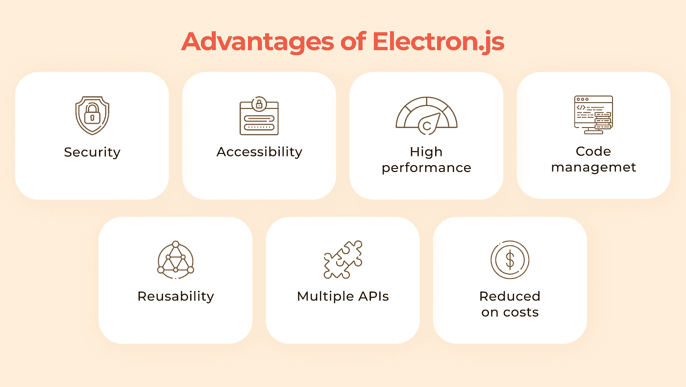
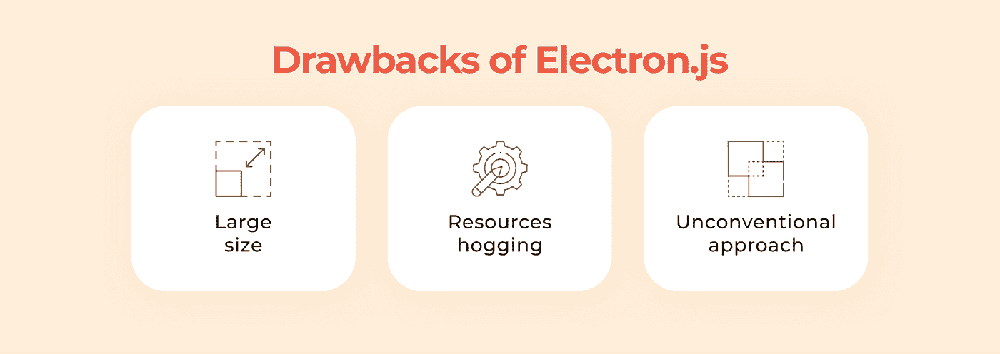
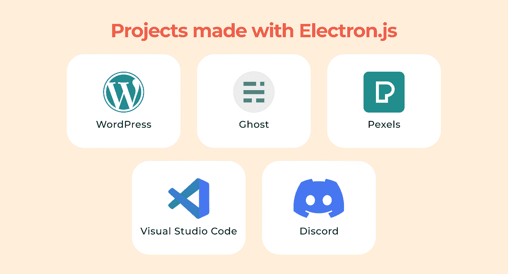

# Electron.js:设计强大的多平台桌面应用的伟大工具

> 原文：<https://levelup.gitconnected.com/electron-js-great-tool-to-design-powerful-multi-platform-desktop-apps-c89404cfaeff>

有传言说构建桌面应用已经无关紧要了。但不是这样的。电子 js。是桌面软件开发的一种很好的方法，在软件工程师中很受欢迎。

为什么？这就是我要讨论的。作为一个例子，你将知道在这种网络技术背后隐藏着什么，以及为什么要应用它。

# 为什么选择 Electron.js？

使用电子，没有特定的技能或 SDK 是必需的。这项技术最大的好处是每个初级开发人员都可以尝试并获得成功。它已经采用了领域逻辑、设计和整体 web 应用程序架构。因此，它有助于降低多平台应用程序开发价格。

此外，这个框架由一个 Chromium 引擎驱动，可以实现 chrome 最神奇的功能。此外，该引擎能够自行重新加载，这意味着您无需在每次修改代码时重启软件。

它导致即时重装和优化整体体验。而且，所有的错误和内存丢失都是由内置的 chrome 工具自己检测出来的。因此，您不需要使用第三方调试器。

JavaScript 程序员应该知道 Electron.js 的所有细节，它是如何操作的，以及使用什么技术来实现第三方 API。

因此，如果你打算[雇佣 Javascript 开发人员](https://www.cleveroad.com/blog/hire-javascript-developer)，确保他们精通 HTML5、CSS3、AngularJS、ReactJS。他们在 SQL、MongoDB 和 GraphQL(或 REST)方面经验丰富。

# Electron.js 代表什么？

Electron 代表一个[网络框架](https://www.techechelons.com/blog/developing-desktop-apps-with-electron-js-advantages-disadvantages)，它让程序员用 JavaScript、HTML 和 CSS 开发跨平台的应用程序。它通过提交丰富的 JS APIs 来管理与多个操作平台对话的细节。

这个框架是如何工作的？基于电子的应用程序作为网络应用程序运行，唯一的区别是它们可以解释和记录数据处理系统文件中的信息。由于电子能够提高开发速度，它已经被添加到程序员的工具箱中。

电子填补了现代桌面应用需求和信息技术可用工具之间的空白。这种 web 技术给桌面软件开发带来了优雅，将它提升到了一个不同的层次。

现在，让我们来看看为什么基于电子的应用程序比移动本地应用程序更值得[选择。](https://dzone.com/articles/what-is-electron-amp-why-should-we-use-it)

# 安全性

例如，如果一个常规的应用程序需要转换成一个跨平台的应用程序，所有的信息都保存在本地的系统中。因此，数据安全性得到保证。另一方面，如果用户希望将信息保存在云中，程序员必须确保这个云具有很强的安全级别。

# 易接近

JavaScript/Plugin 为软件工程师提供了自由管理，并提供了使用硬件级 API 的机会。该框架在特性方面提供了灵活性，使开发人员能够为他们的桌面项目选择所需的功能。此外，迁移到所讨论的技术是顺利的。

# 高性能

在某些情况下，基于电子的跨平台应用表现出比本地应用更高的性能。这取决于两个因素:

*   桌面使用的组件数量
*   桌面是否只加载所需的元素

ElectronJS 能够将一个代码集成到所有平台，这大大加快了开发过程。

# 简化管理

客户将不会遇到向开发团队传达项目需求的挑战，因为跨平台项目可以为所有平台打包。此外，不需要多次测试来确保每个应用程序包含相同的功能。由于整个工作是在一个单独的代码库中完成的，无论问题出现在哪里，QA 工程师都可以在其中进行修复。所以开发时间往下走。

# 复用性

由于 electronic 由一个代码库支持，软件工程师可以利用这个优势来制作 web 应用程序和桌面应用程序。此外，基础代码本身可以重用，因为开发人员对单个应用程序使用单个代码，但会将其分发到所有平台。

# 提供多种 API

当谈到软件开发时，可能在您脑海中盘旋的第一个问题是需要实现哪些功能才能成功。从这个角度来看，电子就是你要找的。它提供了各种各样的 API，可以用来丰富您的产品，从而减少开发时间。例如，Squirrel 支持许多帮助开发安装程序和集成自动更新功能的工具和库。

# 降低成本

转向跨平台桌面应用程序开发，可以降低开发成本。如果你决定投资额外的数字项目，程序员会更快地完成任务。

然而，尽管电子给用户和开发团队都带来了好处，但它也有一些不可忽视的缺点。

**大号**

Chromium 浏览器(web 浏览器的代码库)是一个包含许多代码行的大型软件。因此，你的应用程序将转换成一个大块，占用你硬盘的一小部分空间。然而，现代个人电脑提交 2tb 的操作存储，所以这个问题很容易解决。

**资源抢夺**

除了操作内存，电子产品还会占用系统资源，并消耗大量笔记本电脑的电池能量。原因是这些应用程序针对不同的平台进行了优化，因此能源效率低下。相比之下，原生应用程序是为特定平台开发的，因此它们的储备得到了有效的精简。

**具体要求**

这里我指的是个人客户的需求。最好的情况是，所有跨平台的应用应该在所有操作系统上运行一致。然而，如果客户希望为每个平台添加独特的功能，这将导致产品开发方面的一些困难。首先，实现这些功能需要一些时间。其次，增加的时间导致额外的开支。拿 Slack 或 WhatsUp 这样的电子应用程序来说吧。在任何操作系统上看起来都一样。所以，要么承认你的应用程序的身份，要么本地化。

让我们考虑五个成功的桌面应用程序示例。

# WordPress 桌面应用程序

WordPress 是一个网络发布软件，它允许企业主在没有编码知识的情况下编辑、制作和处理网站内容。通常，WordPress 是通过浏览器启动的。但该公司决定发布一个支持跨平台的桌面平台，以带来流畅的用户体验，使他们能够专注于填充他们的网站，而不会从浏览器标签中分心——或者保持他们的网站搁置但可用。

电子 js。以及 React 框架有助于快速加载和令人兴奋的用户体验。

# 幽灵电子应用程序

Ghost 是一个内容营销工具，允许创建、管理和运行各种网络出版物(博客、书籍、帖子等)。).Ghost 桌面应用程序使作者能够同时处理不同的在线材料，并专注于他们的工作流程。在浏览器中创建快捷方式相当具有挑战性——这个平台让事情变得更简单。

# Pexels 桌面应用程序

Pexels 是创意人士的金矿，其中包含各种各样的免费图片和照片。多亏了 ElectronJS，用户不需要下载图片，只需要点击一下就可以把它们复制到剪贴板上。然后，他们可以将照片附加到任何应用程序中，并将其用作博客或社交媒体帖子的库存照片。

# Visual Studio 代码

这是一个定制的跨平台工具，用于代码编辑。电子架构导致了高速度和轻微的内存使用。此外，该平台内置了对大多数要求苛刻的编程语言(C++、JavaScript、Python 等)的支持。)并提供了丰富的增强生态系统。

它提供了称为 IntelliSense 的强大功能，可以标记代码中的错误，并提交修复这些错误的指南。此外，程序员可以根据他们的需求和专业知识定制功能、键盘快捷键或主题。

# 不调和

Discord 代表游戏爱好者的聊天平台。电子使它可以进入所有主要的平台。该应用程序允许用户创建新的频道或加入已经创建的频道。渠道基本就是游戏。用户可以在每个频道中找到许多其他游戏玩家通过消息或音频文件聊天，共享图像或视频。然而，用户加入群后，他们不能直接发送消息。相反，他们需要等待至少十分钟，直到系统测试他们的耐心水平并验证他们的帐户。

如果你决定部署一个跨平台的应用，ElectronJS 是正确的选择。经验丰富的专家将在几天内交付一个应用程序，因为它具有与所有 JavaScript 库集成的能力。此外，Electron 代表 web 技术，因此如果需要的话，用这个工具设计的应用程序可以很容易地转换成 web 应用程序。

还能读什么？

*   [为什么 Laravel 是 Web 应用开发的最佳框架](https://www.webdatarocks.com/blog/why-laravel-is-the-best-framework-for-web-application-development/)
*   【2021 年最佳 JavaScript 工具
*   [了解如何在 Gitconnected 上使用 Electron.js。](https://gitconnected.com/learn/electron)
*   [2021 年你应该准备好的主要网络发展趋势](https://www.webdatarocks.com/blog/best-code-editors-for-web-development-the-ultimate-latest-list/?hilite=%22trends%22)
*   [2021 年最佳 JavaScript 框架](https://www.webdatarocks.com/blog/best-javascript-frameworks/?hilite=%22trends%22)
*   [通过在 Gitconnected 上构建一个真实的应用程序，了解如何将 Angular 前端连接到 NodeJS & Express & MongoDB 后端。](https://gitconnected.com/learn/angular/angular-and-nodejs-the-mean-stack-guide-da3757)

*原载于*[*https://www.webdatarocks.com*](https://www.webdatarocks.com/blog/electron-js-great-tool-to-design-powerful-multi-platform-desktop-apps/)*。*