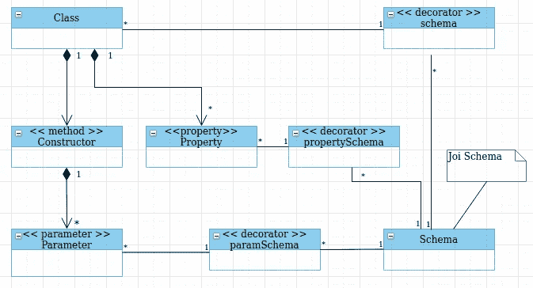

# 用 Decorators 进行优雅的类型脚本数据验证

> 原文：<https://levelup.gitconnected.com/elegant-typescript-data-validation-with-decorators-68ec7506fd87>


在 [Unsplash](https://unsplash.com/s/photos/elegant?utm_source=unsplash&utm_medium=referral&utm_content=creditCopyText) 上由 [Adeolu Eletu](https://unsplash.com/@adeolueletu?utm_source=unsplash&utm_medium=referral&utm_content=creditCopyText) 拍摄的照片

# 我的目标

我想尽可能以最符合人类工程学的优雅方式为我在 typescript 应用程序中使用的对象指定验证规则。

*github:*[*https://github.com/kanian/ts-decorator-validation*](https://github.com/kanian/ts-decorator-validation)*，*

*NPM:*[https://www.npmjs.com/package/ts-decorator-validation](https://www.npmjs.com/package/ts-decorator-validation)

# 工具

我将使用 [Joi](https://hapi.dev/family/joi/) 和 JavaScript [装饰者](https://github.com/tc39/proposal-decorators)。这里有一个简单的 UML 图来总结这种方法:



一个类，它的构造函数，构造函数参数，类属性和它们的模式

# 关于 Joi

Joi 是 JavaScript 的模式描述语言和数据验证器。假设您想要验证一个 person 对象，这样每个 person 对象都有一个 name 和 age 属性。名称必须是至少 3 个字符的非空字符串，而年龄是不能小于 1 的数字。你可以这么做:

然后你会这样验证:

# 打字稿装饰者

decorators 是 Typescript 的一个实验性特性，它提供了一种注释类和类成员声明的方法。它们还为上述类及其成员提供了元编程语法。作为实验，您必须在 tsconfig.json 中启用 decorators 和元数据发射:

```
{
    "compilerOptions": {
        "target": "ES5",
        "experimentalDecorators": true,
        "emitDecoratorMetadata": true }
}
```

此外，您必须安装元数据功能，一个用于 ECMAScript [提议](https://rbuckton.github.io/reflect-metadata/)的 [polyfill](https://www.npmjs.com/package/reflect-metadata) :

```
npm i reflect-metadata
```

通常

> *装饰器*是一种特殊的声明，可以附加到[类声明](https://www.typescriptlang.org/docs/handbook/decorators.html#class-decorators)、[方法](https://www.typescriptlang.org/docs/handbook/decorators.html#method-decorators)、[访问器](https://www.typescriptlang.org/docs/handbook/decorators.html#accessor-decorators)、[属性](https://www.typescriptlang.org/docs/handbook/decorators.html#property-decorators)或[参数](https://www.typescriptlang.org/docs/handbook/decorators.html#parameter-decorators)。装饰者使用形式`@expression`，其中`expression`必须计算出一个函数，该函数将在运行时使用关于被装饰声明的信息来调用。

我对类、参数和属性装饰器特别感兴趣。

类装饰器应用于类构造函数，并允许您修改类声明，以便您可以观察它或应用任何类型的自定义行为。在我的例子中，我想确保一个类实例符合给定的 Joi 模式。因此，我将使用一个 decorator factory，它接受一个给定的模式，并在 decorator 的表达式定义中使用它来验证所创建的感兴趣的类的实例:

类模式装饰器

对于本文的其余部分，我们将假设:

与人相关的图式

现在，我们可以在创建时验证实例，如下所示:

使用 schema decorator 来验证 Person 对象

如您所见，除了创建模式之外，我们只需向我们的类添加一行代码，即 decorator，以便实施验证。这是符合人体工程学的，简洁地显示了意图，是优雅的。

然而，我们必须在退出之前创建一个完整的实例，即使我们可以从参数列表中获得参数无效的信息。一个更好的方法是单独验证参数，然后创建一个实例并在类级别验证它。无论如何，如果参数无效，就不会创建实例。为此，我将使用[参数装饰器](https://www.typescriptlang.org/docs/handbook/decorators.html#parameter-decorators)和[反射元数据](https://www.typescriptlang.org/docs/handbook/decorators.html#metadata)。一个**参数装饰器**

> […]将在运行时作为函数调用，有以下三个参数:1。静态成员的类的构造函数，或者实例成员的类的原型。2.成员的名称。3.函数的参数列表中参数的序号索引。([https://www . typescriptlang . org/docs/handbook/decorators . html # parameter-decorators](https://www.typescriptlang.org/docs/handbook/decorators.html#parameter-decorators))

这是参数装饰器的代码:

参数装饰器

此外，我将修改前面的类 schema decorator 来检查参数 decorator，从而验证构造函数参数:

具有构造函数模式验证的类模式装饰器

`validateConstructorParams`函数检索现有的构造函数参数元数据，并根据各自的参数模式验证给定的参数:

ValidateConstructorParams:根据各自的参数模式验证给定的参数

现在，只要参数无效，我们就可以退出:

paramSchema 装饰器验证示例

这个还是挺简洁优雅的。我们可以通过在导入过程中给装饰者提供更短的别名来使代码更加简洁。

现在，我确信如果给定的数据无效，对象创建将不会完成。

我现在要确保**对对象状态的任何修改都不会使其处于无效状态**。为了实现这一点，我将使用**属性装饰器；**它们叫做

> […]在运行时，使用以下两个参数:1。静态成员的类的构造函数，或者实例成员的类的原型。2.成员的名称。([https://www . typescriptlang . org/docs/handbook/decorators . html # property-decorators](https://www.typescriptlang.org/docs/handbook/decorators.html#property-decorators))

属性装饰器将**为它注释的属性构建一个 getter 和一个 setter** 。setter 将根据属性装饰器的模式验证它的参数:

propertySchema 装饰

propertySchema 装饰器验证示例

将所有东西放在一起会给我们带来:

所有使用的装饰者

# 结论

Typescript 类、参数和属性装饰器以及 reflect-metadata 都是完美的工具，有助于以最符合人类工程学的方式验证 TypeScript 对象，因此也是最优雅的方式。这种声明式方法简洁明了，并且以非常清晰的方式传达意图。

*这篇文章的代码在 https://github.com/kanian/ts-decorator-validation*[](https://github.com/kanian/ts-decorator-validation)**找到，而 npm 包是*[](https://www.npmjs.com/package/ts-decorator-validation)**。***