# OpenShift CI/CD 管道的元素

> 原文：<https://levelup.gitconnected.com/elements-of-an-openshift-ci-cd-pipeline-dd996f10c29>

## 构建企业级 DevSecOps 生产就绪管道


[田宽](https://unsplash.com/@realaxer?utm_source=medium&utm_medium=referral)在 [Unsplash](https://unsplash.com?utm_source=medium&utm_medium=referral) 上拍照

本文的目的是解释与构建 CI/CD 管道相关的一些基本概念，以及它们与 OpenShift 的关系。这是一个介绍性的指南，事实上，这是一个相当大的主题。在适当的时候，更深入和面向实施的指导方针被链接到本文件。

**主题:**

*   不变的基础设施
*   管道阶段和管道流程
*   管道阶段的类型
*   *构建阶段*
*   *晋升阶段*
*   *验证阶段*
*   *合规阶段*
*   管道的所有权
*   指标和仪表板
*   结论

# 不变的基础设施

不可变基础设施的一般概念是，只有一种方法可以将变更引入到系统中，那就是破坏并重新创建该系统。这种方法的主要好处是以一种非常可控的方式引入更改，从而最大限度地减少偏差和错误配置。此外，采用单一的方法来引入变更允许更多地关注自动化和优化。[代码形式的基础设施](https://en.wikipedia.org/wiki/Infrastructure_as_Code)是一种用于实现不可变基础设施的常用方法(这个主题超出了本文的范围)。

系统和基础设施可以被迅速摧毁和重建。因此，不变性不应该被解释为僵化，而是一个关于如何引入变化的非常规定性的规则。对于给定系统实例的生命周期，它是不可变的。

不可变基础设施的概念可以应用于基于容器的解决方案和部署管道，其思想是逐步锁定基础设施:

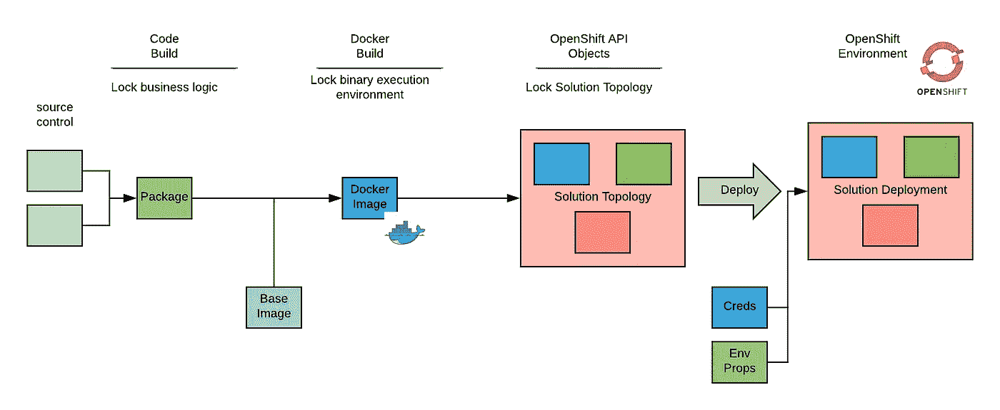

基础设施的各个部分在不同的阶段被锁定，并且每个基础设施部分在被锁定之后变得不可改变。

**代码构建阶段**锁定业务逻辑。这是关于从我们的代码开始创建一个可部署的工件。我们一直做到这一步。
**映像构建阶段**锁定二进制执行环境并创建容器映像。创建容器映像后，业务逻辑可以在任何地方执行，不会出现偏差(对于二进制文件和其他运行时依赖项)。
**拓扑定义阶段**锁定解决方案的拓扑。假设部署涉及由几个组件组成的解决方案，这个阶段创建并锁定描述必须部署哪些组件及其依赖关系的拓扑。利用声明性 API 来创建所需的计算、网络和存储资源的清单。

请注意，我们已经锁定了大部分基础架构，还没有部署任何东西。

最后一个阶段执行环境部署。在部署过程中，会注入依赖于环境的属性，包括公共属性和机密凭据。

为了遵守部署后基础设施不变的原则，在环境中引入新变化的唯一方法是重复前面的过程。不管我们想要引入的变化的性质如何，这都是正确的，这可能包括:

*   代码发布
*   运行时更新
*   安全补丁
*   配置更改

在传统环境中，后三项通常是运营团队的责任，执行时开发团队不一定参与。对于不可变的基础设施和容器，部署过程需要彻底地重新思考，并且需要开发团队的参与。

我们已经描述的进展锁定过程的阶段可以在 CI/CD 管道中实现。以下部分讨论管道的类型以及管道中的步骤类型。

# 管道阶段和管道流程

[*管道阶段*](https://jenkins.io/doc/book/pipeline/#stage) 是一组逻辑分组的任务，旨在实现管道内的特定功能(例如，构建应用、部署应用、测试应用、推广应用)。当所有阶段无故障完成时，管道成功。通常，阶段以一致的顺序连续运行(一个接一个)，但有些阶段可能会并行运行。我们将从一个阶段到下一个阶段的移动称为*触发*。

成功的流水线的最终目标是它能够自动运行(*自动触发*)，将工作负载带入生产状态，而无需任何人工干预。这种级别的延续允许开发团队快速且低风险地发布少量代码。

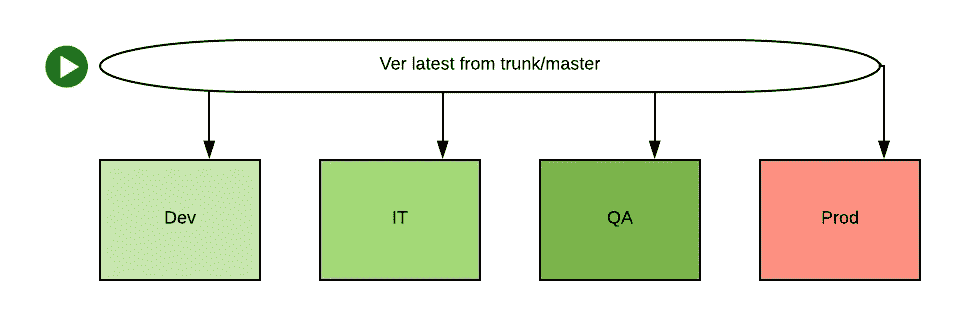

要实现这种能力水平的管道，需要开发和运营团队进行高水平的投资，以在自动化管道中建立适当的测试和验证。这确保了在将代码部署到生产环境之前，代码的质量和合规性。由于这个原因，许多管道最初包括*手动触发器*——在特定阶段后停止或暂停，需要手动干预来运行测试、审查代码或在批准管道继续进入更高阶段之前接收签署。

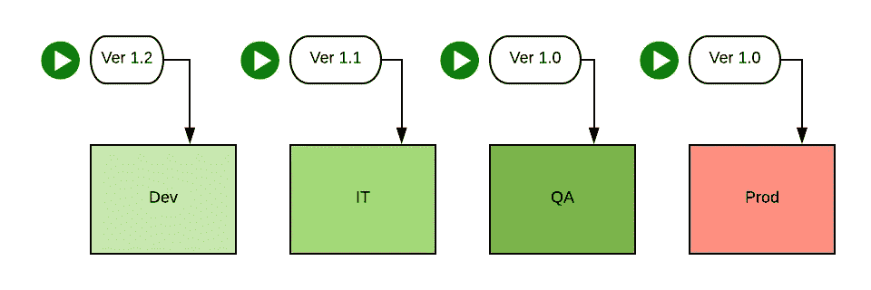

在严格手动触发的管道和自动触发的管道之间有一个连续体。大多数组织可能会从阶段之间的完全手动触发开始，但应该尽可能多地移除这些手动触发，以减少系统中的瓶颈。

# 管道阶段的类型

通常，管道中有四个步骤:

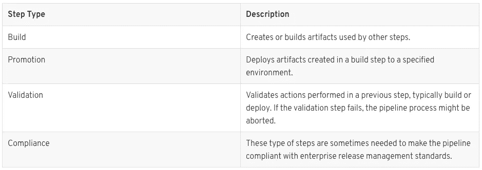

因为管道的主要任务是通过各种[软件开发生命周期](https://en.wikipedia.org/wiki/Systems_development_life_cycle) (SDLC)环境将软件推广到生产，所以一个 [MVP](https://en.wikipedia.org/wiki/Minimum_viable_product) (最小可行产品)管道可能只需要构建和推广步骤，由人工执行验证和符合性检查。

推荐的方法是创建一个 MVP 管道，并且在 MVP 管道被验证之后才添加验证和符合性步骤。

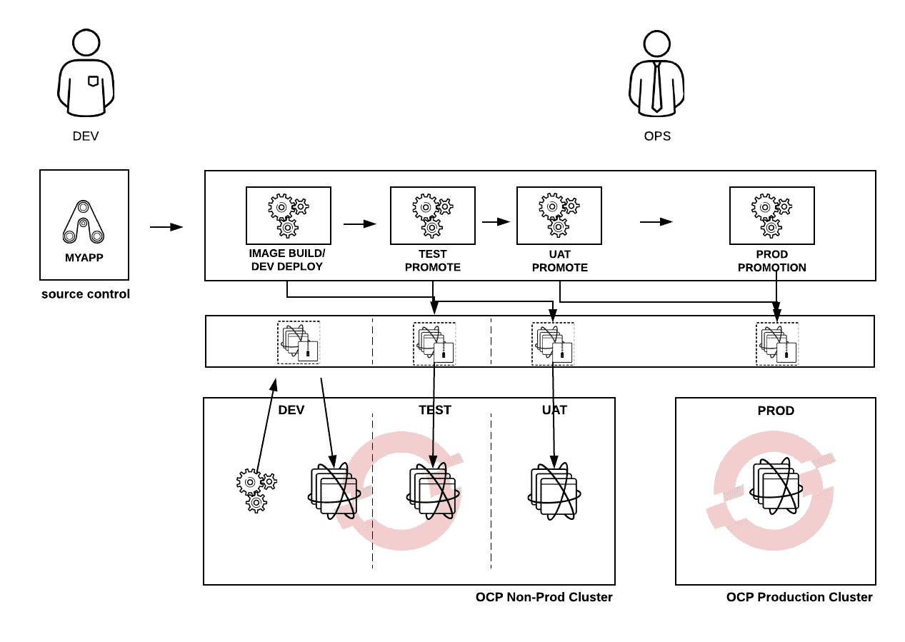

# 构建阶段

构建步骤包括构建容器映像所需的一切。尽管版本控制对于容器映像总是有效的，但是出于合规性的原因，其他部署工件(例如 jar 文件)也可能需要版本控制。管道所有者必须与发布策略所有者合作，以确保符合合规性要求。

构建 docker 映像有三种方式:

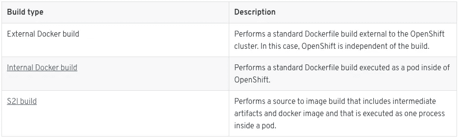

这些构建类型中的每一种都会产生期望的输出，但是有不同的优点和缺点。因为构建是尖峰类型的工作负载，所以内部 Docker 构建非常适合容器平台，在容器平台中，容量在构建结束时被返还给池。在 OpenShift 中运行构建可以提高整体环境效率。然而，在 OpenShift 内部运行构建会产生需要清除的垃圾(参见文档中关于[垃圾收集](https://docs.openshift.com/container-platform/3.9/admin_guide/garbage_collection.html)的章节)。

S2I 编译的主要优点是它们不需要学习 Dockerfile 语法。构建良好的 docker 形象是一项后天的技能，可能不值得花费成本来培训一个组织中的所有开发人员。另一个优点是 S2I 构建中的构建步骤不是以 root 权限运行的。另一个优点是，S2I 构建中的构建步骤按照用户在基础映像中定义的方式运行。这使组织能够控制构建的权限范围，同时仍然允许开发人员完全自助。

另一方面，因为 S2I 版本不是 Kubernetes API 的一部分，所以 S2I 版本不能跨基于 Kubernetes 的平台移植。尽管定制 S2I 过程是可能的，但是学习定制 S2I 构建会像学习如何正确构建 docker 映像一样耗时且复杂。

## 二进制版本

如果构建过程已经存在，并且目标是定制它以部署到 OpenShift，那么[二进制构建](https://docs.openshift.com/container-platform/3.7/dev_guide/builds/build_inputs.html#binary-source)是一个不错的选择。二进制构建使用前一步产生的工件作为 OpenShift 构建(docker 或 S2I)的输入。

## 詹金斯管道建设战略

可用的 OpenShift 构建类型集最近增加了 [Jenkins 管道构建策略](https://docs.openshift.com/container-platform/3.7/dev_guide/builds/build_strategies.html#pipeline-strategy-options)。Jenkins 管道构建是一种构建策略，它包括一种通过 API 调用从 OpenShift 内部触发 Jenkins 构建的机制。构建逻辑驻留在 Jenkins 中。

# 推广阶段

升级步骤用于将解决方案(由多个组件组成)部署到 SDLC 环境中。在 OpenShift 中，环境是驻留在集群中的项目。假设有一个表示解决方案的现有 OpenShift 模板，则使用以下命令执行部署:

```
oc process <template> ... | oc apply -f -
```

该命令将使用依赖于环境的模板参数(不要与依赖于环境的属性混淆)将模板实例化到目标环境，并将其应用于 OpenShift。

`apply`命令确定当前状态和新的期望状态之间是否有差异，如果有，将差异作为补丁应用到现有的 API 对象。因为现有的对象没有被销毁，所以相关的应用程序不会导致停机。

如果此时触发器处于活动状态，则开始新的部署。一般来说，应该仔细考虑部署的自动触发器。事实上，如果我们有一个管道编制器(如 Jenkins ),触发部署的逻辑应该驻留在编制器中。

## 推广策略

以下展示策略是可行的:

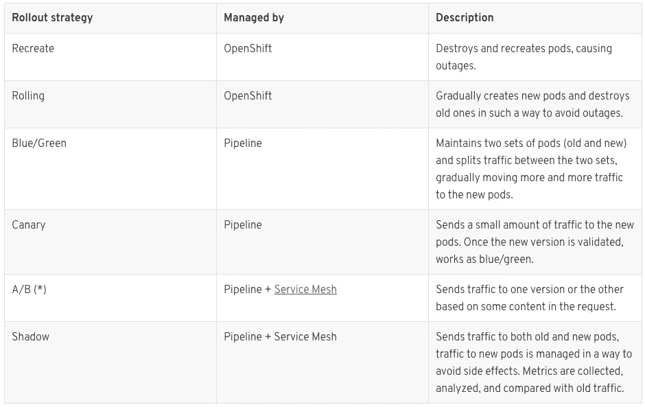

(*)注意:A/B 测试的定义不同于您可以在 [OpenShift 文档](https://docs.openshift.com/container-platform/3.7/dev_guide/deployments/advanced_deployment_strategies.html#advanced-deployment-a-b-deployment)中找到的定义。

部署策略特征

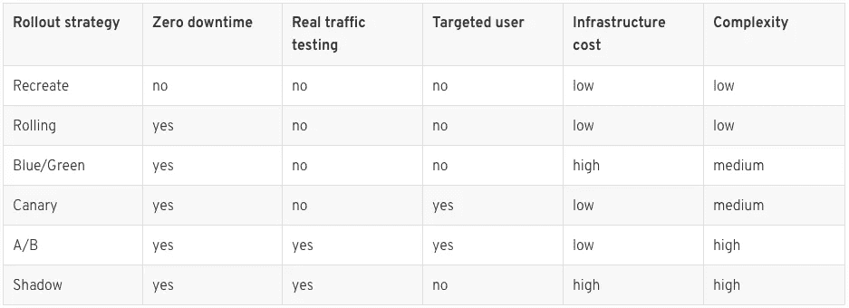

# 验证阶段

验证步骤往往是特定于组织的，并且在一定程度上反映了该组织所采用的开发方法。

验证步骤可以分为环境无关和环境相关。为了尽可能快地捕捉错误，应该在第一次部署之前执行与环境无关的步骤。相反，依赖于环境的步骤只能在解决方案部署后的环境中执行。

下表提供了独立于环境和依赖于环境的验证步骤的示例。

独立于环境的验证步骤:

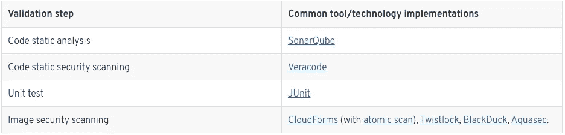

图像安全扫描是由容器技术引入的新步骤。它在安全漏洞方面确保图像的质量( [CVEs](https://en.wikipedia.org/wiki/Common_Vulnerabilities_and_Exposures) )
这个过程有两个方面:一方面我们需要扫描图像以确定其中是否有已知的漏洞，另一方面我们需要防止没有通过质量检查的图像作为容器运行。这种强制存在于流水线之外，并且可以通过[图像许可控制](https://docs.openshift.com/container-platform/3.7/admin_guide/image_policy.html)在 OpenShift 中进行配置。

图像扫描流水线步骤的例子可以在[这里](https://github.com/redhat-cop/openshift-image-signing-scanning)找到。

依赖于环境的验证步骤:

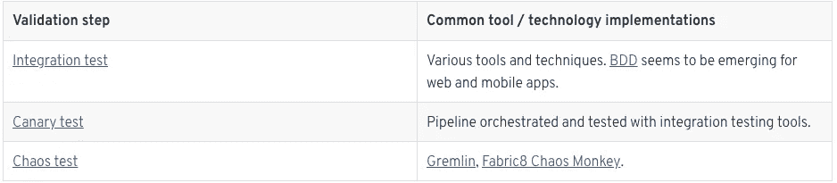

**行为驱动开发(BDD)** 测试是一个有价值的选项，应该用于测试 web 和移动应用程序。BDD 测试用例是使用伪自然语言([小黄瓜](https://github.com/cucumber/cucumber/wiki/Gherkin))创建的，允许非技术用户快速而容易地创建它们。测试用例在测试运行时被翻译成机器指令(一个流行的例子是[黄瓜](https://cucumber.io/))。
BDD 测试的一般架构如下图所示:

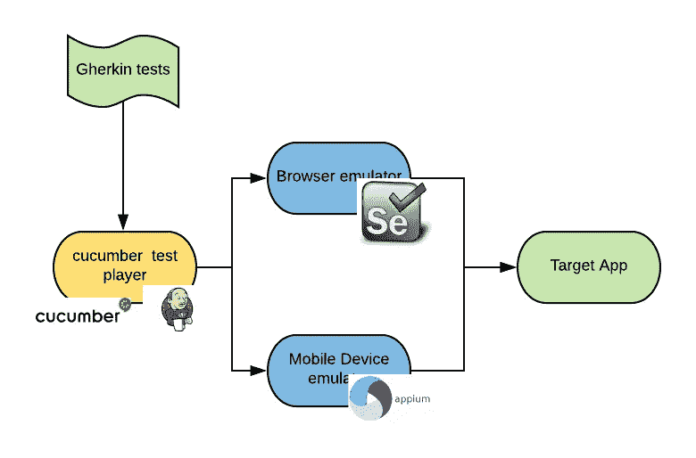

上述架构可以完全部署并包含在 OpenShift 中。浏览器/操作系统和移动设备/操作系统测试的多种组合可以并行执行。Windows 容器的出现将为测试在 Internet Explorer 和 Edge 上运行的应用程序提供额外的机会。

# 合规阶段

当管道必须遵从组织的发布过程和变更管理时，可能需要遵从步骤。

下表提供了合规步骤的示例:

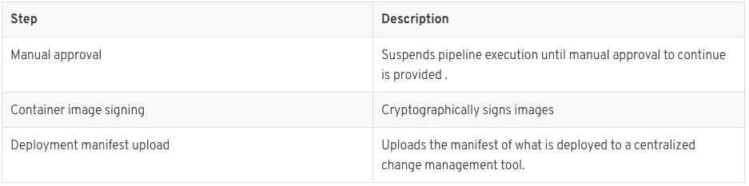

容器图像签名提供了一种使断言可加密验证的方法。当图像被签名时(一个可以赋予任何意义的事实，例如，图像被批准执行)，任何人都可以验证该断言。同样，拥有断言只是流程的一部分，位于管道之外的另一部分是拥有验证和执行断言的方法。[在这里](https://github.com/redhat-cop/openshift-image-signing-scanning)您可以找到一个带有容器映像签名步骤的管道示例。

Google 目前正在为部署管道开发一个更通用的断言框架(见 [Grapheas 和 Kritis](https://cloudplatform.googleblog.com/2017/10/introducing-grafeas-open-source-api-.html) )。

# 管道的所有权

确定组织中谁拥有发布过程、工具和管道是很重要的。对于传统的[位于 ITIL 的](https://en.wikipedia.org/wiki/ITIL)组织，通常有一个拥有发布过程的发布管理团队。该团队还可能拥有支持管道所涉及的工具，并且在某些情况下，拥有实际的管道。

所有与管道相关的方面都应明确定义所有权:

*   发布策略和合规性规则
*   模板和其他通用的可重用管道工件
*   支持管道所需的工具
*   独立管道

敏捷组织的当前趋势是让开发团队拥有他们特定应用程序的管道。在这种情况下，开发团队负责创建和更新管道，并确保管道符合企业发布的发布管理标准。

因为管道过程可以被描述为代码，开发者必须学习管道领域特定语言，否则学习曲线会很短。

更传统的组织可能不喜欢这种方法，因为他们希望在开发活动和部署任务之间有明确的职责分离。

# 指标和仪表板

可以从 CI/CD 管道中收集大量指标，如果没有收集指标并在仪表板中提供，管道的大部分价值都将丢失。DevOps 团队利用指标进行快速反馈。

有用的指标可能包括大量部署错误和总管道执行时间。

尽管目前没有很多工具可以提供管道指标，但一个值得研究的例子是来自 [Capital One](https://developer.capitalone.com/open-source/) 的[heagie ia](https://github.com/capitalone/Hygieia)。

下面的屏幕截图展示了一个管道仪表板:

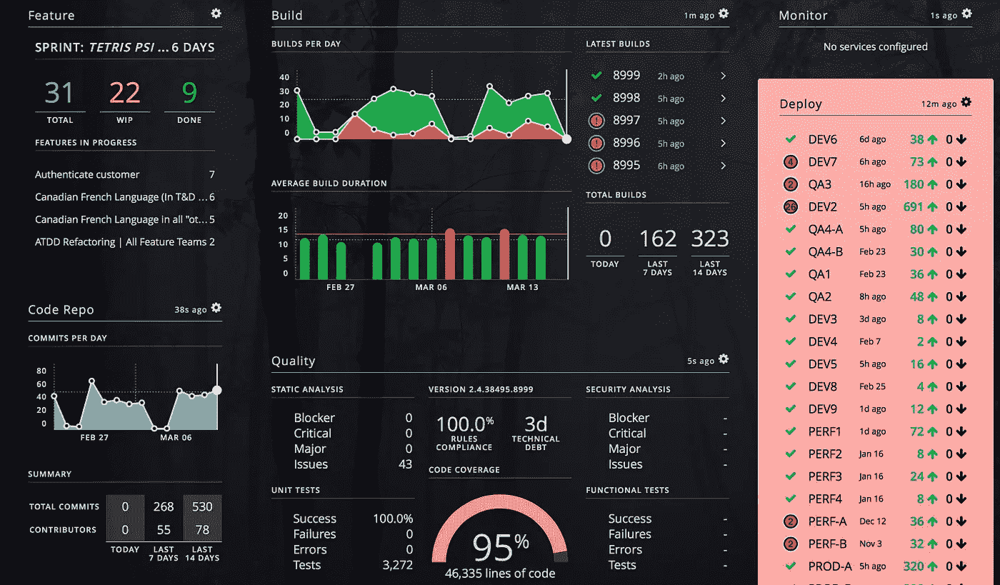

# 结论

本指南在 OpenShift 容器平台和 OCI 容器的上下文中描述了各种部署管道概念。不可变的基础设施和容器平台自动化不会改变持续交付的策略或目标，但是它们会影响管道的操作。可以调整管道阶段、类型和所有权的定义，以利用 OpenShift 行为。构建、升级、验证和合规步骤都可以受益于专为支持 CICD 而设计的 OpenShift 特性。管道指标和仪表板可以与 Kubernetes 集成，以提供关于部署自动化性能的有用反馈。我们建议使用这里描述的 OpenShift 自动化和集成可能性来增强您的部署管道，以提供快速、无摩擦、高质量的软件发布。