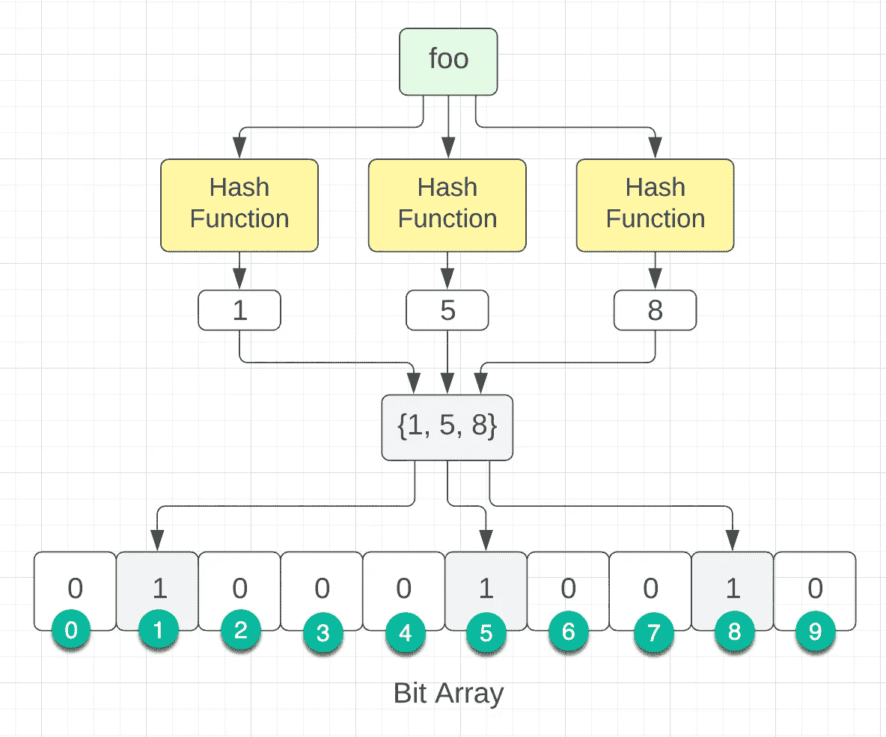

# ELI5:什么是布鲁姆过滤器？

> 原文：<https://levelup.gitconnected.com/eli5-what-the-f-is-a-bloom-filter-4a58a160833d>


# 目录

*   介绍
*   ELI5
*   解释:布隆过滤器
*   代码:Bloom filter vs Redis
*   概述
*   恶作剧

[布隆过滤器](https://en.wikipedia.org/wiki/Bloom_filter)是一种概率数据结构，用于测试一个元素是否是一个集合的成员。换句话说，一个 Bloom filter 可以让你知道，如果一组事物中存在某个事物，那么它是正确的几率非常高。

> **我**:布鲁姆滤镜，这袋糖果里是不是有一颗红色的糖果？
> **布鲁姆滤镜**:也许吧。

为什么要关心这个数据结构呢？**布隆过滤器可以消除高达 85%的磁盘读取**[【1】](https://www.semanticscholar.org/paper/Space%2Ftime-trade-offs-in-hash-coding-with-allowable-Bloom/f39a2c11983b21fd5054d5393614959bfbc4e50f)。在测试一个元素是否存在时，客户端在检查数据库之前首先查询 Bloom filters*，从而潜在地阻止了磁盘读取(因为数据库持久存储在磁盘上)。*

*好吧，但是谁会用布鲁姆滤镜呢？ [PostgreSQL](https://web.archive.org/web/20180909043421/https://git.postgresql.org/gitweb/?p=postgresql.git;a=commitdiff;h=9ee014fc899a28a198492b074e32b60ed8915ea9) ， [Google Chrome](https://web.archive.org/web/20101027012345/http://blog.alexyakunin.com/2010/03/nice-bloom-filter-application.html) ， [Bing](https://danluu.com/bitfunnel-sigir.pdf) ， [Google Cloud Bigtable](https://storage.googleapis.com/pub-tools-public-publication-data/pdf/68a74a85e1662fe02ff3967497f31fda7f32225c.pdf) ，不胜枚举。*

*但是在我们深入研究正式定义之前，我想通过一个简单的、非技术性的类比来解释 Bloom filters，从而实现我在标题中做出的承诺。*

**

*图一。我(布莱恩)*

*当谈到我们冰箱里的东西时，我的女朋友 Stacey 是我的布鲁姆过滤器。当我问她冰箱里有没有东西的时候，她会用以下任何一种说法来回答:*

*   *是的，在冰箱里。*
*   *是的，我想它在冰箱里。*
*   *不，百分之百不在冰箱里*

*当斯泰西说它在冰箱里的时候，她通常是对的，而且她的反应从来不会错。众所周知，从任何地方(如沙发、床、楼上)走到冰箱前都是*贵*。所以，我永远感激她，因为她大大减少了我去冰箱的次数。*

# *布鲁姆过滤器是如何工作的？*

**

*所以你正在考虑在你的技术栈中实现一个 Bloom filter。它是如何工作的？让我们来定义布隆过滤器的组件以及它们是如何协同工作的。*

# *算法描述*

*一个*空布隆过滤器*是一个 *m* 位的[位数组](https://en.wikipedia.org/wiki/Bit_array)，全部置 0。*

**

*m=10 的空布隆过滤器*

*还必须定义 *k* 个不同的[散列函数](https://en.wikipedia.org/wiki/Hash_function)，其中每个[将](https://en.wikipedia.org/wiki/Map_(mathematics))映射或散列一些集合元素到 *m* 数组索引之一。*

**

*单一散列函数，k=1*

*为了*添加*一个元素，将该元素提供给每个 *k* 哈希函数以获得 *k* 数组索引。将这些索引处的位设为 1。*

**

*具有三个散列函数的布隆过滤器，k=3*

*为了*向*查询一个元素(即测试它是否在集合中)，将该元素提供给每个 *k* 散列函数，以获得 *k* 数组索引。**如果*这些索引位的任一位*为 0，则该元素 100%不在集合**中；如果是的话，那么当它被插入时，所有的位都将被设置为 1。因此，布隆过滤器在确定元素是否是集合的成员时非常有效。*

*另一方面**，如果*在这些索引处的所有*位都是 1，那么要么该元素在集合中，要么这些位在插入其他元素**期间被设置为 1，导致[假阳性](https://en.wikipedia.org/wiki/False_positive)。*

*尽管布隆过滤器允许假阳性，但是作为回报，布隆过滤器提供了非常紧凑的存储:**对于 1%的假阳性概率**，每个元素需要少于 10 比特，而与集合[ [2](http://theory.stanford.edu/~rinap/papers/esa2006b.pdf) 中元素的大小或数量无关。*

# *带代码的 Bloom Filter vs Redis*

**

*由 [Vecteezy](https://www.vecteezy.com/free-photos) 提供的免费库存照片*

*如果您仍然不相信，让我们用 Python 将 Bloom filter 与 Redis 数据库进行比较，来完成一个实际的实现。*

# *布鲁姆过滤器测试用例*

*我使用 Python 内置库 **uuid** 和一个 list comprehension 生成了 1M new+unique id。*

```
*unique_ids = [uuid.uuid4() for i in range(0, 1_000_000)]*
```

*然后，我使用[**pybloomfiltermmap 3**](https://pypi.org/project/pybloomfiltermmap3)**库创建了一个新的 Bloom filter 实例。通过使用这个库，我们不必担心实现 *k* 散列函数。***

```
***bloom_filter = BloomFilter(capacity=1_000_000, error_rate=0.01, filename='filter.bloom')***
```

***接下来，我遍历 1M 个唯一 ID，检查该 ID 是否存在于 Bloom filter 中，不久之后，将该 ID 添加到 Bloom filter 中。如果一个 ID 存在(它不应该存在)，我会记下这个假阳性。***

```
***def get_bloom_filter_stats():
    start = time.time()
    false_positives = 0

    for i, element in enumerate(unique_ids):
        if element in bloom_filter:
            print(f'false positive for id={element} at index={i}')
            false_positives += 1

        # hashes element, and stores in bit array
        bloom_filter.add(element)

    elapsed_time = time.time() - start
    return {'execution_time': elapsed_time, 'false_positives': false_positives}***
```

***以下是 Bloom filter 测试的一些统计数据。请注意，实际错误率不到 1%,执行时间< 500ms.***

```
***## Bloom Statistics ##
emulated_requests: 1,000,000
false_positives: 1,838
expected_error_rate: 1.00%
actual_error_rate: 0.1838%
bloom filter file_size: 1.14MB
Bloom execution_time: 482ms***
```

# ***Redis Test Case***

***Now, let’s see how Redis performs with the same 1M key lookups. I started by creating a Redis instance of my local Redis server.***

```
***redis_client = StrictRedis().from_url('redis://localhost:6379')***
```

***Then, I iterated through the same 1M unique IDs, taking note of the elapsed time.***

```
***def get_redis_execution_time():
    start = time.time()
    for element in unique_ids:
        redis_client.get(str(element))
    elapsed_time = time.time() - start
    return elapsed_time***
```

***Redis took 31 seconds (!) to iterate through the entire list of IDs, compared to a Bloom filters execution time of 482 milliseconds. I did not test a SQL database since Redis is generally faster (in-memory vs disk). **极快，这意味着对于键存在检查，Bloom filter 至少比 SQL 数据库**快*63 倍。****

***当然，也有一些权衡:误报和布隆过滤器文件大小(大约 1MB/1M 记录)。然而，错误率低于 1%且占用空间如此之小，这绝对*值得。****

***如果你有兴趣看完整的代码片段，可以在这里找到:[https://github . com/bryangalindo/bloom filter-example/blob/main/main . py](https://github.com/bryangalindo/bloomfilter-example/blob/main/main.py)。***

# ***概述***

***感谢阅读！以下是这篇文章的一些要点。***

*   ***一个*空的*布隆过滤器是一个 *m 个*位的[位数组](https://en.wikipedia.org/wiki/Bit_array)，全部设置为 0。***
*   ***为了确认一个元素是否不存在，一个元素的散列集至少需要*一个映射到 0 位索引的值。****
*   ***如果一个元素的散列集合包含所有的值都映射到 1 位索引，那么要么该元素在集合中，要么在插入其他元素时这些位被设置为 1。***
*   ***布隆过滤器允许假阳性，但是假阳性的概率可以小于 1%。***

# ***一个很短的测验***

******

***由 [Vecteezy](https://www.vecteezy.com/free-photos) 提供的免费库存照片***

# *****问题 1*****

***布隆过滤器中的哪些元素(foo、bar、baz)是**不是**？***

******

***答案:Foo，Bar，Baz***

# *****问题 2*****

***一个新元素， *qux* ，出现了一个散列集{1，5，9}。***

***如果我们要检查元素 *qux* 是否存在于集合中，哪个布隆过滤器(A，B，C)会返回一个**误报**？***

******

***答:答***