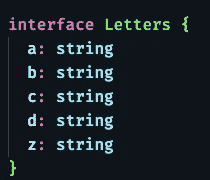
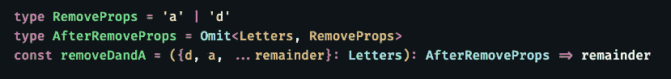
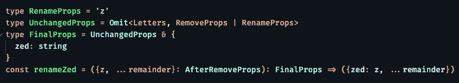
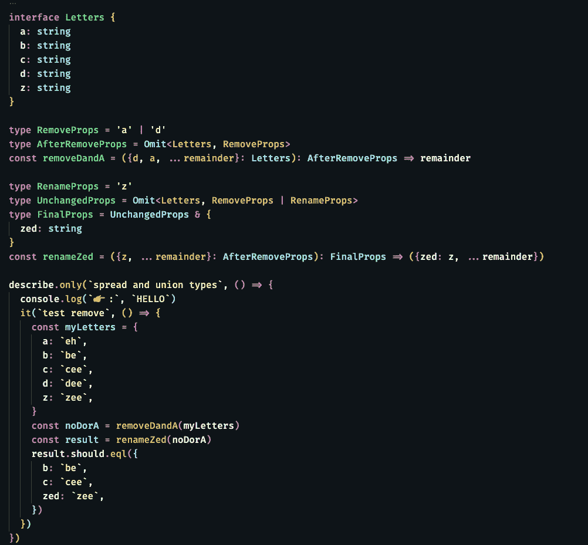

# 省略 TypeScript 中的属性

> 原文：<https://levelup.gitconnected.com/eliding-properties-in-typescript-b170cd83ee09>

## [JavaScript 和类型脚本提示](https://gentille.us/typescript-tips-b74925485b78?sk=4c9067cf57be6406abc26e44cb7fb872)

除了重命名之外，有时还需要删除属性并将这些更改合并到一个新对象中。

是时候拿出大扳手，打开一些属性了

在上一篇文章中，我们研究了如何重命名一个对象的属性。如果你还没有读过这篇文章，那么它将成为你这次旅程的一个更合理的起点。

当你需要以新的方式使用已存在的对象时，总会有一些麻烦制造者，你不想把他们带到旅途中。我们一会儿将深入研究如何正确地输入所有内容。同时，让我们假设在我们的`Letters`对象上还有一些属性。

扩展的(来自最后一篇文章)字母类型

这一次，我们不仅想将`z`重命名为`zed`，还想删除`a`和`d properties.`。下面是删除代码行:

剥离不需要的属性

我们显式地将不需要的属性剥离到胖箭头函数的未使用参数中，然后使用 *rest* 操作符收集剩余的属性并返回它们。这本身就很有用，但是当你试图找到一种简单的方式来输入所有内容时，事情就变得更有趣了。

当我第一次定义要操作的属性，然后定义我想要的最终类型时，键入对我来说更直观。

类型，以及先前粗箭头函数的类型化版本

这个代码片段还使用了 union 运算符。我们取`a`和`d`的并集，并从`AfterRemoveProps.`中省略它们。函数现在是完全类型化的。它接受`Letters` 并返回一个符合`AfterRemoveProps` 类型的对象。如果您将鼠标悬停在使用 VS 代码的类型上，您会看到它包含了`b`、`c`和`z`的属性。

现在，让我们结合上一篇文章中的重命名，并将两个操作合并成我们想要的结果。重命名是相同的，但是类型发生了变化。

使用新的传入类型和返回类型

我不再传入`Letters` 型，而是我们新的`AfterRemoveProps`型。为了清楚起见，我在这里创建了一个名为`UnchangedProps.`的临时类型，它省略了所有三个属性，`a,` `d,`和`z.`，它再次通过使用两个类型的联合来做到这一点。`UnchangedProps`只有`b`和`c.`的属性。我们将返回的最后一个对象也有`zed`属性，所以我们使用`&`操作符来创建包含`b`、`c`和`zed.`的`FinalProps`类型

这是一个包含所有代码的测试。

带测试的最终代码

如果您想测试您的理解，请颠倒顺序，重写代码，首先进行重命名，最后删除属性。

*本文显示的代码是 GitHub* *中可用的* [*。*](https://github.com/Rolias/blog-posts/blob/b779109c183cb4dc7fcdf86d2bdc8434808c9174/src/spread-rename/spread-delete-rename.test.ts)

还有更多 [JavaScript 和 TypeScript 技巧文章](https://gentille.us/typescript-tips-b74925485b78?sk=4c9067cf57be6406abc26e44cb7fb872)。

平静地编码。