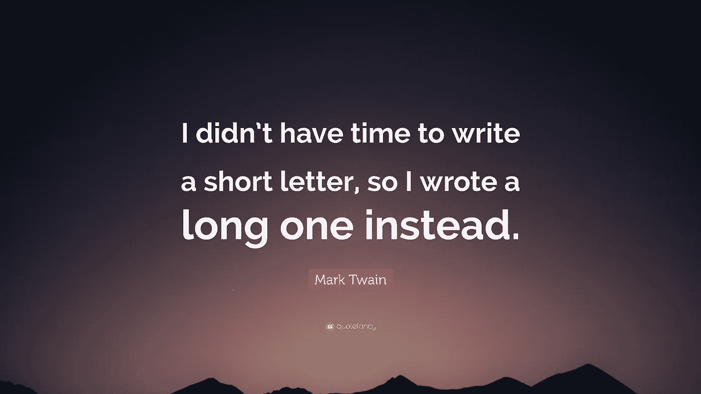

# 抛弃 switch 语句，获得更好、更干净的代码。

> 原文：<https://levelup.gitconnected.com/eliminate-the-switch-statement-for-better-cleaner-code-7e3b39383b7a>

我最近写了关于 JavaScript 选项，当我们需要一个条件语句时，我的 React 应用程序中有真实的使用示例，你可以在这里阅读。

如果我必须给 JavaScript 提供的所有条件选项打分，我想我会把三元运算符放在列表的最上面，把 switch 语句放在最下面(最好是在海洋的最下面)。我不太确定厌恶感来自哪里。作为一个编码者，这是我已经习惯不喜欢的重复吗？是机器人语法吗？

我非常喜欢干净、优雅、简洁的代码，switch 语句一点也不。我是来帮你丢掉开关的。

唉，这似乎是处理需要多重评估的情况的唯一选择。当然，你可以简单地使用一个巨大的 if…else if…else if…etc 语句链，但这只会让你看起来像个新手。我在这里给你一个更优雅的解决方案。这是写给所有像我一样以一千个太阳的热情憎恨 switch 声明的同行们的。对于那些不太介意 switch 语句，但总是在寻找使代码更简洁、可读性更好、可维护性更高的技巧的人来说，也是如此。

进入 ***对象字面查找。***

让我们看看我最近的 React 应用程序中的一个例子。我将包含完整的非缩写函数，这样您就可以看到替代方法有多好。事实上，所需的情况越多，使用对象文字查找代替 switch 语句可以节省的时间就越多。

这里有一个函数，在用户按下“Enter”后，我使用一个 switch 语句将光标移动到表单上的下一个输入字段。

这个功能没有问题。我只是觉得 48 行代码太冗长了(我没有计算第 2 行的注释)。

是谁说“我没有时间写一封短信，所以我写了一封长信”？

啊，是的，马克·吐温。用更少的文字很好的表达自己，更有挑战性。当我只有有限的时间来交付有用的东西时，我总是会想起这句话。它通常不像我希望的那样简洁，但它确实起了作用。当我有更多的时间时，我会写一个更精简的版本。

有人可能会说，我们可能会**抛弃 break 关键字**并简单地在每个案例之后返回，这本身会将我们的代码削减到 34 行。

但是我们可以做得更好，事实上要好得多。

编写简洁的代码需要时间，但它将在未来为您节省大量时间，并且看起来更好。

你看看这个！*我们已经设法把它从* ***的 34 行*** *的代码删减到* ***的 18 行！***

我们简单地把所有的事例放在一个对象中，其中事例(条件)是指向我们想要的输出值的一个键。

对象查找速度很快，随着对象大小的增加，查找速度会变得更快，将数据表示为键值对对于条件执行来说是非常好的。

更不用说，它只是看起来更易读，抛光，和完善。

如果您有任何问题或意见，请随时联系我们。

我喜欢学习和帮助他人学习。