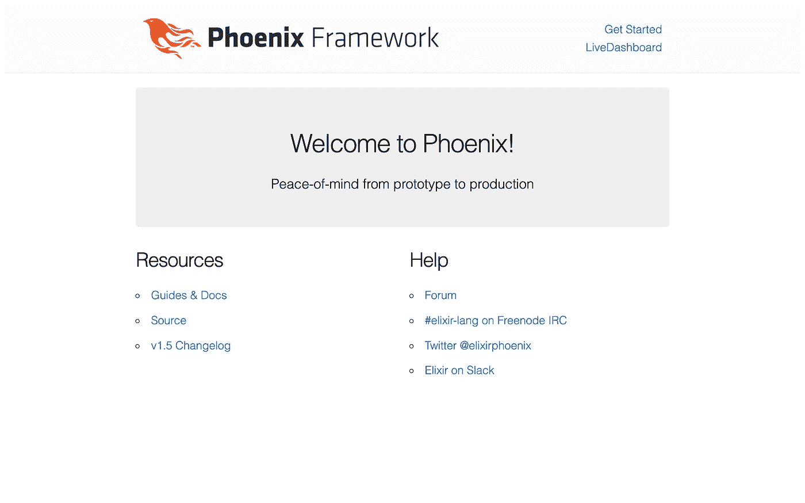
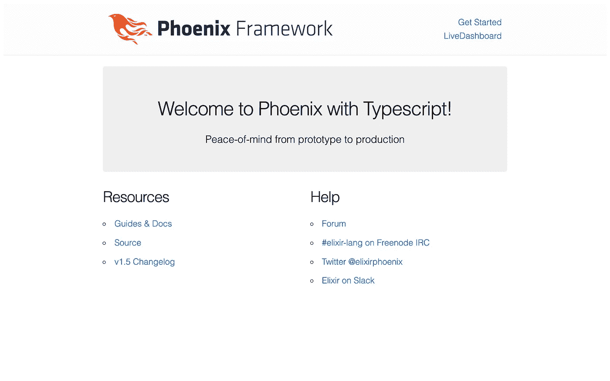
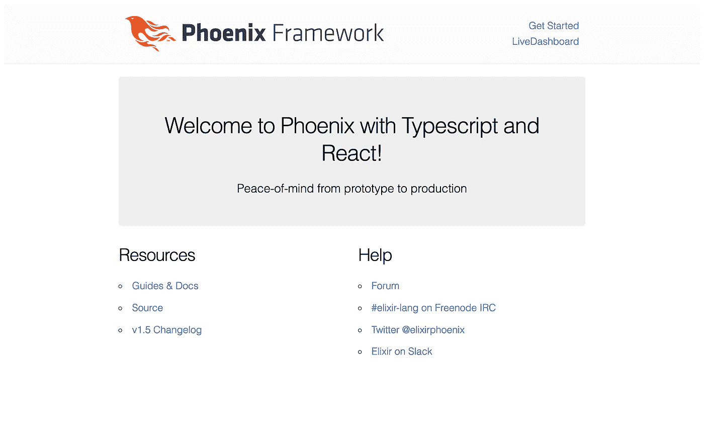

# 灵药，凤凰，打字稿，和反应-2020 年版

> 原文：<https://levelup.gitconnected.com/elixir-phoenix-typescript-and-react-2020-edition-32ceb753705>

## 构建现代 Web 应用程序堆栈的最新指南

*这是我之前指南的更新版，发表于 2019 年 12 月* [*日 DEV.to*](https://dev.to/aisrael/elixir-phoenix-with-typescript-and-react-december-2019-edition-39l4) *。*

Github 上也有代码:[aisrael/elixir-phoenix-typescript-react](https://github.com/aisrael/elixir-phoenix-typescript-react)

虽然基本方法保持不变，但有人在我的回购协议上提交了一张罚单，要求将其升级到 Phoenix 1.5。

我没有采用早期的代码库并将其升级到 Phoenix 1.5(我已经为其他几个项目成功地做到了这一点)，而是决定更新 2020 年的原始文章。

让我们回到正题。

# **先决条件**

本指南假设您已经进行了以下设置:

*   **仙丹** (1.10.3)，这意味着你还需要
*   二郎
*   **npm** (@6.14.5)
*   git(不是真的需要，但无论如何你都会想要)
*   **Docker Compose** (用于运行 PostgreSQL)

如果你还没有 Elixir(和 Erlang)，我强烈推荐使用 [asdf](https://asdf-vm.com/) 来管理 Elixir/Erlang 版本。

根据您平台的说明安装`asdf`，然后使用`asdf`安装 Erlang 和 Elixir:

```
$ asdf plugin add erlang
$ asdf install erlang 23.0.2
$ asdf global erlang 23.0.2$ asdf plugin add elixir
$ asdf install elixir 1.10.3
$ asdf global elixir 1.10.3
```

## **凤凰**

(如果您已经有了使用 Elixir Phoenix 应用程序的经验，您可能希望直接跳到 Typescript 和 React 部分。)

如果您还没有这样做，让我们按照 [Phoenix 安装说明](https://hexdocs.pm/phoenix/installation.html)安装 Phoenix。

首先，我们需要获得十六进制软件包管理器:

```
$ mix local.hex
Are you sure you want to install "[https://repo.hex.pm/installs/1.10.0/hex-0.20.5.ez](https://repo.hex.pm/installs/1.10.0/hex-0.20.5.ez)"? [Yn] y
* creating /Users/aisrael/.asdf/installs/elixir/1.10.3/.mix/archives/hex-0.20.5
```

然后是酏剂混合存档:

```
$ mix archive.install hex phx_new 1.5.3
Resolving Hex dependencies…
Dependency resolution completed:
New:
phx_new 1.5.3
* Getting phx_new (Hex package)
All dependencies are up to date
Compiling 10 files (.ex)
Generated phx_new app
Generated archive "phx_new-1.5.3.ez" with MIX_ENV=prod
Are you sure you want to install "phx_new-1.5.3.ez"? [Yn] Y
* creating /Users/aisrael/.asdf/installs/elixir/1.10.3/.mix/archives/phx_new-1.5.3
```

您可以使用`mix phx.new --version`检查 Phoenix 安装是否顺利:

```
$ mix phx.new --version
Phoenix v1.5.3
```

# **生成凤凰 app**

```
$ mix phx.new hello_react --umbrella
```

这会在当前目录下生成名为`hello_react_umbrella`的仙丹+凤凰[伞 app](https://elixir-lang.org/getting-started/mix-otp/dependencies-and-umbrella-projects.html) ，目录结构如下:

```
.
├── apps
│ ├── hello_react
│ └── hello_react_web
├── config
└── deps
```

这两款灵药应用分别是`/apps/hello_react`和`apps/hello_react_web`。

每个应用程序都有自己的依赖配置，尽管整个保护伞项目将为所有应用程序提供一个共享的依赖库(在`/deps`中)。

所有子应用程序也在`/config`文件夹中共享相同的根配置。

我们从伞状应用程序开始，因为随着应用程序变得越来越大和越来越复杂，它使组织代码变得更容易。此外，我们发现将一个伞状应用程序项目重构为一个单独的应用程序项目比反过来更容易。

## **PostgreSQL，MySQL，或者`** `**— no-ecto**` **`**

默认情况下，Phoenix 的数据库使用 PostgreSQL。

如果您想使用 MySQL 而不是 PostgreSQL，那么您需要使用

```
mix phx.new hello_react --umbrella --database mysql
```

如果你不需要一个数据库，或者只希望在没有数据库的情况下使用，那么使用

```
mix phx.new hello_react --umbrella --no-ecto
```

然而，本指南的其余部分假设缺省值为 Postgres。

## **Git**

此时，我们应该开始使用 Git 来跟踪我们的更改。如果您不需要使用 Git，请随意跳到下一节。

```
$ cd hello_react_umbrella
~/hello_react_umbrella$
```

然后

```
$ git init
Initialized empty Git repository in ~/hello_react_umbrella/.git/
$ git add -A
$ git commit -m “mix phx.new hello_react --umbrella”
```

## **Docker 撰写**

由于我们将需要一个 PostgreSQL 服务器来运行我们的 Phoenix 应用程序，为了本地开发和测试的目的，我们发现使用 Docker，特别是 Docker Compose 可以轻松处理服务依赖。

在项目根中创建下面的`docker-compose.yml`:

```
version: "3"
services:
  postgres:
    image: postgres:11.5
    ports:
      - 5432:5432
    environment:
      POSTGRES_USER: postgres
      POSTGRES_PASSWORD: postgres
      POSTGRES_DB: hello_react_dev
```

注意，我们配置 PostgreSQL(使用`POSTGRES_*`环境变量)来处理生成的 Phoenix 应用程序默认值。

然后，要在后台运行 Postgres，您只需要:

```
$ docker-compose up -d
Creating network "hello_react_umbrella_default" with the default driver
Creating hello_react_umbrella_postgres_1 ... done
```

由于 Docker 编写超出了本文的范围，对于其他 Docker 编写命令，请访问:

*   [https://docs.docker.com/compose/reference/overview/](https://docs.docker.com/compose/reference/overview/)

如果您不能或不想使用 Docker & Docker Compose，您将不得不在本地工作站上手动安装 PostgreSQL。确保使用由`mix phx.new`生成的相同默认值对其进行配置，或者使用适当的凭证修改各自的`config/*.exs`文件。

## **节点**

在运行 Phoenix 应用程序之前，我们需要使用`npm install`初始化生成的 CSS 和 Javascript 资产:

```
~/hello_react_umbrella$ cd apps/hello_react_web/assets
~/hello_react_umbrella/apps/hello_web/assets$ npm install
```

## **欢迎来到凤凰城！**

此时，我们应该能够运行我们的 Phoenix 应用程序了。从项目根目录(您可能希望在新的终端窗口或标签中运行):

```
$ mix phx.server
```

(如果你得到一个询问你是否要安装`rebar3`的提示，就直接说是。)

现在，如果我们访问 http://localhost:4000 ，我们应该能够看到熟悉的“欢迎来到凤凰城！”页面:



# **打字稿**

我们准备开始向前端添加 Typescript。

首先，确保我们回到了`apps/hello_react_web/assets/`。使用以下命令添加类型脚本库:

```
$ npm install --save-dev typescript ts-loader source-map-loader [@types/phoenix](http://twitter.com/types/phoenix)
```

## `**Typescript Configuration**`

然后，让 Typescript 为我们生成一个默认的`tsconfig.json`:

```
$ ./node_modules/.bin/tsc --init
message TS6071: Successfully created a tsconfig.json file.
```

我们需要对 Typescript 默认设置进行一些更改。下面是一个最小的`tsconfig.json`，做了一些必要的修改:

```
{
  "compilerOptions": {
    "target": "es5",
    "module": "ESNext",
    "allowJs": true,
    "jsx": "react",
    "outDir": "./dist/",
    "strict": true,
    "esModuleInterop": true,
    "forceConsistentCasingInFileNames": true
  },
  "exclude": [
    "/node_modules/**/*",
  ]
}
```

## **配置 Webpack**

接下来，我们需要告诉 Webpack 识别`.ts`文件和`.js`文件:

打开`apps/hello_react_web/assets/webpack.config.js`，将第一个模块规则改为:

```
 rules: [
      {
        test: /\.(j|t)s$/,
        exclude: /node_modules/,
        use: [
          {
            loader: "babel-loader"
          },
          {
            loader: "ts-loader"
          }
        ]
      },
```

此外，在`"module"`后添加一个最外面的`"resolve"`键，如下所示:

```
 resolve: {
    extensions: [".ts", ".js"]
  },
```

## **app.js**

当我们生成 Phoenix 应用程序时，它用一行`import css from "../css/app.css";`创建了`apps/hello_react_web/assets/js/app.js`。

当 Typescript 解析该文件时，这会导致问题。你可以在[这个堆栈溢出问题](https://stackoverflow.com/questions/41336858/how-to-import-css-modules-with-typescript-react-and-webpack)和这个[页面](https://medium.com/@sapegin/css-modules-with-typescript-and-webpack-6b221ebe5f10)上看到一个冗长的讨论和几个解决方法。

在继续之前，解决这个问题的最简单(虽然不是最好的)方法(这样 Webpack 将继续处理我们的`app.css`)是将该行改为使用`require`:

```
const _css = require("../css/app.css");
```

由于我们实际上并不使用该变量(我们只需要它以便 Webpack 可以正确地生成我们的`app.css`文件)，我们在它的名称前加上一个下划线，以抑制 Typescript 否则会发出的“未使用的变量”警告。

## 欢迎来到凤凰城！

为了实际演示 Typescript，我们将创建一个新的 Typescript 模块`apps/hello_react_web/assets/js/hello.ts`:

```
function greet(name: string): string {
  return "Welcome to " + name + " with Typescript!";
}export default greet;
```

然后，在`assets/js/app.js`的末尾添加以下几行:

```
import greet from "./hello";document.querySelector("section.phx-hero h1").innerHTML = greet("Phoenix");
```

在`localhost:4000`刷新页面，您应该会看到“欢迎来到 Phoenix with Typescript！”。



# 反应

让我们按照指南继续添加 React roughly，网址为:[https://www.typescriptlang.org/docs/handbook/react-&-web pack . html](https://www.typescriptlang.org/docs/handbook/react-&-webpack.html)

首先，添加必要的包:

```
$ npm install --save react react-dom
$ npm install --save-dev [@types/react](http://twitter.com/types/react) [@types/react-dom](http://twitter.com/types/react-dom)
```

我们再次需要重新配置`webpack.config.js`。

首先，我们来认识一下`*.jsx`和`*.tsx`文件:

```
 rules: [
      {
        test: /\.(j|t)sx?$/,
        exclude: /node_modules/,
```

另外:

```
 resolve: {
    extensions: [".ts", ".tsx", ".js", ".jsx"]
  },
```

## **我们的第一个组件**

首先让我们将`apps/hello_react_web/assets/js/hello.ts`重命名为`apps/hello_react_web/assets/js/hello.tsx`(类似于如何从普通的`.js`中命名 React JS 文件`.jsx`):

```
$ mv apps/hello_react_web/assets/js/hello.ts apps/hello_react_web/assets/js/hello.tsx
```

然后，将`hello.tsx`的内容替换为:

```
import React from "react";interface GreeterProps {
  name: string;
}const Greeter: React.FC<GreeterProps> = (props: GreeterProps) => {
  const name = props.name;
  return (
    <section className="phx-hero">
      <h1>Welcome to {name} with Typescript and React!</h1>
      <p>Peace-of-mind from prototype to production</p>
    </section>
  );
};export default Greeter;
```

## **欢迎来到 Phoenix with Typescript and React**

接下来，在`apps/hello_react_web/lib/hello_react_web/templates/page/index.html.eex`中，移除该部分:

```
<section class="phx-hero">
  <h1><%= gettext "Welcome to %{name}!", name: "Phoenix" %></h1>
  <p>Peace-of-mind from prototype to production</p>
</section>
```

替换成简单的:

```
<div id=”greeting”></div>
```

然后，在`apps/hello_react_web/assets/js/app.js`中，将最后几行替换为:

```
import React from "react";
import ReactDOM from "react-dom";import Greeter from "./hello";const greeting = document.getElementById("greeting");
ReactDOM.render(<Greeter name="Phoenix" />, greeting);
```

最后(您可能需要使用`mix phx.server`重启 Phoenix，并等待几秒钟让 Webpack 编译所有内容)，当我们重新加载`localhost:4000`时，我们应该看到“欢迎使用 Typescript 和 React 来到 Phoenix！`



现在，您已经准备好使用最现代、最高效的 Web 应用程序堆栈来构建您的下一个 unicorn Web 应用程序。

在未来，我希望通过添加一个 React UI 框架和一篇关于如何将 GraphQL 添加到 Phoenix + React 应用程序的文章来阐述这一点。

[](https://skilled.dev) [## 编写面试问题

### 掌握编码面试的过程

技术开发](https://skilled.dev)