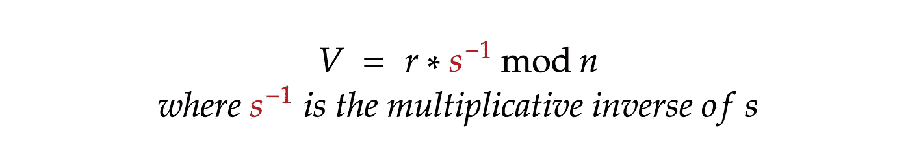

# 椭圆曲线和 ECDSA:从头开始用比特币签署交易的所有知识

> 原文：<https://levelup.gitconnected.com/elliptic-curves-and-ecdsa-from-understanding-the-concept-to-signing-a-transaction-in-bitcoin-dd07851fe0a8>

椭圆曲线非常简单。在其属性之上工作的椭圆曲线数字签名算法(ECDSA)在大多数区块链中使用，如比特币、以太坊等。，而且更简单。但是在互联网上找到一个好的解释并把所有的部分组合在一起是很有挑战性的。但是在这里！在本文中，我们将。

我们将逐一介绍理解和实现该算法所需的所有概念。到本文结束时，我们将从零开始拥有一个功能完整的演示程序**，它可以从**私钥**中提取**公钥**，**对**消息进行签名，**验证**签名是否正确。这个实现将**仅**使用本文中描述的概念。此外，它只需要不到 100 行代码。**

**这篇文章主要针对像我这样的开发人员，他们希望最终理解 ECDSA，但是它对其他人也非常有用。它只需要知道中学数学。**

**我强烈建议一步一步来。如果你愿意，你可以拿起一张纸和一支笔，重复本文中的所有步骤。那就更好了！如果你不是程序员，你可以忽略一些代码。如果你是，我建议你自己重新写代码，练习！**

**文章由 6 个部分组成；每一部分都使用了前几部分的概念(第 2 部分除外):**

*   **I:椭圆曲线的本质**
*   **II:有限域的本质**
*   **III:有限域上的椭圆曲线**
*   **四:信息技术的实际应用:ECDSA**
*   **五.实施**
*   **VI:现场演示**

**从这里开始吧！**

# **第一部分:椭圆曲线的本质**

**我们可能都很熟悉坐标网格上的那些图，其中 **y** 变量以某种方式依赖于 **x** 。比如 **y = x** 、 **y = x** 等等。最有可能的是，我们都有一些这方面的经验。让我们来看看它们:**

****

**椭圆曲线的方程没有太大的不同！它的形式为 **y = x + a*x + b** 。什么是 **a** 和 **b** ？只是一些任意的常数。我们来看看用 **a = 0** ， **b = 7** 是什么样子，就像比特币曲线里一样:**

****

# **它有以下三个非常重要的特性，所有的东西都是基于这三个特性工作的:**

> **这就是为什么很难理解**的原因。你甚至会觉得这是一些语无伦次，不着边际的东西。但是请相信我。这些性质将导致我们一个非常惊人的结果！但是现在让我们假装我们只是在没有目的地玩。****

1.  ***椭圆曲线沿着 **x 轴对称。意思是对于曲线 A 上的任意一点，我们可以通过简单的镜像它的 y 坐标得到它的镜像点，叫做-A:*****

******

***2.如果我们通过**不在垂直线**上的任意两点画一条线，它将 [**与**](https://www.youtube.com/watch?v=6eZQu120A80) 曲线恰好在多一点相交！
通过 **A** 和 **B** 点画一条线，称第三点为 **— C** 。那么，我们来反映一下得到要点 **C** :***

******

***另一个例子:***

******

*****这个 C 点叫做 A 和 B 的和，所以 A+B = C*****

***3.如果我们通过曲线上的任意点**和**画一条**切线** **线**，它将与曲线在**恰好相交一点**。我们将称这个点为**——2A。**我们已经知道如何得到 **2A** :***

******

***思考切线最简单的方法是想象它与一个点相交两次。好像它不是在两点而是在三点与曲线相交:A，A，-2A。***

## ***就是这样！我们在椭圆曲线上定义了三种数学运算:将一个点乘以-1，将两个点相加，以及将一个点加倍。***

## ***这里是椭圆曲线代数开始工作的地方。***

***现在我们有了下图，图中有点 **A** 、 **2A** 、 **-2A** :***

******

***让我们通过 **A** 和 **2A** 画一条线。我们将得到的第三个点是 **-3A** 。然后只要反映出来就可以得到 **3A** :***

******

***你可能还不明白我们为什么要做这一切。再看一步就好了。如果我们试着在 **3A** 和 **-2A** 之间画一条线会怎么样？***

******

*****你看到魔法了吗？**通过在 **3A** 和 **-2A** 之间画一条线，我们得到了 **-A** 点，它是我们最初的 **A** 点沿 x 轴的反射！***

## ***我们刚刚在上面三个子句中定义的是椭圆曲线代数。***

***试着理解这三种运算的威力:本质上，现在我们可以对曲线上的点进行运算，就好像它们不是点，而是数字一样！***

***我们**能用曲线上的点做什么:*****

*   ***加两分 **(A + B)*****
*   ***两点相减 **A — B** = **(A + (-B))*****
*   ***一个点的加倍(乘以二) **2*A*****
*   *****乘以任意整数(将前面的运算组合在一起，可以得到任意整数*点)*****

***我们**不能**做的事情:***

*   ***两点的乘法***
*   ***一点除以另一点***
*   *****点除以标量值*****

***比如得到**10A**:
2A = A+A
4A = 2A+2A
8A = 4A+4A
10A = 8A+2A***

***值得注意的是，计算可能需要对数数量的运算。所以计算**n *点**所需的大概运算量是 **O(log2(n))** ！***

## ***最终我们可以把一个点乘以任意一个整数，但是没有办法把整数取回来！这是它的要旨！这就是椭圆曲线非常适合密码学的原因。它适用于无限大的数字。***

## ***目前唯一的缺点是需要画出来。但是当然，有一些数学公式可以用来反映一个点，用于加法，以及用于将一个点加倍:***

1.  *****将一个点乘以-1** 。如果我们有一个点 **A(x，y)，**我们可以很容易地通过把它的 **y** 坐标乘以 **-1 得到
    - **A** 。** -A(x，-y)。**举例:
    -1 * A(2，2) → -A(2，-2)
    -1 * A(1，-1) → -A(1，1)
    -1 * A(5，8) → -A(5，-8)
    -1 * A(5，-8) → -A(5，8)*****

*****2。把两点加在一起。**我们可以把两个点加在一起，但有一个条件:它们不应该位于一条垂直线上(它们的 x 坐标不应该相等)。这是 **A** 和 **B (A + B = C)** 相加的公式:***

******

*****3。自身加一个点**(一个点乘以 2)。这与添加两个点的操作非常相似，但略有不同:***

******

## ***就是这样！该练习了！***

***让我们尝试在这里添加 A 和 B(让我们在逗号后使用 3 点的近似值):***

******

***根据上面定义的用于添加两个点的公式，***

******

***现在让我们用图解法找到我们的点:***

******

*****管用！**是的，有一个小的邻近问题，因为四舍五入。但是很管用！
为了更好地理解，我建议您尝试自己执行所有这些操作。***

## ***这就是我们需要知道的关于椭圆曲线和我们需要能够在其上执行的操作的全部内容！***

***一切都很好，但是我们还需要几个属性来构建一个加密系统。***

# ***第二部分:有限域***

***我们不需要研究关于[有限域](http://web.stanford.edu/~marykw/classes/CS250_W19/readings/Forney_Introduction_to_Finite_Fields.pdf)的一切。这里我们所需要的是理解几个基本的性质来继续前进，并且能够在有限域的某个“代数”上操作。***

***听说过**模数**运算吗？如果你是一名程序员，你可能会这样做。这只是对除法的**提醒，在编程语言中，通常表示为 **%** (或 **mod** )运算符。例如:*****

*****2 mod 11 = 2
10 mod 11 = 10
11 mod 11 = 0
13 mod 11 = 2
14 mod 11 = 3*****

***如果我们尝试从 **0** 到 **33 mod 11** 的数字，我们会得到这些数字:
0，1，2，3，4，5，6，7，8，9，10，0，1，2，3，4，5，6，7，8，9，10，0***

***它像时钟一样工作。`We can call it a finite field of order 11`。***

## ***我们只需要知道四个属性:***

1.  ***乘法的顺序并不重要。
    **a **b **c**mod n**与**(**a**mod n)*(**b**mod n)*(**c**mod n)**与**(**a * b**mod n)***c**mod n .
    相同
    同:(**6 * 7**mod 11)***8**mod 11 =(**42**mod 11)***9**mod 11 =**9 * 8**mod 11 =**72**mod 11 =**6*****
2.  *****负数** **mod n 是与 n-(|负数| mod n** )相同的 **。示例:
    1)**-4 mod 11**= 11-(4 mod 11)=**11–4 = 7
    2)-7 mod 11**= 11—(7 mod 11)=**11–7 = 4** 3)**-9 mod 11**= 11—(9 mod 11)=**11–9 = 2**
    4)【T20*****
3.  *****[**乘法逆**](https://en.wikipedia.org/wiki/Multiplicative_inverse) **】:对于任意一个 a，都有一个数 b，如 a*b mod n = 1。
    若 a * b mod 11 = 1，** **a** 称为 b **模** **n** 的**乘逆，反之亦然** : **b** 称为 **a** 模 n 的乘逆
    例子:
    1) **5 * x mod 11** = 1。让我们逐个尝试 x 的值，我们会发现 **x = 9，**因为 5 * 9 = 45，45 mod 11 = 1。所以 **9** 是 5 模 11 的**乘法逆。
    2) **7 * x mod 11 = 1** 。再来试试我们的蛮力，就知道了 **x = 8** 。8 是 7 模 11 的乘法倒数。
    3) **10 * x mod 11 = 1。x = 10。**所以 10 是 10 模 11 的乘法逆。*******

***通常，乘法逆运算是通过[扩展欧几里德算法](https://en.wikipedia.org/wiki/Extended_Euclidean_algorithm)找到的，但这是另一篇文章的问题。所以，现在，我们就用蛮力吧。还有， **n** 一定是质数！***

***4.**除法运算与乘法逆运算的乘法运算相同！**最后也是最重要的属性:***

******

***所以，当我们需要处理除法 mod n 时，我们可以很容易地计算出来。
我们来看一个例子:***

******

*****就是这样！现在我们知道如何在有限域上操作“代数”。*****

# ***第三部分:有限域上的椭圆曲线***

***在这里，它变得不那么明显，有点难以理解。但是这正是椭圆曲线在密码学中的应用。我们要做的正是题目中所说的:把我们的椭圆曲线放在有限域上。***

***所以，我们的公式是这样变化的:***

******

***一切都和原来的公式一样，但是现在等式的两部分都在**模 p** 下。***

***对于我们的示例，让我们使用具有以下配置的椭圆曲线:***

*   ***a = 0***
*   ***b = 7***
*   ***p = 11***

***让我们找出运行这段代码的曲线上的所有点:***

***它是 **javascript** ，所以你甚至可以在浏览器中运行它。***

***下面是结果:
**(2，2)，(2，9)，(3，1)，(3，10)，(4，4)，(4，7)，(5，0)，(5，11)，(6，5)，(6，6)，(7，3)，(7，8)*****

***让我们看看它在坐标网格上的样子:***

******

***我们试试 a=0，b=7，p=23:***

******

*****什么都不像是吧？没有明显的形状。*****

## ***但是！结果是，它保留了“原始”椭圆曲线的所有性质和公式！***

***所以现在我们有了一条椭圆曲线，它看起来不像椭圆曲线。但是！它有一个有限的点集，最重要的是，**像椭圆曲线**一样工作。***

## ***我们需要稍微修改一下第一部分中关于 mod p 的公式:***

1.  *****将一个点乘以-1** :
    如果我们有一个点 **A(x，y)，**我们可以很容易地通过将它的 **y** 坐标乘以 **-1 模 p** 得到 **-A** 。
    **举例:** 1) **-1 * A(2，2) → -A(2，-2 mod 11) = -A(2，9)** 2) **-1 * A(2，9) → -A(2，-9 mod 11) = -A(2，2)** 3) **-1 * A(6，5) → -A(6，-5 mod 11) = -A(6*****
2.  *****两点相加**:***

******

*****3。为自己加分**:***

******

***如果你还不明白乘法逆运算的概念，请回到第二部分再检查一遍。***

## ***就是这样！该练习了！***

***对于我们的例子，我们将使用椭圆曲线，其中 **a=0，b=7，阶数 p=11** 。
让我们挑选一个点 **C(7，8)** 并计算 **2C** :***

******

***我们现在可以很容易地计算 4C:***

******

***现在我们来计算一下 **4C — C** ，本质上就是 **3C = 4C + (-C)** :***

******

***那我们再加上 **3C = C + 2C** 看看结果是不是一样:***

******

## ***数学在这里完美地工作！***

*****一个超级重要的性质**:曲线上的每一点都有自己的**阶 n** ！它像模一样工作。例如，如果点 **C** 的**顺序 n** 为 **12** ，则表示 **12C *= 0*** *(该点不存在)，* **13 *** C = C** ， **16*C = 4C** ， **27*C = 3C** 。这个属性是**为一个点预定义的**。***

***你可以练习一下，确保有效。***

*****我们 C 点的顺序其实是 12。**我给你建议一个任务:试试把 **4C + 4C** 相加算出 **8C** 。然后试着加上 **8C + 8C** 。你会得到 **16C** ，和 **4C** 是同一个点。***

***它像时钟一样工作:***

******

***现在我们知道了在密码学中使用椭圆曲线的所有基本知识。***

# ***概括一下***

*   ***所有公式都工作正常。我们还是可以计算**任意整数 x *点**。我们仍然需要大约 log2(x)次运算！***
*   ***椭圆曲线现在有一个有限的点集。***
*   ***点现在有了自己的**顺序，所以它们会像时钟一样重复出现。*****
*   ***为了定义一条椭圆曲线，我们现在需要三个变量: **a** 、 **b** 和 **p** 。 **p** 称为椭圆曲线的阶。***

***我们如何知道使用哪一个 **a** 、 **b** 和 **p** ？这是标准化的！有许多标准。***

## ***比特币和以太坊用什么？***

***他们使用的**标准化椭圆曲线**称为 **secp256k1** 。它有以下变量:***

*   ***a= **0*****
*   ***b= **7*****
*   ***11579208923731619542357098500868790785326998465640564039457584007908834671663***

***相当大的一个数字！我想你已经开始猜测为什么椭圆曲线对密码学如此有用了。***

***现在我们知道了所有重要的东西，让我们把它应用到某个地方吧！***

# ***第四部分:信息技术的实际应用***

***[**椭圆曲线数字签名算法**](https://en.wikipedia.org/wiki/Elliptic_Curve_Digital_Signature_Algorithm) 完全适用于我们刚刚在前面部分中发现的代数。***

***这种算法允许一个人使用他们的**私钥**对一条**消息**进行**签名，这样任何其他人都可以**验证**这个**签名**实际上**属于那个人**，并且知道他们的**公钥**。*****

## ***在区块链，当你签署一条信息时，这就是实际发生的事情:***

***您只需生成一些**消息**，如“**我想发送 X 数量的加密到地址 Y** ”，然后您**签署**该消息(完全使用本文中发现的算法)。其他方可以**向**核实**消息**实际上是由你**签署的**。***

## ***它是如何工作的***

***一切都围绕着一个确定的**预定义的** **点** **G** ，躺在一条**预定义的** **椭圆曲线**上。***

***我们可以生成任意一个**随机整数**，并将其称为我们的 **PrivateKey。如果我们将这个私钥乘以 g 点，我们将得到公钥。所以 PublicKey = PrivateKey * G:*****

******

***是的， **PublicKey** 只是曲线上的一点。***

***我们已经知道，我们不能用一个标量值来逐点或逐点划分。所有可能的操作都列在第一部分的末尾。***

***所以，没有****有效的方法**从**公钥**中提取**私钥**，即使我们知道点 **G** 。*****

*****我们不能用 **PublicKey** 除以 **G** 。此**操作不存在**。蛮力可能会起作用，但是当真的有大量可能的点时，例如，那个巨人:
11579208923731619542357098500868790782837564279074904382605163141518161494337*****

## *****即使有人使用了世界上所有现有的计算能力，也要花费数十亿数十亿…数年才能找到私钥。*****

*****在 ECDSA 中，我们有这组“全局”公共变量。**它们由标准**规定:*****

*   *****带有某些配置的椭圆曲线( **a** 、 **b** 、 **p** )*****
*   *****位于曲线上的点 **G** (其 **x** 和 **y** 坐标)。这被称为**发电机点**。这一点是标准化的。*****
*   *****点 **G** 的顺序 **n** 。我们知道，阶 **n** 是点 **G** 的性质，比如为 G*(n+1) = G，G*(n+2) = 2G，等等。*****

*****以下是属于某个所有者的变量:*****

*   *******私钥** —由所有者保密*****
*   *******公钥** —与公众共享*****

*****以及特定于一个**签名**操作的变量:*****

*   *******消息**本身:任何不大于顺序 **n** 的整数。**通常是**，一个**散列**的字符串被使用。但是为了简单起见，我们将使用纯整数。*****
*   *******K** —签名消息时生成的随机整数，完全针对该签名。这个是保密的，没有办法被第三方发现。*****

*****这里是完整的图片。绿色贴纸表示变量与公众共享，红色贴纸表示变量保密:*****

**********

*****太多变数了！以下是**签名**和**验证**消息的算法:*****

## *****签署消息的算法:*****

*****我们有自己的**私钥**和**消息**。要签署邮件，我们应该:*****

1.  *****生成一个随机整数 **k** 。应该是个不小的数字。[1， **n** -1]*****
2.  *****计算点 **R = G * k*******
3.  *****计算 **r** :*****

**********

*****4.计算 **s:*******

**********

*****就是这样。**签名是一对整数(r，s)。*******

*****以下是该算法的可视化表示:*****

**********

## *****验证签名的算法*****

*****我们有签名者的**公钥**、**消息**和**签名(r，s)。*******

1.  *****计算 **U** :*****

**********

*****2.计算 **V** :*****

**********

*****3.计算点**C**=**U*****G**+**V*****public key*******

*****4.如果 **C** 。x mod **n** = **r** ，则签名有效。否则无效。*****

**********

*****一点都不明显！*****

*****其实这只是一个数学上的小把戏。*****

## *****让我们来玩我们的公式，并证明它是可行的！*****

*****在我们的**验证**算法的步骤 3 中，我们有一个点
**C = U * G+V * public key:*******

**********

*****让我们用变量 **U、V 和 PublicKey** 的定义来代替它们:*****

********************

*****请注意，G * s^-1 是重复的。让我们简化公式:*****

**********

*****我们来看看**签名**算法的步骤 **4** 中 **s** 的定义:*****

**********

*****让我们在公式中替换 s^-1:*****

**********

*****让我们简化这一部分:*****

********************

*****因此，如果签名是正确的，则 **C mod n** 的 **x** 坐标等于 **r** (根据其定义，其与 **G * k** 的 **x** 坐标相同)。*****

# *****Secp256k1 标准化变量:*****

*****对于椭圆曲线:*****

*   *****a=0*****
*   *****b=7*****
*   *****p= `115792089237316195423570985008687907853269984665640564039457584007908834671663`*****

*****对于 g 点:*****

*   *****x 坐标= `55066263022277343669578718895168534326250603453777594175500187360389116729240`*****
*   *****y 坐标= `32670510020758816978083085130507043184471273380659243275938904335757337482424`*****
*   *****订单编号= `115792089237316195423570985008687907852837564279074904382605163141518161494337`*****

## *****搞定了。现在我们完全知道了所有重要的事情！*****

*****下一部分对程序员来说将是最容易的部分。对于其他人来说，没必要跟随。只需进行现场演示。*****

# *****第五部分:实施*****

> *****这一部分是为程序员准备的。*****

*****瓶颈是:*****

*   *****我们需要能够对非常大的数字进行基本的算术运算。在编程中，我们可以使用 [bignum 算法](https://en.wikipedia.org/wiki/Arbitrary-precision_arithmetic)轻松操作大数。所以我们的编程语言必须支持它，或者我们应该使用一些外部包来处理它。在这部分的例子中，我将使用 **Python** ，其中**支持开箱即用的 bignum 算法**。对于现场演示(下一部分)，我将使用 JavaScript，在那里我们将需要[bignome . js 包](https://www.npmjs.com/package/bignumber.js)。*****
*   *****我们将遇到的另一个瓶颈是**寻找一个大数的乘法逆运算**。
    显然，蛮力是不行的。乘法逆可以用 [**扩展欧几里德算法**](https://en.wikipedia.org/wiki/Extended_Euclidean_algorithm) **求，复杂度为 O(log(n))** 。*****

*****Python (3.8+)可以通过其内置的 **pow** 函数找到开箱即用的乘法逆运算:*****

*******如果需要扩展欧几里德算法的实际实现，可以查看我现场演示的代码！*******

## *****让我们开始写代码吧！*****

*****我们需要一个与椭圆曲线相关的简单东西:**点**。让我们定义一个类**点**。在其构造函数中，我们应该检查该点是否位于曲线上:*****

*****我们需要能够**比较两个点**、**将它们加在一起**，然后**将它们乘以一个整数。*******

*****让我们添加一个方法来检查两个点是否相等:*****

*****现在让我们实现 **add** 方法，它返回一个新的点作为加法的结果:*****

*****第三部分列出了所有公式。*****

*****现在让我们实现**乘**方法。
最简单的实现是这样的:*****

*****但是假设我们需要把我们的观点乘以一个大数字:115792089237316195。即使我们有每秒 10 亿次加法运算的速度，这也需要 **3.6 年来计算这个点**！*****

*******这对我们来说甚至不是一个大数字！**这里有一个大数字:
115792089237316195423570985008687907852837564279074904382605163141518161494337*****

*****以这种方式计算这一点将花费数十亿数十亿…数十亿年的时间！*****

*****我们可以定义上述算法的效率为 O(n)，这对我们的目的没有任何用处。如果你还记得的话，有一个简单的方法可以通过不断地将我们的观点翻倍来实现复杂度:*****

*****2P = P+P
4P = 2P+2P
8P = 4P+4P
16P = 8P+8P
32P = 16P+16P
64P = 32P+32P*****

*****和**log2(115792089237316195)=****56*******

*******log2(115792089237316195423570985008687907852837564279074904382605163141518161494337)**=**256*******

*****所以我们不需要几十亿几十亿……几年。**我们只需要 256 次运算就可以到达这个大点**！*****

*******稍等一下**:为了有效地乘以不是 2 次的值，合理的做法是存储所有以前的值，然后将结果组合在一起。*****

*****例如，如果我们需要获得 100P，我们就不能再加倍 64P。我们也不能一个点一个点的增加:潜在的，这将花费数十亿数十亿年在更大的数字上。合理的做法反而是:
96P = 64P+32P
100P = 96P+4P*****

*****因此，为了这个目的，我们需要存储所有以前的 P，然后有效地使用它们。*****

*****这是一个有效的实现:*****

*****因此，我们得到了一个超级高效的实现！现在，我们可以在椭圆曲线上执行所有需要的操作。*****

*****让我们定义一下 secp256k1:*****

*****我在我们的例子中只使用十进制数字，因为它们对人们来说很直观。*****

## *****到目前为止，我们已经实现了在第四部分之前讨论的所有内容。现在让我们实现第四部分中描述的实际数字签名算法。*****

*****ECDSA 的签名方法:*****

*****ECDSA 的验证方法:*****

*****让我们选择一些数字作为我们的私钥，例如， **123456789012345** 。
让我们的消息成为 **12345** 。
你还记得如何从**私钥**中获取**公钥**吗？*****

*****现在让我们签字并试着确认:*****

*****有用！您可以尝试破坏签名或原始消息，并确保我们的算法正常工作。*****

## *****以下是完整的代码:*****

## *****所以整个 ECDSA 算法的实现只用了 100 行代码！它运行得非常好。这和比特币用的算法绝对一样！*****

# *****第六部分:现场演示*****

*****正如我在本文开始时所承诺的，这里是仅使用了文章中描述的概念和公式的现场演示。只有几个提示:*****

*   *****最初，我们只能对整数消息进行签名。但是在演示中，你可以**选择**对你的消息应用一个**哈希**函数( [**sha256**](https://en.wikipedia.org/wiki/SHA-2) )。多亏了它，消息可以是字符串。*****
*   *****比特币使用的[公钥](https://river.com/learn/terms/s/sec-format/)和[签名](https://river.com/learn/terms/d/der/)的格式略有不同。*****
*   *****不要在生产环境中使用它的任何部分！**不安全**。对于生产，您必须**仅**使用[久经考验的解决方案](https://www.openssl.org/)。*****

## *****这是演示:*****

*****我希望这篇文章对你很有用。至少，我尽力让它有用。请随意与朋友分享或在任何地方使用它的任何部分。请留下原文链接。*****

*****随时联系我，提出问题！*****

*****[https://t.me/exemak](https://t.me/exemak) [exemak@gmail.com](mailto:exemak@gmail.com)
卡拉瓦耶夫*****