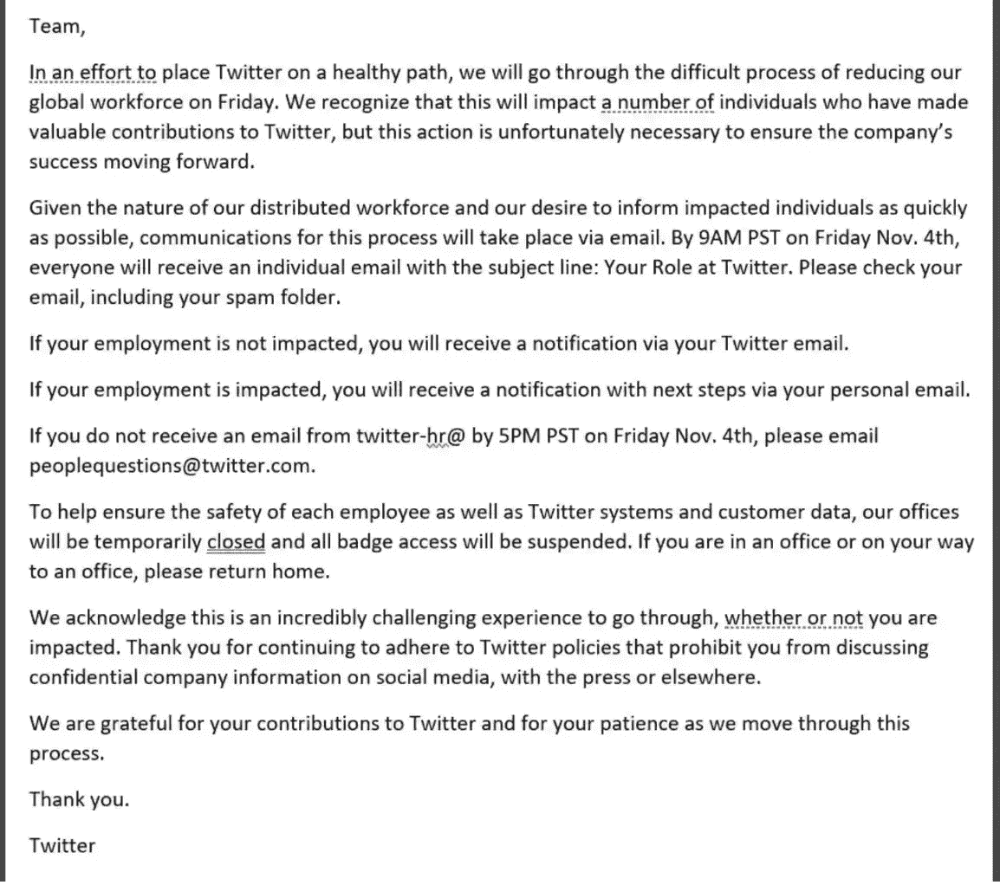
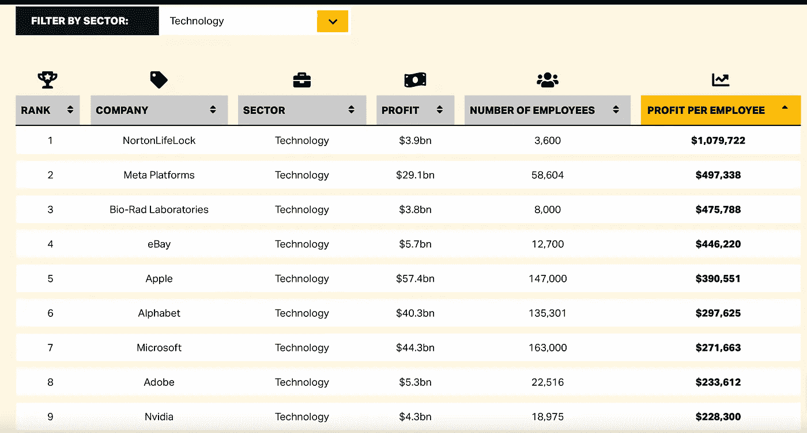

# 埃隆·马斯克解雇了 50%的 Twitter 用户，这也是我喜欢它的原因

> 原文：<https://levelup.gitconnected.com/elon-musk-fires-50-twitter-and-why-i-like-it-adc3451f1018>

大科技是一种过度的人才集中


Bradyn Trollip 在 [Unsplash](https://unsplash.com?utm_source=medium&utm_medium=referral) 上拍摄的照片

周四晚上，在世界上最活跃的社交媒体 Twitter 上，这是一场闪电雷暴。埃隆·马斯克解雇了几乎一半的 Twitter 员工。

因此，Twitter 的总实力将从 7500 增至 3700。

然而，马斯克在[的最初计划](https://www.cbc.ca/news/business/elon-musk-twitter-1.6624859)是解雇 75% (5600 名员工)——后来他[收回了这个声明。](https://techcrunch.com/2022/10/26/now-elon-musk-says-he-wont-fire-75-of-twitters-staff/?guccounter=1&guce_referrer=aHR0cHM6Ly93d3cuZ29vZ2xlLmNvbS8&guce_referrer_sig=AQAAAN1teR3ebP9wzYm6lS0ckyateFyxr9NC_OmDlpiw7S0IftfPKyamGPZrEbWAgt28q7DOP-Y2il61DOL9XZ_9l9Eqe0nxiIsLei-dzzi1jucj7pP7W7a1zFlFhfs9HRRPOquZT-aSbhWMWOr2HakBDSE4YI1Dt9S6VTPNbnrAoIXb)

这是一封泄露的邮件，决定了他们的命运:



来源: [Livemint](https://www.livemint.com/news/world/your-role-at-twitter-how-elon-musk-is-firing-employees-11667555397875.html)

与大型科技领域的其他裁员不同，这一次有点前所未有:工程一直是裁员的重要部分，马斯克正在以一种结构化的方式(他自己定义的结构)来实现这一点。

# Twitter 程序员会如何被解雇？

有传言称，Twitter 程序员将根据他们在过去 3-6 个月内编写的 LOC 数量被解雇。我找不到任何支持它的来源。

也有报道称，一些 Twitter 经理指示他们的员工[一天工作 12 小时，一周工作 7 天](https://www.businessinsider.com/elon-musk-twitter-staff-layoffs-long-hours-shifts-work-jobs-2022-11?r=US&IR=T) (84 小时/周)。如果是这样的话，我绝对不同意。在最好的情况下，它会赶走最优秀的人才。最坏的情况是，这会让 Twitter 变成一个充满精神健康患者的地方。

根据《华盛顿邮报》的一篇文章，许多 Twitter 工程师收到了一份日历邀请，上面写着:

```
“Stop printing, please be ready to show your recent code,” a reference to engineers being asked to show the code they had written in the last 30 to 60 days on their computers.The note continues, “Please come prepared with code as a backup to review on your machines with Elon.” Later, people inside the company reported that Tesla engineers were reviewing the code.
```

这是什么意思？

假设马斯克对他的“**修复 Twitter** ”任务相当真诚，这些可能是衡量标准:

## 谁将从 Twitter 上被解雇:

*   那些在过去 3-6 个月内很少或没有提交的人(是的，他们可能存在)
*   装腔作势提交的程序员。例如:由技术债务和退化导致的错误修复，不需要工程人才的微小变化(本地化、错误消息、大量库导入、版本更新等)。

## 谁将被保留在 Twitter:

*   编写可重用组件的程序员——如果他们的贡献符合 Musk 未来的 Twitter 产品推出，就更是如此。
*   那些既能谈论技术又能谈论商业的人，不管他们的代码贡献如何，并且可以不带任何虚假 PPT 地展示给马斯克的团队。

我很怀疑埃隆自己到底相信多少文化建设。从现在开始，Twitter 将成为一家私人公司。有一件事肯定会改变，那就是泄露出去的东西会大幅减少。

而今天，全世界都觉得有权知道 Twitter 办公室里有多少厕所需要翻新。

# 有些东西不被摧毁就无法重建:

埃隆·马斯克有一种值得商榷的做事方式。但至少，在这种情况下，我似乎觉得他的疯狂是有方法的。

人们更容易认为他是一个无情的资本家或爱解雇人的反社会者。但鉴于他的影响力，他也可以众筹资金雇佣他的宠物员工，在没有大规模裁员的情况下运营 Twitter。

将 Twitter 减半似乎有些激进。但这可能只是一系列其他破坏性举动中的第一张多米诺骨牌。

它是巨大的。这是前所未有的。也很痛苦。

> Twitter 给这个世界带来了许多伟大的想法和讨论，但它很少将它们用于自己的利益和增长。

但是我有一种感觉，这和物理有关。如果一个钟摆向左移动了很远(一语双关，非故意)，你需要轻轻向右敲击它(再次强调，我只是在谈论物理)，这样它最终可以停留在中心，动量会有一个有机的损失。

在一个以民主和自由市场为基础的世界里，这是应该发生的，对吗？

嘿的 DHH 写了一篇相当有意义的[帖子](https://world.hey.com/dhh/apple-fired-4-100-when-steve-jobs-returned-in-1997-57ed6bc6)，讲述了为什么史蒂夫·乔布斯重返苹果后解雇了 4100 名员工。

Twitter 一直是一个臃肿的地方。拥有 7500 名员工仅仅是为了维护一个有赞、转发和评论的国际论坛？我觉得可笑的是，一个具有如此影响力的软件组织却不能正确地平衡其生产力。

以经营一家全国性出租车运营商为例。在拥有 2 万个城镇的美国，你需要雇佣 5000 名客服人员(大约)来进行 24x7 的预订。

如果你用软件工程解决这个问题，你会得到优步。

没错，优步及其盟友需要数十亿美元来解决客户的不满和诉讼。他们是臭名昭著的钱坑，对世界各地的合同司机没什么好处。

但那是优步，对吗？我们说的是一个思想巨人，自由言论平台 Twitter！

它已经存在 20 年了。它给世界带来了许多伟大的想法和讨论，但它很少将它们用于自己的利益和增长。

在过去的十年里，Twitter 已经在想法上变得陈旧，并发现自己解决错误的问题比创造革命性的东西更多。

以下是一些最近值得注意的东西(摘自[维基百科](https://en.wikipedia.org/wiki/Twitter)):

*   2017 年:推文限制翻倍至 280 个字符(耶！👏 👏 👏 😏).
*   2018 年:被锁定的账户将不再计入关注人数
*   2020 年:杰夫·贝索斯和其他名人的[推特账户被黑](https://medium.com/swlh/what-twitters-116k-hack-tells-us-about-privacy-ff713ccaae7b)
*   2021 年:Twitter 收购时事通讯平台 Revue，与 Substack 竞争，抢占不断增长的时事通讯市场
*   2022 年:埃隆·马斯克(Elon Musk)的长期 Twitter 购买插曲

这些看起来能改变世界吗，更不用说增长了？能挑出其中任何一个来证明需要 7500 人的强大团队(其中大部分拿着技术级别的薪水)吗？

嗯，一些开发人员可能会说:它有一个巨大的代码库，基础设施遍布全球。

没错，但是已经写好了。它只需要聪明的维护者。有了 Twitter 这种水平的开发者(从算法上来说，与谷歌的追求者一致)，即使是从头重写也应该是完全可能的。

Twitter 与美国宇航局的月球任务相去甚远。而只是现在，它开始在总工程师 SpaceX 手里玩了。

# 但是 Twitter 内容版主裁员怎么办？

> 在人工智能机器人解决这个问题之前，内容审核不可能同时盈利和有效

许多被解雇的 Twitter 员工是内容管理者，他们帮助 Twitter 保持一个自由言论的平台，至少在理论上是这样。

我不是政治分析家。我没有资格说这些裁员是正当的还是不正当的。我也没有资格声称整个 Twitter 的接管是极右势力扼杀全球言论自由的议程。

但是，我有以下的话要说。

内容适度不是社交平台的茶。不赚钱。如果他们这样做，那是因为法律要求他们这样做。

他们无法设计的东西，他们外包出去。

Cognizant(脸书、Twitter 和谷歌雇佣的内容审核提供商)曾经雇佣数千人来监控仇恨言论、恐怖主义和其他不当内容。2019 年，在一次新闻调查后，它终止了与脸书[的这份中庸合同。是关于什么的？其员工在缓和仇恨内容时经历的精神创伤。](https://www.theverge.com/2019/10/30/20940956/cognizant-facebook-content-moderation-exit-business-conditions-investigation)

在人工智能机器人以 100%的准确率(同样，这是一个有争议的变量)确定之前，内容适度是无法同时盈利和有效的。我想，马斯克可能在某个时候想要这个。

同样，内容适度既不是大型科技公司的主要目标，也不是他们的能力。

他们的能力在于不断破坏尚未数字化的领域。

他们的目的是无情地获取利润。

# Twitter 并不孤单(这是最可怕的部分):

雇佣成千上万的人是一回事，他们有丰厚的福利，良好的工作文化，以及最大的言论自由。榨干投资者的钱是另一回事，但却没有足够的创新能力来发挥你 10%的能力。

或许，最后一个斜体部分也适用于许多其他大型科技公司。

不仅仅是推特。

## 所有的 FAAMG 都是超大的巨型军团:

看看他们的员工人数(大约。来自[维基百科](https://en.wikipedia.org/wiki/Big_Tech)

谷歌:14 万

微软:22 万

苹果:15.5 万

梅塔(脸书):83 000 人

亚马逊:150 万(包括运输和送货人员)

2020 年，一家名为 Tipalti 的金融公司发布了一篇名为“**每名员工利润**”的研究论文。

根据那份报告，最大的科技公司是哪家？有什么猜测吗？

尽管疫情在线蓬勃发展，但它不是我们最喜欢的 FAAMG 男孩。那是 NortonLifeLock(你知道它的名字是赛门铁克杀毒软件)。2020 年，它获得了 39 亿美元的净收入，雇佣了 3600 人。这意味着每个员工都因此获得了 1079722 美元。



来源:[蒂帕尔蒂](https://tipalti.com/profit-per-employee/)

除了亚马逊，我们发现整个 FAAMG 和网飞(在媒体部门下报告)在盈利方面(2020 年)。

然而，今天情况发生了变化。过去，疫情、网飞和脸书的税收明显流失了数十亿美元。如果这样的报告在今天发布，一些大公司(FAAMG)将远远低于他们在 2020 年的职位。

> 在谷歌，没有一个现金+股票收入超过 30 万美元的人有胆量改造谷歌丑陋的用户界面和令人厌恶的 UX。

我不是经济学家。我要强调的一点是，在所有大型科技公司，效率和监督的明显缺失终于显现出来了。

*   谷歌的产品有[垃圾 UX](https://danielmiessler.com/blog/why-apple-keeps-winning/) 。他们的开源产品( [Flutter](https://medium.com/swlh/the-end-of-cross-platform-as-we-know-it-dad658d96b8) )未能满足收入需求。最近，为了击败抖音，它一直在优先考虑 YouTube 搜索结果。一个 8 岁的孩子就能看出来，靠增加用户摩擦来赚取高薪视频广告纯粹是贪婪。你能相信吗？为了保持*数据驱动(除非数据显示他们很烂，否则我们不会修复)*，没有一个谷歌人(现金+股票收入超过 30 万美元)有胆量改造谷歌丑陋的用户界面和令人厌恶的 UX。
*   谷歌的文本搜索结果的相关性也在下降，对 AdWords 客户有利的有机搜索结果，或者对 SEO 友好的垃圾网站有利的有机搜索结果。顺便说一句，谷歌是赋予 SEO 一词意义的公司，后来利用其短视的 AMP 框架来控制网络。DuckDuckGo 没有获胜的唯一原因是谷歌通过 Gmail、Chrome 和苹果的合作伙伴关系占据了很深的主导地位。
*   亚马逊是一台无情的效率机器。它擅长扩大产品规模，却不太关心员工。但在建设科技文化方面，它太短视了。因此，未来的 CS 人才可能不会将其视为一个值得他们梦想的雇主。它面临着严重的磨损，我已经在这里写了[关于它可能的推理](https://medium.com/p/afedbe05a0de)。
*   苹果是大型科技公司中最神秘的。自从史蒂夫·乔布斯去世后，除了扼杀行业发展的 Macbooks，苹果没有推出任何革命性的产品。它的开发者协作系统(App Store Connect)比 15 美元的股票网站还糟糕。发现了一个简单的 CRUD bug？归档雷达，让它在长长的队列中腐烂——这就是所有权原则！对于大多数用户来说，使用 iCloud 是一场噩梦，但苹果公司一直保持这种方式，以销售更多的云存储。
*   苹果，这个最具创新性的公司也因抄袭流行应用而声名狼藉——窃取成功应用开发者的畅销商业创意。扼杀竞争是一回事，但砍掉养活你的那只手是极其愚蠢的。一旦它的秘密被打破，谁也不知道苹果的壁橱里还会冒出多少骷髅。
*   说到创新，微软是走得最远的。它很少通过收购来做到这一点。凭借雄厚的财力，它本可以在很久以前抛弃英特尔(类似苹果的举动)的同时重写 Windows 操作系统，但这从未发生过。迄今为止，它的王牌是它的长期企业客户。它一直以看涨的包装策略赢得竞争对手:首先免费提供低质量的产品，然后迫使他们以更高的成本使用这些产品。MS Teams 就是这样战胜 Slack 的。其最新的人工智能产品 OpenAI 的 DALL-E 不会改变世界，至少在目前的定价结构和形式下不会。
*   目前，脸书不在我的关注范围内，因为元宇宙离它的宏伟承诺还很远，脸书已经[悄悄地](https://www.businessinsider.com/facebook-quiet-layoffs-will-impact-thousands-of-jobs-employees-say-2022-10?r=US&IR=T)削减了一些工作岗位，并计划[削减更多](https://www.theguardian.com/technology/2022/nov/07/facebook-parent-meta-prepares-large-scale-layoffs-fire-thousands-jobs-reports)。

这是什么意思？第一:我去年 6 月份的预测[famg 会像多米诺骨牌一样倒下，可悲的是，这一预测正在成为现实。](https://entrepreneurshandbook.co/the-2025-programmer-has-just-one-option-6a819aefecd9)

# FAAMG 裁员比看起来更迫在眉睫:

> FAAMG 的员工就像机场到达大厅传送带上的行李一样被雇佣和登机。

*   在他们不断追求增长的过程中，FAAMG 俱乐部雇佣了更多的人。在高管层面，这是为了证明更多投资的合理性。在较低的管理层面，是为了把自己的组织养肥，从而增加自己的晋升点。
*   FAAMG 不仅过度雇佣，而且在金字塔最宽的底部雇佣了不相关的人。在招聘时，FAAMG 极度强调技能组合而非角色。只需将他们的样板工作描述与那些较小的科技公司进行比较。**算法？上车！产品管理学位？欢迎光临！斯坦福/麻省理工？非常欢迎！**只要过了 6–8 道面试关，都欢迎。我听说在谷歌，新员工会一直等待，直到经理为他们的项目挑选他们。在此之前，它们位于一个公共资源库中。FAAMG 的员工就像机场到达大厅传送带上的行李一样登机。重点在哪里？
*   FAAMG 开发人员的自我意识很强。他们把外来开发人员视为劣等物种。看看他们开源的回购和论坛。GitHub 问题被无故关闭。除了说一些只有他们同事才懂的科技术语，他们几乎不做任何解释。他们生活在一种高度的权利感中，在他们的收入和影响力的比例上做得不够。这在他们的招聘实践中也很明显，其中[他们因为琐碎的原因拒绝有能力的开发人员](https://betterprogramming.pub/why-developers-should-stop-fretting-over-faamg-rejections-104b597f7da0)。由于这种权利，他们觉得对即将到来的浪潮有额外的保障，并且比他们的小公司同行更有可能失去所有权。产品不稳定，当损失增加时，就会发生解雇。
*   许多 FAAMG 开发者完全致力于亏损的无关 R & D 的项目。当投资者翻案或管理层变动时，他们最终会吞下最痛苦的裁员药丸。这些是我最同情的开发人员——他们是现代科学家，被那些首席执行官梦想火星任务、宇宙飞船、气球互联网、神奇药物和人类基因组 DNA 图的公司弄得失业。这是最残酷的人才管理不善。
*   大型技术公司创造了许多经理，他们在编写产生收入的代码方面没有发挥任何作用。Elon 的以下推文称，这可能发生在 Twitter 上:

这背后的原因很简单。每个人，从支撑这些公司的投资者，都需要数据。图表，图表，还有更多图表。这种做法慢慢渗透，而且不是以一种令人满意的方式；这让新手开发者压力过大。

# 被解雇的 Twitter 开发者会做得很好:

2021 年中旬，通用电气[表示，将在 3 年内裁员一半。那就是 **139，000** 人——大部分来自电力和航空部门。](https://www.marketwatch.com/story/ge-has-nearly-halved-its-u-s-workforce-in-3-years-with-more-job-cuts-likely-11613160793)

(通用电气是杰克韦尔奇(Jack Welch)的公司，这位新创的杰克通过引入每年 10%的最低解雇率来美化裁员。)

他们中的大多数人会发现自己处于无人地带，因为这些行业是由垄断企业驱动的。此外，这些机器与工业设计紧密结合。谈论被竞争对手重新培训和雇佣。

服务行业被解雇的员工情况更糟。

另一方面，软件具有很高程度的技能转移能力，因为它的工作原理是分离的。即使你的技能是不可转移的，与其他行业相比，接受培训是一项零成本、低投入的任务。

作为一名前 Twitter 员工，一个人的机会只会更加光明。他们甚至可能会找到一个投资者来推出他们的企业。软件是唯一支持个人创业的领域。如此多的软件开发人员[在大辞职运动中意识到了他们真正的潜力](https://medium.com/codex/why-senior-developers-are-leading-the-great-resignation-movement-37b93ab9a634)。

总的来说，世界各地的科技人才(尤其是高薪人才)必须面对一个更新的工作生活现实:

*   再多的才华也不能保证继续就业。
*   挥舞着权利的抗议不会带你去任何地方。街上有更多的失业者来推进你反对裙带资本主义的事业。
*   你不能通过在采访中鹦鹉学舌受金钱驱动的使命陈述来改变世界。做到这一点的唯一途径是通过能力和努力。
*   技术类的努力工作有不同的规则:O(log N)比 O(N)更好，并且通常通过 O(N^X 的努力来实现。一个人需要在面试之外利用这些努力。

# 结论:

我完全同情那些被解雇的 Twitter 开发者(并不那么突然)。我已经被我的技术雇主解雇过两次，而且没有遣散费。作为一名在芬兰的程序员，我听说过[10000 多名诺基亚员工](https://en.wikipedia.org/wiki/Nokia#2010–2014)由于被微软收购而立刻被解雇的恐怖故事，以及它是如何影响世界各地的家庭的。

不过，我有话要说。

然而，你们中的大多数人比世界上大多数软件开发人员拥有更好的体验。

仅仅因为你在 X 年前跨过了一些面试大门，并不意味着你就是负责人。他们说他们需要你来改变世界。不，他们没有。他们不需要你。

是的，他们需要你，但仅限于你不可替代的程度。成为缺失的拼图，或者被替换/删除。

无论如何，团结起来。对于你们中的一些人来说，与口号和法庭斗争可能是必要的。但这还不够。

## 什么才够呢？

你必须完成这个循环。

裁员是结构性缺陷的后果(症状)。在街上和他们战斗不会完成这个循环。

滋生、促进和欢呼低效率的蚂蟥从设计上来说是不公平的。他们不是单一的，但有一个共同点:他们支持让富人越来越富。

这就是你需要阻止的人。

我知道这听起来不公平，尤其是在这个时候。

但事实也是如此:只有拥有数万亿银行存款的前 5(或 25)家机构租用并储备了最好的算法大脑(甚至在招聘之前，面试练习期间)——那种可以在 StackOverFlow 上写出 5 分钟以内快速排序的大脑。

把革命从街上带到你的宿舍。建立微型组织来挑战不断喂养脂肪层的大技术。

分配你的认知资产。训练来自世界各地的开发人员达到你的水平。弥合差距。

只有你能做到。而且只能集体做。

用公平取代贪婪，并将其纳入系统。就像一个协议——一个技术必须遵守的标准。记得 HTTPS 吗？

顺便问一下，有多少 Twitter 员工听说过[杰克·多西和 Elon Musk](https://decrypt.co/110937/jack-dorsey-told-elon-musk-twitter-should-be-a-protocol-like-signal) 关于 Twitter 的未来属于言论自由协议的对话？

想看完每一个**中的**故事？使用此链接成为会员[。你的会员费的一部分将支持**笔磁**的写作。](https://tipsnguts.medium.com/membership)

想在**笔磁**每次发布时收到邮件？[点击这里加入他的订户名单](https://tipsnguts.medium.com/subscribe)。