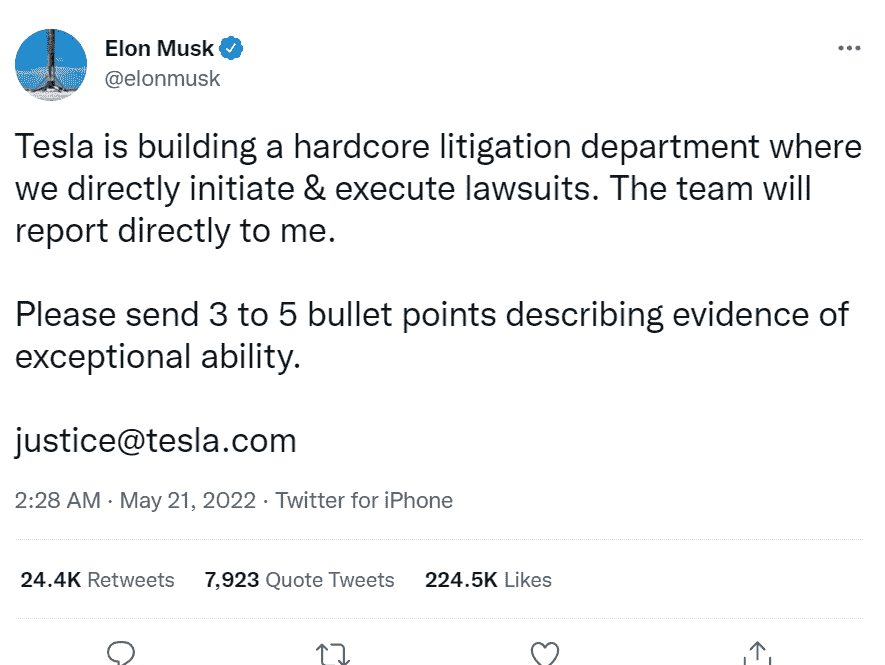
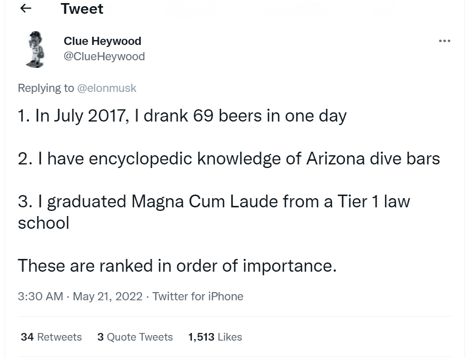

# 埃隆·马斯克在推特上发布职位描述后，得到了令人捧腹的回应

> 原文：<https://levelup.gitconnected.com/elon-musk-gets-hilarious-responses-after-posting-a-job-description-on-twitter-34872b702204>

## 我敢打赌，整个 Twitter 帖子都很有趣

克劳迪奥·施瓦兹在 [Unsplash](https://unsplash.com?utm_source=medium&utm_medium=referral) 上的照片

在一个巨魔政治的时代，SpaceX 和特斯拉首席执行官埃隆·马斯克已经成为巨魔之王。争议似乎并没有离开这位自称的言论自由绝对主义者。

埃隆·马斯克(Elon musk)上周在 Twitter 上发布了一份律师加入特斯拉的工作描述，随后网民们忍不住对他进行了抨击。马斯克讽刺地写道，特斯拉将设立一个“核心诉讼部门”，以“直接提起和执行诉讼”，并“直接向他报告”。这条推特是在他被指控性骚扰的第二天发布的。

这位商业大亨在推特上说，特斯拉正在建立一个核心诉讼部门，他们直接发起和执行诉讼。该团队现在将向他报告。马斯克要求发给他 3 到 5 个要点，描述他非凡能力的证据。

来源:[这条推文](https://twitter.com/elonmusk/status/1527748229470646272?ref_src=twsrc%5Etfw%7Ctwcamp%5Etweetembed%7Ctwterm%5E1527748229470646272%7Ctwgr%5E%7Ctwcon%5Es1_&ref_url=https%3A%2F%2Fwww.ndtv.com%2Fworld-news%2Felon-musk-posts-tesla-job-ad-on-twitter-receives-hilarious-responses-2998759)

他补充说:“我的承诺是:我们永远不会在针对我们的正义案件中寻求胜利，即使我们可能会赢。即使我们可能会输，我们也绝不会放弃/解决针对我们的不公正案件。”

在随后的一条推文中，这位首席执行官澄清说，他正在寻找“铁杆街头斗士”，而不是“像珀金斯或库利那样靠腐败发迹的白鞋律师”。此外，他不祥地写道，“将会有流血。”

这条推文获得了超过 22 万个赞和无数搞笑的模拟求职申请。

一名推特用户回复道

*   “有一次我和前妻吵架赢了。
*   参见上面的第一个项目符号。
*   回去，确保你理解并欣赏第一颗子弹的巨大威力。
*   会为马工作
*   这是我的第五颗子弹。"

另一位“应聘者”介绍自己是一名“冷静的簿记员”,并列举了一些令人捧腹的品质，比如“出色的雪球控制能力”和“比伊万德·霍利菲尔德还高”。"

Twitter 用户 Clue Heywood 写道，2017 年 7 月，他在一天内喝了 69 瓶啤酒。他对亚利桑那州的潜水酒吧了如指掌，列举出“我以优异成绩从一所一流法学院毕业”的特征。

来源:[这条推文](https://twitter.com/ClueHeywood/status/1527763769165635584?ref_src=twsrc%5Etfw%7Ctwcamp%5Etweetembed%7Ctwterm%5E1527763769165635584%7Ctwgr%5E%7Ctwcon%5Es1_&ref_url=https%3A%2F%2Fwww.livemint.com%2Fcompanies%2Fpeople%2Felon-musk-posts-job-advertisement-on-twitter-here-s-how-netizens-respond-11653273328409.html)

另一位推特用户写道，“小时候，每当发生争吵，我总能让我妈妈相信是我姐姐的错。”他的第二个要点是，我从不在和妻子的争论中让步，除非她告诉我。"

其中一份歇斯底里的求职申请是

*   “帮我妈妈打赢了官司
*   我妈妈说我比她聪明
*   我是天秤座。"

这些是他在推特上收到的一些搞笑回复。

据 Insider 报道，马斯克涉嫌向 SpaceX 的一名前员工和空姐暴露自己，提出为她购买一匹马进行色情按摩。后来，这家航空航天公司支付了 25 万美元来解决性行为不端的指控。

尽管这位大亨否认了这些指控，但大多数人认为这个谣言是真实的。马斯克否认这一指控是“出于政治动机的攻击”。他还转发了去年的一篇帖子，其中他建议，如果他曾经卷入丑闻，就把它改名为“细长”。

Space X 没有回应此事。

马斯克表示，这些指控“完全不真实”，所谓的曝光“从未发生过”。除了这一指控，这位亿万富翁从未面临过任何公开骚扰指控，直到去年。至少有 7 名女性对埃隆·马斯克提起性骚扰诉讼，这还为时过早。

在上周提起的六起独立诉讼中，特斯拉的女性员工声称，她们的男性同事经常提到她们的身体和服装。一些女性声称，她们的男同事的行为在她们抱怨多次后并没有改变。

一些妇女无法将问题提交给人力资源部，因为上司也参与了骚扰。许多女性声称职场经历给她们带来了焦虑和抑郁。

在弗里蒙特座椅制造商工作的杰西卡·布鲁克斯声称，她被骚扰到了不得不在她的工作站周围堆放盒子以防止男人盯着她看和吹口哨的地步。

她声称，她在一家慈善商店买了法兰绒衬衫，围在腰间，以隐藏她的臀部，并阻止男人在民事诉讼和接受《华盛顿邮报》采访时对她做出不当评论。

他的汽车公司特斯拉在加州法院面临种族和性别歧视的指控，并受到加州公平住房和就业部的起诉。

另一方面，特斯拉否认了所有不当行为，声称它已经实施了防止和惩罚工人不当行为的规则。大多数美国公司都面临一些与就业相关的索赔和诉讼，特斯拉也不是唯一的。

除了在特斯拉和 SpaceX 的职位，马斯克还持有 Twitter 9.2%的股份。据《福布斯》报道，这家社交媒体巨头的董事会已经批准了他以 440 亿美元收购整个企业的出价。马斯克的净资产估计为 2180 亿美元。

上周，这位亿万富翁表示，他收购 Twitter 的提议“搁置”，理由是据称担心 Twitter 的垃圾账户问题的范围。然而，Twitter 的董事会坚持认为收购将会完成。

你相信马斯克暴露了自己，还是这是个骗局？另一方面，一些公司不时会因虚假指控而被起诉，但他们没有抗争，只是和解。原因是，证明说谎者说谎的成本比偿还他们的成本更高。分享你对埃隆·马斯克性骚扰指控的看法。

请在评论中分享你的观点。*感谢阅读！如果你想支持我，* [***加入我吧！***](https://thefemaleprogrammer.medium.com/membership)