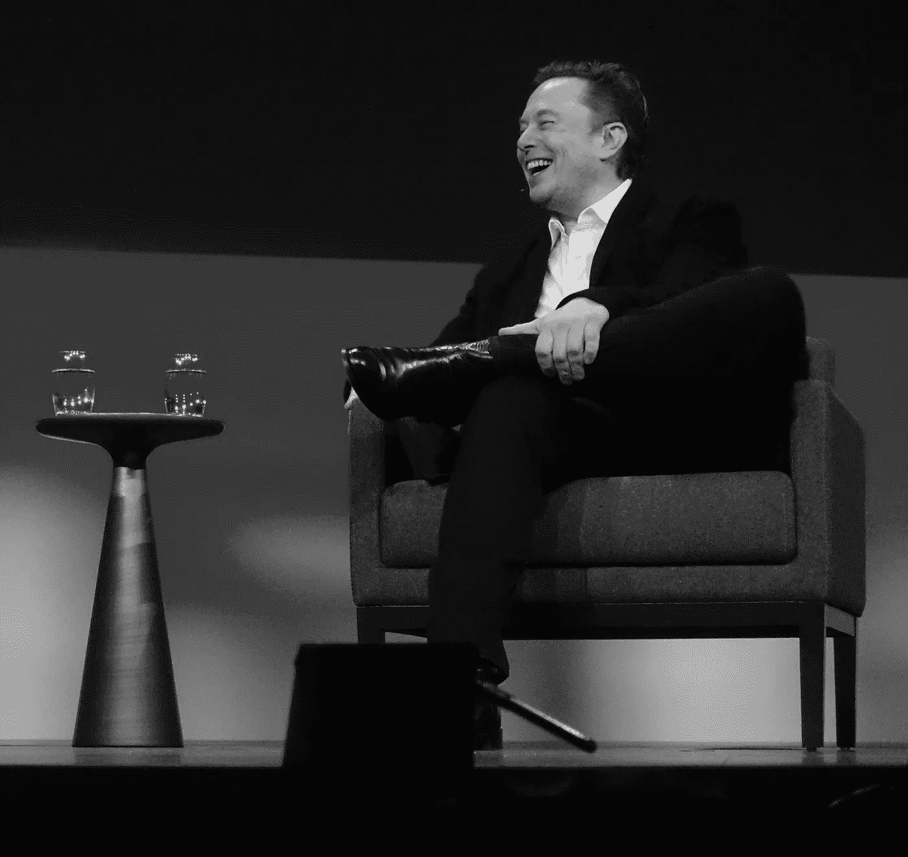
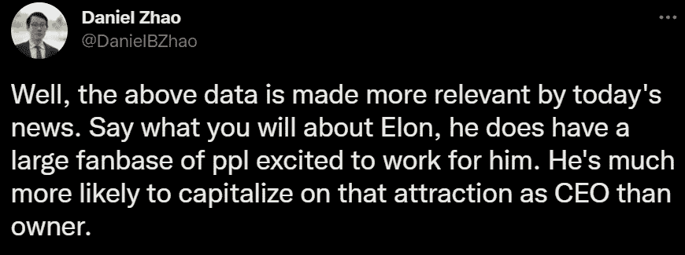
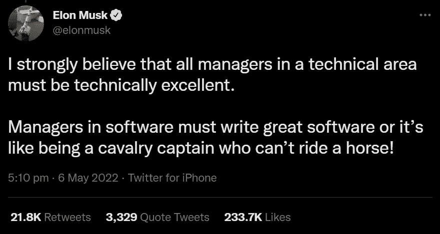
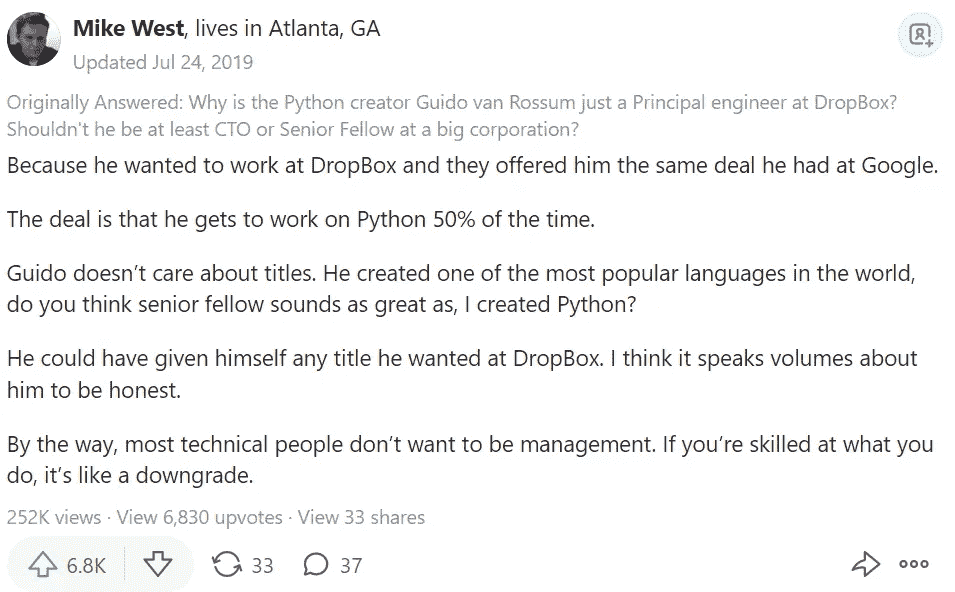

# 埃隆·马斯克刚刚重新定义了软件领域的管理

> 原文：<https://levelup.gitconnected.com/elon-musk-just-redefined-management-in-sofware-164287fdd3a1>

## 埃隆的软件管理方法及其启示

来源:[维基共享资源](https://commons.wikimedia.org/wiki/File:Elon_Musk_(52005460639).jpg)(作者编辑)

隆·马斯克无疑是这十年来最具影响力的人物之一。

埃隆是个务实的家伙。他不顾[的后果](https://www.nytimes.com/2022/04/29/business/elon-musk-tesla-stock.html#:~:text=Daily%20Business%20Briefing-,Elon%20Musk%20sells%20billions%20in%20Tesla%20stock%20as%20he%20prepares,plans%20to%20sell%20any%20more.)采取行动。

也许，这是他拥有很大影响力的原因之一。

你看，在我的一生中，我了解到人们实际上并不知道他们想要什么。因此，马斯克的古怪行为在一定程度上引起了许多人的共鸣。

## 在埃隆手下工作

在埃隆收购 Twitter 的提议遭到“同意”后，马斯克-Twitter 的戏剧仍在继续。在这一点上，该公司的未来是不确定的，因为有一波推文暗示收购后会有一个新的(不同的)“Twitter”。

当关于埃隆[取代](https://fortune.com/2022/04/28/elon-musk-twitter-q1-2022-earnings-acquisition-tesla/)帕拉格·阿格拉瓦尔成为临时首席执行官的谣言正在传播时，Twitter 目前的员工预计情况会更糟。

谁不会呢？

听说特斯拉的 CEO 打算[解雇](https://www.dailymail.co.uk/news/article-10791425/Elon-Musk-plans-fire-1-000-Twitter-staff-quintuple-revenue-69-million-users-paying-3-month.html) 1000 名员工，改变公司的商业模式后。

显然，那些目标不符合埃隆对一个新的、开放的、不受审查的社交媒体平台的愿景的人可能会发现自己在找新工作(不管他们的职位或服务年限)。

这并不意外。

埃隆在招聘方面的记录并不是最好的。众所周知，他说“再见”和说“欢迎”一样快乐。

尽管坐拥无底洞的现金，他还是每周工作 80 小时。因此，可以理解的是，他总是希望自己周围都是志同道合的人——工作机器。

对于有理性的人来说，不在埃隆的指挥下工作应该是足够令人沮丧的。

然而，你瞧！关于 Twitter 工作前景的最新统计数据讲述了一个完全不同的故事。

事实证明，在宣布伊隆可能接管社交媒体巨头之后，加入 Twitter 的兴趣上升了近三倍。

Glassdoor 首席执行官丹尼尔·赵(Daniel Zhao)在最近的一条推文中报告了这一发现:

来源:

是啊！有成千上万的人愿意在 SpaceX 首席工程师的领导下工作。

看起来尽管有风险，麝香骑毕竟是值得争论的。

## 埃隆·马斯克:管理被高估了

在 T2 的一次采访中，埃隆曾被问及他的招聘方式。在引用他的论点时，他简要地谈到了他对常见管理实践的担忧:

> “…少花点时间在财务上，少花点时间在会议室，少花点时间在 PowerPoint 上，多花点时间努力让你的产品尽可能的棒。我认为可能有太多的 MBA 运营公司。有一种美国的 MBA 化，我认为这并没有那么好。应该更加关注产品。”— [埃隆·马斯克](https://www.youtube.com/watch?v=WtlZJjNh1Mw&ab_channel=ElonMuskZone)

传统的管理模式规定并鼓励员工追求更高的管理职位，以赚取更多。你越往上爬，你的职责就越不专业。随后，你的会议和决策日程变得更加繁忙。

在埃隆看来，这种做生意的方法应该三思。

仔细想想，其实很有道理！

公司的生存要感谢客户。客户来企业是因为他们有更好的产品和更好的服务。好的产品和服务是好的研发的结果。获得尖端 R&D 需要杰出的科学家、工程师和设计师。

显然，这种思路反映了埃隆对“MBA 化”的畏惧。

最后，没有人比埃隆更有资格解释商业成功意味着什么。

事实上，Elon 对标准管理实践的不满在以后的几个场合中被提出来，最近软件行业尤其成为攻击目标。

## 埃隆·马斯克:这就是软件中的管理方式

埃隆不一定是个软件人，因为特斯拉和 SpaceX 本身都不是软件公司。

然而，有着如此令人印象深刻的创业记录，埃隆的投入很难不被注意到。最近，他的投入是关于软件管理实践。

5 月 6 日星期五，马斯克发布了 Twitter 的修改版。收购完成后，他计划将 Twitter 打造成一家*“超级专注于核心软件工程、设计、信息安全&服务器硬件”的公司。*

同一天晚些时候，他对软件领域的管理发起了攻击。这一攻击或许更能引起 Twitter 管理层的共鸣。他发推特说:

来源:[推特](https://twitter.com/elonmusk/status/1522609829553971200)

在这一点上，埃隆似乎对公司高估管理层、低估工程师越来越恼火。因此，为了抵消这一点，他认为技术经理**必须**“技术过硬”。

换句话说，如果你是一名开发人员，你应该期望你的直线经理至少和你一样有能力。

然而，当你更深入地研究这种说法时，你会发现它并不适用于很大一部分市场——尤其是在软件领域。

你看，开发团队经常被期望在他们自己之间解决问题(调试、性能……)。在部署到生产环境之前，管理人员通常会介入审查和批准变更。

这归因于以下问题:

*   这些变化能证明技术经理的能力吗？
*   如果你邀请一个技术经理和一个技术负责人参加编码比赛，他们的表现会一样吗？

老实说，我认为技术领导会比技术经理表现得更好。

## 埃隆关于软件管理的观点正确吗？

几年前，我在一家大公司实习(无需举出名字)。我被分配到 R&D 部门。

我接到了一个需要大量研究的高度技术性的项目。更重要的是，人们希望我的发现完全基于公司的内部文件，而这些文件在当时看起来就像是象形文字。更糟糕的是，我可以依靠的相关在线资源非常少，这让我的研究变成了一场艰苦的战斗。

在我的隔间对面，有一个男人。让我们叫他鲍勃。

鲍勃经常被其他雇员围住。你很难看到他独自坐着。有一天，我正在努力思考一个技术概念。因此，当其他人都出去吃午饭时，我征求了鲍勃的意见。

哦天啊！鲍勃非常聪明。他从建议模式变成了演讲模式，回答了我的问题以及他自己问和回答的许多其他问题。我在一个小时内从他身上学到的东西比我在大学一整个学期学到的都多。实习结束时，我学到了很多东西。

原来鲍勃是业务部门的关键人物。几乎 75%的工作量都在他肩上。

他是那家分店的经理吗？

他没有。

事实上，直线经理和其他管理人员经常寻求他的指导和意见。

现在，这是否意味着公司选择了错误的候选人，因为鲍勃更有能力？

我不这么认为。

你看，鲍勃很开心。他对工作的热情总是闪闪发光。我从未听他抱怨过他的工作。从来没有人对他发号施令。

他自由了！

> 他是经理，但没有头衔和分量

事实上，类似的故事也适用于 Python 的创造者 Guido Van Rossum。他接受了为谷歌工作，条件是只做一名软件开发员。

他是否缺乏担当管理角色的技术能力(如首席技术官、高级顾问)？

当然不是！

就我个人而言，我认为管理人员和技术人员往往不匹配，正如 quora 对 Guido Van Rossum 选择放弃管理职位的回答所示:

[来源](https://www.quora.com/Why-is-the-Python-creator-Guido-van-Rossum-just-a-Principal-engineer-at-Dropbox-Shouldnt-he-be-at-least-CTO-or-Senior-Fellow-at-a-big-corporation)

## 结论

埃隆关于软件经理的观点绝对站得住脚。技术人员是公司的基石，因此应该受到尊重。

然而，事实证明，经理的帽子并不适合所有人。更重要的是，技术发展的速度几乎没有给开发人员足够的时间去学习、编码和重复。

这使得很难将高技术专业知识强加给每一个职责超出编码范围的技术经理。

因此，有理由将埃隆对技术经理的定义重新表述如下:

> ̶m̶u̶s̶t̶技术领域的经理应该是技术上的̶e̶x̶c̶e̶l̶l̶e̶n̶t̶专家

*如果你觉得这很有见地，可以考虑成为* [*高级*](https://ayarmohammed96.medium.com/membership) *会员来支持我的工作。如果用这个* [*链接*](http://ayarmohammed96.medium.com/membership) *，我得到一个小切。*

 [## 通过我的推荐链接加入媒体-穆罕默德·阿亚尔

### 作为一个媒体会员，你的会员费的一部分会给你阅读的作家，你可以完全接触到每一个故事…

ayarmohammed96.medium.com](https://ayarmohammed96.medium.com/membership) 

小心点！！