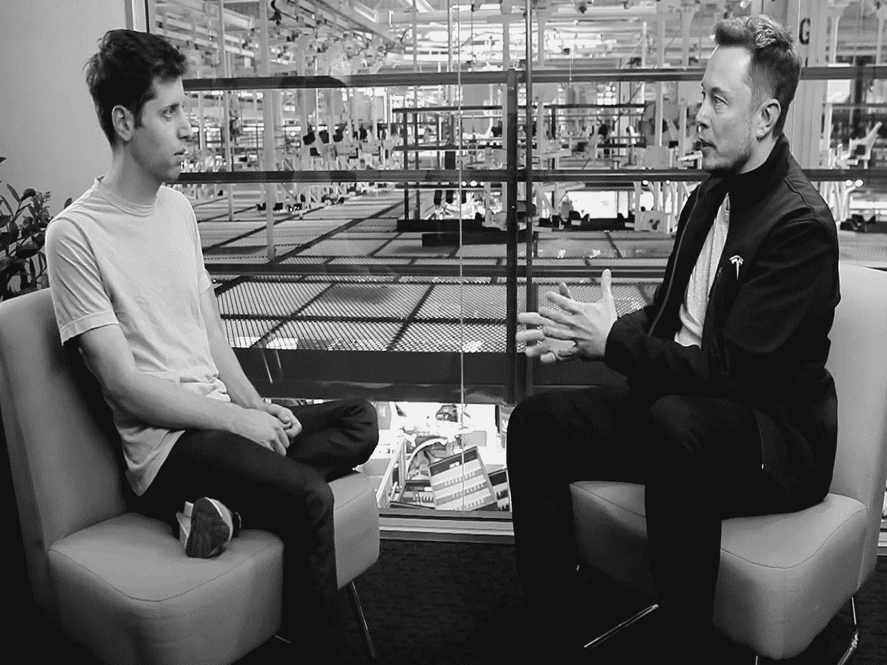

# 埃隆·马斯克在 ChatGPT 上

> 原文：<https://levelup.gitconnected.com/elon-musk-on-chatgpt-5e3790940e51>

## 意见

## 这怎么可能影响推特

[来源](https://elon-musk-interviews.com/2021/03/10/elon-musk-on-how-to-build-the-future-interview-with-sam-altman-english/)(作者修改)

本月早些时候，OpenAI 放弃了人工智能社区所能希望的最好的圣诞礼物——ChatGPT。

ChatGPT 从此席卷了互联网。OpenAI [声称](https://openai.com/blog/chatgpt/)这颗宝石是作为*研究预览*阶段的一部分免费掉落的。

ChatGPT 只不过是一个聊天机器人。但与你通常想扔出窗外的亚马逊 Alexa、谷歌助手或苹果 Siri 不同，ChatGPT 显示出超出你习惯的多功能性/智能程度。

这个看似标准的聊天机器人写文章，写诗，甚至写代码。任何基于文本的活动。你说出它的名字；它很可能做到了。

而且，它的做法很有创意——chat GPT 的输出避开了抄袭测试。

# OpenAI 和 Elon:背景故事

马斯克先生在创新方面的悠久历史再次给人留下深刻印象。

2015 年，这位南非亿万富翁联合创立了 open ai——chat GPT 背后的公司。

起初，OpenAI 是马斯克计划的一部分，尽管没有特斯拉和 SpaceX 那么重要。在与 OpenAI 首席执行官 Sam Altman 的对话中，他说:

> “我的大部分时间都在 SpaceX 和特斯拉之间度过，当然，我每周都会尝试花一部分时间在 OpenAI 上。所以我基本上每周都花半天时间在 OpenAI 上，然后我就有一些 OpenAI 的东西在这一周发生。”——埃隆·马斯克

2018 年，埃隆退出 OpenAI 董事会。OpenAI [声称](https://openai.com/blog/openai-supporters/)此举是*“为了消除与特斯拉的潜在未来冲突”*，因为该公司在自动驾驶汽车的人工智能概念上加倍努力。

2019 年，埃隆打破沉默，在一条推文中总结了他离开 OpenAI 背后的原因。

[来源](https://twitter.com/elonmusk/status/1096989482094518273)

这标志着 Musk-OpenAI 传奇的结束。

# 埃隆·马斯克在 ChatGPT 上

ChatGPT 周围的噪音让埃隆·马斯克着迷。很快，埃隆加入了 ChatGPT 邪教。

他敬畏地发了关于 ChatGPT 的微博。

[来源](https://twitter.com/elonmusk/status/1599128577068650498)

埃隆·马斯克(Elon Musk)一直承认人工智能对人类的好处。但他也一贯主张民主化和政府机构的发展，以规范人工智能。

2014 年，马斯克与人合著了一封公开信，呼吁对人工智能的潜力进行有力的研究，以利用其好处，同时避免其陷阱。

根据这些担忧，很明显，埃隆关于 ChatGPT 的推文是在提醒人们注意 AGI(人工通用智能)的危险。

[通用人工智能](https://en.wikipedia.org/wiki/Artificial_general_intelligence)与狭义人工智能相反，狭义人工智能是人工智能的当前状态，旨在解决一个问题，因此不符合人类大脑的通用、多用途性质。

然而，埃隆称之为一般人工智能或强人工智能，是指人工智能进化到显示与人类相同的认知能力。

通用人工智能的滥用和武器化可能会潜在地威胁到人类的生存。

# ChatGPT 和 Twitter

ChatGPT 取代员工的想法被反复提起。虽然这在这一点上是荒谬的，但对埃隆来说可能是有意义的。

没人知道 SpaceX 首席执行官的脑袋里在想什么。

在一条推文中，他再次分享了他与 ChatGPT 在思维之树上的对话片段，他喜欢这样描述它。

[来源](https://twitter.com/elonmusk/status/1599259281584402432)

从截图来看，很明显，埃隆是在向聊天机器人征求如何让 UX 在社交媒体上做得更好的建议。既然 Twitter 属于这一类，这些建议中的一些可能会被实施或者至少被考虑。

说实话，ChatGPT 提供的回复简直太棒了。

我们当中有多少人能在如此短的时间内快速给出这样的答案？

至少我不能。

你看，像埃隆这样的人不知道“浪费时间”是什么意思。乔·罗根曾经[表示](https://www.youtube.com/watch?v=Ra3fv8gl6NE&ab_channel=JREClips)他对现在 Twitter 的首席执行官如何找到时间开发和实施他提出的所有想法感到惊讶:

> “我只是不知道你是如何管理自己的时间的，我不明白，这似乎不太可能。”—乔·罗根

此外，一名特斯拉的前员工在接受《华尔街日报》采访时表示:

> “如果你有机会与埃隆交谈，你需要简洁、快速……你有 30 秒的时间来阐述你的观点。”—卡尔·梅德洛克

看起来 ChatGPT 符合工作描述。

# 最后的想法

时间不多了…

人工智能野兽很快就会醒来。ChatGPT 的引入很好地提醒了我们它的存在。人们(包括我在内)似乎已经忘记了。

然而，埃隆·马斯克很清楚这一点。否则，他不会加强特斯拉的人工智能努力，使自动驾驶汽车成为现实。

山姆·奥特曼是另一位人工智能传播者，很像埃隆。当被问及 OpenAI 将遵循哪些盈利渠道来维持运营时，他给出了星际迷航般的回答，称他宁愿让人工智能来做选择。

我建议你看看下面的推文。言语不太可能公正地回答山姆的问题。

[来源](https://twitter.com/bayalis/status/1604728792203026432)

这些雄心勃勃的人的这些评论和信念通常是半信半疑的。但是随着时间的流逝，他们证明我们是错的。

所以，让我们再一次等着看这将如何发展。

全自动驾驶汽车将如何推向市场。以及人工智能如何最终模拟人类的陪伴。

*如果你欣赏这种努力，可以考虑通过 Medium 的小费(如下)或通过以下* [*链接*](https://ayarmohammed96.medium.com/membership) *订阅 Medium 来支持作者。虽然作者从推荐链接中获得一小笔佣金，但这是免费的。*

 [## 通过我的推荐链接加入媒体-穆罕默德·阿亚尔

### 阅读默罕默德·阿亚尔(以及媒体上成千上万的其他作家)的每一个故事。您的会员费直接支持…

ayarmohammed96.medium.com](https://ayarmohammed96.medium.com/membership) 

# 分级编码

感谢您成为我们社区的一员！在你离开之前:

*   👏为故事鼓掌，跟着作者走👉
*   📰查看[升级编码出版物](https://levelup.gitconnected.com/?utm_source=pub&utm_medium=post)中的更多内容
*   🔔关注我们:[Twitter](https://twitter.com/gitconnected)|[LinkedIn](https://www.linkedin.com/company/gitconnected)|[时事通讯](https://newsletter.levelup.dev)

🚀👉 [**加入人才集体，找到一份令人惊喜的工作**](https://jobs.levelup.dev/talent/welcome?referral=true)