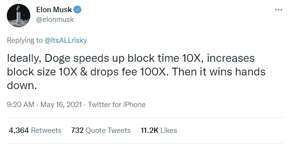
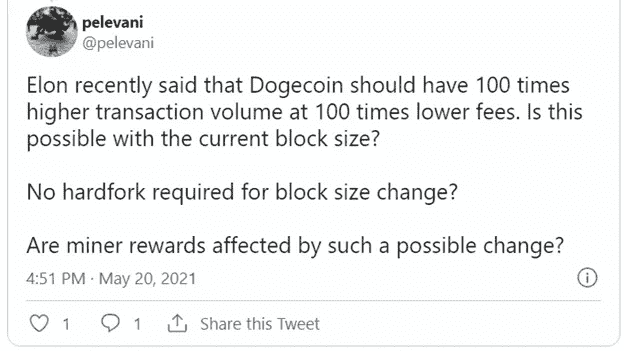
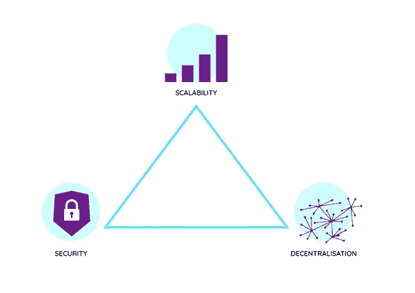
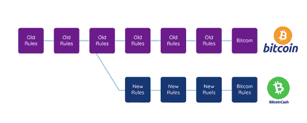
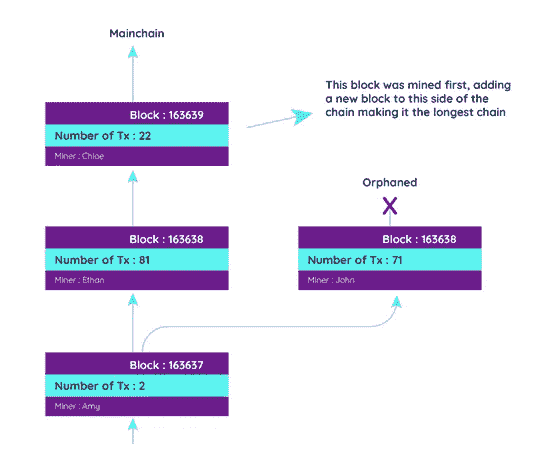
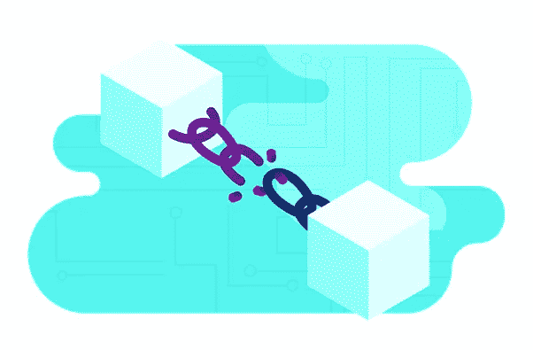

# 埃隆·马斯克——为什么他改进 Dogecoin 的提议行不通

> 原文：<https://levelup.gitconnected.com/elon-musk-why-his-proposal-to-improve-dogecoin-wont-work-63126abb5779>

## 不要误解我。我对埃隆感到深深的敬佩！然而，也许他只有 99%的时候是对的。毕竟，他只是人类，而不是火星人🚀，他提出的改进 DOGE 的建议就是错误的。

几乎每个人都在思考埃隆·马斯克和多格科恩之间的关系。我在 Dogecoin 课程中的一个学生@pelavani 在 Twitter 上问了我一些非常有趣的问题，关于马斯克提高 Doge 区块链效率的提议。

以下是佩勒瓦尼的问题:

以下是我的想法😊

## **问:埃隆最近表示，Dogecoin 应该以低 100 倍的费用获得 100 倍的交易量。对于当前的块大小，这可能吗？**

**答:**在区块链，有一种东西叫做区块链三难现象。在决定数据块时间、数据块大小和成本等变量时，需要考虑这三个重要因素。

块时间和块大小对安全性、分散性和可伸缩性有很大影响。

…问题是:我们如何在不损害安全性和保持良好的网络去中心化水平的情况下获得良好的可扩展性？

为了将区块链 Dogecoin 的阻塞时间提高 10 倍，我们将每 6 秒阻塞一次，而不是 60 秒。这样做有两个问题:

*   随着时间的推移，区块链的大小将增加 10 倍。此外，如果我们同时将数据块大小增加 10 倍，那么区块链大小将增加 100 倍。这对去中心化真的很不利。
*   想象一下。目前，任何人都可以在笔记本电脑上运行完整的节点。我们只需要大约 50 GB 的可用空间来运行整个节点。这有利于去中心化，因为任何人都可以贡献完整的节点，任何人都可以验证所有的事务。在 Dogecoin 网络中，目前大约有 1000 个完整节点。现在，假设我们将块的速度提高了 10 倍，并将块的大小增加了 10 倍。这可能意味着每 6 秒钟创建 10MB 的数据块，1 小时后可能达到 6GB，一天后可能达到 144 GB，一个月内可能达到 4.3。为了拥有如此海量的数据，我们需要大型数据中心，区块链将变得更加集中。我们无法在普通笔记本电脑上运行万亿字节大小的节点。
*   将块速度提高 10 倍(即每 6 秒)的第二个问题是，这将增加出现孤立块的机会。你可以在下面看到更多关于孤立块的细节。孤立块被丢弃，矿工不会因此获得奖励。这对矿工来说是不利的，这可能会挫伤矿工在多杰区块链采矿的积极性。

## **然后是“将块大小增加 10 倍”。这会有什么后果？**

*   将块大小增加 10 倍，即从 1MB 增加到 10MB，将允许每个块中有更多的交易，从而降低交易费用并提高吞吐量。然而，这将导致两个问题:它将成倍增加区块链的规模，我们已经讨论过，导致高度集中。此外，块越大，广播就越困难。即使节点的互联网连接速度很慢，也可以轻松广播和更新 1MB 块大小的节点。但是，如果节点的互联网速度不好，10MB 的块大小可能会被卡住。

在区块链中，保持高度的同步非常重要，这样所有节点都可以验证事务。大的块大小将减少这种同步，并且更少的节点将同时验证所有的事务。

将块的速度提高 10 倍，将块的大小增加 10 倍，确实会将费用降低 100 倍，但是我们会在去中心化和安全性之间进行巨大的权衡。区块链将变得非常集中在几个节点上，这些节点有能力运行数 TB 大小的节点。这些节点可能是大公司。

这种程度的集中会给我们带来安全风险。因为我们有更少的节点，攻击这些节点会更容易。破解 1000 个完整的节点非常非常困难。然而，攻击 10 个节点变得更加容易。

所以…是的，埃隆·马斯克的想法可能并不理想，而且实际上会杀死多戈科恩(或任何其他区块链)。

传统上，当考虑安全性、可伸缩性和分散性时，我们只能选择两个。

## **问:块大小改变不需要 hardfork？**

**答:**硬分叉是不向后兼容的更新。更新到新协议的节点将不再与以前的版本兼容，并将创建区块链的新分支。更新到新协议的节点不能处理以前协议中的事务。

块大小的改变可能会产生一个硬分叉，因为一些矿工不同意这种改变，他们将产生两个不同的区块链:具有原始块大小的区块链和具有新块大小的区块链。

*   硬分叉没有向后兼容性
*   所有节点都必须升级到新版本，否则区块链将一分为二
*   不接受升级的节点将与接受升级的节点不兼容

例如，比特币频繁更新，代表软分叉，它们被称为 BIP——比特币改进提案。然而，在 2017 年，当一些开发者决定提议将比特币块大小从 1 MB 增加到 8 MB 时，出现了一个硬分叉。继续运行前一版本的节点继续运行比特币协议。采用将块大小增加到 8 MB 的变化的节点创建了一个单独的区块链，称为比特币现金。这个分叉创造了两个截然不同的区块链:比特币和一个新的区块链，比特币现金。

## 问:矿工的奖励会受到这样一个可能的变化的影响吗？

答:这又是一个很棒的问题。如果方块速度提高了 10 倍，并且我们保持方块奖励为 10 000 DOGE，那么矿工将获得 10 倍的奖励。然而，这也将是 10 倍以上的通货膨胀率，这将降低硬币的价值，并可能损害 Dogecoin 的价格。根据我的计算:

10 000 DOGE * 10 * 60 * 24 * 365 = 52 560 000 000 每年创造新的 dogecoin

目前的循环供应量(2021 年 5 月)约为..1300 亿

520 亿/1300 亿= 40%的通货膨胀率

对矿工的经济奖励会有点混乱，因为我们会增加奖励，但也会增加 10 倍的印钞量。在将块创建速度提高 10 倍的场景中，将块奖励也降低 10 倍可能是好的。

## 什么是孤立块？

将块速度提高 10 倍也会增加孤立块的数量。

孤立区块是看起来与任何其他区块都非常相似的区块，它具有区块的所有组件，但它不属于区块链。

在比特币区块链中，孤儿块被称为孤儿块。

想象一下，在世界不同地方的两个不同的矿工，Ethan 和 John，同时开采高度为 163638 的区块。一旦他们挖掘了它，他们就会在网络上传播它。在很短的一段时间内，区块链有两条略有不同的链。然而，在地理位置上更接近伊森的克洛伊首先收到了伊森的区块，她也是开采下一个区块的矿工，将其添加到伊森的区块中。这意味着左边的链将是区块链中最长的链，而右边的块将是孤立的。然后，Chloe 将向网络广播新的块 163639，所有节点都会发现应该考虑更长的链。

在区块链，最长的链条总是赢家。这就是所谓的最长链法则。交易会发生什么？约翰街区的一些交易也包括在伊森街区。额外的交易可能会包括在即将到来的区块之一。

在比特币区块链中，孤立区块被完全丢弃，开采该区块的矿工所做的工作只是无用功。

孤立块是比特币区块链建议用户等待几次确认的原因之一。

**🚀请关注我，也请查看我的🧱区块链课程:**

**🐶** [**有史以来第一次 Dogecoin 课程**](https://www.udemy.com/course/-dogecoin-course-the-first-complete-dogecoin-course/?referralCode=9416B1408224CE309DD8)

**👨‍🎓** [**Fintech、云和网络安全课程**](https://www.udemy.com/course/fintech-technologies-cloud-and-cybersecurity/?referralCode=F1D4EA005A2881735A36)

**📖****[**完整的 NFTs 教程**](https://www.udemy.com/course/the-complete-nft-course-learn-everything-about-nfts/?referralCode=AAEE908D13D0E2276B19)**

****👨‍🎓** [**Unblockchain 课程**](https://www.udemy.com/course/blockchain-deep-dive-from-bitcoin-to-ethereum-to-crypto/?referralCode=B8463EE382E6D313304B) **—脑洞大开的区块链课程****

# **分级编码**

**感谢您成为我们社区的一员！[订阅我们的 YouTube 频道](https://www.youtube.com/channel/UC3v9kBR_ab4UHXXdknz8Fbg?sub_confirmation=1)或者加入 [**Skilled.dev 编码面试课程**](https://skilled.dev/) 。**

** [## 编写面试问题+获得开发工作

### 掌握编码面试的过程

技术开发](https://skilled.dev)**