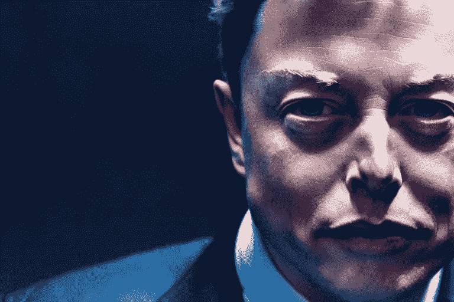

# 埃隆·马斯克最终会学会如何尊重开发者

> 原文：<https://levelup.gitconnected.com/elon-musk-will-eventually-learn-how-to-respect-developers-e92ab7716710>

## 因为一个大的技术平台无法在高质量开发者的常规支持下生存

作者用 AI 工具做的

在周五发布了一张放置在墓碑上的公司标志照片以回应最近袭击 Twitter 的混乱之后，埃隆·马斯克证明了他不缺乏有争议的反复无常的 Twitter 风暴，不管情况有多困难。许多前员工在推特上看到他的活动后，对他是否在故意破坏公司感到困惑。

自从他上个月接管 Twitter 以来，Twitter 已经经历了大规模裁员，广告商抵制，剩余员工辞职，甚至破产警告。我们不知道 Twitter 上的新趋势- #RIPTwitter 和#TwitterMigration 会把公司引向何方，但在这里我们会从核心了解问题所在。

# **开发者正在离开 Twitter**

在马斯克于 11 月的第一周向该公司一半的员工展示了退出大门后，Twitter 只剩下 3750 名员工。此外，他解雇了微博网站的许多关键员工，结束了一场非常公开的争论。

> 马斯克周四给了他们一个下午 5 点的时间，让他们决定是接受“高强度的长时间工作”和“极其顽固”还是接受“三个月的遣散费”，之后这些工人中有数量不明的人在一夜之间辞职。“据报道，75%的人倾向于遣散费，这使得 Twitter 的员工不到 1000 人。

这一离职伤害了 twitter 的几乎每个部门，包括新闻团队，这意味着 Twitter 内部发生的事情将只是猜测。然而，前雇员正在填补空缺，但这并不使任何事情正式化。

据那些仍然可以访问公司内部 Slack 聊天系统的人说，数百名 Twitter 员工表示，他们打算在周四的最后期限之前离开。这些员工发送了告别短信、表情符号和其他符号。

Twitter 的前员工将所有的愤怒发泄在 slackboard 上，通过写下“平庸的男人孩子”和“毫无价值的亿万富翁”等内容来侮辱他。

> Twitter 的一名员工写道，*“作为 Twitter 的一名工程师，我可以证实，埃隆·马斯克根本不了解我们的网站或代码。不骗你，我们在他背后笑得很开心。我们一直称他为“首席执行官”，但它代表代码效率 0。”*

收到邮件的两名员工——一名接受了遣散费，一名仍在工资单上——证实，Twitter 管理层发布了一封未签名的电子邮件，宣布员工胸卡访问将被暂停，其办公室将关闭至周一，但没有提供任何解释。出于对惩罚的担忧，他们同意匿名。

所以，我们来为你总结一下情况；Twitter 最重要的员工曾经是公司的重要组成部分，现在他们都走了，广告商呼吁抵制，开发者也辞职了。现在发生了这么多事。

# Twitter 会崩溃吗？

由于几名工程师在马斯克发出最后通牒后离开，越来越难以排除 Twitter 彻底崩溃的可能性。**这位首席执行官关于“更加工程驱动的”公司和“那些编写伟大代码的人将构成我们团队的大多数”的劝说似乎并不奏效。**

在马斯克解雇了大约 3500 名员工和 2000 多名员工辞职后，现在有人担心该网站可能会出现技术故障和漏洞，有迹象表明 Twitter 背后复杂的基础设施已经开始老化。转发和双重认证都存在困难。

根据伦敦大学学院教授史蒂文·默多克的说法，Twitter 将难以处理复杂的故障；他补充说，即使公司雇佣新员工或重新分配现有员工，即使交接过程顺利，学习相关系统如何工作也需要几个月的时间

> 此外，前安全主管 Peiter Zatko 就该公司糟糕的信息安全系统提出了警告。他担心 Twitter 可能会受到“Equifax 级别的黑客攻击”，指的是 2017 年对一个暴露了 1.47 亿美国人个人信息的信用卡的攻击。

地球上最大的表演“2022 年国际足联世界杯”将于周日开始。在这段时间，推特会变得非常繁忙，因为推文激增，给它的系统带来压力。当 Twitter 的趋势页面受到影响，其微服务不断被关闭时，该公司将如何应对这些变化仍有待确定。

# **推特破产的可能性有多大？**

截至目前，Twitter 几乎没有盈利。它的用户群和利润与 Tiktok 的脸书相比不值一提。然而，在埃隆·马斯克接手之前，没有人会相信这家公司会破产。他说，如果 Twitter 赚不到更多的钱，破产可能是不可避免的。

马斯克将估值定为 440 亿美元，将公司私有化。他抛售了一些特斯拉股票，让 Twitter 背上了 130 亿美元的债务。举例来说，这笔债务相当于该公司 2022 年预期收益的约 7 倍。这就像一张每年支付 10 亿美元的大型信用卡。这是 Twitter 的一个担忧，因为它去年用于偿债的现金流只有 6.32 亿美元。

我们仍在试图理解为什么马斯克会花大价钱收购 Twitter。投资公司 Wedbush Securities 将此次收购称为科技行业中定价最高的收购之一，估计 Twitter 的价值不超过 250 亿美元。

马斯克像骡子一样倔强，贡献了 90%利润的主要广告商，如辉瑞、联合航空和通用汽车，在混乱中停止了在平台上的广告，这一事实现在正在扼杀该公司。

# **埃隆马斯克现在能做什么？**

哈佛大学商学院副教授吴叶彬研究了埃隆·马斯克的收购案，他表示，假设马斯克可能会用更多的特斯拉股票来拯救 Twitter，或者寻求他的共同投资者骨干的支持，这些人几乎肯定不会有问题找到资金。

> 但考虑到 Twitter 负债 130 亿美元的事实，这些投资者可能会回头，在这种情况下，马斯克别无选择，只能申请破产。

如果 Twitter 破产，贷款人和投资者将接管该公司，而埃隆·马斯克将担任首席执行官。这将使他能够为债务再融资并稳定公司。

**这位亿万富翁赌上了一切**——从特斯拉股票到员工的福利。一家公司是由人经营的，他们的福祉和盈利能力一样重要，因为他们是从基础上建立一家公司的人。

在马斯克接管公司之前，Twitter 曾经是一个深受员工关心和喜爱的地方。目前，该公司只剩下一个野心勃勃的领导者和可能累死累活的员工。

许多人说，他不应该把开发人员当成陌生人，因为这可能会适得其反，因为开发人员现在对 Meta、亚马逊和 Twitter 等大公司没有什么信心。我们不知道这种组合将如何运作，也不知道 Twitter 的命运写了什么。但上一次埃隆·马斯克没能给你惊喜是什么时候？

***感谢阅读。请分享你对推特传奇和埃隆·马斯克的看法。***