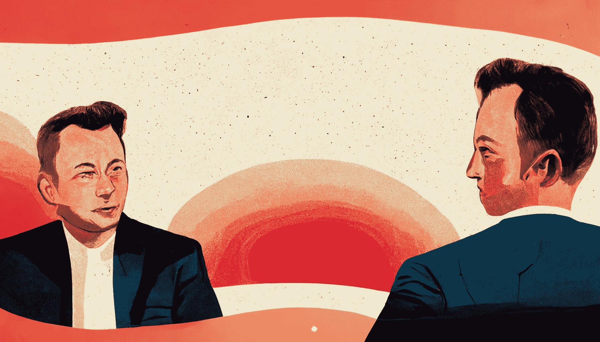

# 如果埃隆·马斯克 22 岁，他会怎么做？

> 原文：<https://levelup.gitconnected.com/elon-musk-would-do-these-if-he-were-22-314449b95adf>

## 最有见地的采访之一，从中可以学到很多东西

作者中途创作的艺术

你会对 20 岁的你说什么？或者如果可以重来你会学什么？这些问题不一定需要回答，而是寻求“人生的教训”。听到像埃隆·马斯克这样的成功人士回答这类问题既有趣又有教育意义。

埃隆·马斯克不需要介绍。SpaceX 和特斯拉汽车公司的创始人无疑一直在塑造我们的未来。贝宝的联合创始人、ZIP2 的开发者埃隆·马斯克(Elon Musk)推出 SpaceX 是为了让火星殖民化，并让整个火箭发射过程更具成本效益。他最近共同创立了几家新企业，包括 SolarCity、Neuralink、The Boring Company 和 OpenAI。

有人说他是钢铁侠，的确如此。许多人说他不是人类，而是外星人。他的能力没有界限。埃隆·马斯克不仅仅是为了创建公司而创建公司；他对技术的热情和对地球留下积极影响的热情是大多数人最喜欢他的地方。

马斯克在高中时有两门最喜欢的课程——而且在这两门课上，他都表现出色。在“第三排特斯拉”播客上，他说，“当我在高中时，我在两个领域取得了优异成绩；物理学和计算机科学。这是我最擅长的两门课。”最近在 Y Combinator 的采访中，YC 前总统山姆·奥特曼(Sam Altman)问埃隆，如果他今天 22 岁，他会做什么。这是他的回答-

萨姆:……如果你今天 22 岁，你会考虑解决的五个问题是什么？

*埃隆:如果有人在做对社会有益的事情，那是好事。它不一定要改变世界…如果你在做对人们有很高价值的事情，坦率地说，即使是像一个小游戏或照片分享方面的一些改进，我认为这也没什么。*

首先，马斯克无疑会涉足人工智能领域。他与采访者山姆·奥特曼(Sam Altman)共同创立了人工智能业务 OpenAI。在每次采访中，他总是花时间讨论人工智能以及它将如何影响人类的未来。他经常被问及天网的可能性或人工智能是否会最终消灭人类。埃隆长期以来一直担心人工智能机器人的危险，甚至预测类似于“终结者”的“可怕结果”。在人类被彻底毁灭之前，他似乎在独自采取行动。

他补充道，

> “但就最有可能影响人类未来的事情而言，可能是近期内最有可能影响人类的单个最大项目，所以我们以一种好的方式迎接人工智能的到来是非常重要的，但如果你能看到水晶球并看到未来，你会喜欢这种结果，因为这是我们多次谈论过的可能出错的事情，所以真的需要确保它是正确的。致力于人工智能，确保它有一个美好的未来，这是我现在认为最重要的事情。”

马斯克感兴趣的下一件事是遗传学。类似于 1997 年电影《Gattaca》中的角色，他从事基因工程来追逐他的太空飞行的野心。马斯克说，当他年轻的时候，他认为能够改变人类 DNA 可能会改变世界，

根据马斯克在采访中的说法，由于 Crispr 等创新，这种情况已经发生了。

> *“那么，我会说任何与遗传学有关的事情。如果你真的可以解决遗传疾病，如果你可以通过基因重组来预防痴呆症或阿尔茨海默氏症或类似的疾病，那就太好了。所以我认为遗传学可能是第二重要的项目。*
> 
> *我们目前带宽有限。我们拥有电子邮件功能、电脑、应用程序和手机形式的数字第三自我。我们实际上是超人。*
> 
> 但是我们在大脑皮层和你自己的第三代数字形式之间的接口上受到极大的带宽限制。在未来，我相信帮助解决带宽限制也很重要。”

埃隆·马斯克在采访中提到，可持续能源、互联网、计算机科学和太空旅行是他在大学时的舒适区。几年后，他正以无限的热情从事这些工作。

他是一位连续创业者，利用出色的品牌、营销和招聘来应对现实世界的科学和工程挑战。他不亚于一个魔术师。但是他的魔术是否会把我们引向一个反乌托邦的未来将是一个永无止境的争论。但在当今世界，如果你 20 多岁，这是成为埃隆·马斯克的大好时机。

*礼遇:* [*youtube*](https://www.youtube.com/watch?v=vVnDE8wSrVo)