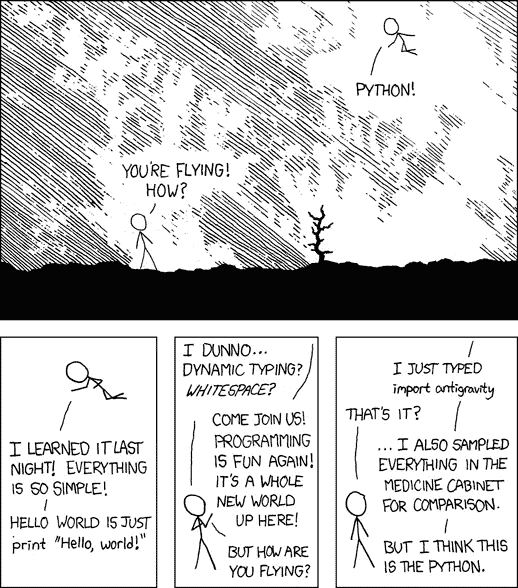

# 让你成为专家的 Python 特性。

> 原文：<https://levelup.gitconnected.com/elusive-python-features-that-will-make-you-an-expert-aaa50c2a6606>

照片由[乔治·贝克尔](https://www.pexels.com/@eye4dtail?utm_content=attributionCopyText&utm_medium=referral&utm_source=pexels)从[派克斯](https://www.pexels.com/photo/addition-black-and-white-black-and-white-chalk-374918/?utm_content=attributionCopyText&utm_medium=referral&utm_source=pexels)拍摄

*请注意，本文使用 repl.it 以交互方式展示代码示例。加载这些文件可能需要几秒钟时间。相信我，等待是值得的。*

Python 是一种非常强大的语言。它有丰富的语法，强大的语言功能，和一些随机的乐趣，不那么严重的复活节彩蛋。这只是我多年来发现的一小部分东西。这些例子是交互式的，所以一定要点击播放按钮，弄乱代码。

# 有趣的事情。

我将从这门语言中一些有趣的、深奥的东西开始。

## 吊带

是对其他语言和来自这些语言的用户的一些困惑的有趣尝试。请注意，您将得到一个错误。但错误信息是开玩笑的——“没戏”。我们仁慈的[ex](https://mail.python.org/pipermail/python-committers/2018-July/005664.html)-[BDFL](https://en.wikipedia.org/wiki/Benevolent_dictator_for_life)Guido Van Rossum 以一种不那么微妙的方式表达了他对在语言中添加括号的想法。

## 这

`import this`将带你领略 Python 的禅意。这些是帮助您编写干净的/“python 式”代码的一组分层指导原则。虽然是为 Python 编写的，但它们也非常适合其他编程语言。

## 无重量

如果你`import antigravity`那么*嘲笑*好吧…试试看。(这一个，你必须在一个终端中尝试，因为它不能在 repl.it 上工作)

[https://xkcd.com/353/](https://xkcd.com/353/)

# 环

## For/Else 语句。

For 循环可以有`else`语句！你得小心这个。乍一看，您可能会认为这意味着如果没有什么可迭代的，那么它应该做 else 块中的事情。

如果你不`break`置身事外，它实际上是用来捕捉的。例如，如果您正在检查某个值是否存在于列表中。如果你找到它，那么`break`，如果你没有找到它，那么你的 else 函数在那里处理这个情况。

## 字典键

在 python 中，你几乎可以使用任何东西作为键。

"..字典键必须是[不可变](https://en.wikipedia.org/wiki/Immutable_object)的类型。例如，可以使用整数、浮点数、字符串或布尔值作为字典键。[ [ref](https://realpython.com/lessons/restrictions-dictionary-keys-and-values/#:~:text=Dictionaries%20in%20Python&text=First%2C%20a%20given%20key%20can,particular%20key%20more%20than%20once.) 这意味着布尔甚至*元组*都可以用作键！但是列表和字典不是。

## 开关

Python 没有 C 或其他语言中常见的开关。switch 只是一个花哨的`if/elif/else`语句，但也许你想要花哨。制作 Pythonic 开关的一种方法是使用值为 lambda 或函数的 map(使用如上所述的不可变键)。

## 数据类

[数据类](https://realpython.com/python-data-classes/)基本上是灵活的接口。当你实现这个接口时，你得到了一个额外的好处，拥有一个令人垂涎的*点符号*！

在实例化 dataclass 对象时，也可以使用字典分解。

为了从数据类中得到更多的数据，可以使用像 Howard 这样的库，它会递归地将你的对象编组为一个富对象。(一定要去看看！)

## 默认值

第一次运行`test_default`函数，得到`['arst', 'A']`，但是第二次，得到`['arst', 'A', 'B']`。这是因为你修改的是对`bob`的引用，而不是你所想的`bob`的新实例。相反，为了避免这种情况，请尝试将您的默认参数设置为`None`，然后将该值更改为您的列表。

***不好:***

***好:***

如果您使用像 PyCharm 这样的 IDE，当您尝试使用可变默认值时，会得到一个警告。

# `id`功能

这个有点不幸。`id`是内置的功能。它的实际目的是获取某个东西的内存位置。例:`id(my_var)`。你能想到什么时候你可能想要调用一个变量`id`？*一直*？一样。你可以忽略它，但是 ide 会抱怨的。

# 结论

Python ( [像任何语言](https://twitter.com/alairock/status/1276691132924100610?s=20)一样)有一些古怪而酷的特性。有时候他们很烦人。有时候他们会让你觉得比斯诺登还 l33t3r。了解你正在使用的语言的来龙去脉会让你像一个工匠一样编程。这些只是我认为值得分享的一小部分东西。编码快乐！

*Skyler Lewis 是犹他州硅坡地区的一名连续创业工程师。他目前正在* [*Hivewire*](https://www.hivewire.co/) *构建下一代工作流软件。*

来自 Level Up Coding 的提示:订阅我们的 [YouTube 频道](https://www.youtube.com/channel/UC3v9kBR_ab4UHXXdknz8Fbg?sub_confirmation=1)或加入 [Skilled.dev 获取编码面试教程和职业建议](https://skilled.dev)。

 [## 编写面试问题

### 掌握编码面试的过程

技术开发](https://skilled.dev)