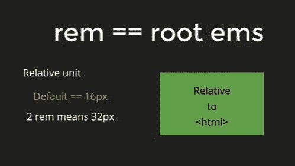

# em、rem 和 px

> 原文：<https://levelup.gitconnected.com/em-rem-and-px-e147619c26ee>

关于基本 CSS 单元的快速说明。看完这篇文章，你会彻底了解这三位互联网骑士！

像素、EM 和 REM 在 CSS 世界中非常流行，但是它们经常被混淆和相互误解。所以不再赘述，让我们先来看看**像素**！

图片来自 Hitesh Chaudhary

它们是 CSS 中最常用的单元，你唯一需要理解的是，如果你将一个元素的大小调整到 100 像素，那么它在你的笔记本电脑屏幕上会看起来很大很巨大。当你想在更小的屏幕上看同样的内容时，问题就来了，比如你的手机屏幕，因为它在手机屏幕上也会有同样巨大的外观。所以当你设计响应式网站时要小心，因为与 em/rem 相比，**像素不是动态的。**

图片来自 Hitesh Chaudhary

**另一方面，新兴市场完全是相对于他们的父母而言的。**举个例子，假设你有一个 **< div >** 标签，你把它的大小指定为 **10px** 。现在，如果你在 **< div** >标签中定义了一个 **< p >** 标签，大小为 **2em** ，这意味着它的大小将是其父标签的两倍，在我们的例子中是 10 像素*的 2 倍，即* **20px** 。现在，这里的问题是，如果你有太多的嵌套，并且在一个 em 中定义了每一个嵌套标签下的每一个标签，就会变得非常混乱。例如，假设您的 **< body >** 标签被定义为 **32px** ，在其中，您定义了一个 **2em** 的 **< div >** 标签，这意味着您的 **< div >** 标签现在是 **64px** ，现在如果这个**
所以基本上它太相对于它的父母，因此要小心使用它！**

图片来自 Hitesh Chaudhary

现在我们得到的第三个伙伴是 REM(根 EM)。老实说，REM 比 CSS 中的任何其他单元都要简单和相关。 **REM 总是相对于根< html >标签。** **HTML 标签默认为 16px** ，所以如果你定义一个 **< h1 >** 标签的大小为 **2rem** ，那么就意味着它的大小是 2 乘以 16，也就是 **32px** 。所以不管你的代码有多混乱和嵌套，它总是相对于根 HTML 标签，默认情况下是 **16px** 。

基本上就是这样，我希望你得到了你想要的。我知道距离上一篇文章已经有一段时间了，这是因为仍然有一个 JavaScript 空白我们还没有覆盖。在那之前保重:)

[GitHub](https://github.com/ritchiepulikottil)

[领英](https://www.linkedin.com/in/ritchie-pulikottil-6876341aa)

[推特](https://twitter.com/dloqcamguy)

[Instagram](https://instagram.com/ritchiepulikottil)