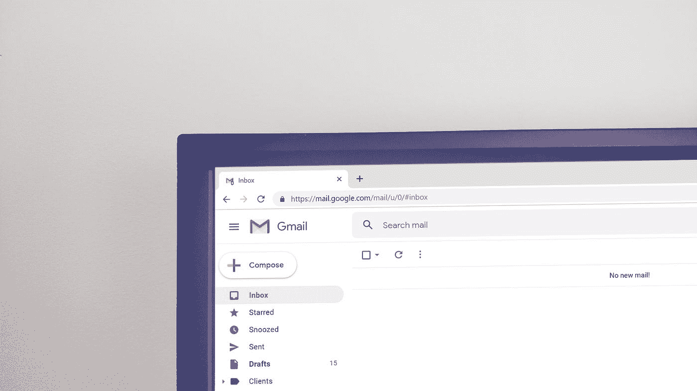
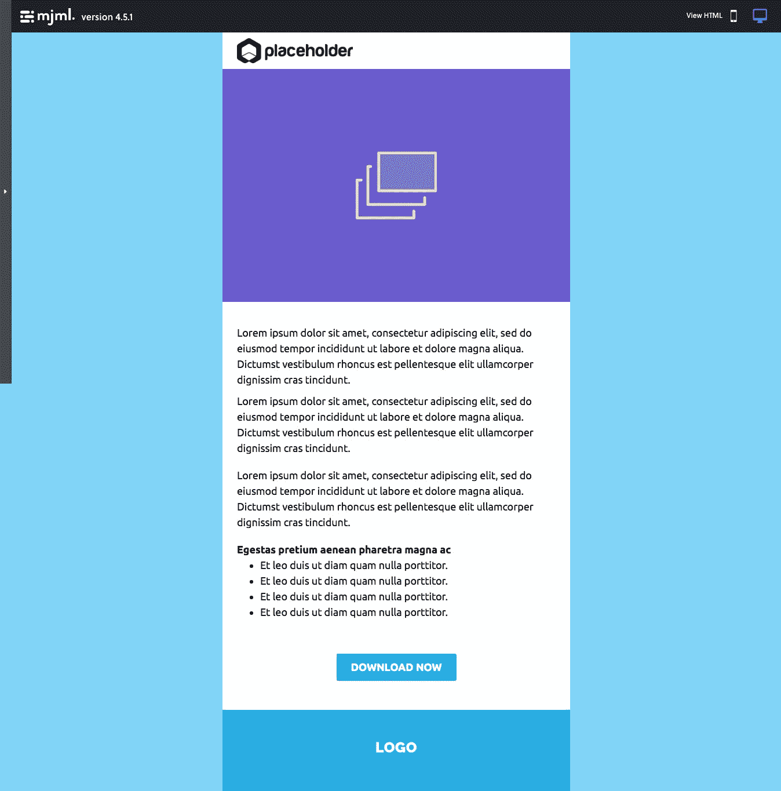
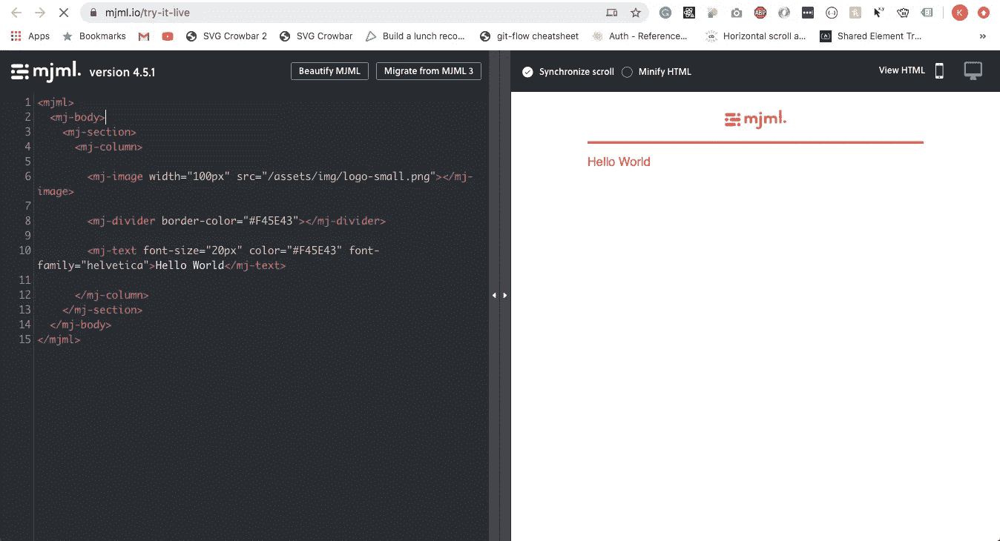

# 电子邮件开发糟透了，让我们用 MJML 让它变得更好

> 原文：<https://levelup.gitconnected.com/email-development-sucks-lets-make-it-better-with-mjml-a4a475a2fe1a>



照片由 [Krsto Jevtic](https://unsplash.com/@krstoj?utm_source=medium&utm_medium=referral) 在 [Unsplash](https://unsplash.com?utm_source=medium&utm_medium=referral) 上拍摄

在不得不写内嵌样式、担心 Outlook 的问题(有很多)和写表格之间，好像我还停留在 90 年代。开发 HTML 邮件吹。一些优秀的服务使得开发 HTML 电子邮件的需求不复存在。太好了，哇哦。文章结束。

> 但是，我们需要更多的定制和更友好的品牌。

MJML 是我最喜欢的电子邮件框架。该框架有许多带有样式覆盖的预建组件。然后，你将这些组件编译成常规的 HTML 格式，内嵌所有样式，每一个 Outlook hack 都能让一切按照 Gmail 的意图运行。如果你是 react 开发者，一旦你看了文档[你会发现一个相似的模式。如果你是一个懂一点 HTML 知识的设计师，你会很快学会的。如果你是我，六年前我还是一名设计实习生，负责制作响应性 HTML 邮件的原型，很抱歉当时还没有这个功能。这可能会省去一些 outlook 形象问题上的麻烦。](https://mjml.io/documentation/)

MJML 附带了一个 [NPM 安装](https://github.com/mjmlio/mjml#installation)如果你喜欢那种东西的话。不过对于这次运行，我们将使用一个 web 版本[来将代码转换成生产就绪的 HTML，稍后会详细介绍。](https://mjml.io/try-it-live)



我们将对此进行编码

如果你看一下上面的例子，你会注意到这封邮件有四个部分，徽标、标题图像、内容+ CTA 和页脚部分。

# 让我们写一些代码



MJML web 编辑器

让我们清除除基本 mjml 标记和主体之外的所有内容。

```
<mjml>
  <mj-body>

  </mj-body>
</mjml>
```

如果我们看我们的例子，我们看到背景颜色是蓝色，我们可以通过`background-color`属性在`mj-body`中设置它。我们要编码的第一个部分是徽标部分。该部分有一个白色背景、一些填充和一个图像。我们将利用`mj-section` `mj-column` `mj-image`及其属性。

如果你看一下`mj-section`，你会看到一些类似于 CSS 属性的属性。你应该把`mj-section`看作行，它们对你的电子邮件的结构和布局至关重要。您需要在这里设置所有部分的填充和边距。`mj-column`就是它听起来的样子，一个专栏。你可以在一行中有多个专栏，但那是不同的博客文章。您会注意到，我还为这个组件设置了填充。MJML 在每个组件上都有默认的填充，你必须用`0`覆盖它们。`mj-image`只是形象的组成部分。你必须以像素为单位设置宽度，默认情况下高度设置为自动。您将像平常一样设置`src`。

我们的下一部分是标题图像部分。当你为你的邮件建立不同的部分和模块时，你会注意到很多冗余。这里我想指出的一点是在`mj-image`中使用了`href`，添加该属性将告诉 MJML 编译器在`img`标签周围添加一个`a`标签。

内容部分，很长。它还介绍了一些新的 MJML 组件。`mj-wrapper` `mj-text` `mj-button`。`mj-wrapper`包装具有相似属性的组件，在我们的例子中，我只添加了背景色。`mj-text`是一个文本组件，可以通过所有`font-size` `line-height` `font-weight`。您还可以在`mj-text`中添加任何 HTML 组件，如`ul`和`li`。

上面我建议你应该在`mj-section`级别添加所有的填充。如果你注意到了，我把所有的填充都设置在了`mj-text`级别。我个人喜欢在文本周围设置填充，如果我想缩进一个段落，会更容易一些。数学什么的。

在我心中有一个特殊的位置，它解决了 outlook 中所有的按钮问题。不再有按钮作为图像。你可以把那些扔掉。它像一个`mj-text`标签一样工作，通过设置字体属性，但也允许背景颜色和边框。

页脚包含一个带有背景色的徽标。你也许可以只使用一个`mj-section`而不使用`mj-wrapper`，但是在这个设计的其他迭代中，对于社交图标，你将需要另一个`mj-section`来保存它们。

吼吼，我们完了！

> 但是 HTML 在哪里呢？


如果你看右上角，有一个查看 HTML 按钮，点击它。看到所有漂亮的 HTML 输出。很可爱。所有的样式都是一行一行写出来的，你有所有多余的微软 Office 代码。它甚至用链接包裹了你的图片。如果你点击这个小电话图标，你还可以看到你的电子邮件的回复。

如果你浏览上面的 HTML，你会看到我对不同的部分或部分有评论，我可能想让它们在 Mailchimp 或 Hubspot 中可编辑。解析所有的 HTML 代码要容易一点。

MJML 很棒。这让我节省了数百个小时来创建电子邮件，并在多个电子邮件客户端上进行测试。它解决了所有的 Microsoft Outlook 问题，甚至变得有反应了！还有很多其他的东西我没有在这里介绍，但是你应该阅读[文档](https://mjml.io/documentation/#getting-started)来了解其他的东西。