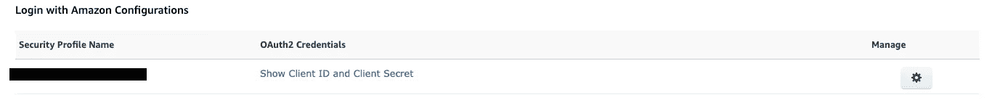
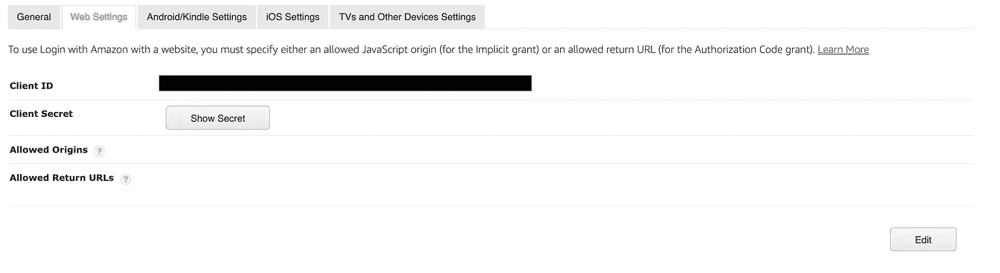

# 使用 Lambda、SMAPI 和 SES 向自己发送每日 Alexa 技能指标更新的电子邮件

> 原文：<https://levelup.gitconnected.com/email-yourself-daily-alexa-skill-metrics-updates-using-lambda-smapi-and-ses-9c16ac97c1f8>


由[威廉·沃比](https://unsplash.com/@wwarby?utm_source=medium&utm_medium=referral)在 [Unsplash](https://unsplash.com?utm_source=medium&utm_medium=referral) 上拍摄的照片

## 每天将您的最新技能指标发送到您的收件箱，因为登录控制台太难了

我坚信监控 Alexa 技能指标的好处——除了当野外出现问题时它们可以给你重要的警告之外，观看良好的指标攀升也是非常令人愉快的！在本教程中，我们将学习如何安排 Lambda 通过 Alexa 技能管理 API (SMAPI)获取你的技能指标，并将这些指标发送到你的收件箱，所有这些都使用无服务器框架进行管理。

SMAPI 是一个 API，它提供了 ASK CLI 或 Alexa 开发人员控制台中的所有相同功能。SMAPI Node.js SDK 使我们能够执行这些操作，比如从 Lambda 函数中检索技能指标数据。

# 获取用于 SMAPI 身份验证的 LWA 令牌

SMAPI 通过使用 Amazon (LWA)令牌登录来验证调用，所以我们的第一步将是检索一个 LWA 刷新令牌，我们可以在 Lambda 函数中使用它来检索我们想要的指标。SMAPI SDK 将能够在任何时候调用我们的 Lambda 时将这个刷新令牌交换为有效的访问令牌。为了获得 LWA 刷新令牌，您需要通过 LWA 控制台配置 LWA 安全配置文件，如下所示:

1.  访问 [LWA 控制台](http://login.amazon.com)并登录。
2.  如果您以前没有创建过安全配置文件，您将看到如下内容:


单击“Create a New Security Profile ”(创建新的安全配置文件)按钮并填写必填字段，将使我们能够访问获取 SMAPI 使用的令牌所需的凭据。

3.创建个人资料后，您将看到以下屏幕:



我们将使用 ASK CLI 将我们的 LWA 客户端 ID 和客户端密码交换为一个刷新令牌，我们将能够在 lambda 中使用该令牌。为了使用 ASK CLI 生成此令牌，我们需要更改安全配置文件中的 Web 设置。可以通过单击安全配置文件最右侧的齿轮图标，然后单击“Web Settings”来访问 Web 设置这将显示以下视图:



我们需要将`http://127.0.0.1:9090/cb`和`[https://s3.amazonaws.com/ask-cli/response_parser.html](https://s3.amazonaws.com/ask-cli/response_parser.html)`添加到允许返回的 URL 列表中，可以通过点击右下角的编辑按钮进行修改。

4.我们现在准备申请我们的 LWA 令牌！我们将使用 ASK CLI 将我们的安全配置文件中的客户端 Id 和客户端密码交换为刷新令牌。如果这是您第一次使用 ASK CLI，您首先需要使用`npm install -g ask-cli`安装它，并通过运行`ask configure`配置您的 ASK CLI 凭据。一旦完成，运行`ask util generate-lwa-tokens --client-id **{your LWA Client ID}** --client-confirmation **{your LWA Client Secret}**`将输出一个访问和刷新令牌——刷新令牌就是我们想要的，因为它将允许我们稍后在 lambda 中使用 SMAPI 进行身份验证。

# 建立架构

现在我们可以进行 SMAPI 调用了，我们准备开始部署一些云资源了！我们的架构将涉及一个由 EventBridge 规则触发的 Lambda，它将通过 SMAPI 检索技能的指标，然后使用 SES 通过电子邮件发送这些数据。我们将使用无服务器框架来管理我们的云资源；这使得安排我们的 Lambda 变得非常容易，因为 Serverless 提供了一个`schedule` Lambda 事件，它负责为我们设置 EventBridge 规则。

## 机密管理

因为我们在 Lambda 中处理秘密，并且我们喜欢以正确的方式来玩，所以我们将使用 SSM 参数存储来存储我们在前面的步骤中创建的秘密和刷新令牌。记住这一点，我们现在可以将我们的 LWA 客户端 id、密码和刷新令牌作为 SecureString 类型的参数添加到 SSM。出于本教程其余部分的目的，我将假设我们已经分别用参数名 LWA _ 客户端 _ID、LWA _ 客户端 _ 秘密和 SMAPI _ 刷新 _ 令牌存储了这些值。

## 创建堆栈

为了构建我们的无服务器堆栈，我们将从一个名为 sendNightlyUpdate 的 lambda 函数开始，并配置一个事件在 UTC 时间每天晚上 11:59 触发 Lambda:

```
sendNightlyUpdate:
  handler: handler.sendNightlyUpdate
  events:
    - schedule: cron(59 23 * * ? *)
```

我们在这里提供给 cron()的参数表示我们希望 Lambda 被触发的分钟、小时、月、日和年——您可以在这里找到关于 cron()调度 AWS 事件[的更多细节。](https://docs.aws.amazon.com/AmazonCloudWatch/latest/events/ScheduledEvents.html)

现在，我们需要确保我们的 Lambda 函数具有正确的 IAM 角色，能够访问我们在 SSM 的秘密(ssm:GetParameters)并通过 SES 发送电子邮件(SES:sendmeil)。这些角色的添加为我们提供了以下堆栈:

现在来看处理程序代码！

# λ处理程序代码

我们剩下要做的就是在 lambda 处理程序中编写我们需要的代码，以获取我们的技能指标，并通过电子邮件发送它们。这将有三个不同的步骤:从他们在 SSM 存储的地方获得秘密和令牌，通过 SMAPI 检索我们的技能指标，并使用 SES 发送电子邮件。我将把每一步分解成它自己的功能。让我们从把秘密带出 SSM 开始:

我们使用`SSM.getParameters()`来保持 API 调用最少；这个方法为我们提供了对 parameter 对象数组的访问，我们将其格式化为参数名到值的映射，以便在剩余的代码中进行更清晰的访问。

接下来，我们将编写一个函数，该函数将接受这些秘密以及我们感兴趣的技能的技能 Id，并返回我们选择的指标:

我们的`getMetricForSkill`函数的第一个参数 metric name 是一个字符串，表示我们希望为我们的技能检索的特定度量。SMAPI 支持检索描述独特客户、会话、话语等数量的多个指标——您可以在[这个](https://developer.amazon.com/en-US/docs/alexa/smapi/metrics-api.html#metric-values)文档中找到您可以检索的指标的完整列表。

我们用于指标检索的 SMAPI 方法是`getSkillMetricsV1`，它采用允许您指定检索指标的 skillId、指标时间周期的开始和结束时间、指标的聚合周期、您的技能阶段以及您检索指标的技能类型的参数。在这里，我们请求将我们的指标聚合到一个单独的数据点，用于实时定制技能的最后 24 小时。`getSkillMetricsV1`有更多的可选参数，允许您对指标检索进行更细粒度的控制，完整的描述可以在[这里](https://developer.amazon.com/en-US/docs/alexa/smapi/metrics-api.html#request-parameters)找到。

我们可以在 SMAPI 响应的 *values* 数组的第一个条目中找到我们的指标，并且知道第一个条目将包含我们正在寻找的数字，因为我们请求了类型为 SINGLE 的聚合周期，这意味着数据将被加起来成为一个单一的总和。

现在，我们需要的是一个允许我们通过 SES 发送电子邮件的功能:

SES Node.js SDK 为我们提供了一个`sendEmail`函数，我们可以将目的地和源地址以及消息体和主题传递给它。需要注意的是，如果您的 AWS 帐户仍然在 ses 的沙盒中，那么您只能通过 SES 控制台向您已经验证的电子邮件地址发送电子邮件。使用 SES 验证电子邮件地址的过程非常简单，只需点击发送到该地址的确认电子邮件中的链接——您可以在这里[找到该过程的分步说明](https://docs.aws.amazon.com/ses/latest/DeveloperGuide/verify-email-addresses-procedure.html)。如果你想发送电子邮件到任何地址，你可以通过提交请求来退出沙盒模式，如[这些说明](https://docs.aws.amazon.com/ses/latest/DeveloperGuide/request-production-access.html)中所述。SES 对所有帐户都是在沙盒中开始的，所以如果你还没有采取行动摆脱它，你可能还在沙盒中。

最后，我们可以将 lambda 处理程序中的 3 个步骤联系在一起:

一个`serverless deploy`晚了，嘣！我们现在有一个计划好的夜间 lambda 作业，它将获取我们为给定技能选择的技能指标，并通过电子邮件发送给我们。不仅如此，我们现在还知道如何通过 Node.js SDK 与 SMAPI 交互，这为各种 Lambda 自动化提供了可能性。让我知道你是如何创造性地运用这些能力的！

## 资源:

[SMAPI 的 AWS 文档](https://developer.amazon.com/en-US/docs/alexa/smapi/smapi-overview.html)，其中关于获取访问令牌
[的](https://developer.amazon.com/en-US/docs/alexa/smapi/metrics-api.html#metric-values)[部分](https://developer.amazon.com/en-US/docs/alexa/smapi/get-access-token-smapi.html)文档描述了通过 SMAPI
[使用](https://developer.amazon.com/en-US/docs/alexa/smapi/metrics-api.html#request-parameters)getskillmetricsv 1 方法
[如何](https://docs.aws.amazon.com/ses/latest/DeveloperGuide/verify-email-addresses-procedure.html)验证用于 SES 沙箱的电子邮件地址
[SES 沙箱中的限制](https://docs.aws.amazon.com/ses/latest/DeveloperGuide/request-production-access.html)以及如何使用 cron 获得用于 AWS 事件
的

如果你正在寻找更简单的方法来掌握你的 Alexa 技能指标，你也可以看看 iOS 版的 Alexa Stats 应用程序——它允许你通过 iOS 应用程序检查你的技能。

[](https://apps.apple.com/us/app/alexa-stats/id1548502502#?platform=iphone) [## Alexa 统计数据

### 在旅途中获取您的 Alexa 技能指标使用 Alexa 从您的手机上关注您的所有 ALEXA 技能…

apps.apple.com](https://apps.apple.com/us/app/alexa-stats/id1548502502#?platform=iphone)