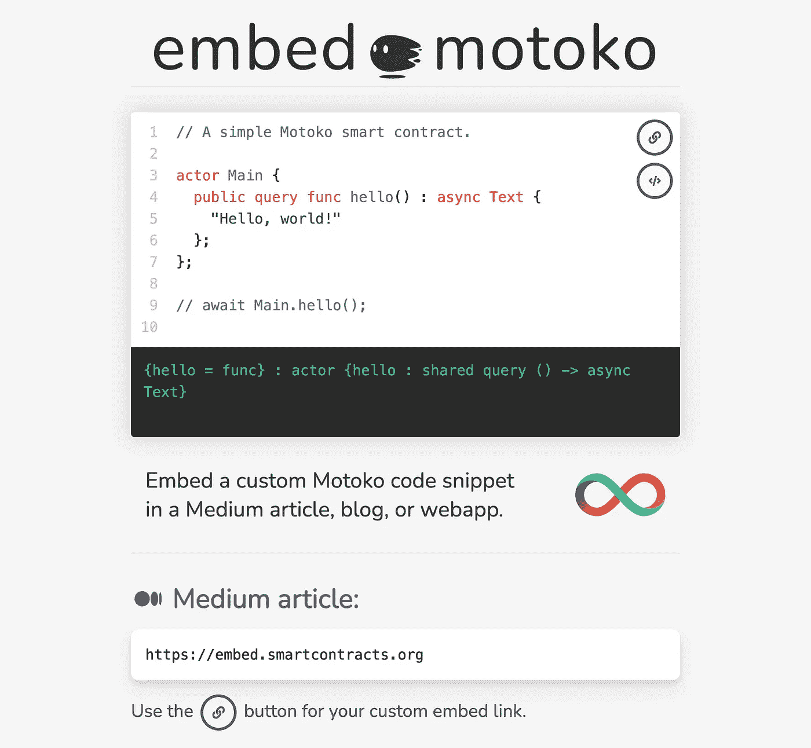
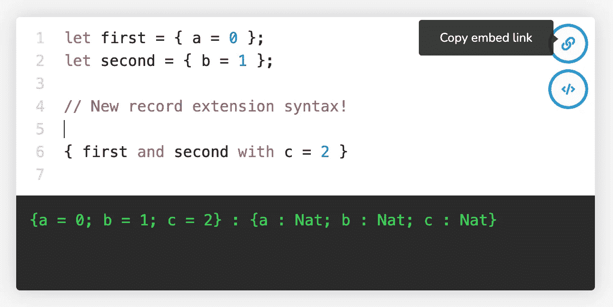

# 嵌入 Motoko:交互式智能合同到你的媒体故事或博客文章中！

> 原文：<https://levelup.gitconnected.com/embed-motoko-interactive-smart-contracts-in-your-medium-story-or-blog-post-58c85719eee6>

## **尝试编辑以下代码片段:**

如果你喜欢阅读或编写代码教程，你很幸运: [DFINITY](https://dfinity.org/) 最近与 [Embed.ly](https://embed.ly/) 合作，在 Medium 平台的任何地方集成 [Motoko](https://internetcomputer.org/docs/current/developer-docs/build/cdks/motoko-dfinity/motoko/) 代码片段。

## 它是这样工作的:

**1** 访问[embed.smartcontracts.org](https://embed.smartcontracts.org/)设计您的代码片段:

 [## 嵌入 Motoko

### 在中型文章、博客文章或 webapp 中嵌入自定义 Motoko 代码片段。

embed.smartcontracts.org](https://embed.smartcontracts.org/) 

**2** )点击界面右上角的“复制嵌入链接”按钮:

**3** )将链接粘贴到您的媒体故事中，然后按回车键:

## 就这么简单！

作为一名最近加入 DFINITY 的 Motoko 开发团队的互联网计算机(IC)社区成员，我几乎每天都使用这个工具来探索语言和尝试新的想法，而不必花时间重新部署智能契约。

如果你想了解更多关于 IC 生态系统的知识，我强烈推荐你写一些代码片段来巩固你从官方[文档](https://internetcomputer.org/docs/current/developer-docs/build/cdks/motoko-dfinity/motoko/)中获得的知识。这将有助于你对 Motoko 的语法有更深的直觉，尤其是如果你已经熟悉另一种编程语言，如 JavaScript、Python 或 Rust。

如果您最终想要将您的代码片段部署为一个罐式智能契约，我们可以满足您的需求。 [Motoko Playground](https://m7sm4-2iaaa-aaaab-qabra-cai.raw.ic0.app/) 允许你临时将你的项目部署到 IC mainnet，而无需设置钱包或者购买 [ICP](https://coinmarketcap.com/currencies/internet-computer/) 代币。这是一个非常酷的特性，我建议尝试一下，体验一下部署真实世界的智能合约。

 [## Motoko 游乐场-无限

### 由 DFINITY 为您带来的互联网计算机本地 Motoko 语言的游乐场

m7sm 4-2 iaaa-aaaab-QA bra-Cai . raw . ic0 . app](https://m7sm4-2iaaa-aaaab-qabra-cai.raw.ic0.app/) 

这种集成是一项正在进行的工作！我们正在积极开发这项嵌入式服务，所以如果您有任何想法、问题或错误报告，请随时[联系 GitHub](https://github.com/dfinity/embed-motoko/issues/new) ，这样我们就可以为每个人改进这个工具。

 [## GitHub - dfinity/embed-motoko:在中型文章、博客文章中嵌入自定义的 motoko 代码片段…

### 在您的媒体文章或网站中嵌入交互式 Motoko 代码片段。将以下链接粘贴到您的媒体中…

github.com](https://github.com/dfinity/embed-motoko#readme) 

感谢阅读！我期待看到您用这些交互式代码片段所创造的东西。

~瑞安