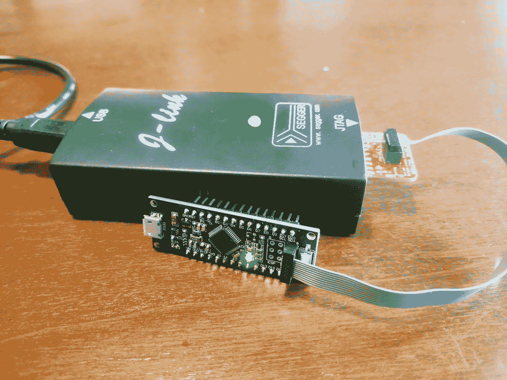
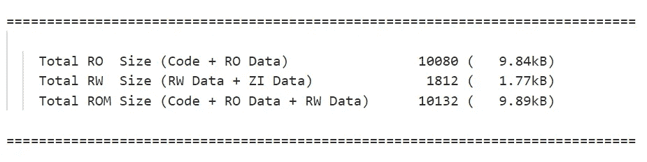
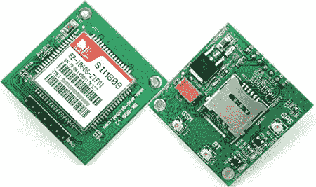
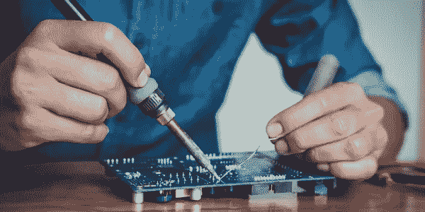

# 嵌入式开发—不要这样做！

> 原文：<https://levelup.gitconnected.com/embedded-development-dont-do-this-1-2-8de0b916e46c>

## 给单片机新手的四条有用建议。

嵌入式产品的实施需要提前做出一些决定:选择“正确的”微控制器绝非易事。我们应该考虑与硬件相关的参数，例如时钟频率、RAM 和闪存存储容量，但软件开发人员也对由抽象层、主板支持包和实时操作系统组成的丰富生态系统感兴趣，这只是其中的一部分。所有这些方面在一开始可能看起来势不可挡，潜在地隐藏了正确的选择。

## *今天我们将讨论程序员在进入嵌入式系统世界时会犯的四个常见错误，并且我们将提供如何逃离痛苦处境的建议/解决方案。*

# 1.不使用调试器

W 在开发非嵌入式应用程序时，使用调试器来修复运行时错误几乎是理所当然的。原因很简单:这个工具有望集成到我们的 ide 中，因此允许我们简单地按下按钮，进入调试模式。

使用 Keil Uvision IDE 调试视图。资料来源:keil.com

然而，当我们加入微控制器的世界时，事情略有变化。这里，软件调试工具意味着硬件调试器的存在，无论是外部的还是集成在我们的开发板中的。有经验的读者可能已经注意到，我还提到了*外部*调试器:事实上，许多评估板都没有调试器，如果我们想开始捕捉错误，就不得不购买另一个硬件。

使用 Segger J-Link 调试器和 JTAG 到 SWD 适配器调试 SAMD21 分线板

这导致了第一个嵌入式错误——也许是最可怕的错误——许多嵌入式新手根本不使用调试器*。因此，他们不仅很快失去了对代码的控制，还失去了对整个系统的控制:如果红色 LED 不闪烁，即使是著名的“blinky”应用程序(也称为微控制器的“hello world”程序)也会变得很痛苦，因为他们没有工具来检查微控制器的内部！*

## *硬件调试器是为了节省时间的挫折。我们绝对应该花一大笔钱去买一个。对于那些刚刚尝试嵌入式系统的人来说，即使是一个更昂贵的克隆系统也能完成这项工作。*

# *2.忽略内存使用*

*走出 RAM 在嵌入式环境中肯定是可行的。也许你在为你的线程分配栈的时候已经太多了，或者也许你依赖于一个第三方库来静态地分配一个巨大的数组。在这两种情况下，最好提前考虑这种可能性。*

*留意内存使用情况并不像听起来那么难:每个有礼貌的链接器都给我们机会生成一个所谓的**映射文件**，它将清楚地告诉我们的应用程序使用了多少字节。这个文件可以通过简单地向链接器传递一个附加标志来生成。例如，使用 [Keil UVision 5](https://www2.keil.com/mdk5/uvision/) 和 [ARM 编译器](https://developer.arm.com/tools-and-software/embedded/arm-compiler)，添加`--map`选项。*

*考虑下面的图像，它描绘了我个人参与的一个项目的地图文件的“图像组件大小”部分的一部分。这里最重要的是要明白:*

*   ***RAM** 将存储 RW 数据+ ZI 数据*
*   ***闪存**将存储代码+ RO 数据+ RW 数据*

**

*映射文件的一部分—使用 ARM 编译器 6.16 (armlink)生成*

*值得指出的是，映射文件无助于确定正确的动态分配需要多少内存。这就是为什么你应该仔细检查每一个`malloc` / `free`函数调用的原因之一。另一个原因是微控制器上的堆空间非常小(千字节数量级)，因此增加了[堆碎片](https://cpp4arduino.com/2018/11/06/what-is-heap-fragmentation.html)的可能性。*

## *应始终仔细考虑内存使用情况，尤其是 RAM，它通常小于闪存。让我们开始利用链接器来生成详细的映射文件，并对资源消耗有更多的了解。此外，malloc/free 不一定是邪恶的，但应该尽可能避免。*

# *3.盲目应用 OO 原则*

*这是我个人犯过很多次的错误！在我的计算机工程课上，我学到了各种[面向对象设计(OOD)](https://en.wikipedia.org/wiki/Object-oriented_design) 原则:如果像“低耦合”和“高内聚”这样的词你听起来很熟悉，那么很可能我们分享了我们的部分学术背景。*

**

*描述 9 个 GRASP 原则的图像，这些原则是开发面向对象软件的指导原则*

*然而，对微控制器编程涉及的远不止这些:小而有效的代码是一个主要问题，而可重用性并不总是可以实现的。此外，嵌入式固件通常采用一个[实时操作系统(RTOS)](https://en.wikipedia.org/wiki/Real-time_operating_system) 将执行逻辑拆分到单独的线程中，从而为 OOP 的基本应用增加了另一层复杂性。*

*例如，我曾经需要实现微控制器逻辑，通过串行端口向 GSM 调制解调器发送 [AT 命令](https://en.wikipedia.org/wiki/Hayes_command_set)，以便将传感器数据发送到 HTTP 服务器。我还需要使用一个 RTOS，结果我有不止一个线程需要与网络服务通信。*

**

*图示为 GSM 调制解调器分线板。来源:亚马逊网站*

*遵循 OO 原则，我创建了一个类，它的唯一职责是与调制解调器进行物理交互。非常干净。
但后来我搬起石头砸了自己的脚，因为许多线程被允许与 modem 类交互，因此需要互斥的资源访问。这个场景需要大量的调试和关于线程优先级的不必要的思考——如果我决定只从一个*线程访问调制解调器，这是可以避免的。**

## *通过创建无价值的抽象来盲目应用 OO 原则会使代码变得复杂，并使其在与嵌入式结构的兼容性方面不够理想。我们还应该考虑我们正在处理的系统的特性，比如设备外设、内存大小、计算能力和逻辑并发性。*

# *4.害怕硬件*

*软件工程师的心态很难改变:我们大多是喜欢玩计算机程序的极客。我们很多人对裸机根本不感兴趣！*

*即便如此，一旦进入嵌入式系统开发，迟早会有人(或多或少明确地)要求我们阅读微控制器数据手册，理解物理通信协议(UART、I2C 等)，甚至焊接印刷电路板(PCB)。*

**

*PCB 焊接示例。资料来源:protoexpress.com*

*所有这些事情通常都超出了程序员的舒适区，需要花费时间和精力才能包含在我们的技能组合中。例如，微控制器的用户手册包括大量关于寄存器映射和外设描述的细节，而编程语言的文档通常是关于通过接口(即函数调用)。*

*处理电气方面的东西更像是一种实践技能，我们只能通过实践来学习:我并不反对学习物理和电磁学背后的理论基础，但我们有可能通过选择简单的电路并尝试在试验板上构建它们来获得更快的反馈。*

**

*我用试验板搭建的电路*

# *包扎*

*今天就到这里吧！和往常一样，如果有任何疑问，请随时联系我——无论是通过 Medium，还是通过 LinkedIn。*

*对于那些对 ARM Cortex 微控制器上的内存使用情况感兴趣的人，[点击这里](https://stackoverflow.com/questions/5430284/rom-and-ram-in-arm)进行讨论，很好地解释了这些设备上的 RAM/ROM 分配。*

*下次见！🍻*