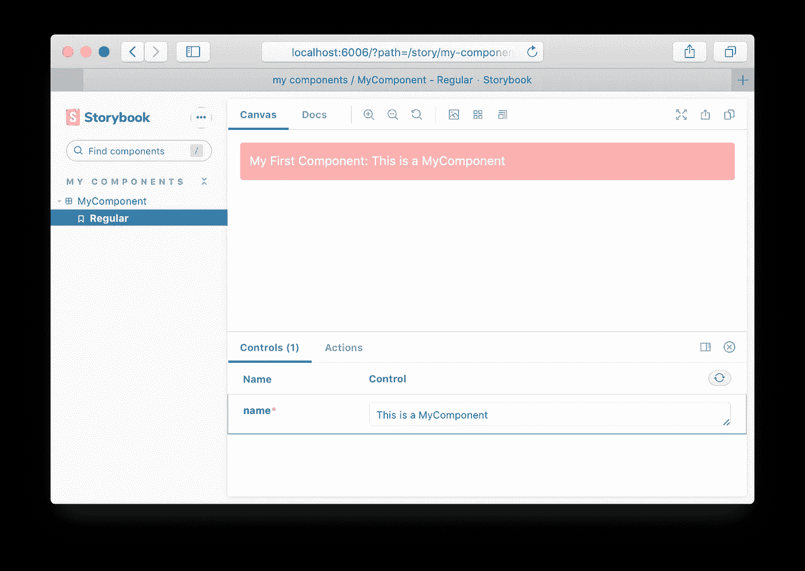

# 嵌入式 React 应用

> 原文：<https://levelup.gitconnected.com/embedded-react-applications-787de218723c>


照片由[记者](https://www.pexels.com/@p-r-r-977155?utm_content=attributionCopyText&utm_medium=referral&utm_source=pexels)从[像素](https://www.pexels.com/photo/a-single-gold-framed-painting-on-the-wall-2951525/?utm_content=attributionCopyText&utm_medium=referral&utm_source=pexels)拍摄

当我们想到“React Application”时，我们会立即想到路由、路径、服务器端渲染、应用程序根以及一系列我们今天如何开发应用程序所固有的其他概念。

实际上，React 应用程序并不局限于要求路由或依赖于服务器呈现步骤。

那么，什么是嵌入式 React 应用呢？

简单地说，一个 React 前端应用程序，你可以把它嵌入到任何网页上，不管这个网页是不是 React 制作的。

让我们从 React 文档本身的一些简单内容开始:

我们导入`react@17`和`react-dom@17`作为依赖项，加上`babel` (babeljs.io)来传输我们的应用程序代码。当然，这是一个简单的 Hello World。


如您所见，我们需要 4 个元素:

*   React 应用程序本身
*   `**react**`和`**react-dom**`库成为依赖关系
*   一个空的容器元素`**root**`和…
*   引导脚本。

*在实践中，您可以将所有依赖项和应用程序代码捆绑在一起，以使我们的可嵌入 React 应用程序自包含。*

这种方法至少适用于两种类型的嵌入式 React 应用程序:


(React 应用程序用黄色虚线边框表示)

在左边，我们有一些所谓的微前端应用程序。这是一个自包含的 React 应用程序，我们可以用它来组成更大的应用程序。

在右边，我们有一个典型的嵌入式应用程序，其中一个额外的功能被添加到现有的应用程序中。这方面的例子可以是客户支持应用程序(如:对讲机、LiveChat 等)

# 微前端反应应用

对于这种方法，我们将创建一个 React 应用程序，将其捆绑在一个文件上，并将其部署在一个静态 HTML 页面上或作为一个更大的应用程序的一部分。我们将把它部署在一个静态的 HTML 网页上。

首先，React 应用程序构建过程，我们将使用 TypeScript 作为编程语言，使用 roll up js([https://rollupjs.org/guide/en/](https://rollupjs.org/guide/en/))作为捆绑工具。

由于我们只是创建一个 React 组件，我想我最好从模板回购开始。这是我们构建一个微前端反应应用程序所需要的。

[](https://github.com/outsrc/my-components) [## 外包/我的组件

### NPM React 模块的模板 GitHub 是超过 5000 万开发人员的家园，他们一起工作来托管和审查代码…

github.com](https://github.com/outsrc/my-components) 

```
$ git clone [https://github.com/outsrc/my-components](https://github.com/outsrc/my-components) myapp
$ cd myapp
$ rm -rf .git
$ git init
$ git add -A
$ git commit -m'initial'
$ yarn
```

## 让我们构建一个嵌入式抵押计算器

抵押贷款计算器是一个简单的应用程序，我们可以嵌入任何房地产/房地产经纪人网站。

*   2 种模式:“月成本”和“最大贷款”
*   每月成本:要求，金额，利率和期间将显示总成本和每月付款。
*   最大贷款:要求，每月付款，利率和期限，并将显示总成本和贷款金额。


抵押贷款计算器设计(使用谷歌搜索作为灵感)

拥有嵌入式应用程序的一个重要细节是管理风格。将 JS 包与应用程序捆绑在一起，将 CSS 样式放在单独的文件中并不理想。我们总是喜欢将 CSS 样式和 JS 捆绑在同一个文件中。

对于这个应用程序，我们将使用 Tailwind CSS([https://tailwindcss.com/](https://tailwindcss.com/))，所以我将添加必要的依赖项和配置文件。

```
$ yarn add -D **@rollup/plugin-json autoprefixer@^9 postcss@^7 postcss-discard-comments postcss-import@^12 postcss-loader rollup-plugin-filesize rollup-plugin-postcss rollup-plugin-progress rollup-plugin-replace rollup-plugin-terser rollup-plugin-visualizer tailwindcss@^1 identity-obj-proxy**
```

*这组依赖项还包括我们需要捆绑最终应用程序的其他* `***rollupjs***` *依赖项。*

对`package.json`文件做了一些修改，以表明我们新的模块内容。

```
{
    **"name": "mortgagecalculator",**
    ...
    **"description": "Mortgage Calculator",**
    ... "script": {
        ...
        **"storybook": "start-storybook -p 6006",**
        ...
    }
    ...
}
```

更改故事书配置文件:`.storybook/main.js`和`.storybook/preview.js`

由于我们正在添加顺风 CSS，我们需要添加一个基础样式文件，我们的项目将在`src/styles/index.css`

现在我们可以在组件上使用 Tailwind CSS 类了:

打开故事书会给我们:

```
$ yarn storybook
```



带有顺风 CSS 类的 MyComponent

现在我们可以构建抵押计算器应用程序了

*您可以查看所有文件的回购*


故事书上的抵押计算器组件

一旦应用程序完成，我们可以把它捆绑在一个文件中，嵌入到网页中使用。

在此之前，我们需要对`rollup.config.js`文件做一些修改。由于我们重用了 React 组件库 repo 中的 build 命令和配置，因此生成的包不包含 React 和 React DOM 作为依赖项，如果我们希望应用程序是自包含的，就需要它们。

我们的`src/index.ts`文件也必须更改。以前，在 React 组件库上，我们只为我们的库提供的所有组件和/或助手函数提供导出。对于 React 应用程序包，我们需要导出一个引导脚本:

…和一个在`package.json`上的构建脚本:

```
{    
    ...
    "script": {
        ...
        **"build": "NODE_ENV=production rollup -c",**
        ...
    }
    ...
}
```

所以我们可以运行:

```
$ yarn build
yarn run v1.22.10
$ NODE_ENV=production rollup -csrc/index.tsx → build/mortgage-calculator.js...
┌───────────────────────────────────────────────┐
│                                               │
│   Destination: build/mortgage-calculator.js   │
│   Bundle Size:  154.13 KB                     │
│   Minified Size:  153.99 KB                   │
│   Gzipped Size:  48.16 KB                     │
│                                               │
└───────────────────────────────────────────────┘
created build/mortgage-calculator.js in 8.5s
✨  Done in 9.46s.
```

我们在`build/mortgage-calculator.js`上有我们的抵押贷款计算器应用程序

如何在网页上使用？只需包含包文件并使用导出的`renderMortgageCalculator`函数运行它。

瞧…


嵌入式 React 应用。

## 结论

该项目包括一些第三方依赖项，它们也捆绑在应用程序中:

*   【https://www.npmjs.com/package/classnames】T6`**classnames**`
*   `**mortgage-helpers**`[https://www.npmjs.com/package/mortgage-helpers](https://www.npmjs.com/package/mortgage-helpers)

其他考虑因素:

*   顺风 CSS 牛逼！我们使用 PurgeCSS(包含在 Tailwind CSS 中)来限制我们包含在应用程序包中的 CSS 样式，如果没有它，我们最终会有几兆字节的未使用的样式。
*   `**rollup-plugin-postcss**` stills 不支持 PostCSS 8，这是 Taildwind CSS 2.x 所必需的(现在正在讨论一个 PR)
*   包的名称存储在浏览器的全局上下文中。所以尽量使用与 JS 标识符兼容的名称。
*   如果你想做一个插件程序，比如一个聊天框，并且你喜欢控制如何加载或者加载什么包，你可以使用一个定制的加载脚本。

这可以被优化以从应用程序被嵌入的上下文中接收更多的信息。

*   一旦构建了应用程序，您就可以通过打开根文件夹上生成的`stats.html`来检查包的内容。


ReactDOM 是最大的依赖。顺风 CSS 只发售 14Kb(大量媒体查询)

今天到此为止。点击此处查看回购:

[](https://github.com/outsrc/mortgage-calculator) [## 外包/抵押计算器

### 抵押计算器-一个可嵌入的 React 应用程序 GitHub 是超过 5000 万开发者的家园，他们一起工作…

github.com](https://github.com/outsrc/mortgage-calculator) 

黑客快乐…

其他相关内容的帖子:

[](/create-a-react-component-library-with-typescript-and-storybook-ed28fc7511f2) [## 用类型脚本和故事书创建一个 React 组件库

### 代码的可重用性很重要，组件的可重用性在用户界面开发领域非常重要…

levelup.gitconnected.com](/create-a-react-component-library-with-typescript-and-storybook-ed28fc7511f2) [](https://medium.com/javascript-in-plain-english/building-a-nextjs-monorepo-ecd21ac04928) [## 构建 NextJS Monorepo

### 你开始为你的公司创建一个前端应用程序，然后一个又一个，最终你得到了…

medium.com](https://medium.com/javascript-in-plain-english/building-a-nextjs-monorepo-ecd21ac04928)