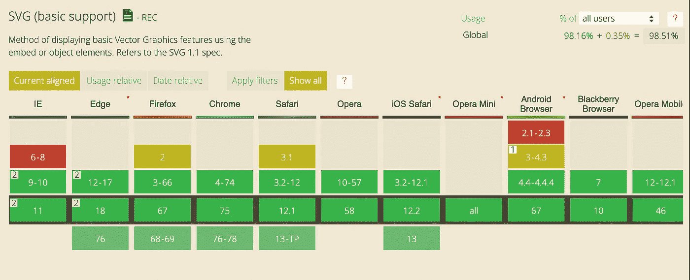
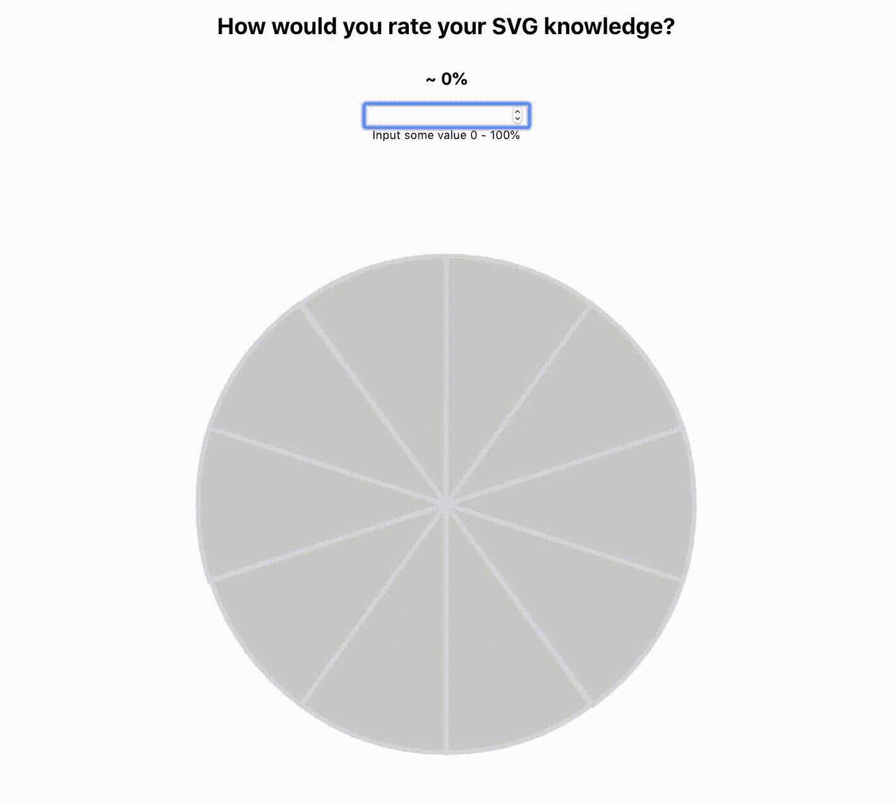

# 将 SVG 代码嵌入 React

> 原文：<https://levelup.gitconnected.com/embedding-svg-code-into-react-2bcca190987a>

## 这是我的第一篇博文，如果能对技术内容和我的写作风格有所反馈，我将不胜感激:)

为什么要使用 SVGs(可缩放矢量图形)？主要原因是分辨率、灵活性和强大的浏览器支持。

**分辨率:**SVG 通常由基于矢量的图形设计软件制作，如 Illustrator、Sketch 和 Inkscape。这意味着它们可以放大或缩小到任何大小，而不会损失分辨率或增加文件大小。这是个好消息:)

灵活性:使用 SVG 让你的创造力尽情发挥，它们可以使用 CSS 完全定制。可以实现可访问性选项，并且可以添加与 JavaScript 的交互性。如果出于某种奇怪的原因(古代浏览器等)，你也可以提供后备图像或背景色。)特定机器不支持 SVG。

> [点击这里查看一个基于 SVG 的惊人实验](http://themaninblue.com/experiment/Blobular/)。

嗯……强大的浏览器支持就是这个意思。

[**can use**](https://caniuse.com/#search=svg)SVG 搜索显示基本功能在大多数现代浏览器中得到广泛支持。

不管你使用什么样的框架，都有很多方法可以将 SVG 嵌入到你的网站中。[萨拉·苏伊丹](https://www.sarasoueidan.com/)在她的 [**篇**](https://www.smashingmagazine.com/2014/11/styling-and-animating-svgs-with-css/) 中详细介绍了**这样做的 7 种方式**。然而，在这篇文章中，我将使用带有基本`create-react-app`的 inline 方法。最终文件将如下所示:

**在下面的代码沙箱中找到演示，向下滚动查看解释。**

 [## 嵌入式 SVG React - CodeSandbox

### CodeSandbox 是一个为 web 应用程序量身定制的在线编辑器。

codesandbox.io](https://codesandbox.io/embed/embed-svg-react-v3l9e) 

> **查看 Github 上的完整代码:**[**complete file**](https://github.com/horsfallnathan/EmbedSVGInReact.git)

## 让我们开始吧

使用您最喜欢的矢量工具创建您的 SVG 文件，保存文件，并使用任何文本编辑器打开。您可以直接使用生成的代码，但是我建议使用在线工具进行优化。 [**这里的**](http://petercollingridge.appspot.com/svg-editor) 就是一个很棒的网站。

优化的好处包括:通过去掉软件通常添加的所有不必要的头文本，使 SVG 代码更易读、更小。

接下来，创建一个新文件并粘贴优化的 SVG 代码。

注意，在上面的代码中，React `className`规则仍然适用，所以您必须将原始 SVG 代码中的“class”改为“className”。我已经将样式导出到一个外部 CSS 文件中，但是如果我想让它保持内联，我必须添加花括号，即“反应方式”*【参见下面的第 14-16 行】*:

厉害！我们现在要做的就是将这个文件导入到我们的应用程序中。与任何 React 组件一样，您可以向其传递道具以进行条件渲染，从而获得所需的类似动画的效果。

# 总结:

在 React 中内嵌 SVG 打开了一个全新的创意世界，当与 JavaScript 动画库如 [GSAP](https://greensock.com) 结合时，你可以让你的项目更加令人印象深刻。

 [## 嵌入式 SVG React — CodeSandbox

### CodeSandbox 是一个为 web 应用程序量身定制的在线编辑器。

codesandbox.io](https://codesandbox.io/embed/embed-svg-react-v3l9e) 

> **查看 Github 上的完整代码:**[**complete file**](https://github.com/horsfallnathan/EmbedSVGInReact.git)