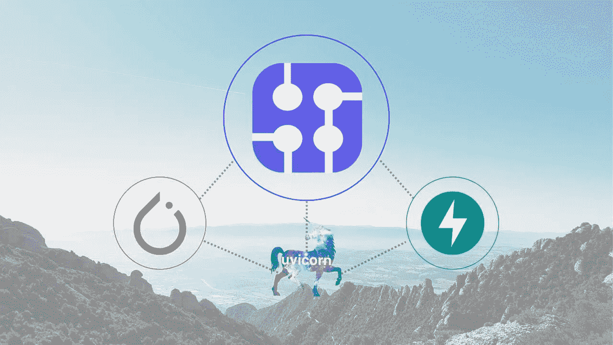
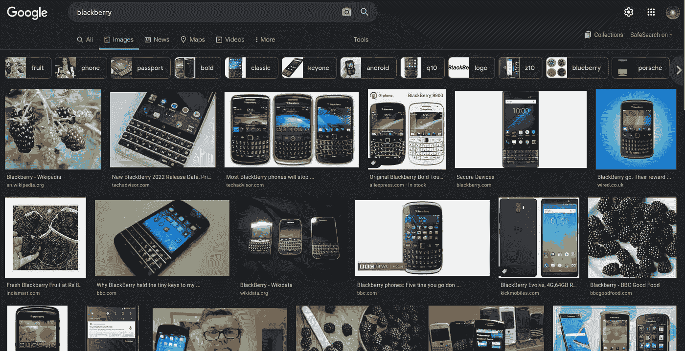
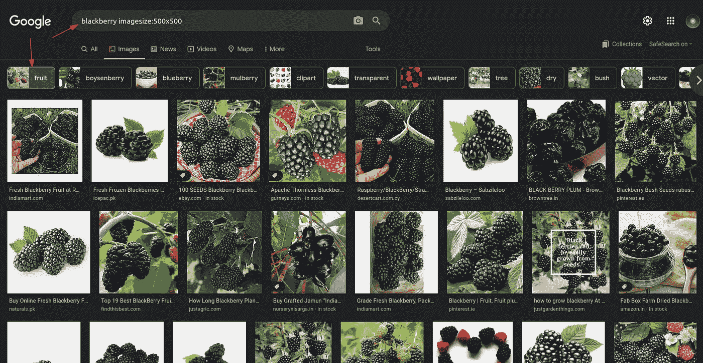
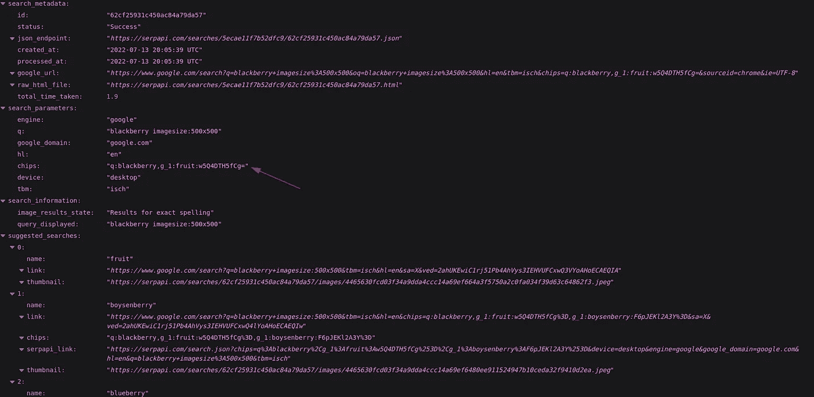
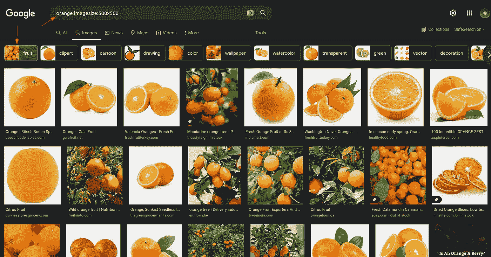
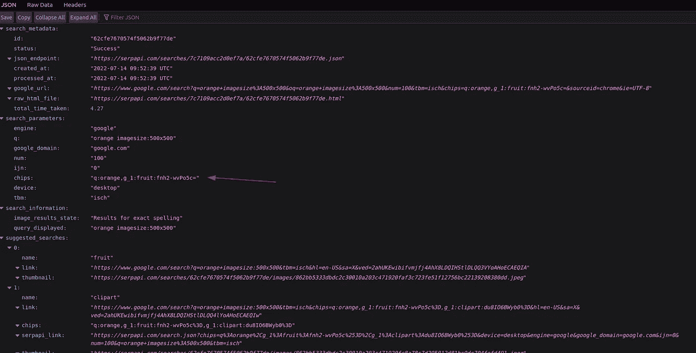
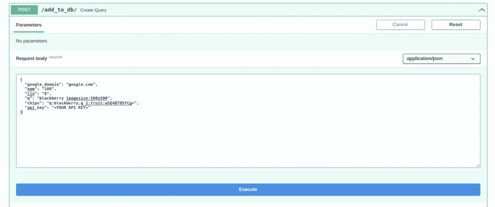
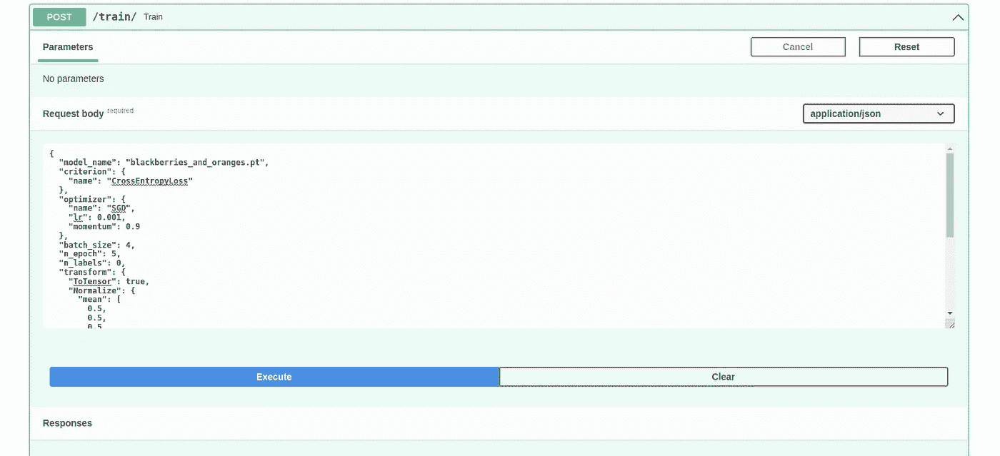
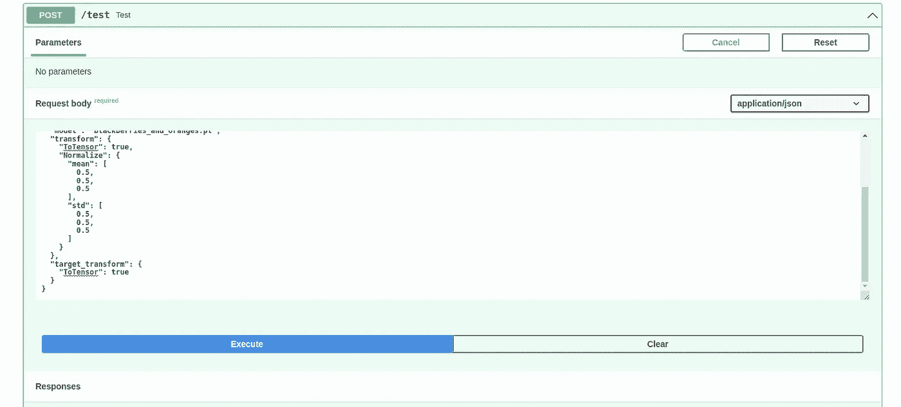

# 用 SERP 数据增强您的培训

> 原文：<https://levelup.gitconnected.com/empower-your-training-with-serp-data-863e33b11c22>

这是人工智能实现博客系列的一部分。如果你对故事的背景或情节感兴趣:

在前几周，我们已经探讨了如何为自动训练创建对训练过程的自定义控制。本周我们将讨论用 SERP 数据增强你的训练，以及对已训练模型的自动测试。

# 如何用特定的图片大小和对象类型来抓取 Google 图片？

Google 有一个很好的选项，可以只获取指定大小的图像，还有一个选项可以获取指定主题的图像。

例如，如果我们查询`blackberry`，我们将得到黑莓手机和各种大小的水果:

这可能会在培训过程中产生问题。如果你想区分黑莓水果和橙子水果，并且如果你的训练数据也有黑莓手机，那么分类精度将低于用黑莓手机处理的充满图像的训练数据。图像的大小也很重要。在对训练数据集进行训练之前，我们对其进行各种模糊图像操作。如果我们只有指定大小的黑莓水果图片，那不是很棒吗？这就是 SerpApi 的用武之地:

如果你谷歌一下搜索词`blackberry imagesize:500x500`，然后点击`fruit`标签，谷歌会返回指定尺寸的黑莓水果图片:

现在，如果你复制搜索的链接，在我的例子中，它是:

`[https://www.google.com/search?q=blackberry+imagesize%3A500x500&oq=blackberry+imagesize%3A500x500&hl=en&tbm=isch&chips=q:blackberry,g_1:fruit:w5Q4DTH5fCg=&sourceid=chrome&ie=UTF-8](https://www.google.com/search?q=blackberry+imagesize%3A500x500&oq=blackberry+imagesize%3A500x500&hl=en&tbm=isch&chips=q:blackberry,g_1:fruit:w5Q4DTH5fCg=&sourceid=chrome&ie=UTF-8)`

并将零件`https://www.google.com`更换为`[https://serpapi.com](https://serpapi.com:)` [:](https://serpapi.com:)

`[https://serpapi.com/search?q=blackberry+imagesize%3A500x500&oq=blackberry+imagesize%3A500x500&hl=en&tbm=isch&chips=q:blackberry,g_1:fruit:w5Q4DTH5fCg=&sourceid=chrome&ie=UTF-8](https://serpapi.com/search?q=blackberry+imagesize%3A500x500&oq=blackberry+imagesize%3A500x500&hl=en&tbm=isch&chips=q:blackberry,g_1:fruit:w5Q4DTH5fCg=&sourceid=chrome&ie=UTF-8)`

您将看到这样一个页面:

你需要一个帐户来使用 [SerpApi 谷歌图像刮刀 API](https://serpapi.com/images-results) 。您可以[注册申请免费积分](https://serpapi.com/users/sign_up)。SerpAoi 能够理解 url 及其参数，并将为您分解参数。我们将需要提取的`chips`参数。

同样的结构也适用于橙子:

# 代码中的更改

我已经更新了查询的类定义，以支持`chips`参数。这样，我们可以用下面的字典查询 SerpApi:

您可以将`ijn`参数从`0`更改为`1`，以分页显示 google 的下一个 100 个结果，自动将结果上传到您的存储数据库。

同样的结构也适用于橙色:

我已经更新了类的初始化函数，支持一个名为`TestCommands`的类:

我还添加了一个额外的函数来调用具有指定 id 的图像，并在需要时对其进行转换:

我还为`ImagesDatabase`对象添加了一个更新的函数来调用特定分类的所有唯一 id:

这里需要注意的一点是，除非明确指定，否则所有的分类都等同于所做的查询。所以`blackberry`和`blackberry imagesize:500x500`会是两个截然不同的分类。这样我们可以只调用黑莓图片，这些图片是水果并且有指定的尺寸。

下面是开始测试的`TestCommands`对象:

由于我还没有创建一个可定制的模型对象，我们将只使用 CNN。正如您所看到的，它拥有调用模型文件和进行预测所需的所有元素。输入将经历与训练过程相同的变换。然而，例如，调整到相同的大小不会产生任何扭曲。

下面是我们将用来进行测试的`Test`类:

它将调用指定分类的图像数据库，并用所有图像测试模型(还没有指定每个分类的限制)，并返回模型的准确性。

最后，让我们指定一个测试端点:

# 自动训练和测试

我已经使用 [SerpApi 的 Google Images Scraper API](https://serpapi.com/images-results) 上传了 2 页`blackberry imagesize:500x500`和 2 页`orange imagesize:500x500`的图片到我的存储器中

我使用以下字典文件来训练模型:

然后我用下面的字典来测试这个模型:

以下是我从测试端点得到的回应:

这当然不是实际用例的代表，因为这是小规模的训练，并且测试是在模型已经训练过的图像上进行的。但是您可以通过`ids`键而不是`label_names`键来避免使用相同的设置。但它是利用 SERP 数据摆脱一些数据清洗程序的代表。

# 结论

我感谢读者的时间和关注，我也感谢 SerpApi 的[聪明人让这篇博文成为可能。在接下来的几周里，我们将探索如何进一步对培训进行自定义控制，用异步流程处理一些动作，并希望在感觉足够具体时开放整个代码，成为开源存储库。](https://serpapi.com/team)

*原载于 2022 年 7 月 14 日 https://serpapi.com***。**

# *分级编码*

*感谢您成为我们社区的一员！更多内容见[升级编码出版物](https://levelup.gitconnected.com/)。
跟随:[推特](https://twitter.com/gitconnected)，[领英](https://www.linkedin.com/company/gitconnected)，[通迅](https://newsletter.levelup.dev/)
升一级就是转型理工招聘👉 [**加入我们的人才集体**](https://jobs.levelup.dev/talent/welcome?referral=true)*