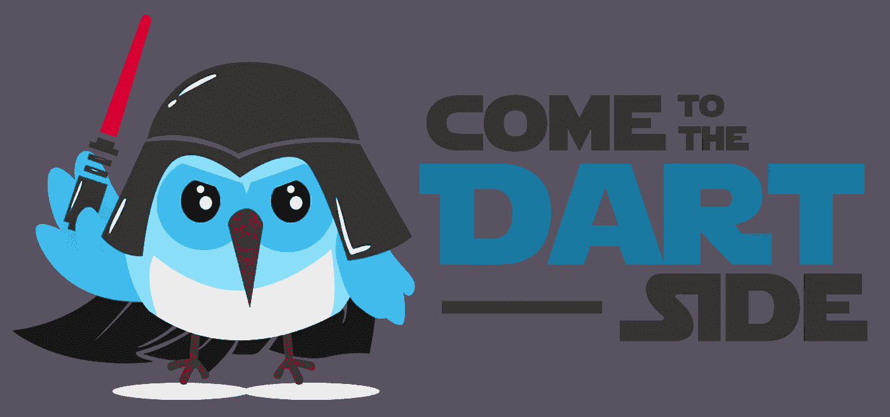
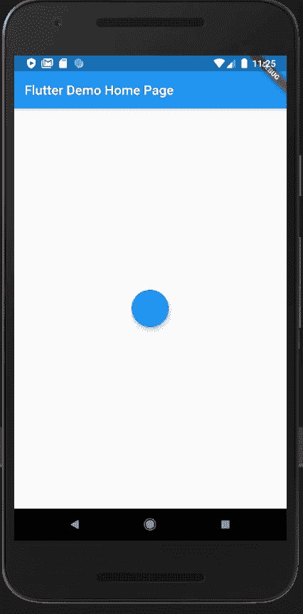
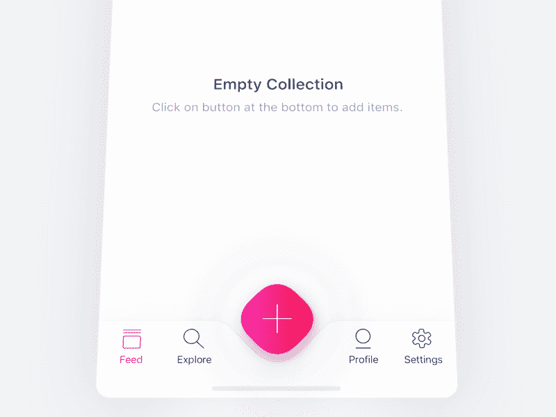
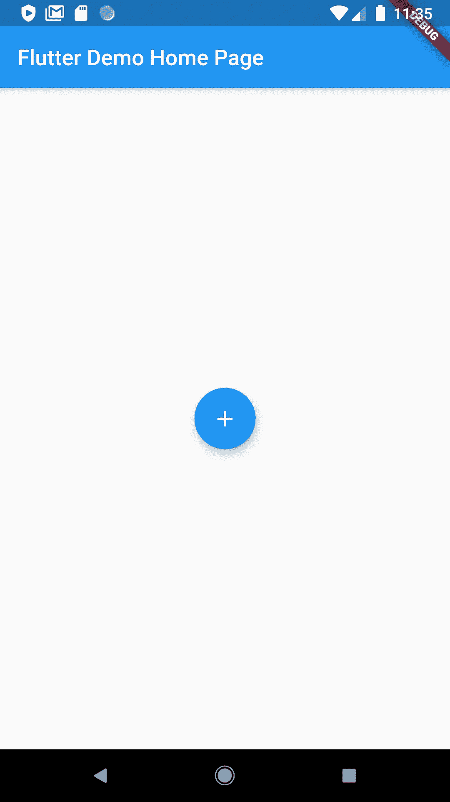
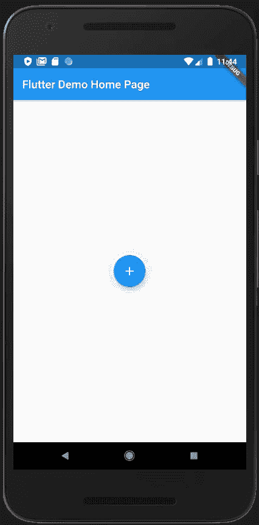
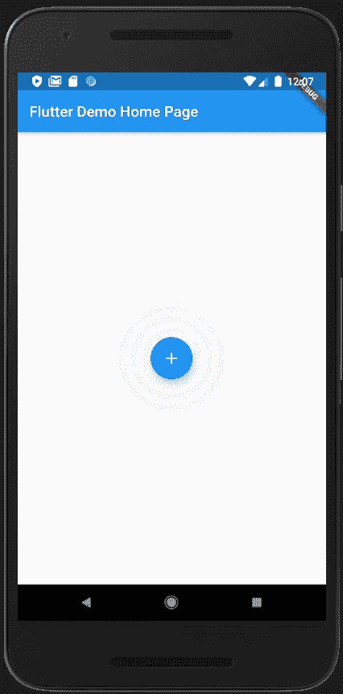
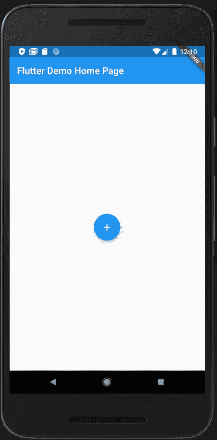
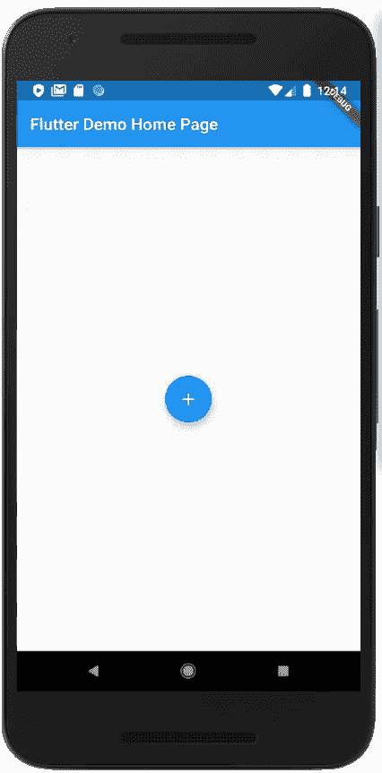
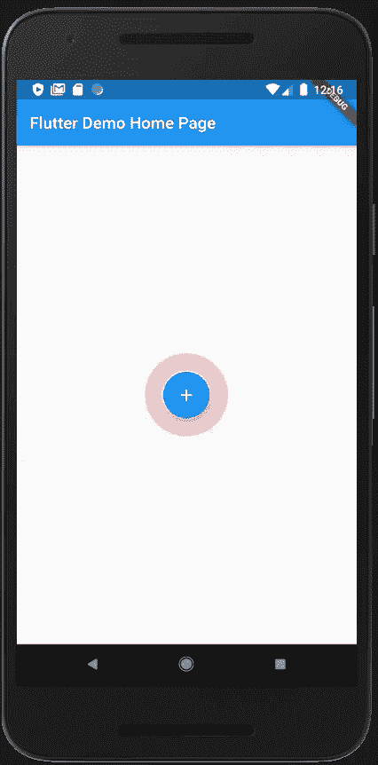
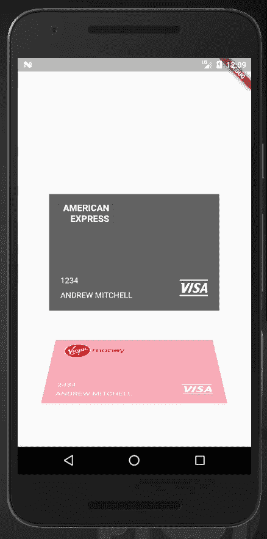

# 空状态动画-颤动

> 原文：<https://levelup.gitconnected.com/empty-state-animation-flutter-7cde18df1e72>

欢迎来到本教程，在 Flutter 中创建一个**棒极了的**动画。



你可以在 [Instagram](https://www.instagram.com/theboringdeveloper/) 上和我联系

## 让我们从看到我们的最终目标开始



**基于**

[](https://dribbble.com/shots/4653793-Empty-State-Animation) [## 空状态动画

### 空态不应该是无聊的。在过去的几个晚上，我一直在探索如何让这种空虚的状态…

dribbble.com](https://dribbble.com/shots/4653793-Empty-State-Animation) 

归功于 [**卢博施**](https://dribbble.com/OtherPlanet) 的这种灵感。

## 我们开始吧

首先创建一个带有浮动动作按钮的布局

## 检查输出



## 我们做了什么？

在屏幕中央增加了一个浮动的动作按钮

# 现在到了有趣的部分

将它作为一个单独的文件或在同一个文件中添加

## **使用此小工具**

```
return Scaffold(
      appBar: AppBar(
        title: Text(widget.title),
      ),
      body: SafeArea(
        child: Center(
            child: EmptyEffect(
            child: FloatingActionButton(
              onPressed: () {},
              child: Icon(Icons.add),            
            ),
            borderColor: Colors.red,
            outermostCircleStartRadius: 20,
            outermostCircleEndRadius: 100,
          ),
        ),
      ),
    );
```

## **检查输出**



**我们做了什么？**

*   我们为半径和不透明度动画创建了一个控制器
*   随着动画时间的推移，不透明度降低，半径增加
*   我们使用计时器在给定时间后重新启动动画
*   我们使用一个堆栈来布局，我们的圆圈在传递的子部件下面
*   ***_ custom painter***用于绘制圆圈
*   我们先画最外面的圆，然后继续画最里面的圆，直到半径大于 0

## 让我们试着改变参数

```
child: EmptyEffect(
  child: FloatingActionButton(
    onPressed: () {},
    child: Icon(Icons.add),
  ),
  borderColor: Colors.red,
  outermostCircleStartRadius: 20,
  outermostCircleEndRadius: 100,
  numberOfCircles: 4,
),
```

**在这里，我们有:**

将圈数更新为 **4** 。

## 现在检查输出


```
child: EmptyEffect(
  child: FloatingActionButton(
    onPressed: () {},
    child: Icon(Icons.add),
  ),
  borderColor: Colors.red,
  outermostCircleStartRadius: 20,
  outermostCircleEndRadius: 100,
  numberOfCircles: 4,
  animationTime: Duration(seconds: 5),
  delay: Duration(seconds: 6),
),
```

**我们有:**

*   增加了默认动画时间
*   增加了两个动画开始之间的延迟

## 现在检查输出



让我们再试试

```
child: EmptyEffect(
  child: FloatingActionButton(
    onPressed: () {},
    child: Icon(Icons.add),
  ),
  borderColor: Colors.red,
  outermostCircleStartRadius: 20,
  outermostCircleEndRadius: 200,
  numberOfCircles: 4,
  animationTime: Duration(seconds: 5),
  delay: Duration(seconds: 6),
),
```

**我们这里有:**

*   增加了末端半径

## 现在让我们检查输出



```
child: EmptyEffect(
  child: FloatingActionButton(
    onPressed: () {},
    child: Icon(Icons.add),
  ),
  borderColor: Colors.red,
  outermostCircleStartRadius: 20,
  outermostCircleEndRadius: 175,
  numberOfCircles: 4,
  animationTime: Duration(seconds: 5),
  delay: Duration(seconds: 6),
  gap: 30,
),
```

**我们这里有:**

*   增加了圆圈之间的间隙

## 现在让我们检查输出



```
child: EmptyEffect(
  child: FloatingActionButton(
    onPressed: () {},
    child: Icon(Icons.add),
  ),
  borderColor: Colors.red,
  outermostCircleStartRadius: 20,
  outermostCircleEndRadius: 175,
  numberOfCircles: 4,
  animationTime: Duration(seconds: 5),
  delay: Duration(seconds: 6),
  gap: 30,
  borderWidth: 20,
  startOpacity: 0.3,
),
```

**我们这里有:**

*   增加了边框宽度
*   增加了圆圈开始的不透明度

## 输出



查看完整项目 [**此处**](https://gist.github.com/GursheeshSingh/f4b1ee9dbaf2e334dae4344638bccec4) **。**

> 谢谢你坚持到最后:)

# 更多 flutter spinner 博客

[](/credit-card-slider-flutter-1edec451103a) [## 信用卡滑块—颤动

### 欢迎来到本教程，创建一个可怕的信用卡滑块。

levelup.gitconnected.com](/credit-card-slider-flutter-1edec451103a) [](https://medium.com/swlh/twitter-spinner-flutter-81ca13c0f00e) [## Twitter 旋转器——颤动

### 欢迎来到本教程，在 Flutter 中创建 Twitter Spinner

medium.com](https://medium.com/swlh/twitter-spinner-flutter-81ca13c0f00e) [](https://medium.com/swlh/common-bottom-navigation-bar-made-easy-flutter-199c9f683b29) [## 简单易用的通用底部导航栏——Flutter

### 欢迎来到本教程，在 Flutter 中创建一个普通的底部导航栏。

medium.com](https://medium.com/swlh/common-bottom-navigation-bar-made-easy-flutter-199c9f683b29) [](https://medium.com/swlh/flutter-custom-tab-indicator-for-tabbar-d72bbc6c9d0c) [## 颤动:TabBar 的自定义标签指示器

### 欢迎学习本教程，为 Flutter 中的 TabBar 创建一个自定义的标签指示器。

medium.com](https://medium.com/swlh/flutter-custom-tab-indicator-for-tabbar-d72bbc6c9d0c) [](/customize-hero-animation-flutter-83f6a35c79d4) [## 自定义颤振中的英雄动画(第 1 部分)

### 欢迎来到这个在 Flutter 中定制英雄动画的教程

levelup.gitconnected.com](/customize-hero-animation-flutter-83f6a35c79d4) 

> 我将会发布更多关于 flutter 的消息，敬请关注:)

 [## boring 开发者

### 欢迎回到 Instagram。登录查看您的朋友、家人和兴趣爱好捕捉和分享了什么…

www.instagram.com](https://www.instagram.com/theboringdeveloper/)