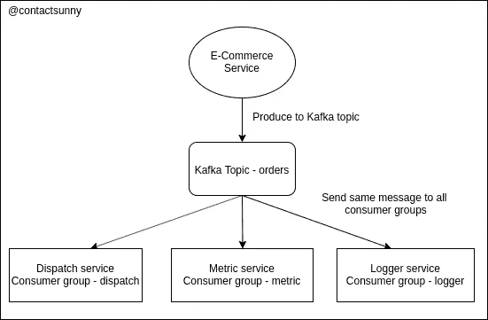

# 用亚马逊社交网站和 SQS 模仿阿帕奇卡夫卡

> 原文：<https://levelup.gitconnected.com/emulating-apache-kafka-with-amazon-sns-and-sqs-aa4c48179307>

> 最初发表于 2020 年 1 月 22 日我的个人博客。

我已经写了不少关于[阿帕奇卡夫卡](https://blog.contactsunny.com/tag/apache-kafka)的帖子。对于并行和异步处理来说，这是一个非常棒的工具。您可以让多个生产者和多个消费者监听一个主题，以处理来自该主题的每一条消息。您甚至可以有消费者组，在消费者组中，服务收听相同的主题，接收相同的消息，但是以不同的方式处理消息。这是我们今天感兴趣的。我会解释它的确切含义，卡夫卡是如何做到的，以及我们如何在 AWS 世界中使用亚马逊 SQS 和。所以让我们开始吧。

# 理解问题

假设你在运营一个电子商务网站。每当客户下订单时，您都希望发生以下事情:

1.  需要向派遣团队更新订单详情。
2.  订单总数指标必须更新。
3.  必须记录订单详情。

让一个服务做所有这三件事会很麻烦，而且是一个糟糕的设计。所以你决定雇佣阿帕奇·卡夫卡。每当用户下订单时，您就用所有订单细节组成一个 JSON 对象，并向 Kafka 主题(方便地命名为“orders”)生成该消息。有三种不同的服务，一种用于通知调度团队订单，一种用于增加订单的度量，另一种用于日志记录。这三个服务正在监听“订单”主题中的消息。因此，每当针对该主题生成一条消息时，他们就会收到该消息。

但问题是，类似于亚马逊 SQS 的设计，在 Kafka 中，如果同一个主题有多个消费者，消息会在消费者中分发，而不是每个人都获得同一消息的副本。因此，我们示例中的问题是，我们只能通知调度团队订单，或者增加度量，或者记录订单。

当一个 SQS 队列有多个使用者时，情况正是如此。为了解决这个问题，在阿帕奇卡夫卡中，我们有一个叫做*的消费群体*，我们可以把我们的消费者分成不同的群体，然后开始听同一个话题。因为服务属于不同的组，所以每个服务都有一个消息的副本。所以现在，我们的三个服务都收到了相同的消息，我们的设计将开始工作。我希望下面的插图能准确地解释这种情况。

卡夫卡主题被三个不同的消费群体消费。

现在的问题是，如何在亚马逊这边实现同样的事情？

# 用 AWS 模仿阿帕奇卡夫卡

问题是，你不能在亚马逊 SQS 上模仿卡夫卡的消费群体，没有任何类似的功能。在 SQS 设置中，如果同一个队列有多个使用者，消息将在所有使用者之间分发。因此，为了模仿卡夫卡的消费群体，我们需要将亚马逊社交网络引入到设置中。让我们看看这是为什么。

当您从生成消息切换到 SQS 队列再切换到 SNS 主题时，您不需要做太多的代码更改。只是使用不同的客户端，调用不同的方法。你准备好了。这些变化出现在 AWS 控制台中。让我们继续前面看的那个例子，电子商务服务。根据这个例子，我们需要三个消费者群体。因此，我们将创建三个不同的 SQS 队列。从 SQS 控制台本身，我们可以订阅这些队列到一个 SNS 主题。这里发生的情况是，每当我们向 SNS 主题写入内容时，该消息或数据的副本会被发送到订阅了 SNS 主题的每个 SQS 队列。这样，因为我们有三个队列，我们将在所有三个队列中获得消息的副本。我们将改变我们的消费者来读取来自这三个新队列的消息。

通过这种方式，我们可以真正并行处理来自 SQS 消费者的相同信息。唯一改变的是我们正在写一个 SNS 主题，而不是 SQS 队列。希望下面的插图比我试图用文字解释的更有意义:

仿效阿帕奇卡夫卡与亚马逊社交网络和亚马逊 SQS。

如果这仍然不清楚，请在评论中告诉我，我一定会帮助你消除困惑。