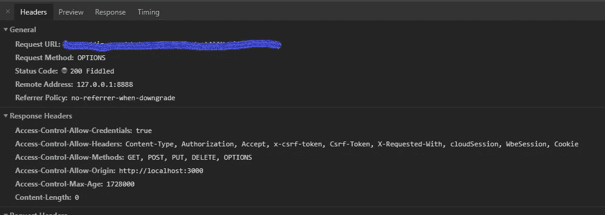

# 使用 Fiddler 启用 CORS—通过本地主机对远程服务器进行 API 调用

> 原文：<https://levelup.gitconnected.com/enable-cors-using-fiddler-making-api-call-to-a-remote-server-via-localhost-b78277cf9c48>

将 localhost 指向测试或生产环境的更简单的方法。


用 Fiddler 监控 HTTP(s)请求。

想象你有一个愉快的工作日，享受你最喜欢的咖啡。不知从哪里，您被告知在生产环境中报告了 JavaScript 代码抛出错误的问题，而在您的本地主机上一切正常。

好吧，也许这一天不会再令人愉快了。

在生产环境中调试 JS 代码通常不是一件容易的事情。简化的 JavaScript 很难理解，这个问题可能是驻留在生产环境中的数据所特有的。追根究底可能非常具有挑战性。

解决方案的一个可能途径是尝试在您的本地主机上重新创建相同的场景。这可能是一项单调乏味的任务，可能需要复制大量数据，甚至需要试凑法。

如果您能够将 API 调用从本地主机客户端定向到生产/测试服务器，岂不是更简单。这将使您能够在本地机器上调试 JS 代码，并从所需的环境中获取数据。为了做到这一点，我们需要启用[跨源资源共享](https://developer.mozilla.org/en-US/docs/Web/HTTP/CORS) (CORS)。

> 跨源资源共享( [CORS](https://developer.mozilla.org/en-US/docs/Glossary/CORS) )是一种机制，它使用额外的 [HTTP](https://developer.mozilla.org/en-US/docs/Glossary/HTTP) 报头来告诉浏览器，让在一个源(域)上运行的 web 应用程序有权访问来自不同源的服务器的选定资源。

出于安全原因，浏览器限制从脚本内部发起跨源 HTTP 请求。这就是 Fiddler 出现的原因。

# 什么是 Fiddler，它是如何工作的？

Fiddler 是一个 Web 调试代理，它记录你的计算机和互联网之间的所有 HTTP(S)流量。它允许您检查流量，设置断点，并“摆弄”传入或传出的数据。

当 Fiddler 开始捕获流量时，它向 [Windows Internet (WinINet)](https://docs.microsoft.com/windows/desktop/wininet/about-wininet) 网络组件注册，并请求所有应用程序(如 Chrome、Firefox、IE 等)开始将它们的请求定向到 Fiddler。Fiddler 然后位于您的客户机和服务器之间，监听 HTTP(s)流量的端口，为它提供记录流量的能力，并充当修改 HTTP 请求和响应的代理。

该应用程序是免费的，可以在提琴手网站[上的所有主要操作系统上获得，同时还有大量的文档和教程视频。](https://www.fiddler2.com/)

# 让我们把手弄脏吧。

您首先需要安装和设置 Fiddler。相关说明可在[提琴手网站](https://www.fiddler2.com/)上找到。

启动应用程序，导航到`Tools` > `Fiddler Options` > `HTTPS` > `Decrypt HTTPS traffic`，安装认证。

使用`CTRL + R`或在`Rules`菜单下找到`Customize Rules...`选项来打开 Fiddler 使用的自定义规则脚本。

在 Handlers 类下添加以下代码以及其他`RulesOption`声明。

```
public static RulesOption("Force CORS")
var m_ForceCORS: boolean = true;
```

接下来，在`OnBeforeRequest`方法中添加以下代码

```
if (m_ForceCORS && oSession.oRequest.headers.HTTPMethod == "OPTIONS") { 
	oSession.utilCreateResponseAndBypassServer();

	oSession.oResponse.headers.Add("Access-Control-Allow-Origin", oSession.oRequest.headers["Origin"]) ;
	oSession.oResponse.headers.Add("Access-Control-Allow-Methods", "GET, POST, PUT, DELETE, OPTIONS");			
	oSession.oResponse.headers.Add("Access-Control-Allow-Headers", "Content-Type, Authorization, Accept, Csrf-Token, X-Requested-With, cloudSession, WbeSession, Cookie");
	oSession.oResponse.headers.Add("Access-Control-Max-Age", "1728000");
	oSession.oResponse.headers.Add("Access-Control-Allow-Credentials", "true");

	oSession.responseCode = 200;
}
```

这里我们使用 fiddler 创建一个响应对象，并添加特定于 CORS 的头。您可能希望根据您的要求更改上面提到的标题。

> 在 Fiddler 从客户端读取完整的 HTTP(S)请求后调用。如果需要，您应该使用此方法来更新请求标头或请求正文。
> 
> `utilCreateResponseAndBypassServer:` 在 OnBeforeRequest 内部调用，创建一个响应对象，绕过服务器。

接下来，在`OnBeforeResponse`方法中添加以下代码

```
if (m_ForceCORS && oSession.oRequest.headers.Exists("Origin")) { 
	oSession.oResponse.headers.Remove("Access-Control-Allow-Origin");
	oSession.oResponse.headers.Add("Access-Control-Allow-Origin", oSession.oRequest.headers["Origin"]) ;

	oSession.oResponse.headers.Remove("Access-Control-Allow-Methods");
	oSession.oResponse.headers.Add("Access-Control-Allow-Methods", oSession.oRequest.headers["Access-Control-Allow-Methods"]);

	oSession.oResponse.headers.Remove("Access-Control-Allow-Headers"); 
	oSession.oResponse.headers.Add("Access-Control-Allow-Headers", oSession.oRequest.headers["Access-Control-Allow-Headers"]);

	oSession.oResponse.headers.Remove("Access-Control-Max-Age");
	oSession.oResponse.headers.Add("Access-Control-Max-Age", oSession.oRequest.headers["Access-Control-Max-Age"]);

	oSession.oResponse.headers.Remove("Access-Control-Allow-Credentials");
	oSession.oResponse.headers.Add("Access-Control-Allow-Credentials", oSession.oRequest.headers["Access-Control-Allow-Credentials"]);
}
```

> `*OnBeforeResponse:*`从服务器读取完整响应后触发。此事件在响应返回到客户端之前触发。如果需要，您应该使用此方法来更新响应标头或响应正文。

上面的代码将修改从服务器接收的 HTTP 响应对象，以包含所需的 CORS 报头。

完成所有修改后，检查规则菜单下的`Force CORS`选项是否已启用。

按下`F12`或使用`Capture Traffic`选项开始通过 Fiddler 拦截 HTTP 请求。现在，您应该能够从本地主机为您的测试/生产环境创建 API 了。



200 拨弄响应与 CORS 启用。

## 如果你喜欢这个故事，请点击👏按钮并分享，帮助其他人找到它！欢迎在下方留言评论。

[](https://levelup.gitconnected.com)[](https://gitconnected.com/learn/javascript) [## 学习 JavaScript -最佳 JavaScript 教程(2019) | gitconnected

### 50 大 JavaScript 教程-免费学习 JavaScript。课程由开发人员提交并投票，从而实现…

gitconnected.com](https://gitconnected.com/learn/javascript)