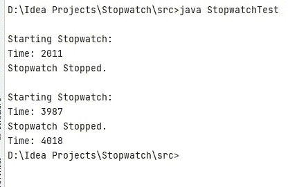

# 将线程逻辑封装在秒表中(第 2 部分)

> 原文：<https://levelup.gitconnected.com/encapsulating-the-thread-logic-in-stopwatch-part-2-746d2e051abd>


礼貌:timeanddate.com

欢迎来到本系列的第二部分“强大的设计模式来创建一个惊人的秒表应用程序”。到目前为止，我们已经弄清楚了核心秒表类的工作原理。但问题是，我们必须显式调用秒表类的 getTime()方法来获取特定时刻的时间。但这并不令我们满意。我们希望看到秒表运行，这就是原因，从客户端来看，我们做了一个不同的线程，只是为了看秒表运行，不断更新时间。但是客户端代码变得越来越重，让客户端做这么多事情只是为了使用秒表是不好的。我们应该总是考虑让客户端代码越来越小。现在真正的问题出现了:我们能用更少的代码给客户同样的功能吗？我们还能做些什么？

# 之前的教程

如果您是第一次阅读这一部分，那么您一定要看看本系列的第 1 部分。

*   [**代号**](https://github.com/rajtilakls2510/Stopwatch/tree/S1_Making_the_core_stopwatch) 直到现在。
*   [第一部分。](https://rajtilakls2510.medium.com/powerful-design-patterns-to-create-an-amazing-stopwatch-app-part-1-b408addedc79)

我们能做些什么来使客户端代码越来越小呢？我们可以做一件事。我们可以将所有与线程相关的逻辑封装到我们的核心秒表类中，这样用户甚至不必考虑自己创建线程。用户只需点击 start()和 stop()方法，就能看到秒表马上开始运行，甚至不需要进入任何线程事务。

逻辑看起来是这样的。

*   当秒表的客户端点击 start()时，秒表本身将创建一个新线程，它将立即启动。这个线程将连续打印秒表时间。
*   当客户端点击 stop()时，该线程将被销毁，不再打印时间，让用户确认秒表已经暂停。

看起来很简单，对吗？这很简单。本教程将会很短，因为接下来我们将实现观察者设计模式，我想给它一个单独的教程。别再多嘴了。让我们开始吧。

这就是现在 Stopwatch.java 班的样子。

```
public class Stopwatch
{
    private long offset, currentStart;
    private boolean isStopped;

    public Stopwatch()
    {
        offset = 0L;
        currentStart = System.*currentTimeMillis*();
        isStopped = true;
    }

    public void start()
    {
        if(isStopped)
        {
            currentStart = System.*currentTimeMillis*() - offset;
        }

        isStopped = false;
    }

    public void stop()
    {
        if(!isStopped)
        {
            offset = System.*currentTimeMillis*() - currentStart;
        }
        isStopped = true;
    }

    public long getTime()
    {
        if(!isStopped)
            return System.*currentTimeMillis*() - currentStart;
        else
            return offset;
    }
}
```

我们的 StopwatchTest.java 看起来像

```
public class StopwatchTest {
    public static void main(String[] args) {
        Stopwatch sw = new Stopwatch();

        Thread observerThread = new Thread(new Runnable() {
            @Override
            public void run() {
                while (true)
                {
                    System.*out*.print("\rTime: "+ sw.getTime());
                    *sleep*(10);
                }

            }
        });
        observerThread.start();

        System.*out*.println("\nStarting Stopwatch: ");
        sw.start();
        *sleep*(2000);
        sw.stop();
        System.*out*.println("\nStopwatch Stopped. ");

        *sleep*(2000);

        System.*out*.println("\nStarting Stopwatch: ");
        sw.start();
        *sleep*(2000);
        sw.stop();
        System.*out*.println("\nStopwatch Stopped. ");

    }

    public static void sleep(int time)
    {
        try {
            Thread.*sleep*(time);
        } catch (InterruptedException e) {
            e.printStackTrace();
        }
    }
}
```

现在困扰我们的是从客户端创建线程。我们必须将传递给线程的 Runnable 的 run()方法中的逻辑放入秒表类中。

我们要做的第一件事是让 Stopwatch 类实现 Runnable 接口。

```
public class Stopwatch implements Runnable
{
....}
```

接下来，我们将覆盖 Runnable 接口希望我们覆盖的 run()方法，并在其中复制打印逻辑。

```
public class Stopwatch implements Runnable
{
  ...

    @Override
    public void run() {
        while(true)
        {
            System.*out*.print("\rTime: "+ getTime());
            try {
                Thread.*sleep*(10);
            } catch (InterruptedException e) {
                e.printStackTrace();
            }
        }
    }
}
```

注意，我们使用的是 getTime()方法。因为 Thread.sleep()抛出了 InterruptedException，所以我们用 try-catch 块将它包围起来。一个问题仍然存在。没有停止逻辑来阻止线程打印时间。print 方法处于无限循环中。之前我们别无选择，只能运行一个无限循环。但是现在我们有了一个可以帮助我们的变量。还记得《欲罢不能》吗？现在是时候使用它了。当秒表停止时，我们将停止打印时间。现在，循环条件变为:

```
public void run() {
    while(!isStopped)
    {
        System.*out*.print("\rTime: "+ getTime());
        ...
    }
}
```

接下来，我们将创建一个存储当前执行线程的类变量。

```
public class Stopwatch implements Runnable
{
    private long offset, currentStart;
    private boolean isStopped;
    private Thread th;  // Thread that prints the time of the stopwatch
    ...}
```

现在，当客户端调用 start()方法时，我们只需要创建一个新线程并启动它。

```
public void start()
{
    if(isStopped)
    {
        th = new Thread(this);
        th.start();
        currentStart = System.*currentTimeMillis*() - offset;
    }

    isStopped = false;
}
```

当客户端调用 stop()方法时，我们需要销毁线程。因为 Java 没有给我们任何东西来破坏一个线程，所以我们只是通过将 thread 变量设置为“null”来取消对它的引用，并依靠垃圾收集器来清理它。

```
public void stop()
{
    if(!isStopped)
    {
        th =null;
        offset = System.*currentTimeMillis*() - currentStart;
    }
    isStopped = true;
}
```

注意:当客户机点击 stop()方法时，线程将停止打印，因为“isStopped”布尔值为真，这使得线程的 while 循环条件为假，从而完成线程执行。

这就是我们对秒表类所做的一切。是时候清理客户端代码并享受封装了。

我们去 StopwatchTest.java 吧。

```
Stopwatch sw = new Stopwatch();

*//        Thread observerThread = new Thread(new Runnable() {
//            @Override
//            public void run() {
//                while (true)
//                {
//                    System.out.print("\rTime: "+ sw.getTime());
//                    sleep(10);
//                }
//
//            }
//        });
//        observerThread.start();* System.*out*.println("\nStarting Stopwatch: ");
        sw.start();
        *sleep*(2000);
        sw.stop();
        System.*out*.println("\nStopwatch Stopped. ");

        *sleep*(2000);

        System.*out*.println("\nStarting Stopwatch: ");
        sw.start();
        *sleep*(2000);
        sw.stop();
        System.*out*.println("\nStopwatch Stopped. ");

    }
```

唯一需要删除的是评论的部分。一旦你删除它，你会发现客户端代码清理器。

让我们来测试一下。



像以前一样工作，但是这一次客户端不需要考虑创建线程，向它传递一个 runnable，以及所有那些废话。

我发现了整件事的一个问题。看看我们在做什么。我们只是打印秒表运行的时间(在不同的线程上)。在大多数实际应用中，不需要打印时间。需要做的事情是将时间从秒表异步发送到客户端，客户端可以计算出如何处理时间。幸运的是，有一种设计模式可以帮助我们，你已经听过很多次了:观察者。在下一篇博客中，我们将看看这种模式是什么，以及我们如何修改代码来实现这种模式。下一集再见。

# 下一个教程:

[应用观察者模式](https://rajtilakls2510.medium.com/applying-the-observer-pattern-part-3-e46ce30c2d32)

# 完整代码

[完整的代码在这里。](https://github.com/rajtilakls2510/Stopwatch/tree/S2_Encapsulating_Thread_logic_in_stopwatch)

Stopwatch.java

```
public class Stopwatch implements Runnable
{
    private long offset, currentStart;
    private boolean isStopped;
    Thread th;

    public Stopwatch()
    {
        offset = 0L;
        currentStart = System.*currentTimeMillis*();
        isStopped = true;
    }

    public void start()
    {
        if(isStopped)
        {
            th = new Thread(this);
            th.start();
            currentStart = System.*currentTimeMillis*() - offset;
        }

        isStopped = false;
    }

    public void stop()
    {
        if(!isStopped)
        {
            th =null;
            offset = System.*currentTimeMillis*() - currentStart;
        }
        isStopped = true;
    }

    public long getTime()
    {
        if(!isStopped)
            return System.*currentTimeMillis*() - currentStart;
        else
            return offset;
    }

    @Override
    public void run() {
        while(!isStopped)
        {
            System.*out*.print("\rTime: "+ getTime());
            try {
                Thread.*sleep*(10);
            } catch (InterruptedException e) {
                e.printStackTrace();
            }
        }
    }
}
```

StopwatchTest.java

```
public class StopwatchTest {
    public static void main(String[] args) {
        Stopwatch sw = new Stopwatch();

        System.*out*.println("\nStarting Stopwatch: ");
        sw.start();
        *sleep*(2000);
        sw.stop();
        System.*out*.println("\nStopwatch Stopped. ");

        *sleep*(2000);

        System.*out*.println("\nStarting Stopwatch: ");
        sw.start();
        *sleep*(2000);
        sw.stop();
        System.*out*.println("\nStopwatch Stopped. ");

    }

    public static void sleep(int time)
    {
        try {
            Thread.*sleep*(time);
        } catch (InterruptedException e) {
            e.printStackTrace();
        }
    }
}
```

# 参考资料:

*   书籍: [Head First 设计模式](https://www.oreilly.com/library/view/head-first-design/0596007124/)，作者埃里克·弗里曼、伊丽莎白·罗布森、伯特·贝茨、凯西·塞拉。